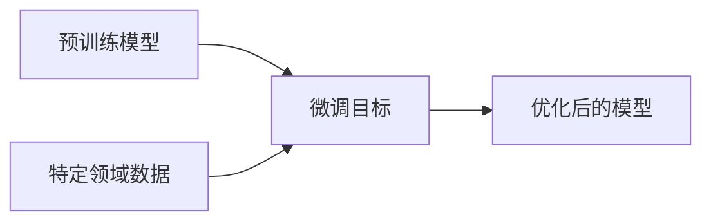
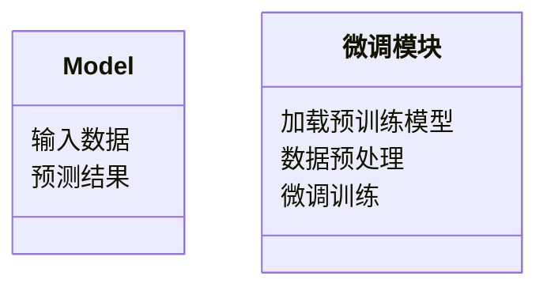

                 


# LLM微调技巧：针对特定领域优化

> 关键词：LLM fine-tuning, 大语言模型, 特定领域优化, 微调方法, 参数高效微调, 适配器微调

> 摘要：本文深入探讨了如何针对特定领域优化大语言模型（LLM）的微调技巧。从基础概念到高级算法，从系统设计到项目实战，全面解析了LLM微调的核心原理和实际应用，帮助读者掌握如何在实际项目中高效优化模型性能。

---

## 第一部分: 背景介绍

### 第1章: LLM微调的基本概念

#### 1.1 什么是LLM微调
- 微调（Fine-tuning）是对预训练模型的参数进行进一步优化的过程。
- 目标是提升模型在特定领域或任务上的性能。

#### 1.2 微调的背景与重要性
- 预训练模型在通用任务上表现优异，但在特定领域可能不够精准。
- 微调通过适应特定领域数据，提升模型的实际应用价值。

#### 1.3 微调与其他模型优化方法的区别
- 微调：调整模型参数，使其适应特定任务。
- 知识蒸馏：将大模型的知识迁移到小模型。
- 剪枝：减少模型的复杂度，降低计算成本。

---

## 第二部分: 核心概念与联系

### 第2章: 微调的核心原理

#### 2.1 微调的数学模型
- 微调过程可以表示为：
  $$ \text{Loss} = \lambda_1 L_{\text{ MLM}} + \lambda_2 L_{\text{ SOP}} $$
  其中，$L_{\text{MLM}}$ 是遮蔽语言模型损失，$L_{\text{SOP}}$ 是下句预测损失，$\lambda_1$ 和 $\lambda_2$ 是超参数。

#### 2.2 微调方法的特征对比
| 方法类型       | 参数调整范围 | 计算资源需求 | 适用场景 |
|----------------|--------------|--------------|----------|
| 全参数微调     | 全部参数     | 高           | 需要大量资源 |
| 参数高效微调   | 部分参数     | 低           | 资源有限时 |
| 适配器微调     | 新增适配器层 | 中           | 快速适应领域 |

#### 2.3 微调的实体关系图


---

## 第三部分: 算法原理

### 第3章: 微调的数学模型与公式

#### 3.1 微调的损失函数
- 交叉熵损失：
  $$ L = -\sum_{i=1}^{n} y_i \log(p_i) $$
  其中，$y_i$ 是真实标签，$p_i$ 是预测概率。

#### 3.2 微调的优化过程
- 使用Adam优化器：
  $$ \theta_{t+1} = \theta_t - \eta \nabla_{\theta_t} L $$
  其中，$\eta$ 是学习率。

#### 3.3 微调的数学推导
- 通过反向传播计算梯度，并更新模型参数。

---

## 第四部分: 系统分析与架构设计

### 第4章: 系统功能设计

#### 4.1 领域模型设计


#### 4.2 系统架构设计


---

## 第五部分: 项目实战

### 第5章: 项目实战与代码实现

#### 5.1 环境安装
```bash
pip install torch transformers
```

#### 5.2 核心代码实现
```python
from torch import nn, optim
from transformers import AutoModelForMaskedLM, AutoTokenizer

class Adapter(nn.Module):
    def __init__(self, hidden_size):
        super().__init__()
        self.adapter = nn.Linear(hidden_size, hidden_size)
    
    def forward(self, hidden_states):
        return self.adapter(hidden_states)

# 初始化模型和适配器
model = AutoModelForMaskedLM.from_pretrained('bert-base-uncased')
adapter = Adapter(model.config.hidden_size)
optimizer = optim.Adam(model.parameters() + adapter.parameters(), lr=1e-5)
```

---

## 第六部分: 最佳实践

### 第6章: 微调的注意事项

#### 6.1 数据质量的重要性
- 数据清洗和标注是微调成功的关键。

#### 6.2 模型选择的策略
- 根据任务需求选择合适的微调方法。

#### 6.3 计算资源的优化
- 使用参数高效微调方法节省计算资源。

---

## 作者：AI天才研究院 & 禅与计算机程序设计艺术

---

这篇文章全面解析了LLM微调的核心原理和实际应用，帮助读者掌握如何在特定领域优化大语言模型的性能。通过详细的数学推导、系统架构设计和项目实战，读者可以深入理解微调技巧，并在实际项目中灵活应用。

