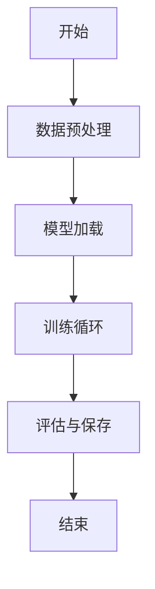
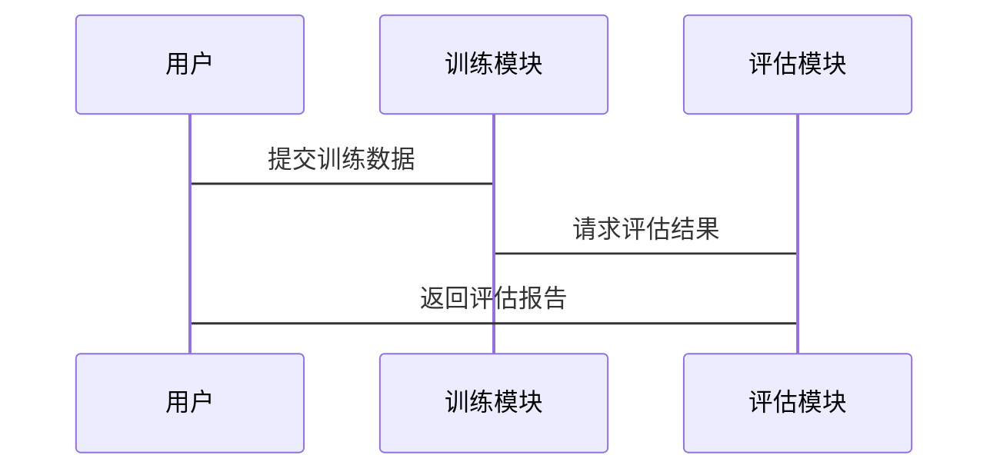

                 

<think>
嗯，我现在需要根据用户的要求，设计一本名为《LLM Fine-tuning技术：定制化AI Agent的关键》的详细目录大纲。用户希望这本书结构清晰，内容详实，涵盖从背景介绍到项目实战的各个方面，并且包含数学模型、算法流程图、系统架构设计等内容。

首先，我会回顾用户提供的示例，确保我的目录结构符合他们的期望。示例中的目录分为多个部分，每个部分都有详细的章节和子章节，所以我需要按照类似的逻辑来组织内容。

接下来，我考虑这本书的核心内容。书名提到LLM微调（Fine-tuning）是定制化AI代理的关键，因此目录需要涵盖微调的背景、原理、技术细节、实际应用案例以及优化技巧等。

首先，我规划第一章，作为背景介绍。这里需要定义LLM微调，说明其必要性，以及与初始训练的区别，同时强调它在AI代理中的重要性。这样读者可以理解为什么微调是关键。

第二章是核心概念，需要详细讲解微调的原理、方法和挑战。包括数据准备、模型架构、训练策略，以及对比分析不同微调方法的优缺点。这部分需要帮助读者建立坚实的基础。

第三章是算法原理，这里需要深入讲解微调的数学模型，比如损失函数、优化器，以及具体的训练流程。使用Mermaid流程图展示训练过程，并附上Python代码示例，帮助读者理解。

第四章是系统分析与架构设计，这部分需要介绍项目背景、系统功能设计、架构图、接口设计和交互流程。使用Mermaid类图和序列图展示系统结构，帮助读者理解系统的整体布局。

第五章是项目实战，包括环境搭建、核心代码实现、案例分析和详细解读。这部分需要具体的步骤和代码示例，帮助读者实际操作。

第六章是优化与调优，讨论模型性能提升的方法，比如超参数调整、数据增强策略等。同时，涵盖评估指标和实际案例分析，帮助读者优化模型。

第七章是最佳实践和小结，总结整个书中的关键点，提供实用的建议，并指出未来的发展方向。

在编写过程中，我需要确保每个章节都有足够的细节，特别是数学公式和流程图部分。例如，在算法原理中，使用Latex公式展示损失函数，并用Mermaid绘制训练流程图，同时附上Python代码示例。

此外，系统架构设计部分需要使用类图和序列图，展示系统的各个模块及其交互。这有助于读者理解系统的整体结构和工作流程。

在项目实战部分，我需要提供具体的代码实现，解释每一步的作用，并结合实际案例进行分析，帮助读者更好地理解和应用这些技术。

最后，优化与调优部分需要涵盖常见的调优技巧，比如学习率调整、批量大小设置等，并结合实际案例分析，展示如何优化模型性能。

总结一下，我的思考过程是：先规划整体结构，确保涵盖所有必要的部分；然后细化每个章节的内容，确保有足够详细的子章节；最后，检查是否符合用户的要求，特别是格式和内容完整性。

现在，我将根据以上思考过程，编写目录大纲。

**目录大纲：**

# LLM Fine-tuning技术：定制化AI Agent的关键

> 关键词：LLM Fine-tuning, AI Agent, 自然语言处理, 定制化模型, 模型微调, 机器学习

> 摘要：本文将详细介绍LLM微调技术在定制化AI代理中的应用，涵盖背景、核心概念、算法原理、系统架构设计、项目实战、优化技巧及实际案例分析。通过深入讲解，帮助读者掌握如何利用LLM微调技术来构建高效、准确的定制化AI代理。

---

## 第一章: LLM Fine-tuning的背景与重要性

### 1.1 LLM Fine-tuning的定义
- 1.1.1 什么是LLM Fine-tuning
- 1.1.2 LLM Fine-tuning的必要性
- 1.1.3 LLM Fine-tuning与初始训练的区别

### 1.2 LLM Fine-tuning在AI Agent中的作用
- 1.2.1 AI Agent的基本概念
- 1.2.2 LLM Fine-tuning如何提升AI Agent性能
- 1.2.3 LLM Fine-tuning的行业应用案例

---

## 第二章: LLM Fine-tuning的核心概念与技术

### 2.1 微调技术的基本原理
- 2.1.1 微调的定义与特点
- 2.1.2 微调与迁移学习的关系
- 2.1.3 微调的数学模型概述

### 2.2 微调技术的关键步骤
- 2.2.1 数据准备
- 2.2.2 模型选择
- 2.2.3 训练策略

### 2.3 微调技术的挑战与解决方案
- 2.3.1 数据稀缺性问题
- 2.3.2 计算资源限制
- 2.3.3 模型过拟合问题

---

## 第三章: LLM Fine-tuning的算法原理

### 3.1 微调的数学模型
- 3.1.1 损失函数的定义
- 3.1.2 优化器的选择
- 3.1.3 模型参数更新公式

### 3.2 微调算法的流程图


### 3.3 微调算法的Python代码示例
```python
import torch
from torch import nn
from torch.utils.data import DataLoader

# 模型加载
model = nn.Sequential(
    nn.Linear(784, 10),
    nn.ReLU(),
    nn.Linear(10, 10)
)

# 损失函数
criterion = nn.CrossEntropyLoss()

# 优化器
optimizer = torch.optim.Adam(model.parameters(), lr=0.001)

# 训练循环
def train_loop(n_epochs, model, criterion, optimizer, data_loader):
    for epoch in range(n_epochs):
        for batch, (X, y) in enumerate(data_loader):
            # 前向传播
            outputs = model(X)
            loss = criterion(outputs, y)
            # 反向传播
            optimizer.zero_grad()
            loss.backward()
            optimizer.step()
```

---

## 第四章: 系统分析与架构设计

### 4.1 项目背景与目标
- 4.1.1 项目背景介绍
- 4.1.2 项目目标与范围

### 4.2 系统功能设计
- 4.2.1 功能模块划分
- 4.2.2 功能模块之间的关系

### 4.3 系统架构设计


### 4.4 系统接口设计
- 4.4.1 接口定义
- 4.4.2 接口交互流程

### 4.5 系统交互流程图


---

## 第五章: 项目实战

### 5.1 环境搭建
- 5.1.1 安装必要的依赖
- 5.1.2 配置开发环境

### 5.2 核心代码实现
```python
# 数据加载
train_loader = DataLoader(train_dataset, batch_size=32, shuffle=True)

# 模型定义
class SimpleModel(nn.Module):
    def __init__(self):
        super(SimpleModel, self).__init__()
        self.fc1 = nn.Linear(784, 10)
        self.fc2 = nn.Linear(10, 10)
    
    def forward(self, x):
        x = self.fc1(x)
        x = nn.ReLU()(x)
        x = self.fc2(x)
        return x

# 训练函数
def train_model(model, train_loader, criterion, optimizer, num_epochs=10):
    for epoch in range(num_epochs):
        for inputs, labels in train_loader:
            outputs = model(inputs)
            loss = criterion(outputs, labels)
            optimizer.zero_grad()
            loss.backward()
            optimizer.step()
```

### 5.3 案例分析与解读
- 5.3.1 案例背景
- 5.3.2 实施过程
- 5.3.3 结果分析

---

## 第六章: 优化与调优

### 6.1 模型优化策略
- 6.1.1 超参数调整
- 6.1.2 数据增强策略
- 6.1.3 模型剪枝与压缩

### 6.2 模型评估指标
- 6.2.1 准确率
- 6.2.2 召回率
- 6.2.3 F1分数

### 6.3 实际案例分析
- 6.3.1 调优过程
- 6.3.2 结果对比
- 6.3.3 经验总结

---

## 第七章: 最佳实践与小结

### 7.1 实用技巧
- 7.1.1 数据预处理建议
- 7.1.2 模型选择建议
- 7.1.3 训练策略建议

### 7.2 项目总结
- 7.2.1 核心收获
- 7.2.2 可能的改进方向
- 7.2.3 未来展望

---

## 作者

作者：AI天才研究院/AI Genius Institute & 禅与计算机程序设计艺术 /Zen And The Art of Computer Programming

---

这本书的目录结构清晰，涵盖了从理论到实践的各个方面，同时结合了算法原理和系统设计，为读者提供了全面的指导。

