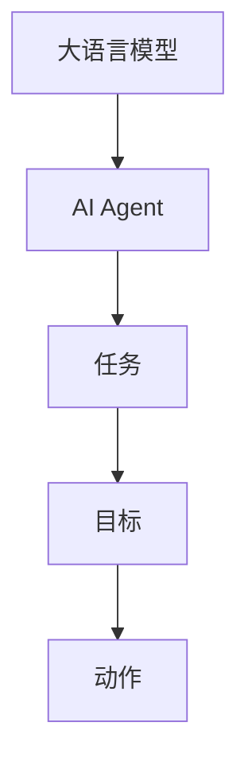
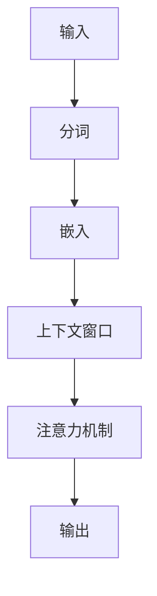
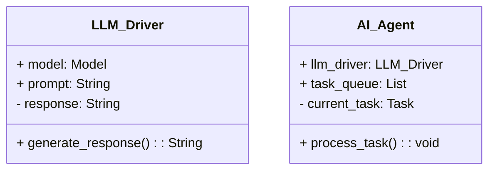
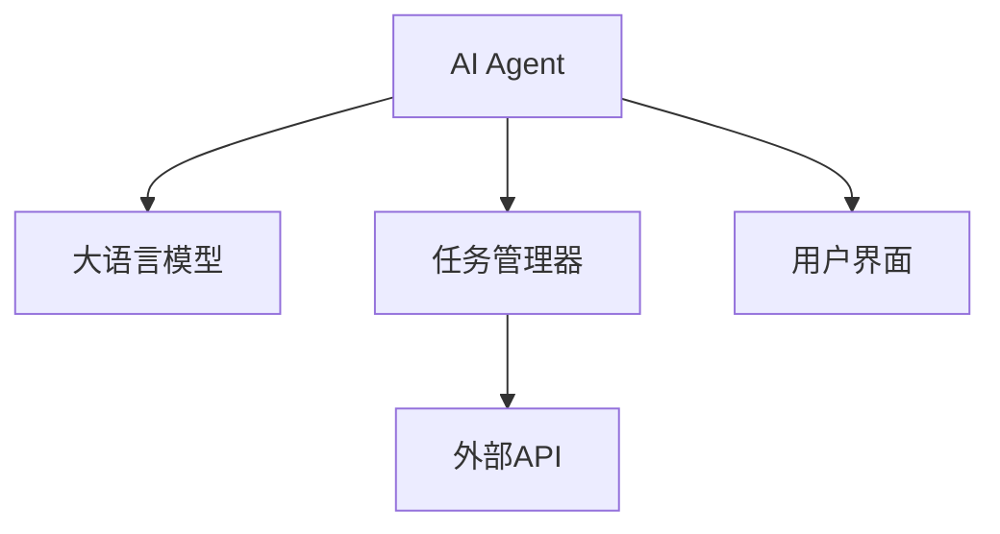

                 


# LLM 驱动的 AI Agent：核心原理与技术栈详解

## 关键词：LLM、AI Agent、大语言模型、智能体、自然语言处理、人机交互、技术栈

## 摘要：  
本文深入探讨了LLM（大语言模型）驱动的AI Agent的核心原理与技术实现，从问题背景、核心概念、算法原理到系统架构、项目实战，层层剖析，结合实际案例，为读者呈现一个全面而深入的技术解析。文章内容涵盖从理论到实践的全链条，帮助读者理解如何构建和优化基于LLM的AI Agent系统。

---

## 第一部分：LLM 驱动的 AI Agent 基础

### 第1章：问题背景与概念解析

#### 1.1 问题背景
- **传统AI的局限性**：传统AI系统基于规则和预设数据，难以处理复杂、动态的现实场景。
- **大语言模型的崛起**：LLM（Large Language Model）通过海量数据训练，具备强大的理解和生成能力。
- **AI Agent的定义**：AI Agent是一种能够感知环境、自主决策并执行任务的智能体。

#### 1.2 问题描述
- **LLM驱动的AI Agent的优势**：结合了大语言模型的自然语言处理能力和AI Agent的自主决策能力。
- **LLM与AI Agent的协同关系**：LLM提供强大的语言理解和生成能力，AI Agent负责任务规划和执行。

#### 1.3 边界与外延
- **边界**：LLM驱动的AI Agent主要用于需要自然语言交互和任务执行的场景。
- **外延**：结合多模态数据和外部知识库，扩展AI Agent的应用范围。

### 第2章：核心概念与联系

#### 2.1 核心概念原理
- **LLM的工作原理**：基于Transformer架构，通过自注意力机制处理输入数据，生成目标输出。
- **AI Agent的行为机制**：通过感知环境、规划任务、执行操作和反馈优化实现目标。

#### 2.2 概念对比分析
| 概念         | LLM                         | AI Agent                     |
|--------------|------------------------------|------------------------------|
| 核心功能     | 自然语言理解和生成         | 任务规划与执行               |
| 适用场景     | 文本生成、问答系统           | 智能助手、自动化任务处理     |
| 决策方式     | 基于概率生成               | 基于逻辑推理和优化算法       |

#### 2.3 实体关系图


---

## 第二部分：算法原理与数学模型

### 第3章：算法原理

#### 3.1 算法流程


#### 3.2 数学模型
$$\text{LLM输出} = f_{\theta}(x)$$  
其中，$x$ 是输入，$f_{\theta}$ 是模型参数化的函数。

#### 3.3 代码实现
```python
def generate_response(prompt, model):
    tokens = model.tokenize(prompt)
    embeddings = model.embed(tokens)
    attention = model.attention(embeddings)
    output = model.decode(attention)
    return output
```

---

## 第三部分：系统分析与架构设计

### 第4章：系统分析

#### 4.1 问题场景
- **多轮对话**：AI Agent需要理解上下文并生成连贯的回应。
- **动态任务处理**：根据用户需求调整任务优先级和执行策略。

#### 4.2 功能设计


### 第5章：架构设计

#### 5.1 系统架构


#### 5.2 接口设计
- **输入接口**：接收用户输入和任务请求。
- **输出接口**：生成自然语言输出和执行结果反馈。

---

## 第四部分：项目实战

### 第6章：环境安装与配置

```bash
pip install transformers
pip install torch
pip install requests
```

### 第7章：核心实现

#### 7.1 代码实现
```python
import torch
from transformers import AutoTokenizer, AutoModelForCausalLM

class LLM_Driver:
    def __init__(self, model_name):
        self.tokenizer = AutoTokenizer.from_pretrained(model_name)
        self.model = AutoModelForCausalLM.from_pretrained(model_name)
    
    def generate_response(self, prompt):
        inputs = self.tokenizer(prompt, return_tensors="pt")
        outputs = self.model.generate(inputs.input_ids, max_length=50)
        response = self.tokenizer.decode(outputs[0], skip_special_tokens=True)
        return response

class AI_Agent:
    def __init__(self, llm_driver):
        self.llm_driver = llm_driver
        self.task_queue = []
    
    def process_task(self, task):
        prompt = f"Please help me {task}."
        response = self.llm_driver.generate_response(prompt)
        return response
```

#### 7.2 应用场景
- **智能助手**：帮助用户完成日常任务，如设置提醒、查询信息。
- **自动化处理**：自动执行预设任务，如发送邮件、安排日程。

### 第8章：案例分析

#### 8.1 应用案例
- **用户需求**：安排会议。
- **系统响应**：AI Agent通过LLM生成自然语言回复，与日历API交互，确认时间和地点。

---

## 第五部分：最佳实践与总结

### 第9章：最佳实践

#### 9.1 技术选型
- 选择合适的LLM模型（如GPT-3.5、PaLM）。
- 根据需求选择AI Agent框架（如LangChain、Tuan）。

#### 9.2 性能优化
- 使用缓存机制减少重复计算。
- 优化模型参数，降低推理成本。

### 第10章：小结与展望

- **小结**：本文详细介绍了LLM驱动的AI Agent的核心原理、系统架构和实现方法。
- **展望**：未来，随着大语言模型的不断进步，AI Agent将具备更强的智能性和适应性。

---

## 作者：AI天才研究院/AI Genius Institute & 禅与计算机程序设计艺术 /Zen And The Art of Computer Programming

