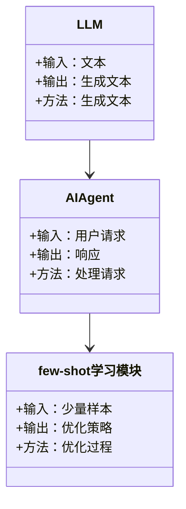
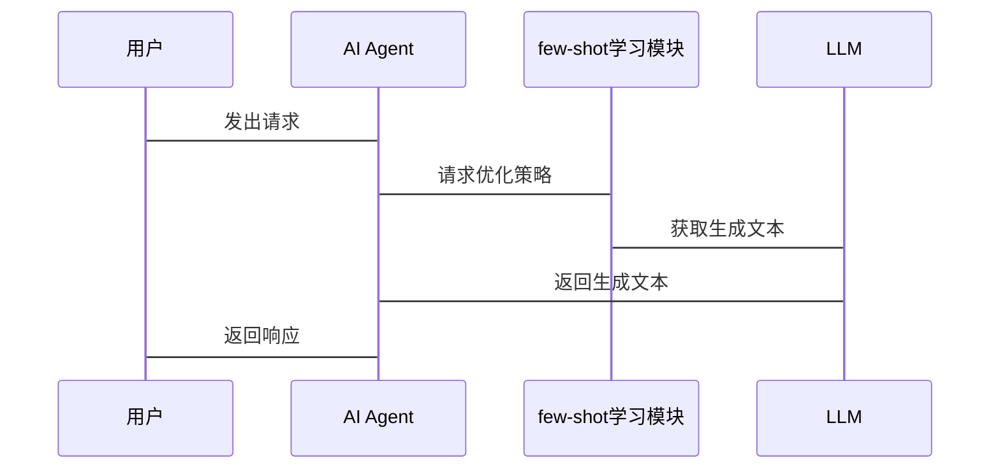

                 


```markdown
# LLM在AI Agent中的few-shot learning优化策略

## 关键词
- 大语言模型（LLM）
- AI Agent
- few-shot learning
- 优化策略
- 算法原理
- 系统设计
- 实际应用

## 摘要
本文将深入探讨大语言模型（LLM）在AI Agent中的few-shot学习优化策略。通过分析few-shot学习的核心原理、数学模型以及其在LLM中的具体应用，结合系统设计与实际项目案例，提出优化策略和最佳实践。文章内容丰富，逻辑清晰，旨在为读者提供全面的技术指导。

---

# 第1章: 背景介绍

## 1.1 LLM与AI Agent的背景
### 1.1.1 大语言模型（LLM）的定义与发展
- 大语言模型的基本概念
- LLM的发展历程与现状
- LLM的核心技术特点（如Transformer架构）

### 1.1.2 AI Agent的基本概念与应用场景
- AI Agent的定义与分类
- AI Agent的主要应用场景（如智能助手、自动化系统）
- AI Agent与人类交互的特点

### 1.1.3 few-shot learning的背景与问题描述
- few-shot学习的定义与特点
- few-shot学习在AI Agent中的必要性
- few-shot学习面临的挑战与问题

## 1.2 few-shot learning的核心概念
### 1.2.1 few-shot learning的定义与特点
- few-shot学习的核心概念
- 与传统学习方法的对比

### 1.2.2 few-shot学习在AI Agent中的应用价值
- 提高AI Agent的灵活性与适应性
- 减少数据依赖，提升效率

### 1.2.3 few-shot学习与LLM的结合
- LLM的特点如何助力few-shot学习
- few-shot学习如何优化LLM在AI Agent中的表现

## 1.3 本章小结
- 总结本章内容，强调few-shot学习在AI Agent中的重要性

---

# 第2章: few-shot学习的核心原理与数学模型

## 2.1 few-shot学习的原理
### 2.1.1 基于距离的分类方法
- 最近邻算法（K-Nearest Neighbor）
- 距离度量方法（如欧氏距离、曼哈顿距离）

### 2.1.2 基于度量的分类方法
- 度量学习的基本概念
- 度量学习在few-shot学习中的应用

### 2.1.3 基于概率的分类方法
- 贝叶斯分类的基本原理
- 贝叶斯方法在few-shot学习中的优势

## 2.2 few-shot学习的数学模型
### 2.2.1 支持向量数据分布模型
- 模型的数学表达
- 示例说明

### 2.2.2 最小二乘法模型
- 模型的数学推导
- 示例说明

### 2.2.3 贝叶斯分类模型
- 贝叶斯定理的公式推导
- 示例说明

## 2.3 few-shot学习的算法流程
### 2.3.1 数据预处理
- 数据清洗与归一化
- 数据特征提取

### 2.3.2 特征提取
- 常见的特征提取方法
- 选择合适的特征提取方法

### 2.3.3 模型训练与优化
- 模型训练的步骤
- 模型优化方法（如交叉验证）

### 2.3.4 模型评估与验证
- 评估指标（如准确率、召回率）
- 示例说明

## 2.4 本章小结
- 总结本章内容，强调数学模型在few-shot学习中的关键作用

---

# 第3章: few-shot学习在LLM中的应用

## 3.1 LLM的基本原理
### 3.1.1 变量分解
- LLM的变量分解方法
- 示例说明

### 3.1.2 模型训练
- LLM的训练过程
- 训练数据的特征

### 3.1.3 模型推理
- LLM的推理机制
- 示例说明

## 3.2 few-shot学习在LLM中的应用
### 3.2.1 few-shot学习与LLM的结合
- few-shot学习如何优化LLM的性能
- 示例说明

### 3.2.2 LLM在AI Agent中的具体应用
- AI Agent的任务分配与协调
- 示例说明

## 3.3 本章小结
- 总结本章内容，强调few-shot学习在LLM中的重要性

---

# 第4章: 系统分析与架构设计方案

## 4.1 系统分析
### 4.1.1 问题场景介绍
- 系统需要解决的问题
- 问题的边界与外延

### 4.1.2 项目介绍
- 项目目标
- 项目范围
- 项目约束

## 4.2 系统功能设计
### 4.2.1 领域模型（mermaid类图）


### 4.2.2 系统架构设计（mermaid架构图）


### 4.2.3 系统接口设计
- 接口1：用户请求接口
- 接口2：生成文本接口
- 接口3：优化策略接口

### 4.2.4 系统交互（mermaid序列图）


## 4.3 本章小结
- 总结本章内容，强调系统设计在实现中的重要性

---

# 第5章: 项目实战

## 5.1 环境安装
### 5.1.1 安装Python
- 安装步骤
- 版本要求

### 5.1.2 安装必要的库
- 库的安装命令
- 验证安装

## 5.2 系统核心实现
### 5.2.1 few-shot学习模块实现
- Python代码示例
- 代码解读

### 5.2.2 LLM与AI Agent集成实现
- Python代码示例
- 代码解读

## 5.3 实际案例分析
### 5.3.1 案例背景
- 案例应用场景
- 案例目标

### 5.3.2 案例分析
- 数据准备
- 模型训练
- 模型验证
- 结果分析

## 5.4 本章小结
- 总结本章内容，强调实际应用的重要性

---

# 第6章: 最佳实践与注意事项

## 6.1 最佳实践 tips
### 6.1.1 数据准备
- 数据清洗与预处理
- 数据特征选择

### 6.1.2 模型选择
- 根据任务选择合适的模型
- 模型调优

### 6.1.3 系统优化
- 系统性能优化
- 系统维护

## 6.2 小结
- 总结本章内容，强调最佳实践的重要性

## 6.3 注意事项
- 实际应用中的注意事项
- 常见问题及解决方案

## 6.4 拓展阅读
- 推荐相关书籍和论文
- 推荐学习资源

---

# 结语
通过本文的详细讲解，读者可以全面理解LLM在AI Agent中的few-shot学习优化策略，并能够在实际项目中灵活运用这些策略。

---

# 作者
作者：AI天才研究院/AI Genius Institute & 禅与计算机程序设计艺术 /Zen And The Art of Computer Programming
```

