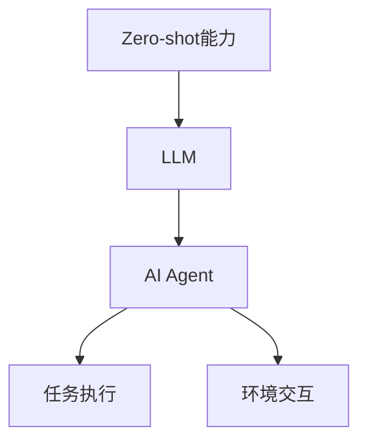
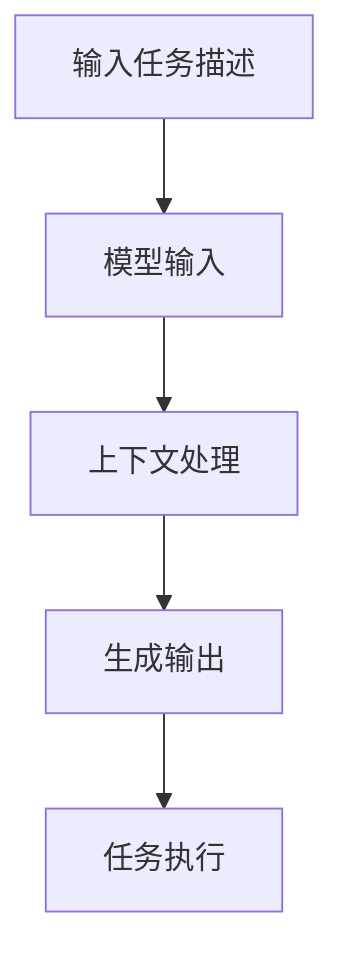
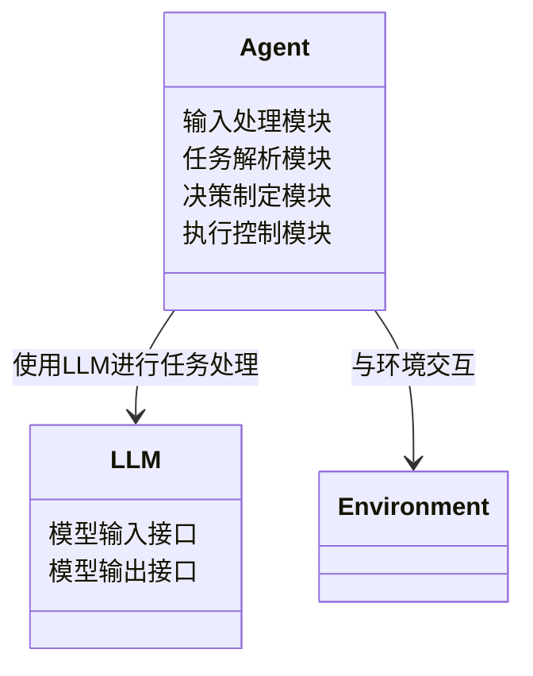
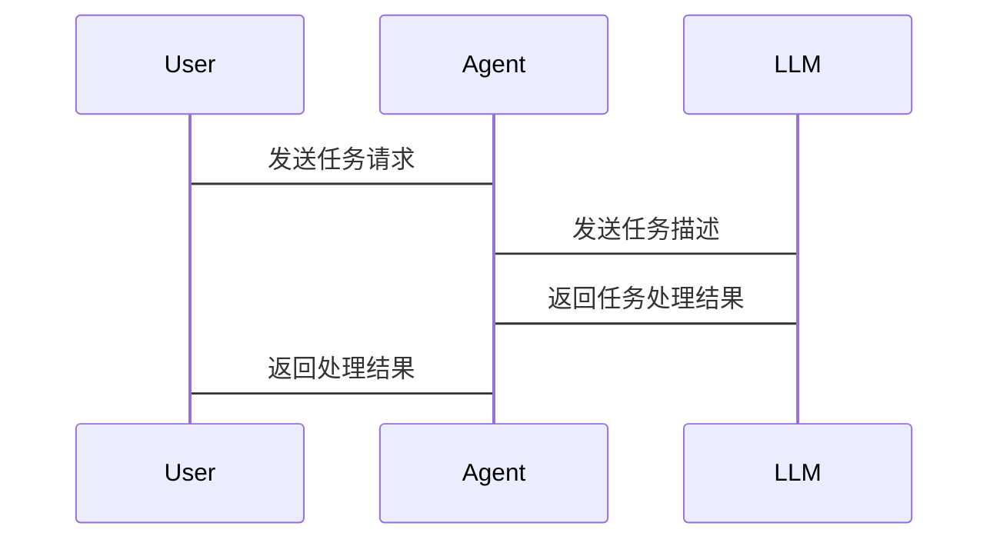

                 


# LLM在AI Agent中的Zero-Shot能力应用

## 关键词：LLM, AI Agent, Zero-Shot, 大语言模型, 人工智能代理, 自然语言处理

## 摘要：本文深入探讨了大语言模型（LLM）在AI Agent中的Zero-Shot能力应用。通过分析Zero-Shot能力的核心原理、算法实现、系统架构设计以及实际项目案例，详细阐述了LLM如何赋予AI Agent灵活应对各种任务的能力。本文内容涵盖了从基础概念到实际应用的各个方面，为读者提供了一个全面的理解框架。

---

# 目录大纲：《LLM在AI Agent中的Zero-Shot能力应用》

## 第一部分: 背景介绍

### 第1章: 问题背景与描述

#### 1.1 问题背景
- 1.1.1 AI Agent的发展现状
  - AI Agent的定义与分类
  - 当前AI Agent的核心技术与应用场景
- 1.1.2 LLM的崛起与应用
  - 大语言模型的定义与特点
  - LLM在自然语言处理领域的成功应用
- 1.1.3 Zero-shot能力的定义与重要性
  - Zero-shot能力的定义
  - Zero-shot能力在AI Agent中的作用

#### 1.2 问题描述
- 1.2.1 AI Agent的核心功能
  - 信息处理、决策制定、任务执行
- 1.2.2 Zero-shot能力在AI Agent中的应用场景
  - 多任务处理、动态任务适应
- 1.2.3 当前AI Agent面临的挑战
  - 任务多样性、环境复杂性、实时性要求

#### 1.3 问题解决与边界
- 1.3.1 Zero-shot能力如何解决AI Agent的问题
  - 灵活应对新任务，减少任务切换成本
- 1.3.2 Zero-shot能力的边界与限制
  - 性能瓶颈、上下文依赖性
- 1.3.3 Zero-shot能力的外延与未来发展
  - 结合其他AI技术，提升能力

#### 1.4 核心概念与要素
- 1.4.1 LLM的基本概念
  - 模型结构、训练方法、参数规模
- 1.4.2 Zero-shot能力的核心要素
  - 模型通用性、适应性、推理能力
- 1.4.3 AI Agent的系统架构与功能模块
  - 输入处理、任务解析、决策制定、执行控制

---

## 第二部分: 核心概念与联系

### 第2章: Zero-shot能力的核心原理

#### 2.1 Zero-shot能力的原理
- 2.1.1 概念属性特征对比表
  | 特性 | Zero-shot能力 | One-shot能力 | 多任务学习能力 |
  |------|----------------|--------------|----------------|
  | 定义 | 模型在未经过特定任务训练的情况下，能够直接理解和执行该任务的能力。 | 模型经过少量样本训练后，能够执行特定任务。 | 模型经过大量样本训练后，能够执行多个任务。 |
  | 优势 | 灵活性高，适用于未知任务。 | 适用于特定任务，但需要少量样本。 | 适用于多个任务，但需要大量样本。 |
  | 应用 | 适用于动态变化的任务环境，减少任务切换成本。 | 适用于已知任务，但需要提前准备样本。 | 适用于多个已知任务，但需要大量样本训练。 |

- 2.1.2 Zero-shot能力的核心特征
  - 无需任务特定训练
  - 强大的上下文理解能力
  - 灵活的任务适应能力

#### 2.2 Zero-shot能力与LLM的关系
- 2.2.1 LLM的通用性与Zero-shot能力
  - LLM的预训练使其具备广泛的知识和语言理解能力
  - Zero-shot能力依赖于模型的通用性
- 2.2.2 Zero-shot能力与LLM的适应性
  - 模型通过微调或提示工程技术增强Zero-shot能力
  - 模型通过持续学习提升Zero-shot能力

#### 2.3 概念关系ER图



---

## 第三部分: 算法原理

### 第3章: Zero-shot能力的算法实现

#### 3.1 Zero-shot任务的输入输出过程
- 3.1.1 模型输入
  - 文本输入、上下文信息、任务描述
- 3.1.2 模型输出
  - 文本生成、任务执行步骤、决策输出

#### 3.2 模型的训练与推理过程
- 3.2.1 模型训练
  - 预训练阶段：通用语言模型训练
  - 微调阶段：针对特定任务的少量样本训练
- 3.2.2 模型推理
  - 输入任务描述和上下文信息
  - 生成任务相关的输出或执行步骤

#### 3.3 模型的数学公式

##### 3.3.1 预训练阶段
- 概率分布：
  $$ P(y|x) = \frac{1}{Z} \exp(\theta \cdot f(x)) $$
  其中，$x$是输入，$y$是输出，$\theta$是模型参数，$f(x)$是特征函数。

##### 3.3.2 微调阶段
- 损失函数：
  $$ L = -\sum_{i=1}^{n} \log P(y_i|x_i) $$
  其中，$n$是训练样本数量，$(x_i, y_i)$是第$i$个训练样本。

#### 3.4 Zero-shot任务的实现流程



---

## 第四部分: 系统分析与架构设计

### 第4章: AI Agent的系统架构

#### 4.1 系统功能设计
- 4.1.1 功能模块
  - 输入处理模块、任务解析模块、决策制定模块、执行控制模块
- 4.1.2 功能描述
  - 输入处理：接收用户输入或环境信息
  - 任务解析：解析任务描述，生成任务执行计划
  - 决策制定：基于当前状态和任务描述，选择最优执行步骤
  - 执行控制：控制任务执行，反馈执行结果

#### 4.2 系统架构设计



#### 4.3 接口设计
- 4.3.1 系统接口
  - 输入接口：接收任务描述和上下文信息
  - 输出接口：返回任务执行结果或下一步操作
- 4.3.2 接口规范
  - 输入格式：JSON格式
  - 输出格式：JSON格式

#### 4.4 交互流程



---

## 第五部分: 项目实战

### 第5章: 实际项目案例

#### 5.1 环境安装
- 安装Python
- 安装必要的库： transformers、numpy、torch

#### 5.2 核心代码实现

##### 5.2.1 导入库
```python
from transformers import AutoTokenizer, AutoModelForCausalLM
import torch
```

##### 5.2.2 加载模型
```python
tokenizer = AutoTokenizer.from_pretrained("gpt2")
model = AutoModelForCausalLM.from_pretrained("gpt2")
```

##### 5.2.3 定义输入
```python
input_text = "Please explain quantum mechanics in simple terms."
inputs = tokenizer.encode(input_text, return_tensors="pt")
```

##### 5.2.4 模型推理
```python
outputs = model.generate(inputs, max_length=100, num_beams=5, temperature=0.7)
result = tokenizer.decode(outputs[0], skip_special_tokens=True)
print(result)
```

#### 5.3 代码解读与分析
- 5.3.1 代码功能
  - 加载模型和分词器
  - 定义输入文本
  - 生成模型输出
- 5.3.2 代码说明
  - 使用GPT-2模型进行文本生成
  - 参数设置：最大长度、beam数量、温度

#### 5.4 案例分析与扩展
- 5.4.1 案例分析
  - 输入文本：解释量子力学
  - 模型输出：简单易懂的解释
- 5.4.2 代码扩展
  - 支持多语言输入
  - 支持复杂任务描述

---

## 第六部分: 总结与展望

### 第6章: 总结与未来展望

#### 6.1 总结
- Zero-shot能力的核心作用
- LLM在AI Agent中的应用价值
- 系统架构设计的关键点

#### 6.2 未来展望
- 提升模型的Zero-shot能力
- 结合其他AI技术，如视觉、推理
- 拓展更多应用场景

#### 6.3 最佳实践 tips
- 选择合适的模型和参数
- 合理设计系统架构
- 定期更新模型和任务

---

## 作者：AI天才研究院/AI Genius Institute & 禅与计算机程序设计艺术 /Zen And The Art of Computer Programming

