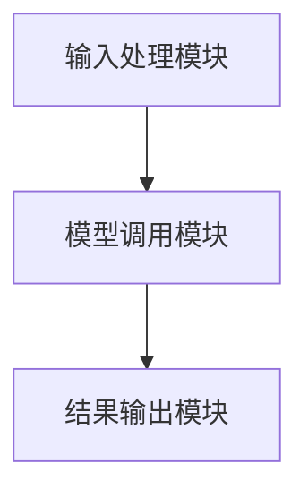

                 


# LLM在AI Agent中的微调技术：适应特定领域需求

> 关键词：LLM，AI Agent，微调技术，自然语言处理，人工智能，领域模型

> 摘要：本文探讨了如何通过微调技术将大语言模型（LLM）应用于AI Agent，以适应特定领域的需求。我们从背景介绍、核心概念、算法原理、系统架构、项目实战到最佳实践，全面分析了微调技术在AI Agent中的应用。通过实际案例，我们展示了如何设计和实现一个支持微调的AI Agent系统，并总结了相关经验和注意事项。

---

## 第1章 LLM和AI Agent概述

### 1.1 LLM的定义与特点

#### 1.1.1 大语言模型的定义
大语言模型（LLM）是指基于深度学习技术训练的大型神经网络模型，能够理解和生成人类语言。LLM的核心是其庞大的参数量和强大的上下文理解能力。

#### 1.1.2 LLM的核心特点
- **规模性**：参数量通常在数亿级别，甚至更高。
- **通用性**：能够处理多种语言理解和生成任务。
- **上下文感知**：能够捕捉文本中的上下文信息，生成连贯的回答。

#### 1.1.3 LLM与传统NLP模型的区别
传统NLP模型通常针对特定任务（如机器翻译、问答系统）进行训练，而LLM是通过大量通用文本数据预训练而成，适用于多种任务。

---

### 1.2 AI Agent的定义与特点

#### 1.2.1 AI Agent的基本概念
AI Agent是一种智能体，能够感知环境、执行任务并做出决策。它可以在多种场景中与用户交互，帮助完成复杂任务。

#### 1.2.2 AI Agent的核心功能
- **感知**：通过传感器或API获取环境信息。
- **推理**：基于感知信息进行逻辑推理。
- **决策**：根据推理结果做出最优决策。
- **执行**：通过执行器完成任务。

#### 1.2.3 AI Agent与传统软件的区别
AI Agent具备学习和适应能力，能够根据反馈优化自身行为，而传统软件通常无法实现这一点。

---

### 1.3 LLM在AI Agent中的作用

#### 1.3.1 LLM作为AI Agent的核心模块
LLM可以作为AI Agent的自然语言处理模块，负责理解和生成文本。

#### 1.3.2 LLM在AI Agent中的应用场景
- **对话交互**：提供自然的对话体验。
- **任务执行**：通过理解用户指令完成复杂任务。
- **知识检索**：帮助用户获取所需信息。

#### 1.3.3 LLM与AI Agent的结合方式
LLM可以作为AI Agent的后端服务，接收输入、处理请求并返回结果。这种结合方式使得AI Agent具备强大的自然语言处理能力。

---

## 第2章 微调技术的背景与必要性

### 2.1 微调技术的基本概念

#### 2.1.1 微调技术的定义
微调技术是指在预训练好的模型基础上，针对特定任务进行 fine-tuning，以优化模型在目标领域的表现。

#### 2.1.2 微调技术的核心思想
通过在特定领域数据上进行微调，使模型适应目标任务的需求。

#### 2.1.3 微调技术与模型训练的关系
微调是在预训练的基础上进行的，通常只调整模型的顶层参数，以减少计算开销。

---

### 2.2 微调技术在LLM中的应用

#### 2.2.1 微调技术在LLM中的作用
- **领域适应**：使LLM在特定领域（如医疗、法律）中表现更优。
- **任务优化**：针对特定任务（如问答系统、文本摘要）进行优化。

#### 2.2.2 微调技术与LLM性能提升的关系
微调可以显著提高模型在特定任务上的准确性和响应速度。

#### 2.2.3 微调技术在AI Agent中的必要性
AI Agent需要处理多种任务，微调技术能够帮助模型更好地适应这些任务。

---

### 2.3 微调技术的背景与需求

#### 2.3.1 微调技术的背景
随着LLM的广泛应用，如何使其适应特定领域的需求成为研究重点。

#### 2.3.2 微调技术的需求
- **领域特定性**：不同领域对模型的需求不同。
- **任务多样性**：AI Agent需要处理多种任务。

#### 2.3.3 微调技术的挑战
- **数据获取**：需要特定领域的标注数据。
- **计算资源**：微调过程需要大量计算资源。

---

## 第3章 微调技术的核心原理

### 3.1 微调技术的算法原理

#### 3.1.1 微调技术的核心思想
在预训练的基础上，通过特定领域的数据对模型进行进一步训练，优化模型在目标任务上的性能。

#### 3.1.2 微调技术的数学模型
微调技术通常采用交叉熵损失函数，通过反向传播更新模型参数。

#### 3.1.3 微调技术的具体步骤
1. 预训练：使用通用数据集训练初始模型。
2. 微调：使用特定领域数据训练模型，优化目标任务。

---

### 3.2 微调技术的数学模型

#### 3.2.1 损失函数
交叉熵损失函数：
$$ L = -\frac{1}{N}\sum_{i=1}^{N} \sum_{k=1}^{K} y_{i,k} \log(p_{i,k}) $$
其中，$y_{i,k}$是真实标签，$p_{i,k}$是预测概率。

#### 3.2.2 参数更新
使用梯度下降法更新模型参数：
$$ \theta = \theta - \eta \frac{\partial L}{\partial \theta} $$
其中，$\eta$是学习率。

---

## 第4章 系统架构与设计

### 4.1 系统架构设计

#### 4.1.1 系统功能模块
- **输入处理模块**：接收用户输入。
- **模型调用模块**：调用微调后的LLM进行推理。
- **结果输出模块**：返回处理结果。

#### 4.1.2 系统架构图


---

## 第5章 项目实战

### 5.1 环境安装

#### 5.1.1 安装Python
```bash
python --version
```

#### 5.1.2 安装依赖
```bash
pip install transformers torch
```

---

### 5.2 系统核心实现

#### 5.2.1 微调代码实现
```python
import torch
from transformers import AutoTokenizer, AutoModelForMaskedLM

model_name = "bert-base-uncased"
tokenizer = AutoTokenizer.from_pretrained(model_name)
model = AutoModelForMaskedLM.from_pretrained(model_name)

# 微调训练
optimizer = torch.optim.AdamW(model.parameters(), lr=1e-5)
criterion = torch.nn.CrossEntropyLoss()

for epoch in range(num_epochs):
    for batch in train_loader:
        inputs, labels = batch
        outputs = model(inputs)
        loss = criterion(outputs.logits, labels)
        loss.backward()
        optimizer.step()
```

---

### 5.3 案例分析

#### 5.3.1 案例背景
假设我们正在为一个医疗领域的AI Agent进行微调。

#### 5.3.2 微调过程
1. 收集医疗领域的标注数据。
2. 使用这些数据对模型进行微调。
3. 测试模型在医疗领域的表现。

---

## 第6章 最佳实践与总结

### 6.1 最佳实践

#### 6.1.1 数据选择
确保数据的多样性和代表性。

#### 6.1.2 模型选择
根据任务需求选择合适的模型。

#### 6.1.3 训练策略
合理设置学习率和训练轮数。

---

### 6.2 总结

通过本文的探讨，我们了解了如何通过微调技术将LLM应用于AI Agent，并使其适应特定领域的需求。微调技术能够显著提升模型在目标任务上的性能，是实现AI Agent实用化的关键步骤。

---

**作者：AI天才研究院 & 禅与计算机程序设计艺术**

