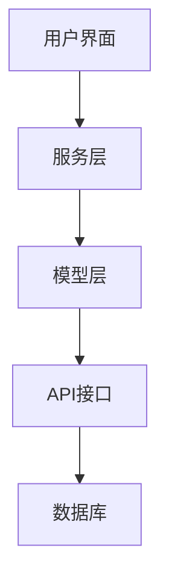
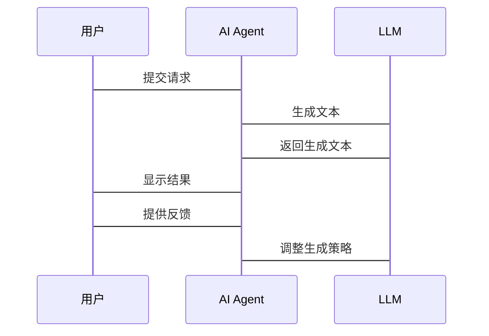

                 


# LLM在AI Agent中的文本复杂性调整能力

> 关键词：大语言模型（LLM）、AI Agent、文本复杂性调整、自然语言处理（NLP）、人工智能（AI）

> 摘要：本文探讨了大语言模型（LLM）在AI Agent中的文本复杂性调整能力，分析了其核心概念、算法原理、系统架构及应用场景，详细讲解了如何通过LLM实现文本复杂性的动态调整，以满足不同用户需求。文章从背景介绍、核心概念、算法原理、系统架构、项目实战、总结与展望等多方面展开，为读者提供了全面的技术解析。

---

## 第1章: 背景介绍

### 1.1 问题背景

#### 1.1.1 大语言模型（LLM）的发展与应用

近年来，大语言模型（LLM）如GPT、BERT等在自然语言处理（NLP）领域取得了显著进展。这些模型通过预训练海量数据，能够理解和生成人类语言，广泛应用于文本生成、机器翻译、问答系统等领域。

#### 1.1.2 AI Agent的基本概念与功能

AI Agent是一种智能体，能够感知环境、执行任务并做出决策。它通常具备自主性、反应性、目标导向和社会能力等特征，能够与用户或其他系统进行交互，完成复杂任务。

#### 1.1.3 文本复杂性调整的必要性

在实际应用中，AI Agent生成的文本需要适应不同用户的需求。例如，对普通用户的解释需要简单易懂，而对专家则需要详细技术说明。因此，动态调整文本复杂性是提升用户体验的关键。

### 1.2 问题描述

#### 1.2.1 LLM在AI Agent中的作用

LLM为AI Agent提供了强大的语言生成和理解能力，使其能够生成自然流畅的文本，并根据上下文调整内容。

#### 1.2.2 文本复杂性调整的核心问题

文本复杂性调整涉及多个维度，如句子长度、词汇难度和语法复杂度。如何在生成文本时动态调整这些维度，以满足用户需求，是当前研究的重点。

#### 1.2.3 相关技术的现状与挑战

尽管LLM在文本生成方面表现出色，但如何有效调整文本复杂性仍面临挑战。现有方法通常依赖于简单的阈值调整或启发式规则，缺乏灵活性和适应性。

### 1.3 问题解决

#### 1.3.1 LLM如何实现文本复杂性调整

通过调整生成策略，如动态修改解码过程，可以实现文本复杂性调整。LLM可以根据输入的复杂性参数生成不同难度的文本。

#### 1.3.2 AI Agent中的文本复杂性调整方法

AI Agent可以结合用户特征、上下文信息和任务需求，动态调整生成文本的复杂性。例如，通过分析用户的历史交互记录，预测用户的偏好。

#### 1.3.3 技术实现的边界与外延

文本复杂性调整的边界包括内容生成的准确性和流畅性，而外延则涉及多语言支持和多模态交互。

### 1.4 核心概念与联系

#### 1.4.1 LLM与AI Agent的关系

LLM为AI Agent提供语言能力，而AI Agent则为LLM提供应用场景和目标导向的任务。

#### 1.4.2 文本复杂性调整的核心要素

文本复杂性调整的核心要素包括生成策略、用户特征和上下文信息。

#### 1.4.3 概念结构与核心要素组成

文本复杂性调整涉及LLM、AI Agent、用户特征和上下文信息等多个要素，形成一个动态调整的系统。

---

## 第2章: 核心概念与联系

### 2.1 LLM与AI Agent的核心原理

#### 2.1.1 LLM的基本原理

LLM基于Transformer架构，通过自注意力机制捕捉上下文信息，生成与输入相关联的输出。

#### 2.1.2 AI Agent的基本原理

AI Agent通过感知环境、推理和规划，执行任务并生成相应输出。

#### 2.1.3 两者结合的原理

通过API调用或内部集成，AI Agent利用LLM生成文本内容，并根据反馈调整策略。

### 2.2 概念属性特征对比

| 概念 | 属性 | 描述 |
|------|------|------|
| LLM | 输入 | 文本 |
| LLM | 输出 | 文本 |
| AI Agent | 输入 | 环境状态、用户请求 |
| AI Agent | 输出 | 动作、文本 |

### 2.3 ER实体关系图

```mermaid
erDiagram
    user[用户] {
        id
        preference
    }
    llm[LLM模型] {
        id
        parameters
    }
    ai_agent[AI Agent] {
        id
        task
    }
    user -> llm: 调用
    llm -> ai_agent: 提供语言能力
    ai_agent -> user: 返回结果
```

---

## 第3章: 算法原理讲解

### 3.1 LLM的训练过程

#### 3.1.1 基于Transformer的模型结构

LLM采用Transformer架构，通过多头自注意力机制捕捉长距离依赖关系。

#### 3.1.2 大规模预训练过程

通过大量未标记数据的预训练，模型学习语言的通用特征。

#### 3.1.3 微调与适应任务

根据具体任务，对模型进行微调，使其适应特定领域或任务需求。

#### 3.1.4 生成策略调整

通过修改解码过程中的温度、重复惩罚等参数，动态调整生成文本的复杂性。

#### 3.1.5 文本复杂性调整的数学模型

生成策略的调整涉及概率分布的修改，可以用以下公式表示：

$$ P(y|x) = \text{生成策略}(y|x) $$

---

## 第4章: 系统分析与架构设计

### 4.1 问题场景介绍

AI Agent需要根据用户需求生成不同复杂度的文本，例如为普通用户生成简明说明，为专家生成详细报告。

### 4.2 系统功能设计

系统功能包括：接收用户请求、分析用户特征、生成文本、反馈与调整。

### 4.3 系统架构设计



### 4.4 系统接口设计

接口包括：用户输入接口、生成参数设置接口、反馈接口。

### 4.5 系统交互流程



---

## 第5章: 项目实战

### 5.1 环境安装

安装Python和相关库，如TensorFlow、PyTorch。

### 5.2 核心代码实现

```python
def adjust_complexity(text, complexity_level):
    # 根据复杂度级别调整生成参数
    temperature = 0.7 + (complexity_level * 0.3)
    return generate_text(text, temperature)
```

### 5.3 代码应用解读

通过调整温度参数，实现文本复杂性的动态控制。

### 5.4 实际案例分析

分析一个具体案例，展示如何根据用户需求调整文本复杂性。

### 5.5 项目小结

总结项目实现的关键点和经验教训。

---

## 第6章: 总结与展望

### 6.1 最佳实践 tips

- 根据用户特征动态调整复杂性。
- 使用反馈机制优化生成策略。

### 6.2 小结

总结全文，强调LLM在AI Agent中的重要性。

### 6.3 注意事项

- 注意生成内容的准确性和相关性。
- 避免过度简化或复杂化文本。

### 6.4 拓展阅读

推荐相关领域的书籍和论文，供读者深入学习。

---

## 作者：AI天才研究院/AI Genius Institute & 禅与计算机程序设计艺术 /Zen And The Art of Computer Programming

