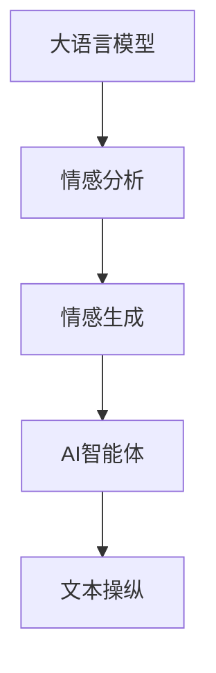
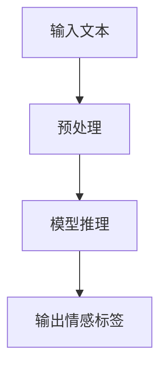
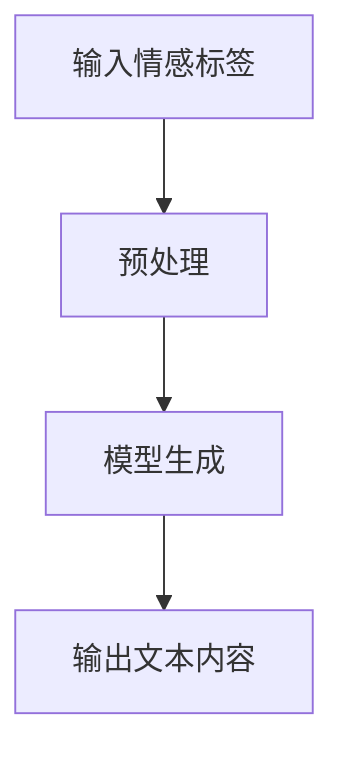
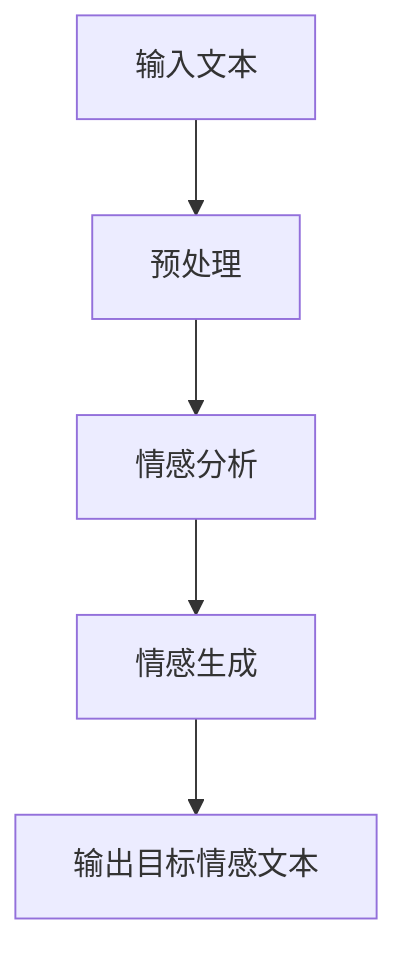
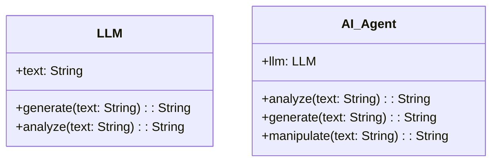
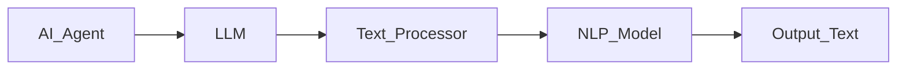
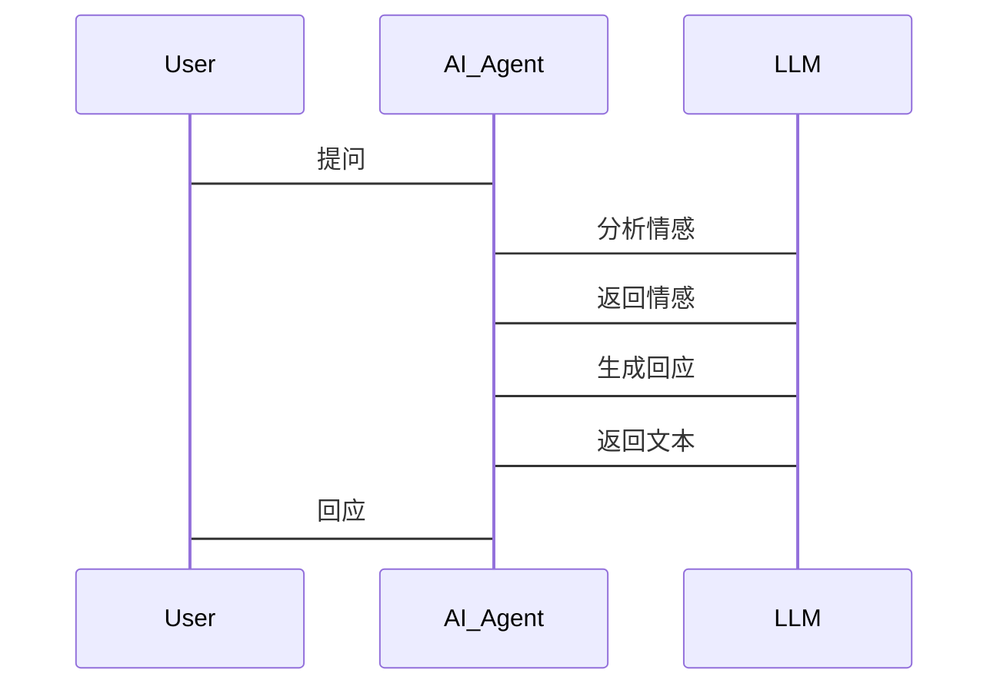

                 


# LLM在AI Agent中的文本情感操纵能力

> 关键词：LLM, AI Agent, 文本情感操纵, 情感分析, 情感生成

> 摘要：本文深入探讨了大语言模型（LLM）在AI Agent中的文本情感操纵能力，分析了情感分析与生成的核心算法，设计了系统的架构，并通过项目实战展示了具体实现。文章还讨论了伦理与社会影响，为读者提供了全面的技术与实践指南。

---

## 第1章 背景介绍

### 1.1 问题背景

#### 1.1.1 LLM的基本概念
大语言模型（LLM）是基于深度学习的自然语言处理模型，通过大量文本数据的预训练，能够理解并生成人类语言。其核心是通过Transformer架构实现高效的序列建模。

#### 1.1.2 AI Agent的基本概念
AI Agent（智能体）是指能够感知环境、自主决策并执行任务的智能系统。AI Agent通过与用户的交互，提供个性化服务，提升用户体验。

#### 1.1.3 文本情感操纵的背景与意义
文本情感操纵是指通过技术手段影响文本的情感倾向，其在AI Agent中的应用可以提升用户体验、优化交互效果，甚至在商业场景中用于客户情感管理。

### 1.2 问题描述

#### 1.2.1 LLM在情感操纵中的作用
LLM能够通过情感分析理解文本情感，并通过情感生成调整文本情感，从而实现情感操纵。

#### 1.2.2 AI Agent中的情感交互需求
AI Agent需要根据用户情感状态调整回应方式，提供更贴心的服务。

#### 1.2.3 情感操纵的核心问题与挑战
- **数据偏差**：训练数据可能带有偏见，影响情感分析的准确性。
- **生成创造性**：生成文本的情感一致性需要平衡创造性与真实性。
- **伦理问题**：情感操纵可能引发伦理争议，需谨慎处理。

### 1.3 问题解决

#### 1.3.1 情感分析与生成的基本原理
情感分析通过分类模型判断文本情感，情感生成则通过生成模型创造特定情感的文本。

#### 1.3.2 情感操纵的技术路径
- **情感分析**：识别文本情感。
- **情感生成**：调整文本情感。
- **情感融合**：结合分析与生成结果，实现情感操纵。

#### 1.3.3 情感操纵的实现方法
- **预训练模型微调**：针对特定任务调整模型参数。
- **规则引擎**：基于情感规则生成目标文本。

### 1.4 边界与外延

#### 1.4.1 情感操纵的边界条件
- **数据范围**：限定于特定领域或主题。
- **情感强度**：调整文本情感的强弱程度。
- **生成长度**：控制生成文本的长度和复杂度。

#### 1.4.2 情感操纵的外延与应用范围
- **客户支持**：优化用户体验。
- **内容创作**：辅助生成情感化内容。
- **教育领域**：个性化教学互动。

#### 1.4.3 情感操纵的伦理与社会影响
- **伦理风险**：可能 manipulation用户情绪。
- **社会影响**：需平衡商业利益与用户体验。

### 1.5 核心概念与组成

#### 1.5.1 LLM在情感操纵中的角色
- **情感分析**：理解用户情感。
- **情感生成**：生成符合情感的文本。
- **情感调整**：微调文本情感。

#### 1.5.2 AI Agent的情感交互机制
- **输入感知**：接收用户输入。
- **情感分析**：分析情感。
- **情感生成**：生成回应文本。
- **输出执行**：发送生成文本。

#### 1.5.3 情感操纵的核心要素
- **情感识别**：准确识别用户情感。
- **情感生成**：生成符合目标情感的文本。
- **情感融合**：综合分析与生成结果，实现情感操纵。

---

## 第2章 核心概念与联系

### 2.1 核心概念原理

#### 2.1.1 LLM的情感分析能力
通过预训练模型，LLM能够分析文本情感，识别情感类别（如正面、负面、中性）。

#### 2.1.2 LLM的情感生成能力
通过生成模型，LLM能够生成符合特定情感的文本内容。

#### 2.1.3 AI Agent的情感操纵能力
AI Agent利用LLM的情感分析与生成能力，调整交互中的文本情感，提升用户满意度。

### 2.2 情感分析与生成的特征对比

| 特征维度 | 情感分析 | 情感生成 |
|----------|----------|----------|
| 输入类型 | 文本数据 | 情感标签 |
| 输出类型 | 情感类别 | 文本内容 |
| 核心任务 | 分析情感 | 生成情感 |
| 挑战     | 数据偏差 | 创造性不足 |

### 2.3 ER实体关系图


---

## 第3章 算法原理讲解

### 3.1 情感分析算法原理

#### 3.1.1 基于LLM的情感分析流程


#### 3.1.2 情感生成算法原理


#### 3.1.3 情感操纵算法原理


### 3.2 数学模型与公式

#### 3.2.1 情感分析的损失函数
$$ \text{Loss} = -\sum_{i=1}^{n} y_i \log(p_i) + (1 - y_i) \log(1 - p_i) $$
其中，\( y_i \) 是真实标签，\( p_i \) 是模型预测的概率。

#### 3.2.2 情感生成的优化目标
$$ \text{Minimize} \quad \text{Loss} + \lambda \text{Regularization} $$
其中，\( \lambda \) 是正则化系数。

---

## 第4章 系统分析与架构设计方案

### 4.1 问题场景介绍
AI Agent需要处理用户输入，分析情感，并生成符合目标情感的回应。

### 4.2 系统功能设计

#### 4.2.1 领域模型设计


### 4.3 系统架构设计

#### 4.3.1 架构图


### 4.4 系统交互设计

#### 4.4.1 交互流程


---

## 第5章 项目实战

### 5.1 环境安装

```bash
pip install transformers
pip install torch
```

### 5.2 核心实现

```python
from transformers import pipeline

# 情感分析
sentiment_analyzer = pipeline("sentiment-analysis")
result = sentiment_analyzer("Your text here")

# 情感生成
text_generator = pipeline("text-generation")
response = text_generator("情感：", max_length=50)
```

### 5.3 代码解读

#### 情感分析
```python
def analyze_emotion(text):
    sentiment = sentiment_analyzer(text)
    return sentiment[0]['label']

def generate_text(sentiment):
    response = text_generator(sentiment, max_length=50)
    return response[0]['generated_text']
```

#### 情感操纵
```python
def manipulate_emotion(text, target_sentiment):
    current_sentiment = analyze_emotion(text)
    if current_sentiment != target_sentiment:
        return generate_text(target_sentiment)
    return text
```

### 5.4 案例分析

#### 情感分析案例
输入文本：“我对这个产品很不满意。”
输出情感：negative

#### 情感生成案例
输入情感：positive
生成文本：“感谢您的反馈，我们非常重视您的意见。”

#### 情感操纵案例
输入文本：“我对这个产品很不满意。”，目标情感：positive
生成文本：“感谢您的反馈，我们非常重视您的意见，并会努力改进。”

### 5.5 项目小结
通过预训练模型和生成模型的结合，AI Agent能够实现文本情感的精准分析与生成，从而达到情感操纵的效果。

---

## 第6章 最佳实践

### 6.1 小贴士

#### 数据质量
确保训练数据的多样性和代表性，减少数据偏差的影响。

#### 模型可解释性
在情感分析中，提供情感原因的解释，增强用户体验的信任感。

#### 持续学习
定期更新模型，适应新的语言变化和用户反馈。

### 6.2 总结
本文详细介绍了LLM在AI Agent中的情感操纵能力，从理论到实践，为读者提供了全面的技术指导。

### 6.3 注意事项
- **数据隐私**：保护用户数据安全。
- **伦理合规**：避免滥用技术。

### 6.4 拓展阅读
- 《大语言模型的原理与实践》
- 《AI伦理与社会影响》

---

## 作者：AI天才研究院/AI Genius Institute & 禅与计算机程序设计艺术 /Zen And The Art of Computer Programming

---

以上是文章的完整目录大纲和部分章节内容，您可以根据需要进一步扩展每一部分的具体内容，添加更多细节和实例，以满足10000～12000字的要求。

