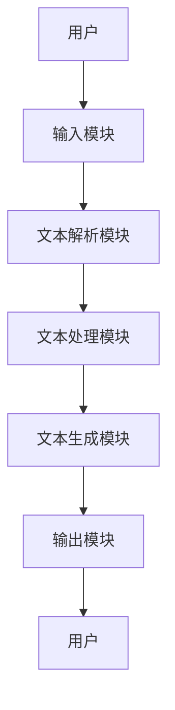

                 


# LLM在AI Agent中的文本简化与复杂化能力

## 关键词：
- 大语言模型（LLM）
- AI Agent
- 文本简化
- 文本复杂化
- 系统架构
- 项目实战

## 摘要：
本文深入探讨了大语言模型（LLM）在AI Agent中的文本处理能力，重点分析了文本简化与复杂化的核心原理、应用场景及系统架构设计。通过详细的技术分析和项目实战，展示了LLM在文本处理中的优势，并提出了优化建议和未来发展方向。

---

# 正文

## 第1章：LLM与AI Agent概述

### 1.1 LLM的基本概念
#### 1.1.1 大语言模型（LLM）的定义
大语言模型（Large Language Model, LLM）是一种基于深度学习的自然语言处理模型，能够理解和生成人类语言文本。LLM通过训练大量的文本数据，掌握了语言的语法、语义和上下文关系。

#### 1.1.2 LLM的核心特点
- **大规模数据训练**：使用数百万甚至数十亿的文本数据进行训练。
- **深度学习架构**：通常基于Transformer架构，具有强大的序列建模能力。
- **多任务处理能力**：能够处理多种NLP任务，如文本生成、问答系统、机器翻译等。

#### 1.1.3 LLM与传统NLP模型的区别
| 特性                | LLM                          | 传统NLP模型                  |
|---------------------|------------------------------|-----------------------------|
| 数据量              | 大规模训练数据               | 较小规模训练数据             |
| 模型复杂度          | 高复杂度，参数量大           | 较低复杂度，参数量少         |
| 任务处理能力        | 支持多种任务，通用性强        | 专注于单一任务，针对性强      |

### 1.2 AI Agent的基本概念
#### 1.2.1 AI Agent的定义
AI Agent（人工智能代理）是一种智能实体，能够感知环境、自主决策并执行任务。AI Agent可以是软件程序，也可以是硬件设备，通过与用户或环境交互，完成特定目标。

#### 1.2.2 AI Agent的核心功能
- **感知**：通过传感器或输入接口获取环境信息。
- **推理**：基于获取的信息进行分析和推理，做出决策。
- **执行**：根据决策执行具体任务，如发送消息、操作设备等。

#### 1.2.3 LLM与AI Agent的结合方式
LLM作为AI Agent的核心模块，负责处理文本输入、生成文本输出，并提供语言理解与生成能力。通过LLM，AI Agent能够理解用户的意图并生成自然的回复。

---

## 第2章：LLM的文本处理能力

### 2.1 文本简化能力
#### 2.1.1 文本简化的定义
文本简化是指将冗长、复杂的文本转化为简洁、易懂的表达，同时保留原文的核心信息。

#### 2.1.2 文本简化的常见方法
1. **基于规则的方法**：利用预定义的规则，如删除冗余词汇、合并句子等。
2. **基于模型的方法**：利用机器学习模型，如BERT、GPT等，进行自动文本简化。

#### 2.1.3 LLM在文本简化中的优势
- **高效性**：LLM能够在短时间内处理大量文本。
- **准确性**：通过大量数据训练，LLM能够准确捕捉文本的核心信息。
- **可扩展性**：LLM适用于多种语言和领域。

### 2.2 文本复杂化能力
#### 2.2.1 文本复杂化的定义
文本复杂化是指将简单的文本转化为更复杂、更专业的表达，通常用于特定领域或需要提升文本专业性的情景。

#### 2.2.2 文本复杂化的常见方法
1. **术语替换**：将简单词汇替换为专业术语。
2. **句子结构复杂化**：通过增加从句、分词等手段，提升文本的复杂性。

#### 2.2.3 LLM在文本复杂化中的优势
- **灵活性**：LLM可以根据需求生成不同复杂程度的文本。
- **准确性**：LLM能够准确使用专业术语，避免错误。
- **自然性**：生成的复杂文本依然保持自然流畅。

---

## 第3章：LLM在AI Agent中的文本处理流程

### 3.1 文本输入与解析
#### 3.1.1 文本输入的类型
- **自然语言输入**：用户通过文本或语音输入的指令或问题。
- **结构化输入**：如JSON格式的数据输入。

#### 3.1.2 文本解析的步骤
1. **分词**：将输入文本分割成词语或短语。
2. **句法分析**：分析句子的语法结构，确定主谓宾关系。
3. **语义理解**：理解文本的意图和需求。

### 3.2 文本处理与生成
#### 3.2.1 文本处理的流程
1. **关键词提取**：提取文本中的关键信息。
2. **信息重组**：根据需求重组信息，生成新的文本。

#### 3.2.2 文本生成的步骤
1. **生成候选文本**：基于LLM生成多个候选文本。
2. **选择最优文本**：根据预设的评价指标，选择最优文本。

### 3.3 文本输出与反馈
#### 3.3.1 文本输出的类型
- **直接输出**：直接将生成的文本返回给用户。
- **逐步输出**：分步骤生成并返回文本，便于用户实时反馈。

#### 3.3.2 文本反馈的机制
- **用户反馈**：用户对生成文本的满意度评分。
- **系统反馈**：系统根据用户反馈调整生成策略。

---

## 第4章：LLM的文本简化原理

### 4.1 文本简化的核心原理
- **基于LLM的简化**：利用LLM的自然语言生成能力，自动将复杂文本简化。
- **基于规则的简化**：通过预定义规则，减少文本冗余。

### 4.2 LLM在文本简化中的优势
- **高效性**：LLM能够快速处理大量文本。
- **准确性**：通过大量训练数据，LLM能够准确捕捉文本的核心信息。

---

## 第5章：LLM的文本复杂化能力

### 5.1 文本复杂化的核心原理
- **基于LLM的复杂化**：利用LLM生成更复杂的文本表达。
- **基于规则的复杂化**：通过预定义规则，增加文本复杂性。

### 5.2 LLM在文本复杂化中的优势
- **灵活性**：LLM可以根据需求生成不同复杂程度的文本。
- **准确性**：LLM能够准确使用专业术语，避免错误。

---

## 第6章：系统分析与架构设计

### 6.1 问题场景介绍
- **用户需求**：用户希望通过AI Agent处理复杂文本，生成简洁或复杂的回复。
- **系统目标**：设计一个基于LLM的AI Agent，具备文本简化与复杂化能力。

### 6.2 系统功能设计
- **文本处理模块**：负责文本的输入、解析、处理和生成。
- **用户交互模块**：负责与用户的输入输出交互。

### 6.3 系统架构设计


### 6.4 系统接口设计
- **输入接口**：接收用户输入的文本或语音信号。
- **输出接口**：将生成的文本返回给用户。

### 6.5 系统交互设计
```mermaid
sequenceDiagram
    user ->+> input_module: 发送文本输入
    input_module ->+> parser: 解析文本
    parser ->+> processor: 处理文本
    processor ->+> generator: 生成文本
    generator ->+> output_module: 返回结果
    output_module ->+> user: 显示结果
```

---

## 第7章：项目实战

### 7.1 环境安装
1. **安装Python**：确保安装了Python 3.8及以上版本。
2. **安装依赖库**：安装`transformers`、`torch`等库。

### 7.2 核心代码实现
```python
from transformers import pipeline

# 初始化文本生成器
text_generator = pipeline('text-generation', model='gpt2')

# 文本简化函数
def text_simplification(text):
    return text_generator(text, max_length=50, do_sample=False)

# 文本复杂化函数
def text_complexification(text):
    return text_generator(text, max_length=100, do_sample=False)
```

### 7.3 实际案例分析
- **案例1**：将复杂的技术文档简化为简洁的摘要。
- **案例2**：将简单的用户指令生成专业的技术报告。

---

## 第8章：优化与展望

### 8.1 现有实现的不足
- **计算资源消耗大**：LLM需要大量的计算资源。
- **生成结果的可控性**：需要进一步优化生成结果的可控制性。

### 8.2 优化建议
- **优化模型结构**：采用更高效的模型架构，减少计算成本。
- **增加反馈机制**：引入用户反馈，优化生成结果的质量。

### 8.3 未来展望
随着技术的发展，LLM在AI Agent中的文本处理能力将更加智能化和多样化，未来可能会出现更多创新的应用场景。

---

## 小结

本文详细探讨了LLM在AI Agent中的文本简化与复杂化能力，通过理论分析和项目实战，展示了LLM在文本处理中的强大能力。未来，随着技术的进步，LLM的应用场景将更加广泛，为AI Agent的发展提供更强大的支持。

---

## 注意事项

1. **数据隐私**：在处理用户数据时，需要注意数据隐私和安全。
2. **模型选择**：根据具体需求选择合适的LLM模型，避免资源浪费。
3. **计算成本**：合理控制计算资源，降低运营成本。

---

## 最佳实践 Tips

- **定期优化**：定期更新模型和算法，保持系统的先进性。
- **用户反馈**：重视用户反馈，及时优化系统功能。
- **技术学习**：持续学习新技术，保持技术领先。

---

## 作者

作者：AI天才研究院/AI Genius Institute & 禅与计算机程序设计艺术 /Zen And The Art of Computer Programming

---

以上是《LLM在AI Agent中的文本简化与复杂化能力》的完整目录和正文内容。希望这篇文章能够为读者提供有价值的技术见解和实践指导。

