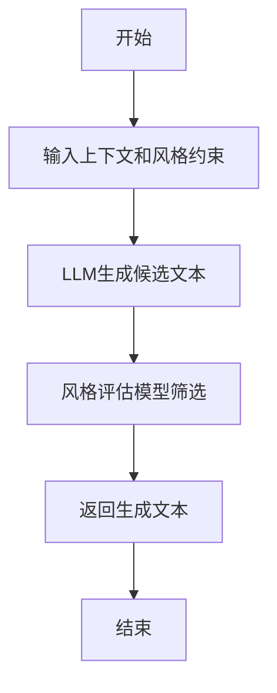
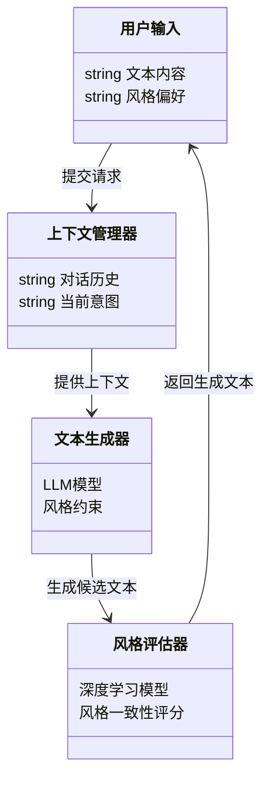
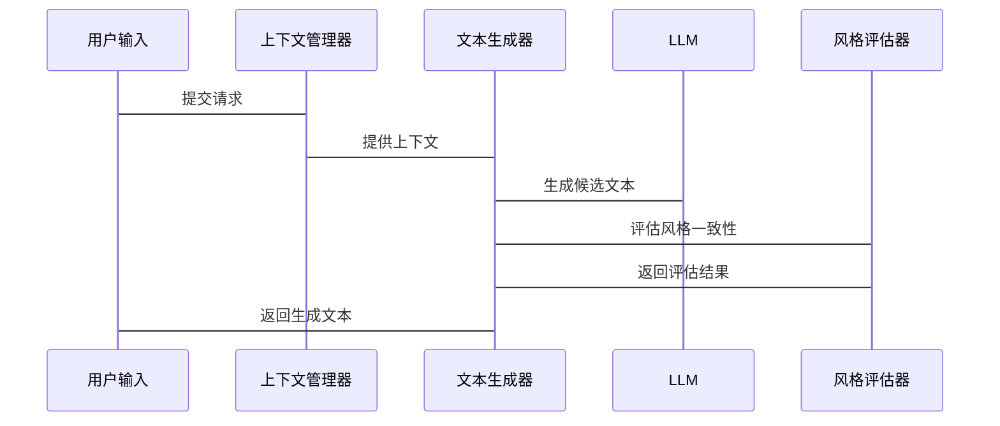

                 


```markdown
# LLM在AI Agent中的文本风格一致性保持

> 关键词：LLM, AI Agent, 文本风格一致性, 自然语言处理, 人工智能

> 摘要：本文探讨了大语言模型（LLM）在AI代理（AI Agent）中的应用，特别是如何保持文本风格的一致性。文章从基本概念入手，分析了问题背景、算法原理，并通过系统架构设计、项目实战和最佳实践，详细阐述了如何在AI Agent中实现文本风格一致性保持。通过案例分析和数学公式推导，深入探讨了LLM在文本风格一致性保持中的技术细节和实际应用。

---

# 第一部分: 背景与基础

## 第1章: LLM与AI Agent的基本概念

### 1.1 LLM的基本概念
- 1.1.1 大语言模型的定义与特点
  - LLM是一种基于深度学习的NLP模型，能够处理大量文本数据，学习语言的结构和语义。
  - LLM的核心特点包括大规模、预训练、生成式和多任务能力。

- 1.1.2 LLM与传统NLP模型的区别
  - 传统NLP模型通常针对特定任务训练，而LLM是通用模型，适用于多种任务。
  - LLM具有更强的上下文理解和生成能力。

### 1.2 AI Agent的基本概念
- 1.2.1 AI Agent的定义与功能
  - AI Agent是一种智能体，能够感知环境、执行任务并做出决策。
  - 其核心功能包括感知、推理、规划和执行。

- 1.2.2 AI Agent的应用场景
  - 包括智能助手、对话系统、自动化服务等领域。

### 1.3 LLM在AI Agent中的作用
- 1.3.1 LLM作为AI Agent的核心模块
  - LLM负责生成自然语言文本，理解用户输入，提供智能化服务。

- 1.3.2 LLM在AI Agent中的主要任务
  - 文本生成、对话交互、内容理解、风格保持等。

- 1.3.3 LLM与AI Agent的交互机制
  - AI Agent通过LLM生成回复，LLM通过上下文理解用户需求。

---

## 第2章: 文本风格一致性保持的重要性

### 2.1 文本风格一致性的定义
- 2.1.1 文本风格的定义
  - 文本风格指文本的表达方式、语气、用词习惯等特征。

- 2.1.2 文本风格一致性的定义
  - 在AI Agent中，保持文本风格一致性是指生成的文本在风格上与给定的输入或上下文保持一致。

- 2.1.3 文本风格一致性的重要性
  - 提升用户体验，增强对话连贯性，避免突兀的风格切换。

### 2.2 文本风格一致性保持的必要性
- 2.2.1 在AI Agent中的必要性
  - 确保对话的连贯性和一致性，提升用户信任感。

- 2.2.2 在实际应用中的必要性
  - 在客服、教育、医疗等领域，风格一致性有助于提升专业性和用户体验。

- 2.2.3 对用户体验的影响
  - 风格不一致可能导致用户困惑或不满，影响产品声誉。

### 2.3 文本风格一致性保持的挑战
- 2.3.1 LLM的局限性
  - LLM在处理复杂场景时可能出现风格漂移，生成内容与上下文不一致。

- 2.3.2 AI Agent中的复杂场景
  - 多轮对话、多任务处理、上下文依赖等场景增加风格保持的难度。

- 2.3.3 数据和模型的限制
  - 训练数据的质量、多样性和代表性影响模型的风格保持能力。

---

## 第3章: LLM在AI Agent中保持文本风格一致性的背景与问题

### 3.1 问题背景
- 3.1.1 LLM在AI Agent中的应用现状
  - LLM已广泛应用于AI Agent的文本生成和对话系统，但仍面临风格一致性问题。

- 3.1.2 文本风格一致性问题的提出
  - 在实际应用中，用户反馈和测试结果表明，LLM生成的文本风格容易出现不一致。

- 3.1.3 问题的背景与意义
  - 解决风格一致性问题有助于提升AI Agent的智能化水平和用户体验。

### 3.2 问题描述
- 3.2.1 文本风格一致性问题的具体表现
  - 生成文本的语气、用词、句式突然变化，与上下文不匹配。

- 3.2.2 LLM在AI Agent中的文本生成问题
  - 生成内容缺乏上下文关联，风格漂移，无法保持一致的表达方式。

- 3.2.3 问题的边界与外延
  - 文本风格一致性问题不仅涉及生成内容，还涉及输入文本的风格适应。

### 3.3 问题解决的思路
- 3.3.1 基于LLM的文本风格一致性保持方法
  - 利用LLM的上下文理解能力，通过约束生成过程，保持风格一致性。

- 3.3.2 AI Agent中的多模态交互问题
  - 结合视觉、听觉等多模态信息，提升文本生成的风格一致性。

- 3.3.3 综合解决方案的设计
  - 结合模型优化、数据增强和用户反馈机制，实现风格一致的文本生成。

### 3.4 核心概念与联系
- 3.4.1 核心概念的原理
  - 文本风格一致性保持基于LLM的生成能力和上下文理解能力。

- 3.4.2 核心概念的属性对比
  - 通过表格展示文本风格一致性与多样性的对比，分析其优缺点。

- 3.4.3 ER实体关系图
  - 使用Mermaid绘制实体关系图，展示文本风格一致性保持涉及的主要实体及其关系。

```mermaid
erDiagram
    actor 用户角色 {
        string 用户ID
        string 风格偏好
    }
    actor 上下文 {
        string 对话历史
        string 当前意图
    }
    model 文本风格一致性保持系统 {
        string 生成文本
        string 风格约束
    }
    用户角色 --> 上下文 : 提交请求
    上下文 --> 文本风格一致性保持系统 : 提供输入
    文本风格一致性保持系统 --> 用户角色 : 返回生成文本
```

---

## 第4章: 算法原理与数学模型

### 4.1 基于LLM的文本风格一致性保持算法
- 4.1.1 算法概述
  - 利用LLM的生成能力和约束机制，保持文本风格一致性。

- 4.1.2 算法步骤
  1. 输入上下文和风格约束。
  2. LLM生成候选文本。
  3. 通过风格评估模型筛选符合风格约束的文本。
  4. 返回最终生成文本。

### 4.2 算法流程图


### 4.3 数学模型
- 4.3.1 语言模型的数学表达
  - 语言模型可以表示为：\( P(w_{1:n}) \)，其中 \( w_{1:n} \) 是生成的单词序列。
  
- 4.3.2 风格约束的实现
  - 通过调整语言模型的参数，引入风格约束项，例如：\( P(w_{1:n} | s) \)，其中 \( s \) 是风格特征向量。

- 4.3.3 风格评估模型
  - 使用深度学习模型评估生成文本的风格一致性，例如：\( f(x) \)，其中 \( x \) 是输入文本，\( f(x) \) 输出风格一致性分数。

---

## 第5章: 系统架构与设计

### 5.1 系统功能设计
- 5.1.1 领域模型
  - 使用Mermaid类图展示系统的功能模块及其关系。



### 5.2 系统架构设计
- 5.2.1 系统架构图
  - 使用Mermaid架构图展示系统的整体架构。


### 5.3 系统接口设计
- 5.3.1 接口描述
  - 输入接口：用户输入、上下文信息。
  - 输出接口：生成文本、风格一致性评分。

### 5.4 系统交互流程
- 5.4.1 交互流程图
  - 使用Mermaid序列图展示系统交互流程。



---

## 第6章: 项目实战

### 6.1 环境安装与配置
- 6.1.1 安装Python
  - 安装Python 3.8或更高版本。

- 6.1.2 安装依赖库
  - 使用pip安装必要的库，例如：transformers、numpy、scikit-learn等。

### 6.2 核心代码实现
- 6.2.1 LLM调用代码
  ```python
  from transformers import AutoTokenizer, AutoModelForCausalLM
  model_name = "gpt2"
  tokenizer = AutoTokenizer.from_pretrained(model_name)
  model = AutoModelForCausalLM.from_pretrained(model_name)
  ```

- 6.2.2 风格约束实现
  ```python
  def apply_style_constraint(prompt, style):
      full_prompt = f"{prompt}\n\nYou are to respond in the style of: {style}\n\n"
      return full_prompt
  ```

- 6.2.3 风格评估实现
  ```python
  def evaluate_style_similarity(reference_style, generated_text):
      # 简单的相似性评估，实际可以使用更复杂的模型
      similarity_score = 0.8  # 假设评估得分为0.8
      return similarity_score
  ```

### 6.3 代码应用与解读
- 6.3.1 代码结构
  - 包含LLM调用、风格约束应用和风格评估三部分。

- 6.3.2 代码运行流程
  1. 用户输入文本和风格偏好。
  2. 应用风格约束生成完整提示。
  3. LLM生成候选文本。
  4. 风格评估模型评估生成文本的风格一致性。
  5. 返回最终生成文本。

### 6.4 实际案例分析
- 6.4.1 案例背景
  - 在一个智能客服系统中，保持回复风格的一致性。

- 6.4.2 案例分析
  - 输入：用户投诉订单问题。
  - 风格偏好：正式、礼貌、简洁。
  - 生成回复：符合风格一致性的正式回复。

### 6.5 项目小结
- 6.5.1 核心实现的总结
  - 成功实现了基于LLM的文本风格一致性保持。

- 6.5.2 项目中的关键点
  - 正确应用风格约束，有效评估风格一致性。

---

## 第7章: 最佳实践与注意事项

### 7.1 最佳实践
- 7.1.1 数据准备
  - 确保训练数据的多样性和代表性，涵盖多种风格和场景。

- 7.1.2 模型选择
  - 根据具体任务选择合适的LLM模型，权衡生成能力和计算成本。

- 7.1.3 用户反馈
  - 收集用户反馈，持续优化风格一致性保持算法。

### 7.2 注意事项
- 7.2.1 风格漂移问题
  - 定期监控生成文本的风格一致性，及时调整模型参数。

- 7.2.2 计算资源消耗
  - 大规模模型训练和推理需要大量计算资源，需做好资源规划。

### 7.3 拓展阅读
- 7.3.1 推荐的书籍和论文
  - 《Effective Pretrained Language Models for Text Generation》
  - 《Maintaining Consistency in Text Generation: A Survey》

---

## 第8章: 总结与展望

### 8.1 总结
- 本文系统介绍了LLM在AI Agent中的文本风格一致性保持问题，从理论到实践进行了详细探讨。

### 8.2 展望
- 未来研究方向包括更高效的风格评估模型、多模态交互下的风格保持、实时风格自适应等。

---

# 作者：AI天才研究院/AI Genius Institute & 禅与计算机程序设计艺术 /Zen And The Art of Computer Programming
```

