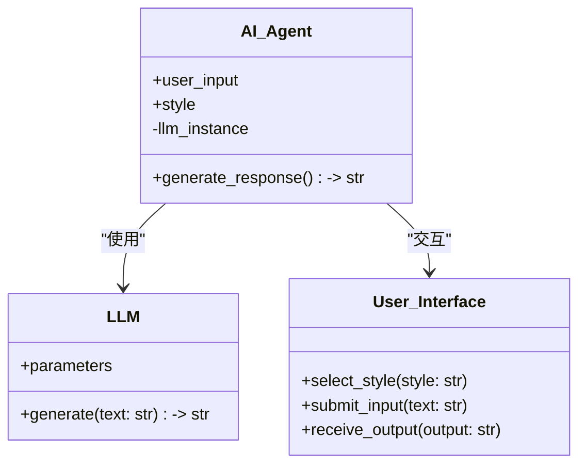
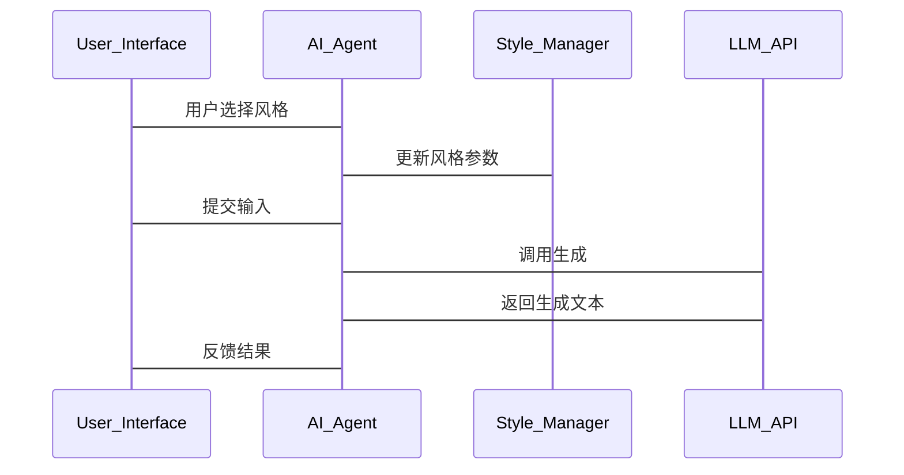

                 


# LLM在AI Agent中的文本风格个性化定制

**关键词**: 大语言模型, AI Agent, 文本风格, 个性化定制, 自然语言处理, 生成式AI

**摘要**: 本文探讨了如何利用大语言模型（LLM）实现AI Agent中的文本风格个性化定制。通过分析问题背景、核心概念和算法原理，结合系统架构设计和项目实战，详细介绍了从理论到实践的全过程，旨在为开发者提供实用的技术指导。

---

## 第1章: 背景与问题分析

### 1.1 问题背景

#### 1.1.1 当前AI Agent的发展现状
AI Agent（智能助手）已广泛应用于聊天机器人、智能客服等领域，但其文本生成风格通常单一，缺乏个性化。

#### 1.1.2 文本风格个性化的需求
用户期望AI Agent能够根据自身特点生成不同风格的文本，如正式、随意、幽默等。

#### 1.1.3 LLM在文本生成中的优势
大语言模型具备强大的文本生成能力，可通过微调实现风格定制。

### 1.2 问题描述

#### 1.2.1 LLM在AI Agent中的应用痛点
模型风格固定，难以适应多样化需求。

#### 1.2.2 文本风格个性化的核心问题
如何让模型在生成文本时，根据用户需求调整风格。

#### 1.2.3 现有解决方案的局限性
传统方法依赖模板，灵活性差。

### 1.3 问题解决思路

#### 1.3.1 LLM与AI Agent的结合
通过LLM生成多样化文本，提升AI Agent的交互体验。

#### 1.3.2 文本风格个性化的目标
实现基于用户偏好或场景的风格切换。

#### 1.3.3 解决方案的可行性分析
利用LLM的可微调性，通过参数调节实现风格定制。

### 1.4 问题边界与外延

#### 1.4.1 LLM在AI Agent中的应用边界
专注于文本生成，不涉及其他功能如推理或决策。

#### 1.4.2 文本风格个性化的能力范围
支持多种风格，但需在模型训练时明确定义。

#### 1.4.3 相关概念的扩展与对比
与生成式AI、自然语言处理等概念进行对比和区分。

### 1.5 核心概念结构

#### 1.5.1 核心概念组成
- **LLM**: 大语言模型，具备强大文本生成能力。
- **AI Agent**: 智能助手，负责执行任务和与用户交互。

#### 1.5.2 概念属性特征对比表
| 概念 | 属性 | 特征 |
|------|------|------|
| LLM  | 输入 | 文本 |
| LLM  | 输出 | 文本 |
| AI Agent | 输入 | 用户指令 |
| AI Agent | 输出 | 行动或回复 |

#### 1.5.3 ER实体关系图
```mermaid
erd
    entity LLM {
        id
        model_parameters
    }
    entity AI_Agent {
        id
        capabilities
    }
    LLM --> AI_Agent : "驱动"
```

---

## 第2章: 核心概念与联系

### 2.1 LLM与AI Agent的关系

#### 2.1.1 LLM的定义与特点
大语言模型通过大量数据训练，能够生成多样化文本。

#### 2.1.2 AI Agent的定义与特点
智能助手通过理解和执行用户指令完成任务。

#### 2.1.3 两者结合的逻辑关系
AI Agent利用LLM生成文本，实现自然语言交互。

### 2.2 核心概念原理

#### 2.2.1 LLM的训练原理
基于Transformer架构，通过自监督学习掌握语言规律。

#### 2.2.2 AI Agent的交互机制
接收输入，调用LLM生成响应，反馈给用户。

#### 2.2.3 文本风格个性化的核心算法
通过调整LLM的参数或使用风格转移技术实现。

### 2.3 概念属性特征对比

| 概念 | 属性 | 特征 |
|------|------|------|
| LLM  | 输入 | 文本 |
| LLM  | 输出 | 文本 |
| AI Agent | 输入 | 用户指令 |
| AI Agent | 输出 | 行动或回复 |

---

## 第3章: 算法原理讲解

### 3.1 LLM的训练原理

#### 3.1.1 模型结构
基于Transformer的编码器-解码器架构。

#### 3.1.2 自监督学习
通过预测下一个词来学习语言模型。

#### 3.1.3 参数优化
使用Adam优化器，通过梯度下降更新参数。

### 3.2 AI Agent的交互机制

#### 3.2.1 用户输入处理
解析用户需求，生成合适的输入格式。

#### 3.2.2 LLM调用
通过API调用LLM生成回复文本。

#### 3.2.3 反馈机制
根据用户反馈调整生成策略。

### 3.3 文本风格个性化的核心算法

#### 3.3.1 风格分类
将风格分为多个类别，如正式、随意、幽默。

#### 3.3.2 风格参数调整
通过调节模型参数或添加风格标记实现。

#### 3.3.3 风格转移
使用预训练模型进行风格迁移。

---

## 第4章: 系统架构设计

### 4.1 问题场景介绍

#### 4.1.1 系统目标
实现支持多种文本风格的AI Agent。

#### 4.1.2 核心需求
用户可选择不同风格，系统根据需求生成文本。

#### 4.1.3 场景描述
用户通过对话界面与AI Agent交互，选择风格后，系统生成相应文本。

### 4.2 系统功能设计

#### 4.2.1 领域模型类图


#### 4.2.2 系统架构设计


### 4.3 系统接口设计

#### 4.3.1 LLM调用接口
```python
class LLM_API:
    def generate(self, text: str, style: str) -> str:
        pass
```

#### 4.3.2 AI Agent接口
```python
class AI_Agent:
    def __init__(self, llm_api):
        self.llm_api = llm_api
        self.style = "default"

    def set_style(self, style: str):
        self.style = style

    def generate_response(self, input_text: str) -> str:
        return self.llm_api.generate(input_text, self.style)
```

### 4.4 系统交互序列图



---

## 第5章: 项目实战

### 5.1 环境安装

```bash
pip install transformers torch
```

### 5.2 系统核心实现源代码

```python
from transformers import AutoTokenizer, AutoModelForCausalLM
import torch

class LLM_API:
    def __init__(self, model_name="gpt2"):
        self.tokenizer = AutoTokenizer.from_pretrained(model_name)
        self.model = AutoModelForCausalLM.from_pretrained(model_name)
        self.model.eval()

    def generate(self, text: str, style: str) -> str:
        inputs = self.tokenizer(text, return_tensors="pt")
        outputs = self.model.generate(inputs.input_ids, max_length=100)
        return self.tokenizer.decode(outputs[0], skip_special_tokens=True)

class AI_Agent:
    def __init__(self, llm_api):
        self.llm_api = llm_api
        self.style = "default"

    def set_style(self, style: str):
        self.style = style

    def generate_response(self, input_text: str) -> str:
        return self.llm_api.generate(input_text, self.style)
```

### 5.3 代码应用解读与分析

#### 5.3.1 LLM_API实现
加载预训练模型，根据输入生成文本。

#### 5.3.2 AI_Agent实现
管理当前风格，调用LLM生成响应。

### 5.4 实际案例分析和详细讲解剖析

#### 5.4.1 案例1: 正式风格
用户输入：请描述公司明天的会议安排。
生成文本：尊敬的各位同事，明天上午十点将在会议室召开月度总结会议...

#### 5.4.2 案例2: 随意风格
用户输入：告诉我今天的天气如何。
生成文本：嘿，今天天气不错，阳光明媚，微风拂面...

### 5.5 项目小结

#### 5.5.1 核心代码说明
- LLM_API负责模型调用。
- AI_Agent管理风格和交互。

#### 5.5.2 系统功能总结
支持多种风格切换，生成个性化文本。

---

## 第6章: 总结与展望

### 6.1 总结

#### 6.1.1 核心内容回顾
本文详细介绍了如何利用LLM实现AI Agent中的文本风格个性化定制。

#### 6.1.2 项目实战经验
通过代码示例展示了系统的实现和应用。

### 6.2 注意事项

#### 6.2.1 风险提示
模型训练需大量计算资源，调参需谨慎。

#### 6.2.2 技术局限性
当前模型在极端风格转换上可能效果不佳。

### 6.3 未来研究方向

#### 6.3.1 模型优化
探索更高效的风格转移方法。

#### 6.3.2 新兴技术结合
将LLM与增强学习结合，提升生成效果。

---

**作者：AI天才研究院 & 禅与计算机程序设计艺术**

