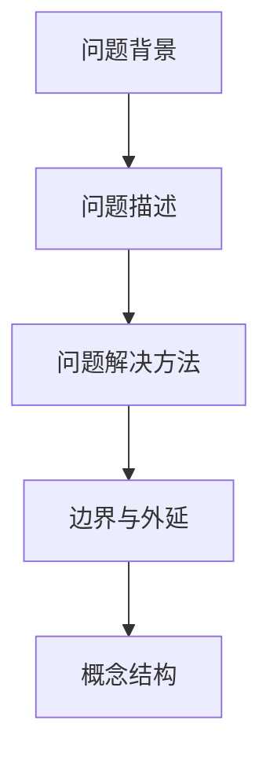
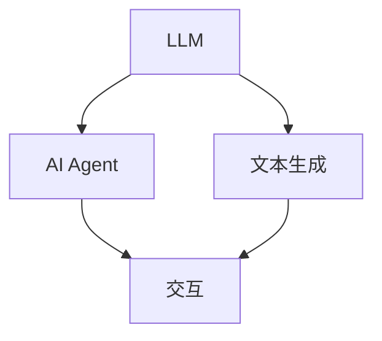
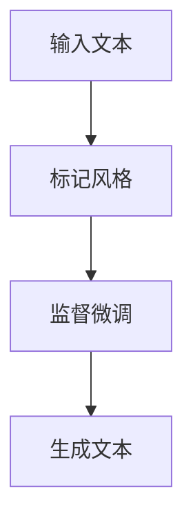
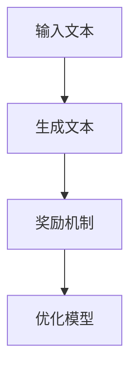
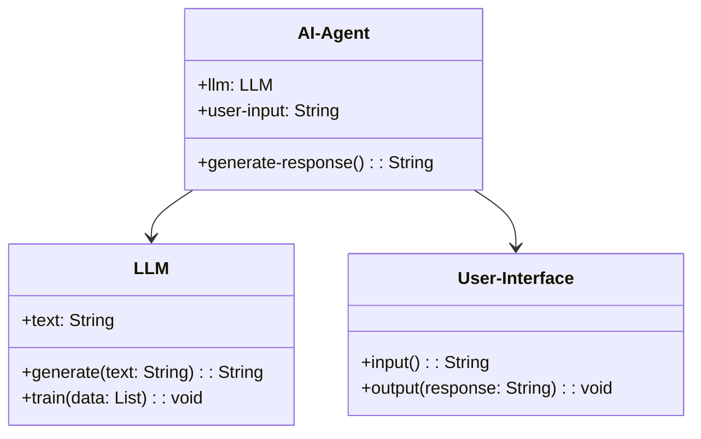
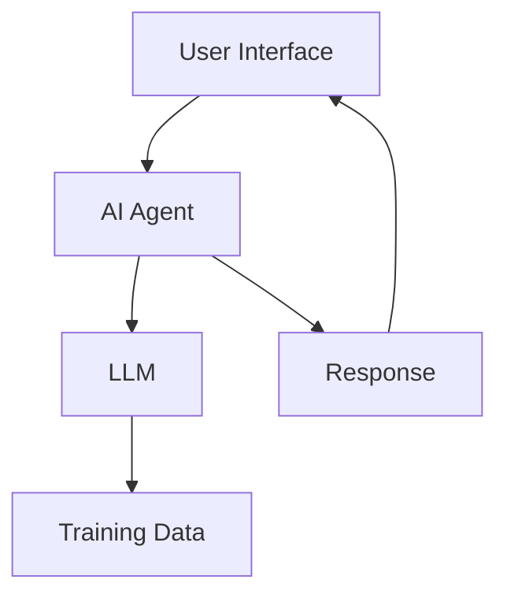
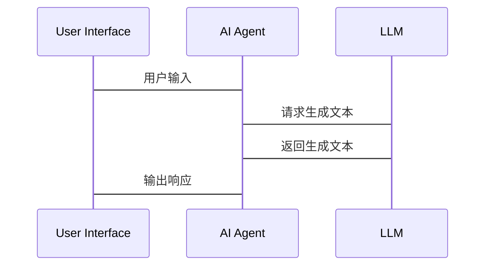

                 


# LLM在AI Agent中的文本风格模仿与创新

> 关键词：LLM, AI Agent, 文本风格, 模仿, 创新, 人工智能, 自然语言处理

> 摘要：本文探讨了大语言模型（LLM）在AI Agent中的文本风格模仿与创新应用。通过分析LLM的核心原理，结合AI Agent的系统架构设计，展示了如何利用LLM进行文本风格的模仿与创新。文章从背景介绍、核心概念、算法原理、系统架构到项目实战，全面解析了LLM在AI Agent中的应用，并提供了丰富的代码示例和案例分析，最后总结了最佳实践和未来发展方向。

---

## 第一部分：背景介绍

### 第1章：问题背景与描述

#### 1.1 问题背景
在人工智能（AI）快速发展的今天，AI Agent（智能体）的应用越来越广泛。AI Agent能够通过自然语言处理（NLP）技术与用户进行交互，其中文本生成是其核心能力之一。然而，现有的文本生成模型在风格模仿与创新方面仍有不足，难以满足多样化的用户需求。如何让AI Agent生成符合特定风格的文本，同时又能创新出新的风格，成为当前研究的热点。

#### 1.2 问题描述
AI Agent的文本生成能力主要依赖于大语言模型（LLM）。然而，现有的LLM在以下方面存在挑战：
1. **风格模仿不足**：无法准确模仿特定领域的文本风格，如文学作品、科技文章等。
2. **风格创新缺乏**：难以生成具有创新性的文本风格，无法满足用户的多样化需求。
3. **交互性不足**：AI Agent的文本生成能力尚未与实际应用场景充分结合，导致用户体验不佳。

#### 1.3 问题解决方法
通过结合LLM的文本生成能力与AI Agent的交互能力，可以实现以下目标：
1. **风格模仿**：利用LLM对特定风格的文本进行学习，生成类似的文本。
2. **风格创新**：在模仿的基础上，结合创新算法，生成新的文本风格。
3. **多模态交互**：将文本生成与其他模态（如图像、语音）结合，提升用户体验。

#### 1.4 边界与外延
- **文本风格模仿的边界**：模仿的范围仅限于语言风格，不包括内容创新。
- **创新文本风格的外延**：基于已有风格，生成新的风格，但需保持文本的连贯性和逻辑性。
- **AI Agent的文本生成能力**：结合上下文和用户意图，生成符合要求的文本。

#### 1.5 概念结构与核心要素组成
以下是核心概念的结构图：



---

## 第二部分：核心概念与联系

### 第2章：LLM与AI Agent的核心概念

#### 2.1 LLM的定义与特点
大语言模型（LLM）是一种基于深度学习的自然语言处理模型，具有以下特点：
1. **大规模训练数据**：通常使用海量文本数据进行训练。
2. **多任务学习能力**：能够处理多种NLP任务，如文本生成、翻译、问答等。
3. **上下文理解能力**：能够理解上下文关系，生成连贯的文本。

#### 2.2 AI Agent的定义与特点
AI Agent是一种智能代理系统，具有以下特点：
1. **自主性**：能够在没有外部干预的情况下独立运行。
2. **反应性**：能够实时感知环境并做出反应。
3. **目标导向**：通过设定目标来驱动行为。

#### 2.3 LLM与AI Agent的关系
LLM为AI Agent提供了强大的文本生成能力，而AI Agent为LLM提供了交互环境和应用场景。以下是LLM与传统NLP模型的对比表格：

| 特性                | LLM                                | 传统NLP模型                         |
|---------------------|------------------------------------|--------------------------------------|
| 模型规模            | 大规模（如GPT-3、GPT-4）          | 小规模（如BERT-base）               |
| 多任务能力          | 强大，支持多种NLP任务             | 较弱，通常针对特定任务优化         |
| 上下文理解能力      | 强大，能够理解长文本上下文         | 较弱，通常仅限于短文本             |
| 应用场景            | 多领域（如文本生成、对话、翻译）   | 单一领域（如文本分类、命名实体识别）|

以下是LLM与AI Agent的关系图：



---

## 第三部分：算法原理

### 第3章：LLM的文本生成算法

#### 3.1 基于监督微调的风格模仿
监督微调是一种通过使用特定领域的数据对模型进行微调的方法。以下是监督微调的流程图：



#### 3.2 基于强化学习的风格创新
强化学习是一种通过奖励机制来优化模型输出的方法。以下是强化学习的流程图：



#### 3.3 数学模型
以下是文本生成的数学模型示例：

- **交叉熵损失函数**：
  $$ \text{loss} = -\sum_{i=1}^{n} \text{log} p(y_i | y_{<i}) $$
  
- **梯度下降优化**：
  $$ \theta = \theta - \eta \frac{\partial \text{loss}}{\partial \theta} $$

---

## 第四部分：系统分析与架构设计

### 第4章：AI Agent的系统架构

#### 4.1 项目背景
本项目旨在通过结合LLM和AI Agent，实现文本风格的模仿与创新。系统主要应用于智能客服、内容创作等领域。

#### 4.2 系统功能设计
以下是系统功能的类图：



#### 4.3 系统架构设计
以下是系统架构的架构图：



#### 4.4 系统接口设计
以下是系统接口的序列图：



---

## 第五部分：项目实战

### 第5章：环境安装与核心代码实现

#### 5.1 环境安装
需要安装以下依赖：
```bash
pip install torch transformers
```

#### 5.2 核心代码实现
以下是风格模仿与创新的代码示例：

```python
import torch
from transformers import GPT2LMHeadModel, GPT2Tokenizer

# 初始化模型和tokenizer
model_name = "gpt2-large"
model = GPT2LMHeadModel.from_pretrained(model_name)
tokenizer = GPT2Tokenizer.from_pretrained(model_name)

# 风格模仿
def style_imitation(text):
    inputs = tokenizer.encode(text, return_tensors="pt")
    outputs = model.generate(inputs, max_length=500, temperature=0.7)
    return tokenizer.decode(outputs[0], skip_special_tokens=True)

# 风格创新
def style_innovation(text):
    inputs = tokenizer.encode(text, return_tensors="pt")
    outputs = model.generate(inputs, max_length=500, temperature=1.2)
    return tokenizer.decode(outputs[0], skip_special_tokens=True)
```

#### 5.3 案例分析
以下是一个风格模仿与创新的案例：

- **输入文本**：一段科技新闻。
- **风格模仿**：模仿科技新闻的正式风格。
- **风格创新**：生成一种新的科技新闻风格，如轻松幽默的风格。

#### 5.4 项目小结
通过代码实现，可以验证LLM在AI Agent中的文本风格模仿与创新能力。

---

## 第六部分：总结与展望

### 第6章：最佳实践与小结

#### 6.1 最佳实践
1. **数据预处理**：确保训练数据的质量和多样性。
2. **模型调优**：根据具体任务调整模型参数，如温度、top-k等。
3. **多模态结合**：将文本生成与其他模态（如图像、语音）结合，提升用户体验。

#### 6.2 总结
本文详细探讨了LLM在AI Agent中的文本风格模仿与创新应用，从理论到实践，全面解析了相关技术。通过实际案例分析，展示了如何利用LLM实现风格模仿与创新。

#### 6.3 注意事项
- **数据隐私**：注意数据的隐私和安全问题。
- **模型泛化能力**：避免过度拟合特定数据集，确保模型的泛化能力。
- **用户体验**：在创新文本风格时，需考虑用户的接受度和体验。

#### 6.4 拓展阅读
- 推荐阅读《Deep Learning》（Ian Goodfellow等著）
- 推荐阅读《生成式人工智能：概念与应用》（书籍或论文）

---

## 作者：AI天才研究院/AI Genius Institute & 禅与计算机程序设计艺术 /Zen And The Art of Computer Programming

---

**摘要**：本文通过分析LLM在AI Agent中的应用，详细探讨了文本风格模仿与创新的技术实现。从背景介绍到项目实战，全面解析了相关技术，并提供了丰富的代码示例和案例分析，为读者提供了宝贵的参考和实践指导。

