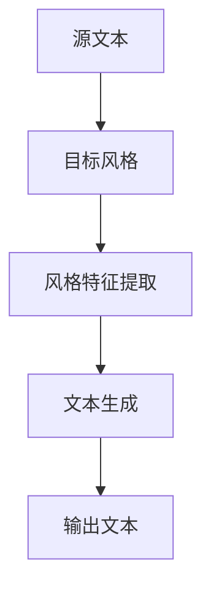
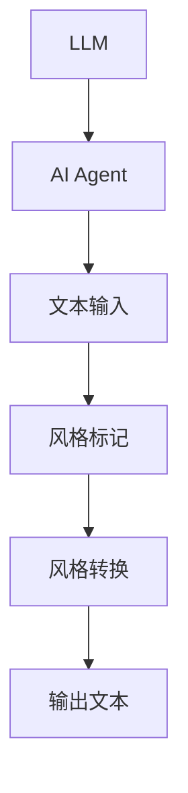
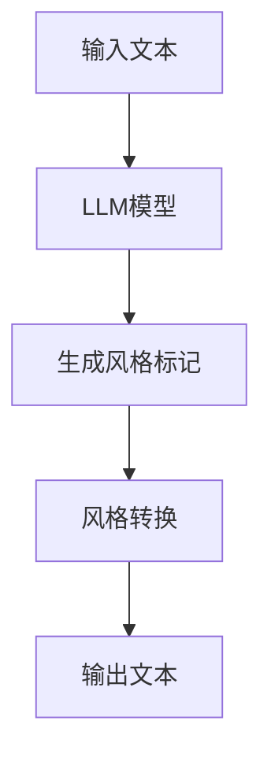
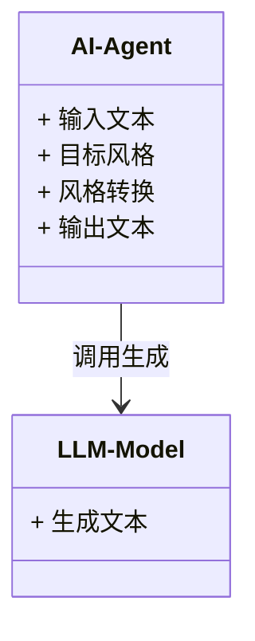
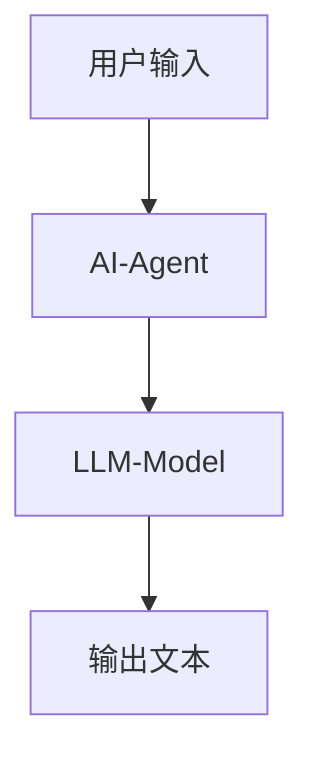
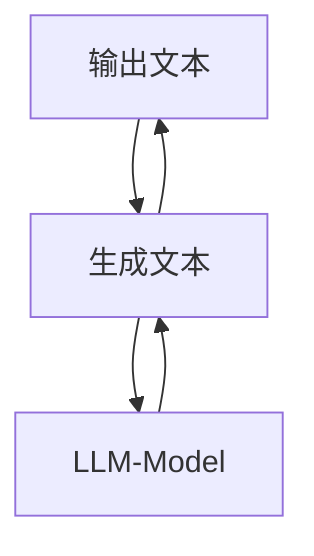

                 


# LLM在AI Agent中的文本风格转换与保持

> 关键词：LLM, AI Agent, 文本风格转换, 风格保持, 大型语言模型

> 摘要：本文探讨了大型语言模型（LLM）在AI代理中的文本风格转换与保持技术。从背景介绍到算法原理，再到系统架构和项目实战，详细分析了LLM在文本处理中的应用，及其在AI代理中的重要性。通过实际案例和代码实现，展示了如何利用LLM实现文本风格转换与保持，为AI代理的文本处理能力提供了理论和实践支持。

---

## 第1章: 背景介绍

### 1.1 问题背景

#### 1.1.1 AI Agent的定义与作用
AI Agent（人工智能代理）是能够感知环境、自主决策并执行任务的智能体。在自然语言处理领域，AI Agent常用于对话系统、内容生成和文本编辑等场景。AI Agent的核心能力之一是理解和生成符合特定风格的文本。

#### 1.1.2 文本风格转换的必要性
在实际应用中，AI Agent需要根据不同的场景和用户需求生成多样化的文本。例如，一个AI客服在处理投诉时需要语气友好、专业，而在推广产品时则需要语言活泼、吸引人。文本风格转换技术使AI Agent能够灵活调整输出内容的风格，以适应不同的应用场景。

#### 1.1.3 LLM在文本处理中的优势
LLM（Large Language Model）通过海量数据训练，掌握了多种语言风格和语义理解能力。相比传统NLP方法，LLM能够更自然地生成符合目标风格的文本，且具有更高的灵活性和可扩展性。

---

### 1.2 问题描述

#### 1.2.1 文本风格转换的核心问题
文本风格转换的核心问题在于如何将源文本的风格特征提取出来，并将其转换为目标风格。这需要模型同时理解源文本的内容和风格特征，同时保持内容的完整性。

#### 1.2.2 LLM在风格保持中的挑战
尽管LLM在文本生成方面表现出色，但要在特定场景下保持风格一致性仍面临挑战。例如，模型可能在转换风格时丢失部分语义信息，或者生成的内容不符合目标风格的语法规则。

#### 1.2.3 需求场景与应用领域
文本风格转换的应用场景广泛，包括内容创作、客户服务、教育等领域。例如，将学术论文转化为通俗易懂的文章，或将正式邮件转化为更亲切的语气。

---

### 1.3 问题解决

#### 1.3.1 LLM如何实现文本风格转换
LLM通过预训练掌握了多种语言风格，能够根据输入的源文本和目标风格生成相应的文本。具体步骤包括：输入源文本，指定目标风格，模型生成符合目标风格的文本。

#### 1.3.2 风格保持的关键技术
风格保持技术包括基于规则的替换、基于统计模型的转换以及基于LLM的生成方法。其中，LLM方法因其生成能力强、灵活性高而被广泛应用。

#### 1.3.3 解决方案的优缺点对比
| 方法 | 优点 | 缺点 |
|------|------|------|
| 基于规则的替换 | 简单易实现 | 需手动制定规则，难以覆盖所有场景 |
| 基于统计模型的转换 | 能处理大量数据，效果稳定 | 训练时间长，难以快速迭代 |
| 基于LLM的生成方法 | 灵活性高，生成能力强 | 可能存在风格不一致的情况 |

---

### 1.4 边界与外延

#### 1.4.1 风格转换的边界条件
风格转换需在特定语境和目标风格范围内进行。例如，将科技新闻转化为散文时，需保持科技领域的专业术语。

#### 1.4.2 风格保持的适用范围
风格保持适用于需要在保持内容一致性的前提下，调整语言风格的场景。例如，将正式报告转化为更口语化的解释。

#### 1.4.3 相关概念的对比与区分
- 文本生成：生成新文本，不考虑原有内容。
- 文本编辑：基于现有文本进行修改，可能涉及风格转换。
- 文本分类：将文本按风格或内容进行分类，与风格转换有交集但不同。

---

### 1.5 概念结构与核心要素

#### 1.5.1 核心概念组成
文本风格转换系统由以下部分组成：
1. 源文本输入
2. 目标风格指定
3. 风格特征提取
4. 文本生成模块
5. 输出文本

#### 1.5.2 关键要素的关联性
- 源文本与目标风格：输入与目标的关联性决定生成内容的风格。
- 风格特征提取：提取关键特征是风格转换的核心步骤。
- 文本生成模块：基于提取的特征生成目标风格的文本。

#### 1.5.3 概念模型的可视化


---

## 第2章: 核心概念与联系

### 2.1 LLM与AI Agent的关系

#### 2.1.1 LLM在AI Agent中的角色
LLM作为AI Agent的核心组件，负责理解和生成文本。在风格转换任务中，LLM根据输入的源文本和目标风格生成输出。

#### 2.1.2 AI Agent对文本风格的需求
AI Agent需要根据应用场景调整文本风格。例如，客服系统需要在不同情况下使用不同的语气。

#### 2.1.3 LLM与AI Agent的协同工作
LLM为AI Agent提供文本生成能力，AI Agent根据任务需求调用LLM进行风格转换。

---

### 2.2 文本风格转换与保持的原理

#### 2.2.1 风格转换的基本原理
风格转换的原理是通过模型学习不同风格的特点，将其应用到源文本中。基于LLM的方法利用模型的生成能力，直接生成目标风格的文本。

#### 2.2.2 LLM在风格保持中的机制
LLM通过预训练掌握了多种风格的特点，能够根据输入的目标风格生成相应的文本。同时，模型可以调整生成策略，以保持特定风格的一致性。

#### 2.2.3 风格转换与保持的对比分析
| 阶段 | 风格转换 | 风格保持 |
|------|----------|----------|
| 输入 | 源文本和目标风格 | 源文本和目标风格 |
| 输出 | 新风格文本 | 相同风格下的不同内容 |
| 方法 | 基于LLM生成 | 基于LLM微调或指令调整 |

---

### 2.3 核心概念属性特征对比

#### 2.3.1 不同风格转换方法的特征对比
| 方法 | 基于规则的替换 | 基于统计模型的转换 | 基于LLM的生成 |
|------|----------------|-------------------|----------------|
| 优点 | 简单易实现 | 效果稳定 | 灵活性高 |
| 缺点 | 手动制定规则 | 训练时间长 | 可能存在风格不一致 |
| 适用场景 | 简单风格转换 | 多样化风格转换 | 复杂风格转换 |

---

### 2.4 ER实体关系图



---

## 第3章: 算法原理讲解

### 3.1 基于LLM的文本风格转换算法

#### 3.1.1 算法流程
1. 输入源文本和目标风格。
2. 提取源文本的风格特征。
3. 根据目标风格生成新的文本。



#### 3.1.2 算法实现代码
```python
def style_transfer(text, target_style):
    model = load_llm()  # 加载预训练好的LLM模型
    styled_text = model.generate(text, target_style)  # 生成目标风格的文本
    return styled_text
```

---

### 3.2 数学模型与公式

#### 3.2.1 概率分布公式
模型生成目标风格的概率分布可以通过以下公式表示：
$$ P(\text{out} | \text{in}, \text{style}) = f(\text{in}, \text{style}) $$

其中，$f$ 是模型的生成函数，$\text{in}$ 是输入文本，$\text{style}$ 是目标风格。

#### 3.2.2 示例
假设源文本为“这本书很有趣”，目标风格为“正式”。模型生成“该书内容丰富，值得一读。”

---

## 第4章: 系统分析与架构设计

### 4.1 问题场景介绍
AI Agent需要根据用户输入的文本和指定的风格生成符合要求的文本。例如，将用户提供的新闻稿转化为更简洁的摘要。

### 4.2 项目介绍
本项目旨在开发一个基于LLM的AI Agent，实现文本风格转换与保持功能。

---

### 4.3 系统功能设计

#### 4.3.1 领域模型


---

### 4.4 系统架构设计

#### 4.4.1 系统架构图


---

### 4.5 系统接口设计
1. 输入接口：接收源文本和目标风格。
2. 输出接口：返回生成的文本。

---

### 4.6 系统交互图



---

## 第5章: 项目实战

### 5.1 环境安装
1. 安装Python和相关库（如Hugging Face库）。
2. 下载并安装LLM模型（如GPT-3）。

### 5.2 核心代码实现

#### 5.2.1 加载模型
```python
from transformers import GPT2LMHeadModel, GPT2Tokenizer

model = GPT2LMHeadModel.from_pretrained('gpt2')
tokenizer = GPT2Tokenizer.from_pretrained('gpt2')
```

#### 5.2.2 定义风格转换函数
```python
def style_transfer(input_text, target_style):
    inputs = tokenizer(input_text, return_tensors='np')
    outputs = model.generate(inputs.input_ids, max_length=50, do_sample=True)
    generated_text = tokenizer.decode(outputs[0], skip_special_tokens=True)
    return generated_text
```

---

### 5.3 案例分析
输入文本：“这本书很有趣”，目标风格：“正式”。生成文本：“该书内容丰富，值得一读。”

---

## 第6章: 总结与展望

### 6.1 总结
本文详细探讨了LLM在AI Agent中的文本风格转换与保持技术。通过分析核心概念、算法原理和系统架构，展示了如何利用LLM实现灵活的文本风格转换。

### 6.2 展望
未来，随着LLM模型的不断进步，文本风格转换技术将更加智能化。AI Agent将能够处理更多复杂场景下的文本风格转换，为用户提供更个性化的服务。

---

## 附录

### 附录A: 工具与库

1. Hugging Face Transformers库：用于加载和调用LLM模型。
2. Mermaid：用于绘制流程图和架构图。

---

### 附录B: 参考文献

1. Radford, A., et al. (2019). "Language models are few-shot learners." arXiv preprint arXiv:1909.08899.
2. Vaswani, A., et al. (2017). "Attention is all you need." Advances in neural information processing systems.

---

## 作者

作者：AI天才研究院/AI Genius Institute & 禅与计算机程序设计艺术 /Zen And The Art of Computer Programming

