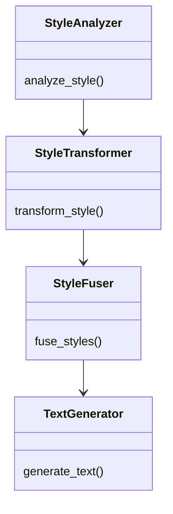
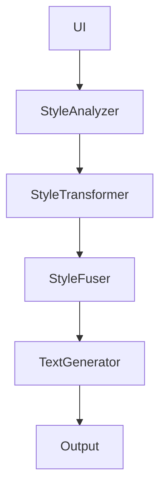
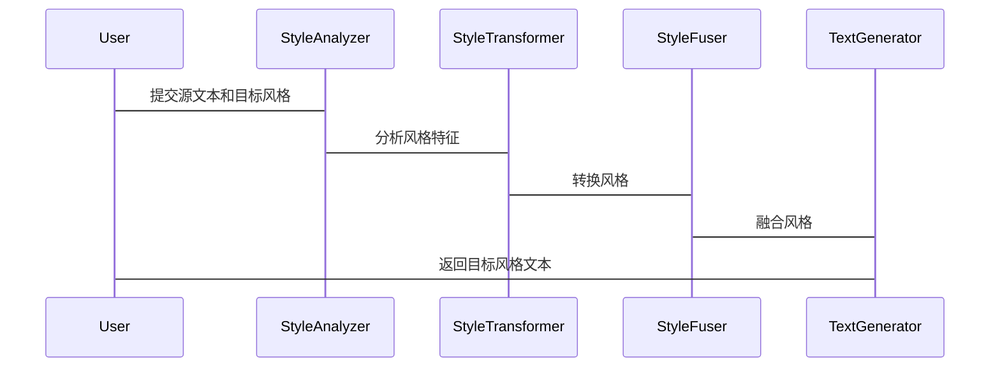

                 


# LLM在AI Agent中的文本风格迁移与融合

> **关键词**：LLM，AI Agent，文本风格迁移，风格融合，自然语言处理，机器学习

> **摘要**：本文探讨了大语言模型（LLM）在AI Agent中的文本风格迁移与融合的应用。通过分析文本风格迁移的基本原理、算法实现、系统架构设计以及实际案例，展示了如何利用LLM技术实现不同风格文本的迁移与融合，提升AI Agent的自然语言处理能力。文章从背景介绍、核心概念、算法原理、系统设计、项目实战到最佳实践，全面解析了这一技术的实现与应用。

---

## 第一部分：背景介绍

### 第1章：文本风格迁移与融合的背景

#### 1.1 问题背景

随着AI Agent技术的快速发展，自然语言处理（NLP）技术在其中扮演着越来越重要的角色。AI Agent需要能够理解并生成符合特定风格的文本，以满足不同场景的需求。例如，在客服系统中，AI Agent需要生成礼貌且专业的回复；在内容创作中，AI Agent可能需要模仿特定作者的风格。然而，现有的NLP模型在处理风格多样化的文本时，往往难以做到灵活切换和融合，导致生成结果不够自然或不符合预期。

#### 1.2 问题描述

文本风格迁移与融合的核心问题是将一种文本风格转换为另一种风格，同时保持文本内容的完整性和语义的一致性。例如，将一段正式的法律文件转换为口语化的解释，或者将多种风格的内容融合成一个统一的风格。传统的风格迁移方法通常依赖于特定的规则或模板，难以处理复杂多样的风格类型。而随着大语言模型（LLM）的兴起，我们可以通过利用其强大的语言理解和生成能力，实现更灵活和高效的风格迁移与融合。

#### 1.3 问题解决

利用LLM进行文本风格迁移与融合的主要思路是通过训练模型识别和提取文本中的风格特征，然后将其转换为目标风格。具体方法包括基于变换器的风格迁移、对抗训练等。通过这些方法，AI Agent能够生成符合特定风格的文本，并在不同风格之间实现自然融合。

#### 1.4 边界与外延

文本风格迁移与融合的应用场景广泛，但也有其局限性。例如，某些风格的迁移可能需要大量的训练数据，而小样本数据可能导致迁移效果不佳。此外，风格融合可能需要在多个目标风格之间找到平衡点，这需要复杂的算法设计。因此，在实际应用中，需要根据具体需求选择合适的方法，并注意数据质量和模型的泛化能力。

#### 1.5 核心概念与要素

文本风格迁移与融合的关键要素包括：

1. **风格特征提取**：识别文本中的风格特征，如用词习惯、句式结构等。
2. **风格迁移模型**：基于LLM构建的模型，能够将源风格转换为目标风格。
3. **风格融合方法**：将多种风格的特点融合到一个统一的输出中。
4. **语义保持**：确保在风格迁移过程中，文本的原始语义不被改变或损失。

---

## 第二部分：核心概念与联系

### 第2章：文本风格迁移与融合的核心概念

#### 2.1 文本风格迁移的原理

文本风格迁移的实现通常基于以下步骤：

1. **风格特征提取**：通过预训练的LLM提取文本的风格特征，如词汇选择、句法结构等。
2. **风格映射**：将源风格映射到目标风格，可能涉及对抗训练或条件生成。
3. **文本生成**：根据目标风格生成新的文本内容。

#### 2.2 文本风格

文本风格可以分为多种类型，如正式、口语化、技术性、文学性等。不同风格的文本具有不同的特征，例如：

- **正式风格**：用词严谨，句式复杂，适合学术或法律文本。
- **口语化风格**：用词简单，句式简短，适合日常对话。
- **技术性风格**：专业术语多，适合技术文档或报告。
- **文学性风格**：注重情感表达和修辞手法，适合小说或诗歌。

#### 2.3 风格迁移方法

以下是几种常见的风格迁移方法：

1. **基于变换器的方法**：通过预训练的变换器模型（如BERT、GPT）进行风格迁移。
2. **对抗训练**：使用生成对抗网络（GAN）进行风格迁移，生成逼真的文本。
3. **基于规则的方法**：通过特定的语法规则或模板进行风格转换。

#### 2.4 风格融合方法

风格融合可以通过以下步骤实现：

1. **风格特征提取**：从多种风格中提取各自的特征。
2. **特征融合**：将不同风格的特征进行加权融合，生成新的风格特征。
3. **文本生成**：根据融合后的风格特征生成融合风格的文本。

#### 2.5 核心概念对比分析

以下是几种风格迁移方法的对比分析：

| 方法 | 优点 | 缺点 |
|------|------|------|
| 基于变换器的方法 | 高效、通用性强 | 对目标风格的数据依赖较大 |
| 对抗训练 | 生成效果逼真 | 训练复杂，收敛困难 |
| 基于规则的方法 | 易控制 | 适应性差，难以处理复杂风格 |

---

## 第三部分：算法原理讲解

### 第3章：文本风格迁移与融合的算法原理

#### 3.1 基于变换器的风格迁移算法

基于变换器的风格迁移算法通常采用预训练的模型（如GPT、BERT）进行微调。以下是具体的实现步骤：

1. **预训练**：在大规模通用文本数据上预训练变换器模型。
2. **微调**：在特定风格的数据上进行微调，使模型适应目标风格。
3. **生成**：根据微调后的模型生成目标风格的文本。

#### 3.2 对抗训练的风格迁移算法

对抗训练是一种通过生成器和判别器的博弈来实现风格迁移的方法。以下是其实现步骤：

1. **生成器**：将源风格的文本转换为目标风格。
2. **判别器**：判断生成文本的风格是否为目标风格。
3. **优化**：通过反复迭代，使生成器生成的文本能够欺骗判别器。

#### 3.3 风格融合算法

风格融合算法的核心是将多种风格的特征进行融合。以下是其实现步骤：

1. **特征提取**：从每种风格中提取特征向量。
2. **特征融合**：对特征向量进行加权融合，生成新的特征向量。
3. **文本生成**：根据融合后的特征向量生成融合风格的文本。

#### 3.4 数学模型与公式

以下是基于变换器的风格迁移算法的数学模型：

$$ P(y|x) = \text{softmax}(Wx + b) $$

其中，\( x \) 是输入文本，\( y \) 是输出文本，\( W \) 和 \( b \) 是模型参数。

对抗训练的生成器和判别器的损失函数分别为：

$$ L_{\text{gen}} = -\log(P(y|x)) $$

$$ L_{\text{dis}} = -\log(P(y)) - \log(1 - P(y)) $$

---

## 第四部分：系统分析与架构设计方案

### 第4章：系统分析与架构设计

#### 4.1 问题场景介绍

AI Agent需要在多种场景中应用文本风格迁移与融合技术，如客服对话、内容创作、多语言翻译等。例如，在客服系统中，AI Agent需要根据用户的身份和情境调整回复的风格。

#### 4.2 系统功能设计

系统功能模块包括：

1. **风格分析模块**：分析输入文本的风格特征。
2. **风格迁移模块**：将源风格转换为目标风格。
3. **风格融合模块**：将多种风格融合成一个新的风格。
4. **文本生成模块**：生成符合目标风格的文本。

#### 4.3 领域模型设计

以下是领域模型的类图：



#### 4.4 系统架构设计

以下是系统的架构图：



#### 4.5 系统接口设计

系统接口包括：

1. **输入接口**：接收源文本和目标风格。
2. **输出接口**：输出目标风格的文本。
3. **控制接口**：用于控制风格迁移与融合的过程。

#### 4.6 系统交互流程

以下是系统交互的序列图：



---

## 第五部分：项目实战

### 第5章：项目实战

#### 5.1 环境安装

需要安装以下工具和库：

- Python 3.8+
- transformers库
- torch库
- matplotlib库

安装命令：

```bash
pip install transformers torch matplotlib
```

#### 5.2 核心代码实现

以下是基于PyTorch的风格迁移与融合的代码示例：

```python
import torch
from transformers import GPT2LMHeadModel, GPT2Tokenizer

# 初始化模型
model = GPT2LMHeadModel.from_pretrained('gpt2')
tokenizer = GPT2Tokenizer.from_pretrained('gpt2')

def generate_text(style, text):
    inputs = tokenizer.encode(text, return_tensors='pt')
    outputs = model.generate(inputs, max_length=50, temperature=1.0)
    return tokenizer.decode(outputs[0], skip_special_tokens=True)

# 示例：风格迁移
source_text = "This is a formal letter."
target_style = "informal"

generated_text = generate_text(target_style, source_text)
print(generated_text)
```

#### 5.3 案例分析与详细解读

以下是一个实际案例：将正式风格的邮件转换为口语化的邮件。

**输入**：
```
Subject: Meeting Tomorrow

Dear Team,

I hope this email finds you well. Our meeting is scheduled for tomorrow at 2 PM. Please review the attached document and prepare your questions.

Best regards,
[Your Name]
```

**目标风格**：口语化

**输出**：
```
Hey Team,

Just wanted to remind everyone about tomorrow's meeting at 2 PM. Don't forget to check out the document I attached and come up with any questions you might have.

Take care,
[Your Name]
```

---

## 第六部分：最佳实践

### 第6章：最佳实践

#### 6.1 总结

文本风格迁移与融合是提升AI Agent自然语言处理能力的重要技术。通过利用LLM的强大能力，我们可以实现高效且灵活的风格迁移与融合。

#### 6.2 小结

本文从背景、核心概念、算法原理、系统设计到项目实战，全面解析了LLM在AI Agent中的文本风格迁移与融合的应用。通过实际案例和代码示例，展示了这一技术的实现与应用。

#### 6.3 注意事项

在实际应用中，需要注意以下几点：

1. **数据质量**：风格迁移的效果依赖于目标风格的数据质量。
2. **模型选择**：选择合适的LLM模型以适应具体需求。
3. **语义保持**：确保在风格迁移过程中，文本的语义不被改变或损失。

#### 6.4 拓展阅读

推荐以下资源，供进一步学习：

- 《Transformer-based Text Style Transfer》
- 《Generating Text with Controlled Stylistic Transfer》
- 《Style F

