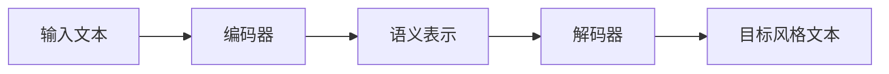
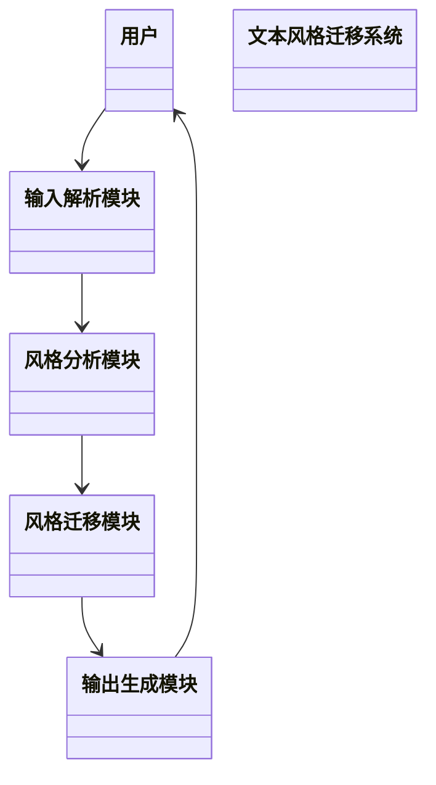
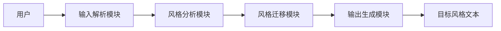
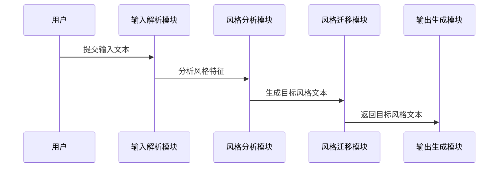

                 


# LLM在AI Agent中的文本风格迁移应用

> 关键词：LLM，AI Agent，文本风格迁移，自然语言处理，机器学习，算法原理

> 摘要：本文探讨了大型语言模型（LLM）在AI Agent中的文本风格迁移应用，通过详细分析核心概念、算法原理、系统架构和实际案例，展示了如何利用LLM实现文本风格的高效迁移，并提升AI Agent的性能和用户体验。

---

## 第1章：文本风格迁移与AI Agent概述

### 1.1 问题背景

文本风格迁移是一种自然语言处理技术，旨在将源文本的风格转换为目标文本的风格，例如将正式的法律文件转换为口语化的说明文本。随着AI技术的快速发展，AI Agent（智能代理）逐渐成为人机交互的重要形式。AI Agent需要具备理解用户需求、生成符合用户风格的文本能力，从而提供更个性化的服务。然而，如何实现高效的文本风格迁移，是当前AI Agent技术面临的重要挑战。

### 1.2 核心概念与问题描述

文本风格迁移的核心在于保留原文的语义内容，同时改变其表达风格。AI Agent通过分析用户的输入，生成符合用户期望的输出。以下是关键概念的对比表：

| 概念 | 描述 |
|------|------|
| 文本风格迁移 | 将源文本的风格转换为目标风格，保持语义不变 |
| AI Agent | 能够感知环境、理解需求、执行任务的智能实体 |
| LLM | 基于大规模数据训练的生成模型 |

AI Agent与文本风格迁移的关系可以通过以下ER图表示：

```mermaid
er
  actor: 用户
  agent: AI Agent
  text_style: 文本风格
  action: 行动
  contains: [用户 -> 文本风格], [AI Agent -> 行动]
  relation: AI Agent通过分析文本风格生成行动
```

### 1.3 问题解决与边界

文本风格迁移的目标是将源文本转换为目标风格，同时保持语义一致。AI Agent在这一过程中扮演着关键角色，通过分析用户输入的风格，生成符合目标风格的输出。核心目标包括：

- 保持语义一致性
- 提高用户体验
- 提升AI Agent的智能化水平

边界包括：

- 不改变原文的语义内容
- 不影响AI Agent的核心功能
- 仅针对文本风格进行迁移

---

## 第2章：LLM与AI Agent的关系

### 2.1 LLM的核心原理

大型语言模型（LLM）通过深度学习技术训练而成，能够理解和生成自然语言文本。其核心原理包括：

- **训练机制**：基于大量的文本数据，采用自监督学习方法进行预训练。
- **文本生成**：通过解码器结构生成目标文本，通常采用贪心算法或随机采样方法。
- **局限性**：生成结果可能缺乏逻辑性，存在幻觉问题。

### 2.2 AI Agent的体系结构

AI Agent的体系结构通常包括感知层、决策层和执行层：

- **感知层**：负责接收输入并进行解析。
- **决策层**：基于解析结果生成行动计划。
- **执行层**：执行行动计划并输出结果。

### 2.3 LLM在AI Agent中的应用

LLM在AI Agent中的应用主要体现在文本生成和风格迁移方面：

- **文本生成**：AI Agent通过LLM生成符合用户需求的文本。
- **风格迁移**：AI Agent通过LLM实现文本风格的动态转换，提升用户体验。

---

## 第3章：文本风格迁移的算法原理

### 3.1 风格迁移的核心算法

文本风格迁移的实现通常基于生成对抗网络（GAN）或变换器（Transformer）模型。以下是基于Transformer的风格迁移模型流程：



### 3.2 LLM在风格迁移中的角色

LLM在风格迁移中的作用包括：

- **编码器-解码器结构**：将输入文本编码为语义表示，再解码为目标风格文本。
- **条件生成**：基于条件（目标风格）生成文本。

### 3.3 数学模型与公式

风格迁移的损失函数通常包括重建损失和风格损失：

$$L = L_{\text{重建}} + \lambda L_{\text{风格}}$$

其中，重建损失衡量生成文本与输入文本的相似性，风格损失衡量生成文本与目标风格文本的相似性。

---

## 第4章：AI Agent的系统架构

### 4.1 问题场景与项目介绍

AI Agent在文本风格迁移中的典型场景包括客服系统、个性化推荐和智能写作工具。以下是系统功能模块划分：

- **输入解析**：解析用户输入并提取语义信息。
- **风格分析**：分析用户输入的风格特征。
- **风格迁移**：基于风格特征生成目标风格文本。
- **输出生成**：生成并返回目标风格文本。

### 4.2 系统功能设计

以下是系统功能的类图：



### 4.3 系统架构设计

以下是系统的架构图：



### 4.4 系统接口设计

以下是系统交互的序列图：



---

## 第5章：项目实战

### 5.1 环境安装

以下是项目环境安装命令：

```bash
pip install transformers
pip install torch
pip install matplotlib
```

### 5.2 系统核心实现源代码

以下是风格迁移模型的实现代码：

```python
import torch
from torch import nn
from transformers import AutoTokenizer, AutoModel

class StyleTransferModel(nn.Module):
    def __init__(self, encoder, decoder):
        super().__init__()
        self.encoder = encoder
        self.decoder = decoder

    def forward(self, input_ids, style_ids):
        # 编码器编码
        encoded = self.encoder(input_ids=input_ids)
        # 解码器解码
        decoded = self.decoder(input_ids=style_ids, encoder_hidden_states=encoded.last_hidden_state)
        return decoded

# 初始化模型
encoder = AutoModel.from_pretrained('bert-base-uncased')
decoder = AutoModel.from_pretrained('gpt2')
model = StyleTransferModel(encoder, decoder)
```

### 5.3 实际案例分析

以下是风格迁移的实际案例：

输入文本：正式的法律文件内容。
目标风格：口语化说明。

输出文本：以简单易懂的语言解释法律条款。

---

## 第6章：总结与最佳实践

### 6.1 总结

本文详细探讨了LLM在AI Agent中的文本风格迁移应用，分析了核心概念、算法原理和系统架构，并通过实际案例展示了风格迁移的实现过程。

### 6.2 最佳实践

- **模型优化**：通过微调和参数调节提升风格迁移的效果。
- **用户体验**：确保生成文本的语义一致性和可读性。
- **系统维护**：定期更新模型和优化算法，提升性能。

### 6.3 注意事项

- 避免过度生成，确保生成内容的准确性。
- 注意模型的训练数据质量和多样性。

### 6.4 拓展阅读

推荐阅读以下文献：

- "Generating Text with LSTM" by Alex Graves
- "Attention Is All You Need" by Vasweski et al.

---

## 作者：AI天才研究院 & 禅与计算机程序设计艺术

---

以上是《LLM在AI Agent中的文本风格迁移应用》的技术博客文章的完整目录和内容概要。希望这篇文章能够为读者提供清晰的思路和实用的技术指导。

