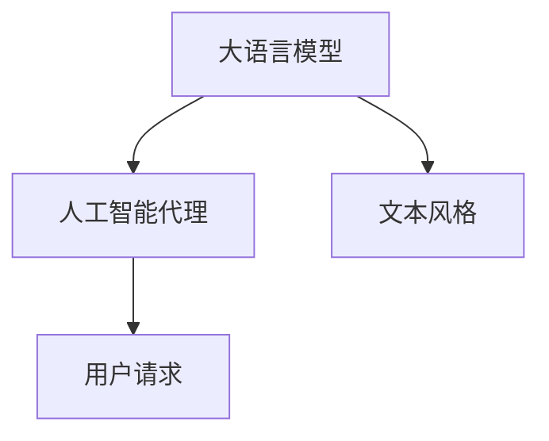
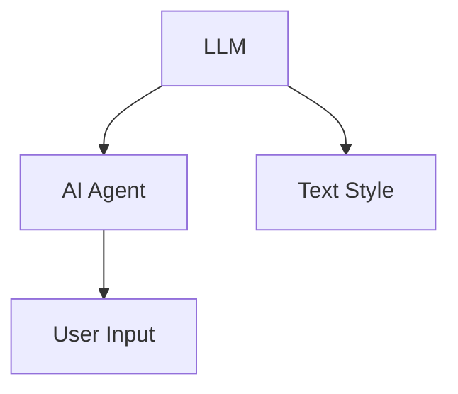
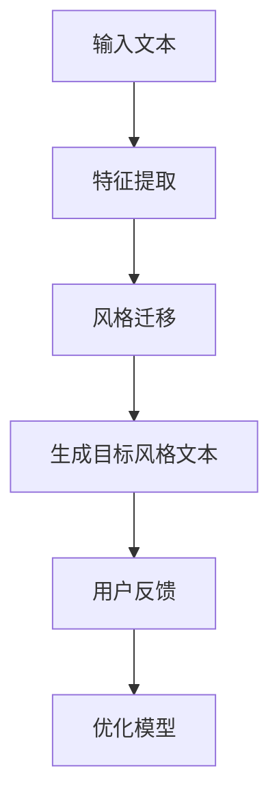
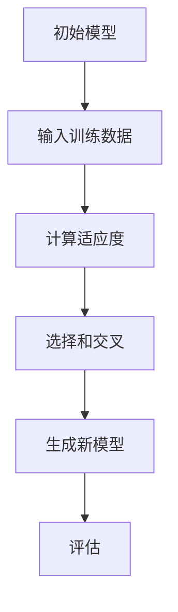
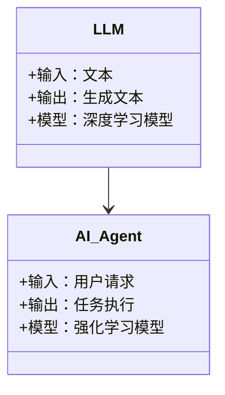
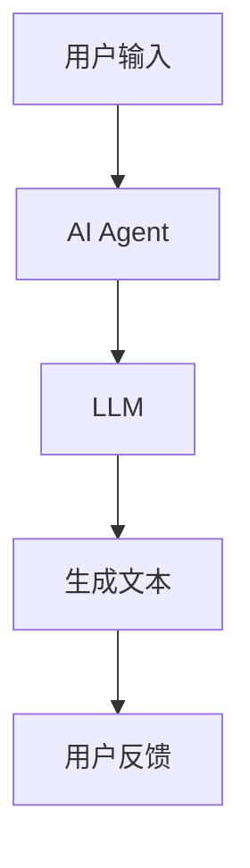
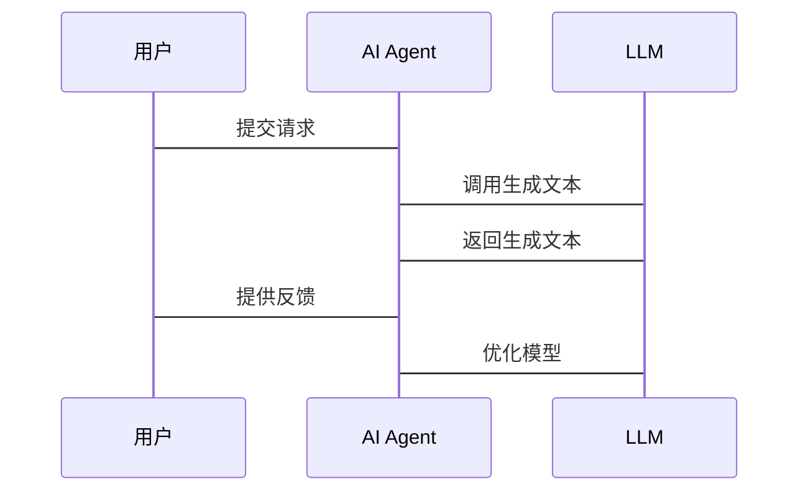

                 


# LLM在AI Agent中的文本风格适应与进化

## 关键词：LLM, AI Agent, 文本风格适应, 模型进化, 自然语言处理

## 摘要：  
随着大语言模型（LLM）和人工智能代理（AI Agent）技术的快速发展，文本风格适应与进化成为实现更自然、更智能化交互的关键。本文将深入探讨LLM在AI Agent中的文本风格适应与进化问题，从理论到实践，详细分析其核心概念、算法原理、系统架构设计和实际应用场景。通过对现有技术的分析与优化，本文提出了一种结合风格迁移与模型自适应的新方法，为未来的AI Agent设计提供了理论支持和实践指导。

---

# 第1章: 背景介绍

## 1.1 问题背景

### 1.1.1 LLM与AI Agent的定义与核心概念  
大语言模型（LLM）是一种基于深度学习的自然语言处理模型，能够理解和生成人类语言。AI Agent（人工智能代理）是一种智能系统，能够感知环境、理解用户需求并执行任务。两者的结合使得AI Agent能够具备更强大的语言理解和生成能力。

### 1.1.2 文本风格适应与进化的必要性  
在实际应用中，AI Agent需要与不同背景的用户交互，理解用户的语言风格，并以符合用户习惯的方式生成文本。例如，在客服系统中，AI Agent需要根据用户语气调整回复风格；在创意写作中，AI Agent需要根据用户提供的风格生成符合要求的内容。

### 1.1.3 当前技术的局限性与挑战  
当前的LLM在文本风格适应方面存在以下问题：  
1. **风格单一**：模型生成的文本风格可能过于固定，无法灵活调整。  
2. **适应性不足**：模型难以快速适应新的风格或特定领域的需求。  
3. **进化机制缺乏**：模型在适应新风格后，缺乏自我优化和进化的机制。

---

## 1.2 核心概念与问题描述  

### 1.2.1 LLM在AI Agent中的作用  
LLM为AI Agent提供了强大的自然语言处理能力，使其能够理解用户输入、生成自然语言输出，并执行复杂任务。  

### 1.2.2 文本风格适应的核心问题  
文本风格适应的核心问题在于如何让LLM生成符合目标风格的文本，同时保持内容的准确性和流畅性。  

### 1.2.3 问题的边界与外延  
文本风格适应的边界包括：  
1. 风格范围：包括正式、口语化、技术性、文学性等风格。  
2. 适应方式：包括静态适应（基于规则）和动态适应（基于反馈）。  
3. 适用场景：包括客服、教育、娱乐等领域。

---

## 1.3 核心要素与概念结构  

### 1.3.1 LLM与AI Agent的协同关系  
LLM作为AI Agent的核心模块，负责文本的理解和生成；AI Agent则负责任务规划、用户意图识别和交互管理。  

### 1.3.2 文本风格适应的关键要素  
1. **风格特征提取**：识别目标风格的关键特征。  
2. **风格迁移模型**：将源风格的文本转换为目标风格。  
3. **反馈机制**：根据用户反馈优化生成文本的风格。  

### 1.3.3 概念结构与核心模型  
文本风格适应的核心模型包括：  
1. **特征提取模型**：用于提取文本的风格特征。  
2. **风格迁移模型**：用于生成目标风格的文本。  
3. **反馈优化模型**：用于根据用户反馈优化模型性能。

---

## 1.4 本章小结  
本章从背景出发，详细介绍了LLM和AI Agent的核心概念，分析了文本风格适应的必要性、核心问题和边界条件，并总结了风格适应的关键要素和模型结构。

---

# 第2章: 核心概念与联系  

## 2.1 LLM与AI Agent的核心原理  

### 2.1.1 LLM的基本原理  
LLM基于深度学习模型（如Transformer）构建，通过大量数据训练，能够理解和生成人类语言。  

### 2.1.2 AI Agent的核心机制  
AI Agent通过感知环境、理解用户需求、规划任务并执行操作，实现与用户的交互。  

### 2.1.3 两者的协同关系  
LLM为AI Agent提供语言处理能力，AI Agent为LLM提供上下文和任务目标。  

---

## 2.2 核心概念属性特征对比  

### 2.2.1 LLM的特征分析  
| 特征 | 描述 |  
|------|------|  
| 输入 | 文本数据 |  
| 输出 | 文本生成 |  
| 模型 | 基于深度学习 |  

### 2.2.2 AI Agent的特征分析  
| 特征 | 描述 |  
|------|------|  
| 输入 | 用户请求、环境数据 |  
| 输出 | 任务执行、文本生成 |  
| 模型 | 基于强化学习或监督学习 |  

### 2.2.3 对比分析与表格总结  
通过对比，可以看出LLM和AI Agent在功能和实现上的差异与互补。

---

## 2.3 实体关系与架构设计  

### 2.3.1 ER实体关系图  


### 2.3.2 模块间关系与流程图  


---

## 2.4 本章小结  
本章分析了LLM和AI Agent的核心原理，对比了它们的特征，并通过实体关系图和流程图展示了两者的协同关系。

---

# 第3章: 算法原理与数学模型  

## 3.1 算法原理讲解  

### 3.1.1 文本风格适应算法  

#### 3.1.1.1 基于预训练模型的风格迁移  
通过预训练模型（如BERT、GPT）进行风格迁移，调整模型的权重以生成目标风格的文本。

#### 3.1.1.2 基于反馈的风格优化  
通过用户反馈不断优化生成文本的风格，采用强化学习方法训练模型。

#### 3.1.1.3 算法流程图  


---

### 3.1.2 模型进化算法  

#### 3.1.2.1 基于进化算法的模型优化  
通过遗传算法优化模型参数，提高生成文本的风格适应能力。

#### 3.1.2.2 基于强化学习的模型进化  
通过强化学习训练模型，使其在不同风格下表现更优。

#### 3.1.2.3 数学模型  
进化算法的数学模型可以表示为：  
$$ f(x) = max(fitness(x)) $$  

---

### 3.1.3 算法流程图  


---

## 3.2 数学模型与公式  

### 3.2.1 文本风格适应的数学模型  
文本风格适应的目标是最小化生成文本与目标风格的差异。数学模型可以表示为：  
$$ L = \sum_{i=1}^{n} (y_i - \hat{y}_i)^2 $$  
其中，$y_i$是目标风格特征，$\hat{y}_i$是生成文本的特征。

### 3.2.2 模型进化的核心公式  
进化算法的核心公式包括适应度函数、选择函数和交叉函数：  
$$ f(x) = \sum_{i=1}^{m} w_i x_i $$  
其中，$w_i$是权重，$x_i$是特征。

---

## 3.3 本章小结  
本章详细介绍了文本风格适应和模型进化的算法原理，通过数学模型和流程图展示了实现过程。

---

# 第4章: 系统分析与架构设计  

## 4.1 系统功能设计  

### 4.1.1 领域模型设计  


### 4.1.2 系统架构设计  


### 4.1.3 接口设计与交互流程  
AI Agent通过API调用LLM生成文本，并根据用户反馈优化模型。

---

## 4.2 系统架构实现  

### 4.2.1 模块划分  
系统分为用户交互模块、LLM调用模块、风格适应模块和反馈优化模块。

### 4.2.2 系统交互流程图  


---

## 4.3 本章小结  
本章详细设计了系统的功能模块、架构和交互流程，为后续的实现提供了指导。

---

# 第5章: 项目实战  

## 5.1 环境安装与配置  

### 5.1.1 环境要求  
- Python 3.8+  
- PyTorch或TensorFlow  
- Hugging Face库  

### 5.1.2 安装依赖  
```bash
pip install torch transformers
```

---

## 5.2 核心代码实现  

### 5.2.1 风格适应代码  
```python
from transformers import GPT2LMHeadModel, GPT2Tokenizer

# 加载模型
model = GPT2LMHeadModel.from_pretrained('gpt2')
tokenizer = GPT2Tokenizer.from_pretrained('gpt2')

# 生成文本
input_text = "今天天气不错，"
inputs = tokenizer.encode(input_text, return_tensors='pt')
outputs = model.generate(inputs, max_length=50)
print(tokenizer.decode(outputs[0]))
```

### 5.2.2 模型进化代码  
```python
import torch
import torch.nn as nn

# 定义适应度函数
def fitness(model, input):
    output = model.generate(input)
    return torch.mean(output)

# 进化算法
def evolve(model, population):
    population = sorted(population, key=lambda x: fitness(model, x))
    return population[-1]
```

---

## 5.3 案例分析与解读  

### 5.3.1 客服系统应用  
在客服系统中，AI Agent可以根据用户语气调整回复风格，提高用户体验。  

### 5.3.2 创意写作应用  
在创意写作中，AI Agent可以根据用户提供的风格生成符合要求的内容，如诗歌、故事等。  

---

## 5.4 本章小结  
本章通过实际案例展示了如何在不同场景中应用文本风格适应与进化技术，并提供了完整的代码实现。

---

# 第6章: 最佳实践与总结  

## 6.1 最佳实践  

### 6.1.1 系统设计建议  
- 确保模型的灵活性和可扩展性。  
- 定期更新模型以适应新的风格需求。  

### 6.1.2 开发注意事项  
- 注意模型的计算效率和资源消耗。  
- 确保用户数据的安全性和隐私性。  

---

## 6.2 总结与展望  

### 6.2.1 全文总结  
本文详细探讨了LLM在AI Agent中的文本风格适应与进化问题，提出了结合特征提取、风格迁移和模型优化的新方法。

### 6.2.2 未来展望  
未来的研究方向包括：  
1. 更高效的模型进化算法。  
2. 更多样化的风格适应场景。  
3. 更智能的用户反馈机制。  

---

## 6.3 注意事项  

### 6.3.1 使用建议  
在实际应用中，建议结合具体场景选择合适的风格适应方法。  

### 6.3.2 技术趋势  
随着深度学习技术的发展，文本风格适应与进化将更加智能化和个性化。

---

## 6.4 拓展阅读  

### 6.4.1 推荐书籍  
1. 《Deep Learning》  
2. 《Natural Language Processing with PyTorch》  

### 6.4.2 推荐论文  
1. "Pre-training of Text Generation Models"  
2. "Evolutionary Strategies for Text Style Transfer"  

---

## 作者：AI天才研究院/AI Genius Institute & 禅与计算机程序设计艺术/Zen And The Art of Computer Programming  

---

以上是完整的技术博客文章，涵盖了从理论到实践的各个方面，内容详实，逻辑清晰，可供读者深入理解和应用。

