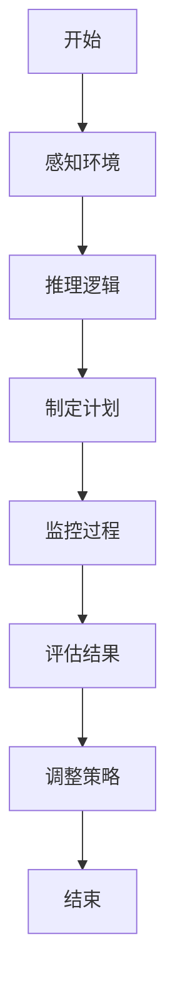

                 


# LLM在AI Agent元认知能力培养中的应用

> 关键词：LLM, AI Agent, 元认知能力, 人工智能, 代理系统

> 摘要：本文探讨了如何利用大语言模型（LLM）提升AI代理的元认知能力。通过分析元认知能力的核心概念、建模方法和系统设计，结合实际项目案例，详细阐述了LLM在AI Agent中的应用，展示了如何通过算法优化和系统架构设计实现元认知能力的培养。

---

## 第1章：问题背景与研究现状

### 1.1 问题背景

#### 1.1.1 AI Agent的定义与核心能力
AI Agent（人工智能代理）是一种能够感知环境、执行任务并做出决策的智能系统。其核心能力包括感知、推理、规划、学习和自适应。AI Agent的目标是通过这些能力，为用户提供高效、智能的服务。

#### 1.1.2 LLM的定义与技术特点
大语言模型（LLM，Large Language Model）是基于深度学习的自然语言处理模型，如GPT-3、PaLM等。LLM具有以下特点：
- **大规模数据训练**：利用海量文本数据进行预训练，具备广泛的知识覆盖。
- **强大的生成能力**：能够生成连贯且合理的文本，支持多种语言和风格。
- **上下文理解**：通过上下文理解语义，能够进行对话、摘要、翻译等多种任务。

#### 1.1.3 元认知能力的定义与重要性
元认知能力是指个体对自身认知过程的认知和调控能力。在AI Agent中，元认知能力包括：
- **自我监控**：监控自身的认知过程。
- **自我评估**：评估自身的知识和能力。
- **自我调节**：根据评估结果调整认知策略。

元认知能力在AI Agent中的重要性体现在：
- **提升决策准确性**：通过自我监控和评估，减少错误决策。
- **增强适应性**：根据环境变化动态调整策略。
- **提高交互体验**：通过理解自身能力，提供更精准的服务。

### 1.2 研究现状

#### 1.2.1 当前AI Agent的发展现状
AI Agent技术近年来取得了显著进展，尤其是在自然语言处理和决策推理方面。然而，现有AI Agent的元认知能力较为有限，主要依赖预设规则，缺乏动态调整和自适应能力。

#### 1.2.2 LLM在AI Agent中的应用现状
LLM在AI Agent中的应用主要集中在自然语言理解和生成、对话系统优化等方面。然而，如何将LLM的能力与AI Agent的元认知需求结合起来，仍然是一个挑战。

#### 1.2.3 元认知能力在AI Agent中的研究进展
目前，研究者们开始关注AI Agent的元认知能力，提出了多种建模方法和实现框架。然而，如何将元认知能力与LLM结合，仍处于探索阶段。

### 1.3 本书的目标与方法论

#### 1.3.1 本书的研究目标
本文旨在探讨如何利用大语言模型提升AI Agent的元认知能力，构建一种新的元认知模型，实现动态调整和自适应决策。

#### 1.3.2 本书的方法论框架
本文采用以下方法论：
1. **理论分析**：从元认知能力的定义出发，分析其核心要素。
2. **算法设计**：基于LLM，设计一种新的元认知模型。
3. **系统实现**：结合实际应用场景，设计并实现一个AI Agent系统。

#### 1.3.3 本书的结构安排
本文将从基础概念、算法原理、系统设计、项目实战等方面展开，逐步深入探讨LLM在AI Agent元认知能力培养中的应用。

---

## 第2章：LLM与AI Agent基础

### 2.1 LLM的定义与技术原理

#### 2.1.1 大语言模型的基本概念
大语言模型是一种基于Transformer架构的自然语言处理模型，通过大量数据训练，具备强大的文本生成和理解能力。

#### 2.1.2 LLM的核心技术原理
1. **Transformer架构**：由编码器和解码器组成，利用自注意力机制捕捉上下文信息。
2. **预训练与微调**：通过大规模数据预训练，再在特定任务上进行微调。

#### 2.1.3 LLM的主要应用场景
- **自然语言生成**：文本生成、对话系统。
- **机器翻译**：跨语言翻译。
- **问答系统**：智能问答。

### 2.2 AI Agent的定义与核心能力

#### 2.2.1 AI Agent的基本概念
AI Agent是一种智能代理，能够感知环境、执行任务并做出决策。它可以分为简单反射型、基于模型的反应型、目标驱动型和实用驱动型四种类型。

#### 2.2.2 AI Agent的核心能力
1. **感知能力**：通过传感器获取环境信息。
2. **推理能力**：基于知识库进行逻辑推理。
3. **规划能力**：制定行动计划。
4. **学习能力**：通过经验改进性能。
5. **自适应能力**：根据环境变化动态调整策略。

### 2.3 元认知能力的定义与重要性

#### 2.3.1 元认知能力的定义
元认知能力是指AI Agent对其认知过程的认知和调控能力，包括自我监控、自我评估和自我调节。

#### 2.3.2 元认知能力的核心要素
1. **自我监控**：实时监控认知过程。
2. **自我评估**：评估自身知识和能力。
3. **自我调节**：根据评估结果调整认知策略。

---

## 第3章：元认知能力的建模与分析

### 3.1 元认知能力的建模

#### 3.1.1 元认知模型的定义
元认知模型是对元认知能力的抽象和建模，能够描述AI Agent如何监控、评估和调节其认知过程。

#### 3.1.2 元认知模型的核心要素
1. **监控模块**：负责监控认知过程。
2. **评估模块**：负责评估认知结果。
3. **调节模块**：负责调整认知策略。

### 3.2 元认知能力的特征分析

#### 3.2.1 元认知能力的特征对比
| 特征 | 描述 |
|------|------|
| 自我监控 | 实时监控认知过程 |
| 自我评估 | 评估自身知识和能力 |
| 自我调节 | 根据评估结果调整策略 |

#### 3.2.2 元认知能力的挑战
1. **动态性**：环境变化快，需要动态调整。
2. **复杂性**：涉及多个认知过程的协调。
3. **不确定性**：部分信息不完整，需要概率推理。

---

## 第4章：LLM增强的元认知模型

### 4.1 基于LLM的元认知模型

#### 4.1.1 模型设计思路
1. **输入处理**：将AI Agent的认知过程和环境信息输入LLM。
2. **生成策略**：LLM根据输入生成元认知策略。
3. **输出调整**：根据生成的策略调整AI Agent的行为。

#### 4.1.2 模型实现步骤
1. **数据预处理**：收集和整理认知过程数据。
2. **模型训练**：基于LLM进行微调。
3. **策略生成**：生成元认知策略。
4. **策略执行**：调整AI Agent的行为。

### 4.2 案例分析

#### 4.2.1 案例背景
假设有一个AI Agent需要在复杂环境中进行决策，需要利用元认知能力进行自我监控和调节。

#### 4.2.2 案例分析
1. **监控阶段**：AI Agent监控自身的认知过程。
2. **评估阶段**：评估当前策略的有效性。
3. **调节阶段**：根据评估结果调整策略。

---

## 第5章：系统设计与架构

### 5.1 系统架构设计

#### 5.1.1 系统模块划分
1. **感知模块**：负责获取环境信息。
2. **推理模块**：负责逻辑推理。
3. **规划模块**：负责制定行动计划。
4. **元认知模块**：负责监控、评估和调节。

#### 5.1.2 系统交互流程
1. **感知模块**接收环境信息。
2. **推理模块**进行逻辑推理。
3. **规划模块**制定行动计划。
4. **元认知模块**监控并评估过程。
5. **根据评估结果**调整策略。

### 5.2 系统功能设计

#### 5.2.1 功能模块设计
1. **自我监控**：实时监控认知过程。
2. **自我评估**：评估自身知识和能力。
3. **自我调节**：根据评估结果调整策略。

#### 5.2.2 功能流程图


---

## 第6章：项目实战

### 6.1 项目环境安装

#### 6.1.1 环境配置
1. **Python 3.8+**
2. **TensorFlow 2.0+**
3. **Keras**
4. **Hugging Face库**

#### 6.1.2 安装依赖
```bash
pip install tensorflow keras huggingface-pytorch transformers
```

### 6.2 核心代码实现

#### 6.2.1 元认知模型代码
```python
def meta_cognition_model(input_data):
    # 输入数据处理
    processed_input = preprocess(input_data)
    # 生成策略
    strategy = generate_strategy(processed_input)
    # 调整策略
    adjusted_strategy = adjust_strategy(strategy)
    return adjusted_strategy
```

#### 6.2.2 应用场景代码
```python
def main():
    # 初始化环境
    env = Environment()
    # 初始化AI Agent
    agent = AIAgent(env)
    # 执行任务
    result = agent.execute_task()
    # 输出结果
    print(result)

if __name__ == "__main__":
    main()
```

### 6.3 案例分析

#### 6.3.1 案例背景
假设一个AI Agent需要在电商平台上进行商品推荐。

#### 6.3.2 代码解读
```python
class AIAgent:
    def __init__(self, environment):
        self.env = environment
        self.model = meta_cognition_model()

    def execute_task(self):
        # 获取环境信息
        env_info = self.env.get_info()
        # 执行任务
        result = self.model(env_info)
        return result
```

---

## 第7章：最佳实践与未来展望

### 7.1 小结

#### 7.1.1 核心要点总结
1. LLM在AI Agent中的应用潜力巨大。
2. 元认知能力的建模与实现是关键。
3. 系统设计与实现需要综合考虑多方面因素。

### 7.2 注意事项

#### 7.2.1 开发中的注意事项
1. 数据质量：确保训练数据的质量和多样性。
2. 模型调优：进行充分的模型调优和测试。
3. 系统优化：优化系统架构，提高运行效率。

### 7.3 未来展望

#### 7.3.1 未来研究方向
1. 更复杂的元认知模型。
2. 多模态数据的融合。
3. 更强的自适应能力。

#### 7.3.2 技术发展趋势
1. 模型规模越来越大。
2. 算法越来越复杂。
3. 应用场景越来越广泛。

---

## 作者：AI天才研究院/AI Genius Institute & 禅与计算机程序设计艺术 /Zen And The Art of Computer Programming

---

以上是《LLM在AI Agent元认知能力培养中的应用》的目录大纲和部分正文内容。

