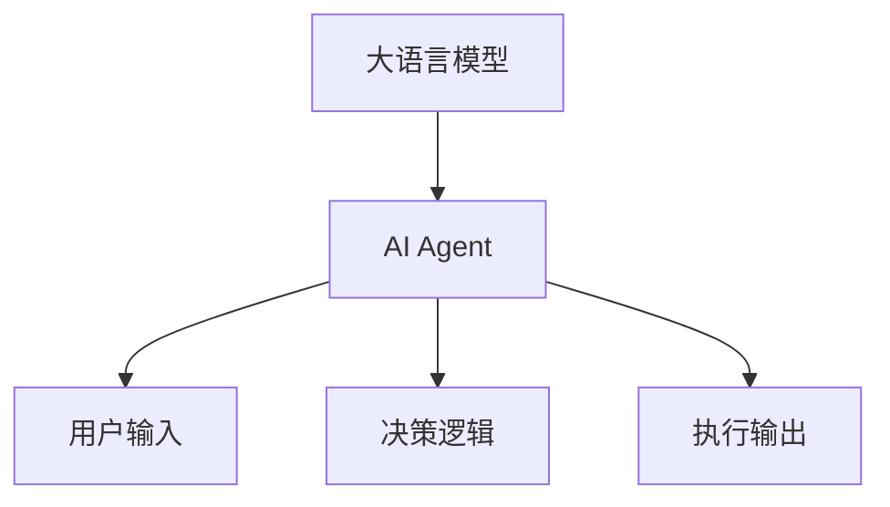
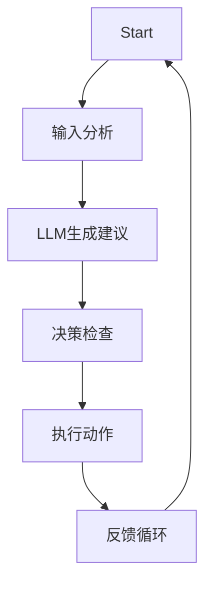
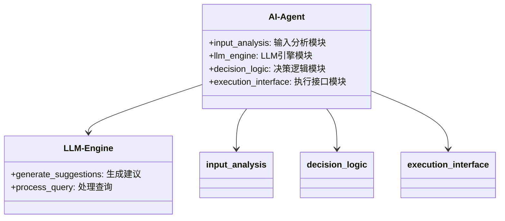
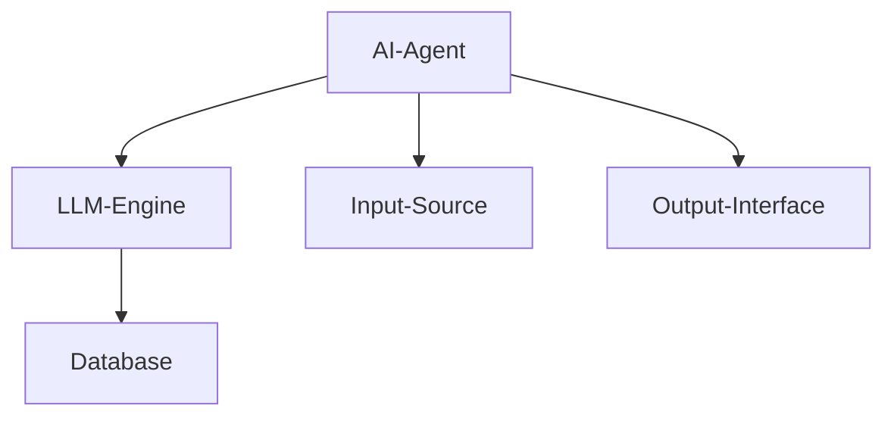

                 


# LLM在AI Agent决策过程中的角色：从建议到执行

## 关键词：LLM, AI Agent, 决策过程, 大语言模型, AI代理, 人工智能

## 摘要：本文探讨了大语言模型（LLM）在AI Agent决策过程中的角色，从建议到执行的整个流程。通过分析背景、核心概念、算法原理、系统架构、项目实战和最佳实践，本文详细阐述了LLM如何赋能AI Agent，实现更高效、更智能的决策过程。

---

## 第一部分：背景介绍

### 第1章：AI Agent与LLM的基本概念

#### 1.1 AI Agent的基本概念
- **AI Agent**（人工智能代理）是指能够感知环境、做出决策并采取行动的智能实体。它可以是一个软件程序、机器人或其他智能系统，旨在帮助用户完成特定任务或提供决策支持。
- **LLM**（大语言模型）是指基于深度学习训练的大型语言模型，如GPT系列、BERT系列等，能够理解和生成人类语言。LLM通过大量数据训练，具备强大的自然语言处理能力，可以用于文本生成、对话交互、信息检索等多种任务。

#### 1.2 问题背景与描述
- **问题背景**：AI Agent的决策过程需要依赖大量的信息和知识，而LLM作为一种强大的信息处理工具，可以为AI Agent提供丰富的上下文理解和生成能力。然而，如何将LLM与AI Agent的有效结合，使其在决策过程中发挥更大的作用，仍是一个具有挑战性的课题。
- **问题描述**：本文将探讨LLM在AI Agent决策过程中的角色，分析其在建议生成、决策支持、执行反馈等环节中的具体应用和作用。
- **问题解决**：通过结合LLM的自然语言处理能力和AI Agent的决策逻辑，可以显著提升AI Agent的智能水平和决策效率。

#### 1.3 问题解决与应用
- **LLM在决策中的应用**：LLM可以为AI Agent提供多轮对话交互能力，帮助其更好地理解用户需求并生成相应的建议。此外，LLM还可以用于风险评估、方案生成和决策优化等环节。
- **AI Agent的决策流程**：AI Agent的决策流程通常包括信息收集、需求分析、方案生成、决策评估和执行反馈等阶段。LLM在每个阶段都可以发挥重要作用。
- **边界与外延**：本文主要关注LLM在AI Agent决策过程中的角色，不涉及AI Agent的硬件实现或其他外部系统的集成。

---

## 第二部分：核心概念与联系

### 第2章：LLM与AI Agent的核心原理

#### 2.1 核心原理分析
- **LLM的原理**：LLM基于Transformer架构，通过自注意力机制和前馈网络，可以生成与输入相关的上下文信息。LLM的训练目标是最小化预测下一个词的概率，从而生成连贯且合理的文本。
- **AI Agent的决策机制**：AI Agent的决策机制通常包括感知、推理和执行三个阶段。感知阶段通过传感器或API获取环境信息，推理阶段通过逻辑推理或机器学习模型生成决策，执行阶段通过动作或反馈与环境交互。
- **两者结合的原理**：LLM作为AI Agent的“智能大脑”，负责处理自然语言输入、生成建议和解释决策。AI Agent则作为LLM的执行载体，负责将LLM生成的建议转化为实际行动。

#### 2.2 核心概念对比
- **LLM与传统NLP模型的对比**：
  | 属性         | LLM                     | 传统NLP模型               |
  |--------------|-------------------------|---------------------------|
  | 处理能力     | 强大的上下文理解和生成 | 通常针对特定任务设计       |
  | 模型规模     | 大型或超大规模          | 中小型模型                |
  | 应用场景     | 多领域、多任务          | 单一任务或领域            |
- **AI Agent与传统决策系统的对比**：
  | 属性         | AI Agent                 | 传统决策系统               |
  |--------------|-------------------------|---------------------------|
  | 智能水平     | 高度智能化               | 基于规则或简单的逻辑       |
  | 学习能力     | 可以通过数据进行训练     | 通常无法学习或自适应         |
  | 交互方式     | 支持自然语言交互         | 通常基于固定输入或界面       |

#### 2.3 实体关系图


---

## 第三部分：算法原理讲解

### 第3章：LLM与AI Agent的算法流程

#### 3.1 算法流程图


#### 3.2 算法实现代码
```python
def ai_agent_decision_process(user_input):
    # 输入分析
    input_analysis = process_input(user_input)
    # LLM生成建议
    suggestions = llm.generate(input_analysis)
    # 决策检查
    for suggestion in suggestions:
        if is_valid(suggestion):
            # 执行动作
            action = execute_action(suggestion)
            return action
    # 如果没有有效建议，触发反馈循环
    return feedback_loop(input_analysis)
```

---

## 第四部分：数学模型与公式

### 第4章：数学模型解析

#### 4.1 注意力机制公式
$$\text{Attention}(Q,K,V) = \text{softmax}\left(\frac{QK^T}{\sqrt{d}}\right)V$$

其中，$Q$、$K$、$V$分别是查询、键和值向量，$d$是向量的维度。

#### 4.2 损失函数公式
$$\mathcal{L} = -\sum_{i=1}^{n} y_i \log p(y_i|x)$$

其中，$y_i$是真实标签，$p(y_i|x)$是模型对输入$x$的预测概率。

---

## 第五部分：系统分析与架构设计

### 第5章：系统架构设计

#### 5.1 系统功能设计


#### 5.2 系统架构图


---

## 第六部分：项目实战

### 第6章：环境安装与代码实现

#### 6.1 环境安装
```bash
pip install transformers torch
```

#### 6.2 核心实现代码
```python
from transformers import GPT2LMHeadModel, GPT2Tokenizer

def generate_suggestions(model, tokenizer, input_text):
    inputs = tokenizer(input_text, return_tensors="pt")
    outputs = model.generate(**inputs, max_length=50)
    return [tokenizer.decode(output) for output in outputs]
```

---

## 第七部分：最佳实践与总结

### 第7章：总结与注意事项

#### 7.1 总结
- LLM作为AI Agent的核心模块，能够显著提升其智能水平和决策能力。
- 通过结合LLM的自然语言处理能力和AI Agent的决策逻辑，可以实现更高效、更智能的决策过程。
- 本文详细探讨了LLM在AI Agent决策过程中的角色，从建议生成到执行反馈，为未来的AI Agent设计提供了参考。

#### 7.2 注意事项
- 在实际应用中，需要考虑LLM的计算资源消耗和响应时间问题。
- 需要结合具体场景对LLM进行微调，以提升其在特定领域的表现。
- AI Agent的决策过程需要结合实际环境和用户需求，进行动态调整和优化。

---

## 作者

作者：AI天才研究院/AI Genius Institute & 禅与计算机程序设计艺术 /Zen And The Art of Computer Programming

