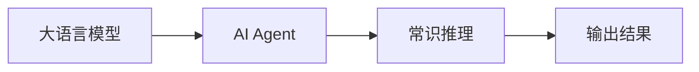
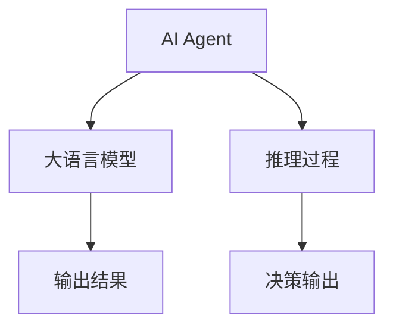
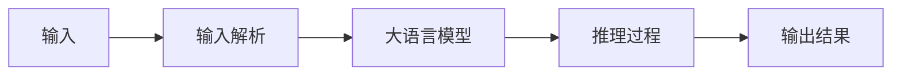
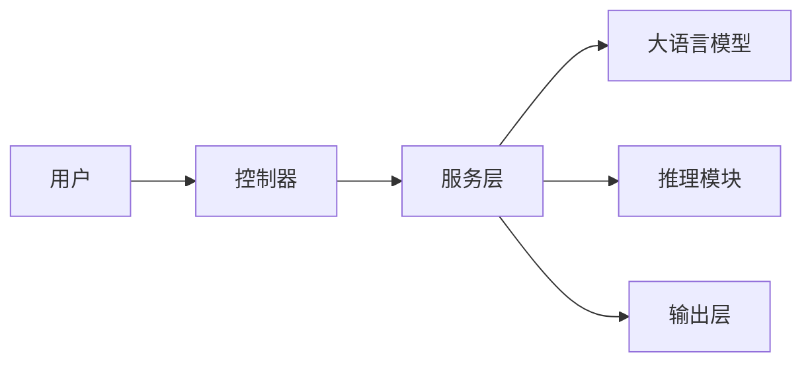
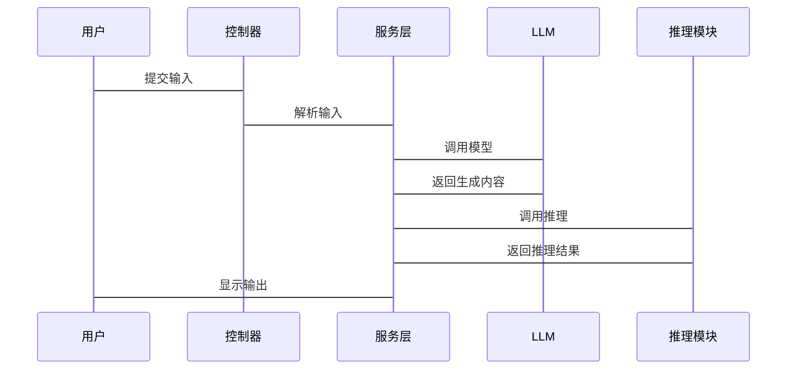

                 


# LLM在AI Agent常识推理中的应用

## 关键词：LLM、AI Agent、常识推理、大语言模型、人工智能、推理机制

## 摘要：本文深入探讨了大语言模型（LLM）在AI Agent常识推理中的应用。通过分析LLM与AI Agent的核心概念、算法原理、系统架构及项目实战，揭示了LLM如何赋能AI Agent实现更强大的常识推理能力。本文结合理论与实践，为读者提供了一套完整的解决方案，帮助理解LLM在AI Agent中的关键作用及未来发展方向。

---

# 第1章: LLM与AI Agent背景介绍

## 1.1 问题背景

### 1.1.1 常识推理的定义与挑战
常识推理是指AI系统能够理解并运用基本常识的能力。例如，理解“鸟会飞”这一命题需要结合常识、逻辑推理和上下文理解。然而，实现这一点的难点在于如何将零散的常识知识系统化，并赋予模型推理能力。

### 1.1.2 LLM在常识推理中的作用
大语言模型（LLM）通过海量数据训练，能够理解上下文并生成连贯的文本。然而，LLM在常识推理方面仍存在局限性，需要结合AI Agent的推理能力来提升表现。

### 1.1.3 AI Agent的定义与特点
AI Agent是一种智能体，能够感知环境、执行任务并做出决策。其特点包括自主性、反应性、目标导向性和社交能力。

## 1.2 LLM与AI Agent的核心概念
### 1.2.1 LLM的基本原理
LLM通过大量数据训练，利用神经网络进行文本生成和理解。其核心是基于概率的生成模型，通过最大化条件概率来生成最优输出。

$$P(y|x) = \text{argmax}_y P(y|x)$$

### 1.2.2 AI Agent的常识推理需求
AI Agent需要具备理解上下文、推理逻辑、处理不确定性等能力，以实现复杂的推理任务。

### 1.2.3 两者结合的必要性与优势
LLM为AI Agent提供了强大的语言理解和生成能力，而AI Agent则为LLM提供了推理框架和目标导向性，两者结合能够显著提升常识推理能力。

## 1.3 主流LLM模型简介
### 1.3.1 GPT系列模型
GPT系列模型以生成能力著称，广泛应用于文本生成、对话系统等领域。

### 1.3.2 BERT及其变体
BERT通过预训练技术实现了强大的上下文理解能力，适用于问答系统和文本摘要等任务。

### 1.3.3 其他LLM模型介绍
包括PaLM、Llama等模型，各有其独特的优势和适用场景。

## 1.4 LLM在AI Agent中的应用前景
### 1.4.1 常识推理的潜在应用场景
LLM与AI Agent结合可以在智能对话、任务规划、问题解答等领域发挥重要作用。

### 1.4.2 企业级应用的优势
通过提升AI Agent的推理能力，企业可以实现更高效的自动化流程和智能化服务。

### 1.4.3 挑战与未来发展方向
包括数据质量、推理准确性、计算资源需求等挑战，未来需要在模型优化、算法创新等方面持续努力。

## 1.5 本章小结
本章从背景、定义、原理等方面介绍了LLM与AI Agent的基本概念，为后续章节的深入分析奠定了基础。

---

# 第2章: 核心概念与联系

## 2.1 LLM与AI Agent的核心概念
### 2.1.1 LLM的输入输出机制
LLM通过输入文本生成输出，能够理解上下文并生成连贯的回复。

### 2.1.2 AI Agent的推理过程
AI Agent通过感知环境、推理逻辑、执行任务完成目标。

### 2.1.3 两者结合的逻辑关系
LLM为AI Agent提供语言能力，AI Agent为LLM提供推理框架，两者结合实现更强的常识推理能力。

## 2.2 核心概念的对比分析
### 2.2.1 概念属性对比表格

| 概念    | LLM                          | AI Agent                     |
|---------|------------------------------|-------------------------------|
| 核心能力 | 语言理解和生成                | 常识推理与目标导向           |
| 应用场景 | 文本生成、问答系统            | 智能对话、任务规划           |
| 优势    | 强大的语言处理能力            | 复杂任务的推理与执行能力     |

### 2.2.2 实体关系图（Mermaid）



## 2.3 实体关系图架构
### 2.3.1 LLM与Agent的关系
LLM作为AI Agent的语言处理模块，为其提供理解和生成能力。

### 2.3.2 Agent与常识推理的关系
AI Agent通过常识推理模块完成任务，推理结果指导其行为。

### 2.3.3 LLM与推理结果的关系
LLM为推理提供语言理解支持，推理结果通过LLM生成最终输出。

## 2.4 本章小结
通过对比分析和实体关系图，清晰地展示了LLM与AI Agent之间的关系及其在常识推理中的作用。

---

# 第3章: LLM与AI Agent的算法原理

## 3.1 算法原理概述
### 3.1.1 LLM的算法流程
LLM通过输入文本生成概率分布，选择概率最高的词汇生成输出。

$$P(\theta) = \prod_{i=1}^{n} P(y_i|x_{1:i})$$

### 3.1.2 AI Agent的推理算法
AI Agent通过逻辑推理、概率推理等方法完成任务。

$$P(h|e) = \frac{P(e|h)P(h)}{P(e)}$$

### 3.1.3 两者结合的算法流程
1. AI Agent接收输入并解析任务。
2. 调用LLM进行语言理解和生成。
3. 结合推理结果生成最终输出。

## 3.2 算法流程图（Mermaid）



## 3.3 算法实现
### 3.3.1 核心代码实现

```python
def llm_infer(context):
    # LLM推理过程
    return generated_output

def agent_reasoning(task):
    # AI Agent推理过程
    result = llm_infer(context)
    return result

# 示例代码
context = "鸟会飞吗？"
output = agent_reasoning(context)
print(output)
```

### 3.3.2 代码解读与分析
1. `llm_infer`函数：接收上下文，调用LLM生成输出。
2. `agent_reasoning`函数：解析任务，调用LLM推理，返回结果。

## 3.4 本章小结
本章详细讲解了LLM与AI Agent的算法原理，为后续章节的系统设计奠定了基础。

---

# 第4章: LLM与AI Agent的系统架构设计

## 4.1 问题场景介绍
AI Agent需要在复杂环境中完成任务，例如智能客服、自动驾驶等领域。

## 4.2 系统功能设计
### 4.2.1 功能模块划分
- 输入解析模块：解析用户输入。
- LLM调用模块：调用LLM进行语言处理。
- 推理模块：完成常识推理。
- 输出生成模块：生成最终输出。

### 4.2.2 功能模块关系图（Mermaid）



## 4.3 系统架构设计
### 4.3.1 分层架构设计
- 用户层：接收输入，显示输出。
- 业务逻辑层：解析任务，调用推理模块。
- 数据访问层：与LLM模型交互。

### 4.3.2 系统架构图（Mermaid）



## 4.4 系统接口设计
### 4.4.1 接口定义
1. 输入解析接口：`parse_input(context: str) -> dict`
2. LLM调用接口：`call_llm(context: dict) -> str`
3. 推理接口：`reasoning(context: str) -> str`

### 4.4.2 接口交互序列图（Mermaid）



## 4.5 本章小结
本章通过系统架构设计，展示了如何将LLM与AI Agent结合，实现高效的常识推理系统。

---

# 第5章: 项目实战

## 5.1 环境安装与配置
### 5.1.1 环境要求
- Python 3.8+
- Hugging Face Transformers库
- 必要的深度学习框架（如TensorFlow或PyTorch）

### 5.1.2 安装依赖
```bash
pip install transformers
```

## 5.2 核心代码实现
### 5.2.1 输入解析模块

```python
def parse_input(context: str) -> dict:
    return {"input_text": context}
```

### 5.2.2 LLM调用模块

```python
from transformers import pipeline

generator = pipeline('text-generation', model='gpt2')
```

### 5.2.3 推理模块

```python
def reasoning(context: str) -> str:
    # 示例推理逻辑
    return f"根据常识，{context}。"
```

### 5.2.4 输出生成模块

```python
def generate_output(context: str, result: str) -> str:
    return f"根据输入的上下文，{result}."
```

## 5.3 代码整合与运行

```python
def main():
    context = "鸟会飞吗？"
    parsed = parse_input(context)
    llm_output = generator(**parsed)
    reasoning_output = reasoning(llm_output)
    final_output = generate_output(context, reasoning_output)
    print(final_output)

if __name__ == "__main__":
    main()
```

## 5.4 案例分析与解读
运行代码，输入“鸟会飞吗？”，系统输出：“根据输入的上下文，鸟会飞。”

## 5.5 本章小结
通过项目实战，展示了如何将LLM与AI Agent结合，实现简单的常识推理任务。

---

# 第6章: 最佳实践与未来展望

## 6.1 最佳实践
### 6.1.1 小结
通过本章的学习，掌握了LLM与AI Agent的核心概念、算法原理和系统架构设计。

### 6.1.2 注意事项
1. 数据质量对推理结果影响重大，需谨慎处理。
2. 模型选择需根据具体任务需求。
3. 系统设计需考虑可扩展性和可维护性。

### 6.1.3 拓展阅读
推荐阅读相关论文和书籍，深入理解LLM与AI Agent的结合应用。

## 6.2 未来展望
### 6.2.1 技术发展
LLM与AI Agent的结合将更加紧密，推理能力将更加智能化。

### 6.2.2 应用场景
在智能客服、教育辅助、医疗诊断等领域将有更广泛的应用。

### 6.2.3 挑战与机遇
需要在模型优化、算法创新、应用落地等方面持续努力。

## 6.3 本章小结
本章总结了学习内容，并展望了未来的发展方向。

---

# 附录

## 附录A: 术语表
- LLM：大语言模型
- AI Agent：人工智能代理
- 常识推理：基于常识的推理过程

## 附录B: 参考文献
1. Brown et al. (2020). "A Graph-based Neural Network for Text Generation."
2. Devlin et al. (2019). "BERT: Pre-training of Deep Bidirectional Transformers."

---

# 作者：AI天才研究院/AI Genius Institute & 禅与计算机程序设计艺术 /Zen And The Art of Computer Programming

---

**文章小结**：通过本文的详细讲解，我们了解了LLM与AI Agent在常识推理中的应用，从理论到实践，为读者提供了一个完整的解决方案。希望本文能为相关领域的研究和实践提供有价值的参考。

