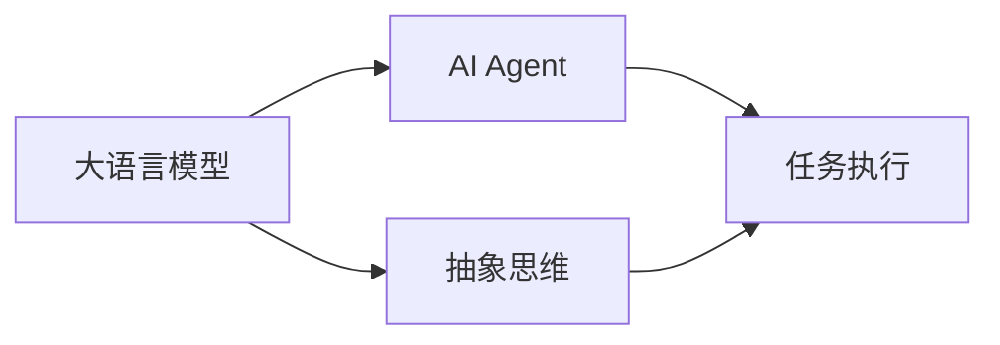
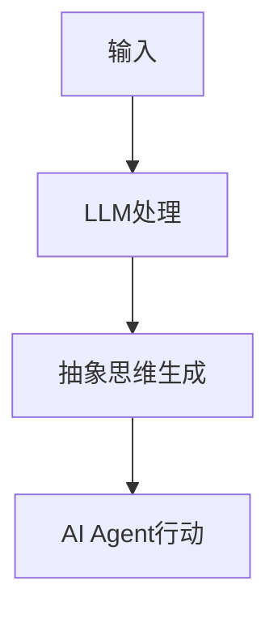
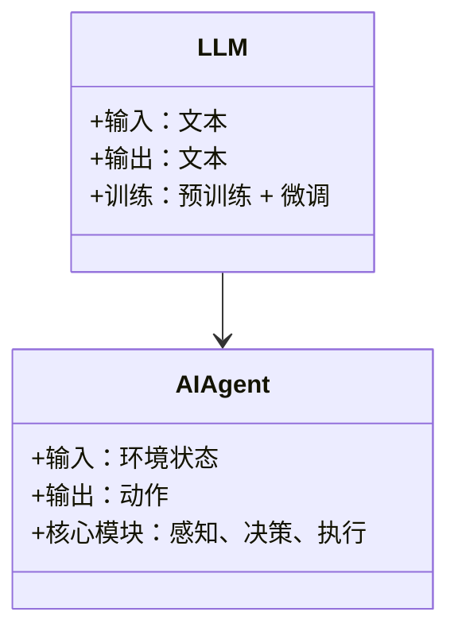
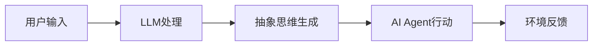
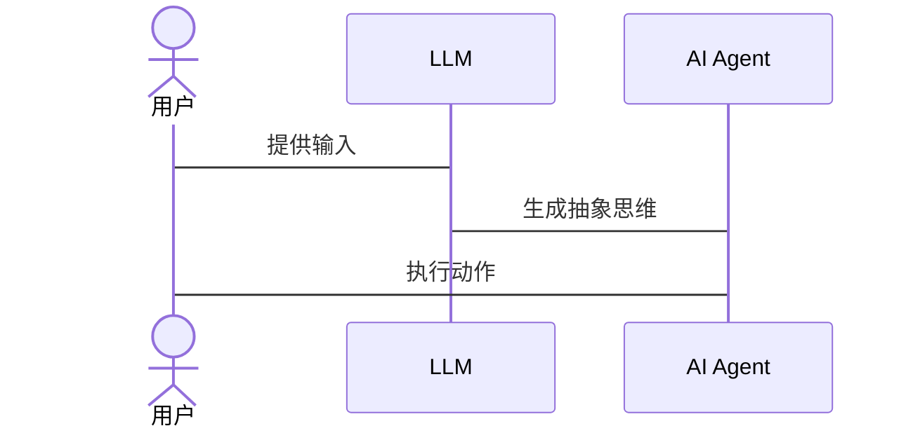

                 


# LLM在AI Agent抽象思维培养中的应用

## 关键词：LLM, AI Agent, 抽象思维, 大语言模型, 智能体设计

## 摘要：本文探讨了如何利用大语言模型（LLM）赋能AI Agent的抽象思维能力，分析了LLM与AI Agent的核心概念及其在智能系统中的应用。文章从背景介绍、核心概念、算法原理、系统架构到项目实战，全面解析了LLM在AI Agent中的应用，并通过具体案例展示了如何设计和实现具有抽象思维能力的AI Agent系统。

---

# 第一部分: LLM与AI Agent背景介绍

## 第1章: LLM与AI Agent概述

### 1.1 LLM的基本概念
#### 1.1.1 大语言模型的定义
大语言模型（LLM）是指基于大量数据训练的大型神经网络模型，具有理解上下文、生成文本和解决复杂问题的能力。

#### 1.1.2 LLM的核心特点
- **大规模数据训练**：利用海量数据进行训练，提升模型的泛化能力。
- **深度学习架构**：采用Transformer架构，擅长处理序列数据。
- **多任务能力**：能够处理多种NLP任务，如问答、翻译、文本生成等。

#### 1.1.3 LLM与传统NLP模型的区别
传统NLP模型通常针对特定任务训练，而LLM是通用型模型，能够处理多种任务。

### 1.2 AI Agent的基本概念
#### 1.2.1 AI Agent的定义
AI Agent（智能体）是指在环境中能够感知并自主行动以实现目标的实体。

#### 1.2.2 AI Agent的核心功能
- **感知环境**：通过传感器或数据输入感知环境状态。
- **决策与推理**：基于感知信息进行推理，制定行动策略。
- **执行动作**：根据决策结果执行实际动作。

#### 1.2.3 AI Agent的应用场景
- **自动驾驶**：感知环境并做出驾驶决策。
- **智能助手**：如Siri、Alexa，提供语音交互服务。
- **游戏AI**：在游戏环境中做出策略性决策。

### 1.3 LLM在AI Agent中的作用
#### 1.3.1 LLM如何赋能AI Agent的抽象思维
- LLM能够理解和生成自然语言，帮助AI Agent进行语言交流和理解。
- 提供上下文理解和推理能力，增强AI Agent的抽象思维能力。

#### 1.3.2 LLM在AI Agent中的具体应用
- **自然语言交互**：通过LLM实现人与AI Agent之间的自然语言对话。
- **复杂问题解决**：利用LLM的推理能力，帮助AI Agent解决复杂问题。

#### 1.3.3 LLM与AI Agent结合的优势
- **强大的语言处理能力**：LLM能够处理复杂的语言任务。
- **快速学习能力**：通过微调LLM，可以快速适应特定任务。

---

## 第2章: LLM与AI Agent的核心概念与联系

### 2.1 LLM的核心原理
#### 2.1.1 LLM的训练过程
- **预训练**：在大规模通用数据集上进行无监督预训练，学习语言的结构和语义。
- **微调**：根据具体任务对模型进行有监督微调，提升任务相关的性能。

#### 2.1.2 LLM的内部结构
- **Transformer架构**：由编码器和解码器组成，擅长处理序列数据。
- **自注意力机制**：通过计算词与词之间的相关性，捕捉长距离依赖关系。

#### 2.1.3 LLM的推理机制
- **生成式推理**：基于概率分布生成文本。
- **理解式推理**：通过编码器理解输入文本的语义。

### 2.2 AI Agent的核心原理
#### 2.2.1 AI Agent的感知与决策过程
- **感知**：通过传感器或数据接口获取环境信息。
- **决策**：基于感知信息，结合知识库和推理模型，制定行动策略。

#### 2.2.2 AI Agent的行动机制
- **执行动作**：根据决策结果，通过执行器或API调用完成实际操作。
- **反馈机制**：根据执行结果调整后续行动。

#### 2.2.3 AI Agent的学习与优化
- **强化学习**：通过奖励机制优化决策策略。
- **监督学习**：通过标注数据进行模型优化。

### 2.3 LLM与AI Agent的实体关系图


### 2.4 LLM与AI Agent的算法流程图


---

## 第3章: LLM在AI Agent中的算法原理

### 3.1 LLM的数学模型
#### 3.1.1 Transformer模型的数学表示
- **自注意力机制**：
  $$\text{Attention}(Q, K, V) = \text{softmax}\left(\frac{QK^T}{\sqrt{d_k}}\right)V$$
  其中，$Q$、$K$、$V$分别为查询、键和值向量，$d_k$为键的维度。

#### 3.1.2 解码器的前向传播
- **解码器层**：
  $$\text{DecoderLayer}(x) = \text{FFN}(\text{Attention}(x, x, x))$$
  其中，$\text{FFN}$表示前馈神经网络。

### 3.2 AI Agent的决策算法
#### 3.2.1 基于LLM的决策过程
- **输入处理**：将感知信息输入LLM，生成决策建议。
- **决策优化**：通过强化学习优化决策策略。

#### 3.2.2 决策算法的数学表示
- **策略网络**：
  $$\pi(a|s) = \text{softmax}(W_s s + b)$$
  其中，$s$是状态向量，$a$是动作向量，$W_s$和$b$是网络参数。

---

## 第4章: LLM与AI Agent的系统架构设计

### 4.1 系统功能设计
#### 4.1.1 领域模型


#### 4.1.2 系统架构


#### 4.1.3 系统接口设计
- **输入接口**：文本输入、环境状态输入。
- **输出接口**：生成文本、动作指令。

### 4.2 系统交互流程图


---

## 第5章: LLM与AI Agent的项目实战

### 5.1 环境安装
- **工具安装**：安装Python、TensorFlow、Keras等框架。
- **模型下载**：下载预训练的LLM模型（如GPT）。

### 5.2 核心代码实现
#### 5.2.1 LLM的文本生成
```python
def generate_text(prompt, max_length=50):
    # 使用LLM生成文本
    output = model.generate(prompts=prompt, max_length=max_length)
    return output[0].text
```

#### 5.2.2 AI Agent的决策逻辑
```python
def decide_action(state):
    # 使用LLM生成决策建议
    prompt = f"根据当前状态{state}，请生成一个动作。"
    action = generate_text(prompt)
    return action
```

### 5.3 案例分析
#### 5.3.1 案例介绍
设计一个简单的AI Agent，用于回答用户问题。

#### 5.3.2 代码实现
```python
# 安装依赖
pip install transformers

# 导入库
from transformers import GPT2LMHeadModel, GPT2Tokenizer

# 初始化模型
model = GPT2LMHeadModel.from_pretrained('gpt2')
tokenizer = GPT2Tokenizer.from_pretrained('gpt2')

def generate_response(prompt):
    inputs = tokenizer.encode(prompt, return_tensors='pt')
    outputs = model.generate(inputs, max_length=50, temperature=0.7)
    response = tokenizer.decode(outputs[0], skip_special_tokens=True)
    return response
```

#### 5.3.3 案例分析
通过上述代码，AI Agent能够根据用户输入生成自然语言回答，展示了LLM在AI Agent中的应用。

---

## 第6章: 总结与展望

### 6.1 本章总结
本文详细探讨了LLM在AI Agent中的应用，从背景、原理到系统设计和实战，全面解析了如何利用LLM赋能AI Agent的抽象思维能力。

### 6.2 未来展望
未来，随着大语言模型的不断发展，AI Agent的抽象思维能力将更加智能化和多样化，应用场景也将更加广泛。

### 6.3 最佳实践Tips
- 在实际应用中，建议根据具体任务对LLM进行微调，以提升性能。
- 注意数据隐私和模型安全，确保系统的稳定性和可靠性。

---

## 作者：AI天才研究院 & 禅与计算机程序设计艺术

---

通过本文的详细讲解，读者可以全面理解LLM在AI Agent中的应用，并能够实际操作相关技术。希望本文能够为读者提供有价值的参考和启发。

