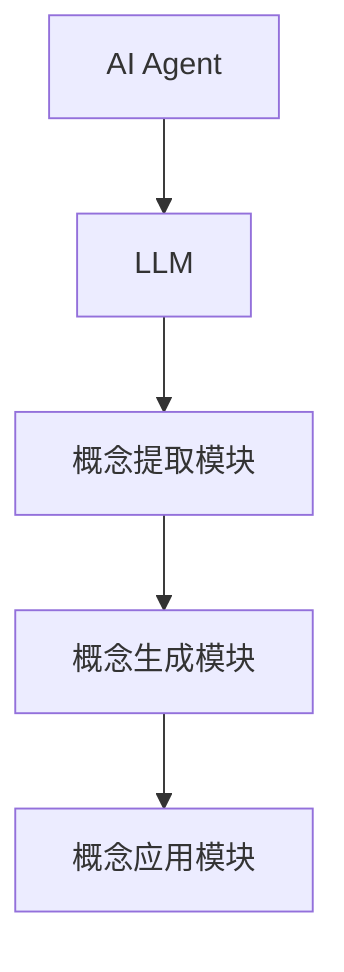
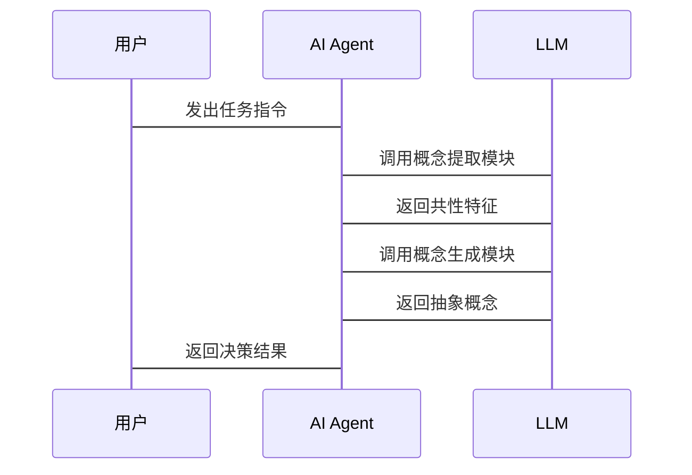

                 


---

# LLM在AI Agent抽象概念形成中的应用

> 关键词：大语言模型（LLM）、AI Agent、抽象概念、自然语言处理、人机交互

> 摘要：本文探讨了如何利用大语言模型（LLM）在AI Agent的抽象概念形成中的应用。通过分析LLM的核心原理、AI Agent的架构，以及两者的交互机制，本文详细阐述了LLM如何帮助AI Agent理解、推理和形成抽象概念。文章还通过实际案例和系统设计，展示了LLM在AI Agent中的具体应用场景和实现方法，为相关领域的研究和实践提供了理论和实践参考。

---

# 第一部分：LLM与AI Agent概述

## 第1章：LLM与AI Agent的基本概念

### 1.1 大语言模型（LLM）的定义
大语言模型（Large Language Model, LLM）是指基于深度学习训练的大型神经网络模型，能够理解和生成人类语言。LLM的核心在于其庞大的参数规模和强大的语言处理能力，使其在自然语言处理（NLP）任务中表现出色。

### 1.2 AI Agent的定义与分类
AI Agent（人工智能代理）是指能够感知环境、自主决策并执行任务的智能体。AI Agent可以根据任务类型分为多种类别，如简单反射型、基于模型的反射型、目标驱动型和效用驱动型。

### 1.3 LLM在AI Agent中的作用
LLM为AI Agent提供了强大的语言理解和生成能力，使其能够更自然地与人类交互，并能够处理复杂的语义信息。通过LLM，AI Agent可以更好地理解用户意图，形成抽象概念，并做出更智能的决策。

---

## 第2章：问题背景与目标

### 2.1 当前AI Agent面临的挑战
1. **语义理解能力不足**：传统的AI Agent依赖于规则或浅层学习，难以理解复杂的语义信息。
2. **抽象概念形成困难**：AI Agent难以从具体实例中归纳出抽象概念，限制了其智能性。
3. **动态环境适应性差**：在复杂多变的环境中，AI Agent难以快速适应新的情况。

### 2.2 LLM如何解决这些问题
1. **强大的语义理解能力**：LLM通过大规模预训练，能够理解上下文和隐含意图。
2. **抽象概念的形成**：通过LLM的生成能力，AI Agent可以归纳出抽象概念，并应用于新场景。
3. **快速适应能力**：LLM的灵活性使其能够快速适应新的语境和任务。

### 2.3 本书的研究目标
本研究旨在探讨如何利用LLM帮助AI Agent形成和应用抽象概念，从而提升AI Agent的智能性和实用性。

---

## 第3章：问题描述与解决思路

### 3.1 AI Agent抽象概念形成的核心问题
AI Agent需要从具体实例中提取特征，归纳出抽象概念，并能够将这些概念应用于新的情境中。这需要AI Agent具备强大的学习和推理能力。

### 3.2 LLM在抽象概念形成中的优势
1. **语义表示能力**：LLM能够将具体实例映射到语义空间，提取共性特征。
2. **生成能力**：LLM可以生成新的语义表示，帮助AI Agent形成新的抽象概念。
3. **动态适应能力**：LLM的可微分性质使其能够快速调整模型参数，适应新概念。

### 3.3 解决思路与技术路线
1. **概念提取**：通过LLM对具体实例进行语义分析，提取共性特征。
2. **概念生成**：利用LLM生成新的抽象概念，并验证其合理性。
3. **概念应用**：将生成的抽象概念应用于新场景，指导AI Agent的行为。

---

# 第二部分：LLM与AI Agent的核心概念与联系

## 第4章：LLM的核心原理

### 4.1 LLM的训练原理
1. **预训练目标**：LLM通过大量文本数据的预训练，学习语言的分布特征。
2. **Transformer架构**：基于Transformer的模型结构，LLM能够处理长距离依赖关系。
3. **自注意力机制**：通过自注意力机制，模型可以关注输入中的重要部分，生成更准确的语义表示。

### 4.2 LLM的推理机制
1. **解码过程**：在生成任务中，LLM通过解码器逐层生成输出。
2. **概率生成模型**：LLM基于概率分布生成文本，具有上下文理解和生成能力。

### 4.3 LLM的可解释性与局限性
1. **可解释性问题**：LLM的决策过程往往难以解释，限制了其在某些领域的应用。
2. **模型局限性**：LLM可能受到训练数据的偏差影响，生成不准确的结果。

---

## 第5章：AI Agent的核心原理

### 5.1 AI Agent的基本架构
1. **感知模块**：负责感知环境信息。
2. **推理模块**：基于感知信息进行推理和决策。
3. **执行模块**：根据决策结果执行具体操作。

### 5.2 AI Agent的认知模型
1. **状态空间**：表示AI Agent所处的状态。
2. **动作空间**：表示AI Agent可以执行的动作。
3. **奖励机制**：用于评估AI Agent行为的优劣。

### 5.3 AI Agent的决策算法
1. **基于规则的决策**：通过预定义规则进行决策。
2. **基于学习的决策**：通过机器学习模型进行预测和决策。
3. **基于模型的决策**：通过构建环境模型进行决策。

---

## 第6章：LLM与AI Agent的关系

### 6.1 LLM作为AI Agent的语言中枢
1. **语义理解**：LLM为AI Agent提供强大的语言处理能力。
2. **知识表示**：LLM可以将知识表示为语义向量，便于AI Agent理解和推理。

### 6.2 LLM与AI Agent的交互机制
1. **输入输出交互**：AI Agent通过LLM与用户进行自然语言对话。
2. **内部推理交互**：AI Agent利用LLM进行内部推理和决策。

### 6.3 LLM在AI Agent中的应用案例
1. **智能对话系统**：AI Agent通过LLM与用户进行自然语言对话。
2. **任务型AI Agent**：AI Agent利用LLM理解用户意图并执行任务。

---

# 第三部分：系统分析与架构设计

## 第7章：系统分析与架构设计方案

### 7.1 项目场景介绍
1. **问题场景**：AI Agent需要通过LLM形成抽象概念，解决具体任务。
2. **项目目标**：设计一个基于LLM的AI Agent系统，实现抽象概念的形成与应用。

### 7.2 系统功能设计
1. **概念提取模块**：从具体实例中提取共性特征。
2. **概念生成模块**：生成新的抽象概念。
3. **概念应用模块**：将抽象概念应用于新场景。

### 7.3 系统架构设计


### 7.4 接口设计
1. **输入接口**：接收具体实例或任务指令。
2. **输出接口**：输出抽象概念或决策结果。

### 7.5 交互序列图


---

# 第四部分：项目实战

## 第8章：项目实战

### 8.1 环境安装
```bash
pip install transformers
```

### 8.2 核心代码实现
```python
from transformers import AutoTokenizer, AutoModelForCausalLM

tokenizer = AutoTokenizer.from_pretrained("gpt2")
model = AutoModelForCausalLM.from_pretrained("gpt2")

def generate_concept(instance):
    inputs = tokenizer.encode(instance, return_tensors="pt")
    outputs = model.generate(inputs, max_length=50)
    return tokenizer.decode(outputs[0], skip_special_tokens=True)

# 示例
instance = "猫和狗都是动物，它们都有四条腿。"
concept = generate_concept(instance)
print(concept)
```

### 8.3 代码解读与分析
1. **环境安装**：安装必要的库，如`transformers`。
2. **模型加载**：加载预训练的GPT-2模型和分词器。
3. **概念生成函数**：定义一个函数，将具体实例输入模型，生成抽象概念。
4. **示例运行**：通过具体实例生成抽象概念，验证模型的生成能力。

### 8.4 实际案例分析
1. **案例描述**：给定具体实例，生成抽象概念。
2. **案例运行**：通过代码生成抽象概念。
3. **结果分析**：分析生成的概念是否符合预期。

### 8.5 项目小结
本项目通过代码实现，展示了如何利用LLM生成抽象概念，并应用于AI Agent的决策过程中。通过实际案例分析，验证了该方法的有效性。

---

# 第五部分：总结与展望

## 第9章：总结与展望

### 9.1 最佳实践
1. **选择合适的模型**：根据任务需求选择合适的LLM模型。
2. **优化模型性能**：通过微调或参数调整，提升模型的生成能力。
3. **结合具体场景**：将LLM与具体应用场景结合，提升AI Agent的智能性。

### 9.2 小结
本文详细探讨了LLM在AI Agent抽象概念形成中的应用，通过理论分析和实际案例，展示了如何利用LLM提升AI Agent的智能性。

### 9.3 注意事项
1. **模型的可解释性**：在实际应用中，需关注模型的可解释性问题。
2. **数据的质量**：模型的性能依赖于训练数据的质量。
3. **安全与伦理问题**：需关注生成内容的安全性和伦理问题。

### 9.4 拓展阅读
1. **相关文献**：推荐阅读关于LLM和AI Agent的最新研究论文。
2. **工具与框架**：推荐学习相关的开源框架和工具，如Hugging Face的Transformers库。

---

# 作者

作者：AI天才研究院（AI Genius Institute） & 禅与计算机程序设计艺术（Zen And The Art of Computer Programming）

---

