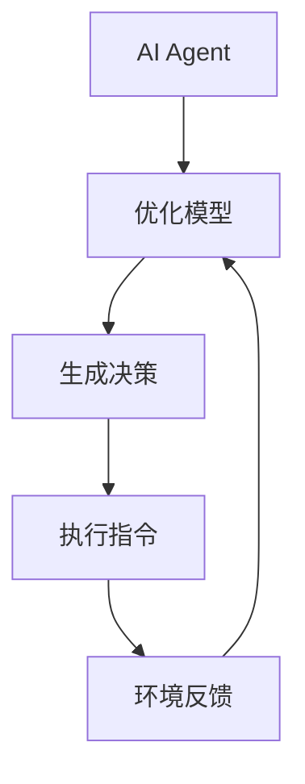
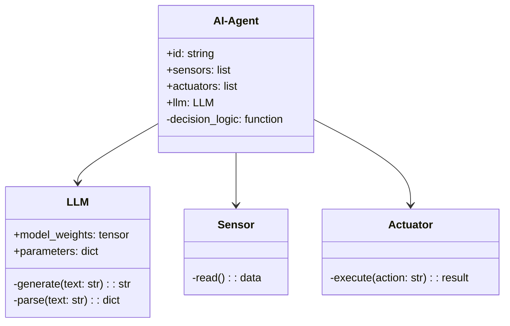
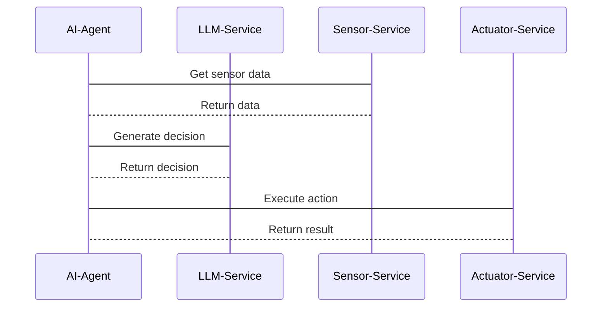

                 


# LLM在AI Agent概念形成与泛化中的作用

---

## 关键词
LLM, AI Agent, 大语言模型, 人工智能, 智能体, 生成式AI, 智能决策

---

## 摘要
本文探讨了大语言模型（LLM）在AI Agent概念形成与泛化中的核心作用。通过分析LLM与AI Agent的关系，详细讲解了LLM在AI Agent中的算法原理、系统架构设计、项目实战及最佳实践。文章结合实际案例，分析了LLM在AI Agent中的应用价值，为读者提供了全面的技术视角。

---

## 第1章: 背景介绍与核心概念

### 1.1 LLM与AI Agent的背景

#### 1.1.1 大语言模型（LLM）的发展历程
- 大语言模型（LLM）的定义：基于Transformer架构的生成式AI模型，能够理解和生成自然语言。
- 发展历程：从BERT到GPT系列，再到当前的先进模型（如GPT-4）。
- 核心特点：大规模预训练、生成能力强大、可泛化应用于多种任务。

#### 1.1.2 AI Agent的基本概念与定义
- AI Agent的定义：智能体是能够感知环境、自主决策并执行任务的实体。
- 核心功能：感知、决策、执行、反馈。
- 应用场景：智能助手、自动驾驶、机器人、智能客服等。

#### 1.1.3 LLM与AI Agent的结合背景
- AI Agent的局限性：传统AI Agent在处理复杂语言任务时能力有限。
- LLM的优势：强大的自然语言理解和生成能力。
- 结合的必然性：通过LLM增强AI Agent的语言理解和决策能力。

### 1.2 问题背景与描述

#### 1.2.1 AI Agent概念形成的核心问题
- AI Agent的自主性与智能性如何结合。
- 如何实现AI Agent的多任务处理能力。
- LLM在AI Agent中的角色定位。

#### 1.2.2 LLM在AI Agent中的作用与挑战
- 作用：提升AI Agent的语言理解和生成能力。
- 挑战：模型泛化能力、实时性、安全性和可解释性。

#### 1.2.3 问题解决的思路与方法
- 利用LLM作为AI Agent的核心模块。
- 设计AI Agent的分层架构，结合LLM进行决策。

### 1.3 核心概念的结构与组成

#### 1.3.1 AI Agent的概念属性
- 感知能力：通过传感器或API获取环境信息。
- 决策能力：基于信息做出最优决策。
- 执行能力：通过动作影响环境。
- 反馈机制：根据结果调整行为。

#### 1.3.2 LLM在AI Agent中的角色
- 作为决策模块的核心工具。
- 提供自然语言理解和生成能力。
- 支持多任务处理。

#### 1.3.3 概念结构与核心要素组成
- 输入：环境信息、任务目标。
- 输出：决策指令、反馈信息。
- 核心模块：感知层、决策层、执行层。

---

## 第2章: 核心概念与联系

### 2.1 LLM与AI Agent的关系

#### 2.1.1 LLM作为AI Agent的核心模块
- LLM作为决策模块：通过生成式模型生成决策指令。
- LLM作为执行模块：通过生成自然语言输出结果。

#### 2.1.2 AI Agent作为LLM的应用载体
- AI Agent为LLM提供场景化应用。
- AI Agent通过环境反馈优化LLM的表现。

#### 2.1.3 两者之间的相互作用
- LLM通过AI Agent获取任务需求。
- AI Agent通过LLM生成理解和决策。

### 2.2 核心概念的属性对比

#### 2.2.1 LLM与AI Agent的功能对比
| 功能维度 | LLM | AI Agent |
|----------|------|----------|
| 核心任务 | 语言生成与理解 | 环境感知、决策、执行 |
| 数据需求 | 大规模文本数据 | 多模态数据 |
| 应用场景 | 文本生成、问答系统 | 自动驾驶、智能助手 |

#### 2.2.2 LLM与AI Agent的场景对比
- LLM适用于文本处理任务。
- AI Agent适用于复杂场景的全栈任务处理。

#### 2.2.3 LLM与AI Agent的数据需求对比
- LLM依赖大规模文本数据。
- AI Agent依赖多模态数据（文本、图像、传感器数据）。

### 2.3 实体关系图与协作机制

#### 2.3.1 LLM与AI Agent的ER实体关系图
```mermaid
er
    entity(LLM) {
        id
        parameters
        model_weights
    }
    entity(AI-Agent) {
        id
        sensors
        actuators
        decision_logic
    }
    relationship(使用) {
        LLM -> AI-Agent
    }
```

#### 2.3.2 LLM与AI Agent的协作流程图


---

## 第3章: 算法原理与数学模型

### 3.1 LLM的算法原理

#### 3.1.1 大语言模型的训练流程
- 预训练阶段：基于大规模数据的自监督学习。
- 微调阶段：针对特定任务的优化。

#### 3.1.2 基于LLM的生成式AI算法
- 基于Transformer的生成模型。
- 采样方法：贪婪采样、随机采样、温度采样。

#### 3.1.3 LLM在AI Agent中的调用流程
- 输入处理：将环境信息转化为输入格式。
- 模型调用：调用LLM API生成输出。
- 输出解析：将生成结果转化为可执行指令。

### 3.2 数学模型与公式

#### 3.2.1 LLM的概率生成模型
- 生成式模型的数学基础：基于概率论。
- 概率生成公式：
  $$ P(y|x) = \frac{1}{Z} \exp(-E(x,y)) $$
  其中，$Z$ 是归一化常数。

#### 3.2.2 基于LLM的条件概率公式
- 条件概率公式：
  $$ P(y|x) = \text{softmax}(Q(x,y)) $$
  其中，$Q(x,y)$ 是模型的输出分数。

#### 3.2.3 LLM的损失函数
- 交叉熵损失函数：
  $$ \mathcal{L} = -\sum_{i=1}^{n} \log P(y_i|x_i) $$

---

## 第4章: 系统分析与架构设计

### 4.1 问题场景介绍

#### 4.1.1 系统介绍
- 系统名称：基于LLM的智能助手。
- 功能目标：通过LLM实现自然语言理解与生成，辅助AI Agent完成任务。

#### 4.1.2 项目介绍
- 项目目标：构建一个结合LLM的AI Agent系统。
- 项目范围：涵盖感知、决策、执行三个层面。

### 4.2 系统功能设计

#### 4.2.1 领域模型（Mermaid类图）


#### 4.2.2 系统架构设计（Mermaid架构图）


#### 4.2.3 系统接口设计
- API接口：RESTful API。
- 接口定义：
  - POST /llm/generate
  - GET /sensors/data
  - POST /actuators/execute

#### 4.2.4 系统交互流程图（Mermaid序列图）


---

## 第5章: 项目实战

### 5.1 环境安装与配置

#### 5.1.1 环境安装
- 安装Python 3.8及以上版本。
- 安装必要的库：`transformers`, `requests`, `json`.

#### 5.1.2 项目核心代码实现
```python
from transformers import pipeline
import requests
import json

# 初始化LLM管道
llm = pipeline('text-generation', model='gpt2')

def generate_decision(prompt):
    return llm(prompt, max_length=50)[0]['generated_text']

def main():
    # 获取传感器数据
    response = requests.get('http://localhost:8000/sensors')
    data = json.loads(response.text)
    
    # 生成决策
    prompt = f"Based on {data}, make a decision."
    decision = generate_decision(prompt)
    
    # 执行动作
    action = decision.split(':')[1].strip()
    response = requests.post('http://localhost:8000/actuators/execute', 
                            json={'action': action})
    print(response.text)

if __name__ == "__main__":
    main()
```

#### 5.1.3 代码解读与应用分析
- 代码功能：从传感器获取数据，通过LLM生成决策，执行动作。
- 实际应用：智能助手、智能家居、智能客服。

### 5.2 项目小结
- 项目实现的目标：结合LLM实现AI Agent的自然语言处理功能。
- 项目成果：展示了LLM在AI Agent中的实际应用价值。

---

## 第6章: 最佳实践与注意事项

### 6.1 最佳实践

#### 6.1.1 核心经验总结
- 数据质量：高质量的训练数据是关键。
- 模型选择：根据任务选择合适的LLM模型。
- 系统架构：分层架构便于扩展和维护。

#### 6.1.2 注意事项
- 数据安全：保护用户数据和模型权重。
- 模型泛化：避免过拟合特定任务。
- 系统性能：优化LLM调用的延迟和资源消耗。

### 6.2 小结
- LLM在AI Agent中的应用前景广阔。
- 通过实践可以进一步优化系统性能和用户体验。

### 6.3 拓展阅读
- 推荐书籍：《Deep Learning》、《Transformer-based Models》。
- 推荐论文：GPT系列论文、BERT系列论文。

---

## 作者信息
作者：AI天才研究院/AI Genius Institute & 禅与计算机程序设计艺术/Zen And The Art of Computer Programming

