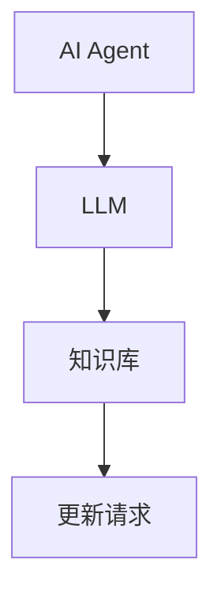
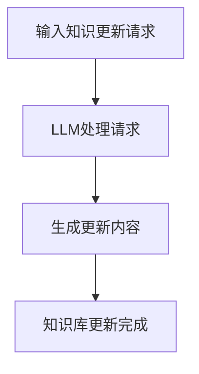
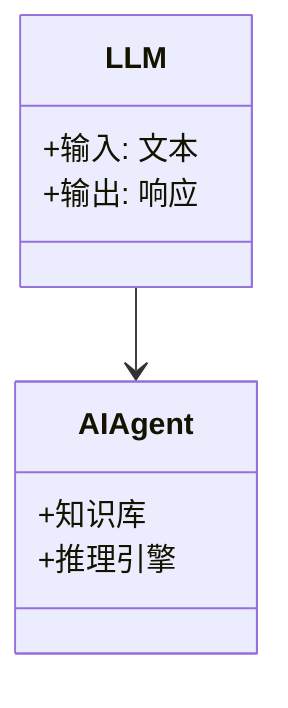
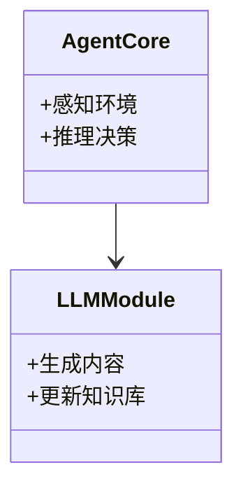
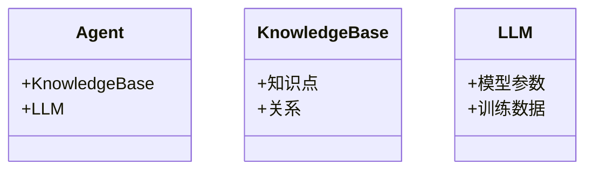
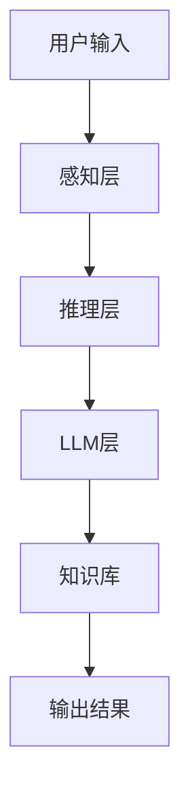

                 


# LLM在AI Agent知识更新中的应用

> 关键词：LLM, AI Agent, 知识更新, 人工智能, 大语言模型

> 摘要：本文探讨了大语言模型（LLM）在AI Agent知识更新中的应用，分析了LLM与AI Agent的关系，详细讲解了知识更新的原理、算法、系统设计及实际应用，结合项目实战和案例分析，总结了最佳实践和未来展望。

---

# 第1章: LLM与AI Agent基础知识

## 1.1 LLM的基本概念

### 1.1.1 大语言模型的定义

大语言模型（Large Language Model, LLM）是指基于深度学习技术训练的大型神经网络模型，能够理解和生成人类语言。LLM的核心在于其庞大的参数量和丰富的训练数据，使其在自然语言处理任务中表现出色。

$$ \text{LLM的模型大小} = \text{参数数量} \times \text{训练数据规模} $$

### 1.1.2 LLM的核心特点

- **大规模训练数据**：LLM通常使用数百万甚至数十亿的文本数据进行训练。
- **深度神经网络**：采用Transformer架构，具有强大的上下文理解和生成能力。
- **多任务通用性**：LLM可以在多种NLP任务（如分类、生成、问答等）上表现出色。

### 1.1.3 LLM与传统NLP模型的区别

| 特性                | LLM                            | 传统NLP模型                  |
|---------------------|--------------------------------|-------------------------------|
| 模型规模            | 大型或超大型参数（ billions） | 小型或中型参数（ millions）   |
| 训练数据            | 极大规模（如互联网数据）       | 较小规模（如特定领域数据）    |
| 任务通用性          | 高度通用（支持多种任务）       | 专用性强（针对特定任务优化）  |

## 1.2 AI Agent的基本概念

### 1.2.1 AI Agent的定义

AI Agent（人工智能代理）是指能够感知环境、执行任务并做出决策的智能实体。AI Agent可以通过传感器获取信息，利用推理能力解决问题，并通过执行器与环境交互。

### 1.2.2 AI Agent的核心功能

- **感知环境**：通过传感器或API获取环境信息。
- **推理决策**：基于知识库和推理算法做出决策。
- **执行操作**：通过执行器完成特定任务。

### 1.2.3 AI Agent的应用场景

- **智能助手**：如Siri、Alexa等。
- **智能客服**：自动处理客户咨询。
- **自动驾驶**：车辆决策和环境感知。

## 1.3 LLM在AI Agent中的作用

### 1.3.1 LLM作为知识库的更新工具

AI Agent需要不断更新知识库以适应新信息。LLM可以通过微调或提示工程技术，快速生成和更新知识库内容。

### 1.3.2 LLM作为AI Agent的交互接口

LLM可以作为AI Agent的自然语言处理接口，理解用户输入并生成自然的回复。

### 1.3.3 LLM在AI Agent决策中的应用

LLM可以为AI Agent提供上下文理解和意图识别能力，辅助决策过程。

## 1.4 本章小结

本章介绍了LLM和AI Agent的基本概念及其在知识更新中的作用，为后续内容奠定了基础。

---

# 第2章: LLM的知识更新原理

## 2.1 知识更新的基本概念

### 2.1.1 知识更新的定义

知识更新是指通过模型再训练或参数调整，使其适应新数据的过程。

### 2.1.2 知识更新的必要性

- **适应新数据**：模型需要不断学习新知识以保持性能。
- **应对变化**：环境或任务的变化需要模型调整。

### 2.1.3 知识更新的边界与外延

知识更新的边界在于模型的更新方式和数据规模，外延包括增量学习、在线学习等技术。

## 2.2 LLM的知识更新机制

### 2.2.1 基于参数微调的知识更新

通过微调模型参数，使模型适应新数据。

### 2.2.2 基于提示工程技术的知识更新

通过设计提示（prompt），引导模型生成所需内容。

### 2.2.3 基于知识图谱的知识更新

将知识表示为图结构，通过图推理更新知识。

## 2.3 知识更新的挑战与解决方案

### 2.3.1 知识更新中的数据稀疏性问题

- **问题**：新数据不足导致更新效果差。
- **解决方案**：使用数据增强技术。

### 2.3.2 知识更新中的模型适应性问题

- **问题**：模型在更新后可能忘记旧知识。
- **解决方案**：采用增量学习方法。

### 2.3.3 知识更新中的性能优化问题

- **问题**：知识更新过程耗时耗资源。
- **解决方案**：优化算法和硬件加速。

## 2.4 本章小结

本章详细讲解了LLM的知识更新机制及其挑战和解决方案。

---

# 第3章: LLM与AI Agent的知识更新方法

## 3.1 知识更新的核心概念与联系

### 3.1.1 知识更新的核心概念

知识更新是模型在新数据上的再训练过程。

### 3.1.2 LLM与AI Agent的知识更新关系

AI Agent依赖LLM进行知识更新，LLM通过知识更新为AI Agent提供支持。

### 3.1.3 知识更新的ER实体关系图



## 3.2 知识更新的算法原理

### 3.2.1 LLM的知识更新算法流程



### 3.2.2 知识更新的数学模型

$$ \text{损失函数} = \text{交叉熵损失} + \text{正则化项} $$
$$ \text{梯度下降} = \text{损失函数对参数求导} $$

## 3.3 知识更新的系统分析与架构设计

### 3.3.1 系统功能设计



---

# 第4章: 系统设计与架构

## 4.1 问题场景介绍

AI Agent需要通过LLM进行知识更新，以应对动态环境的变化。

## 4.2 系统功能设计

### 4.2.1 系统功能模块



### 4.2.2 领域模型设计



## 4.3 系统架构设计

### 4.3.1 系统架构图



---

# 第5章: 项目实战

## 5.1 环境安装

```bash
pip install transformers
pip install torch
pip install mermaid
```

## 5.2 核心实现

### 5.2.1 知识更新实现

```python
import torch
from transformers import AutoTokenizer, AutoModelForCausalLM

model_name = "gpt2"
tokenizer = AutoTokenizer.from_pretrained(model_name)
model = AutoModelForCausalLM.from_pretrained(model_name)

def update_knowledge_base(new_info):
    inputs = tokenizer.encode(new_info, return_tensors="pt")
    outputs = model.generate(inputs, max_length=50)
    return tokenizer.decode(outputs[0], skip_special_tokens=True)
```

### 5.2.2 系统交互实现

```python
def agent_decision(input_text):
    # 调用LLM进行推理
    response = model.generate(input_text)
    return response
```

## 5.3 案例分析

### 5.3.1 更新知识库

```python
# 更新知识库
new_info = "最新的Python版本是3.11"
updated_knowledge = update_knowledge_base(new_info)
print(updated_knowledge)
```

### 5.3.2 系统交互

```python
# 系统交互
input_text = "如何处理这个错误？"
decision = agent_decision(input_text)
print(decision)
```

## 5.4 本章小结

本章通过项目实战展示了LLM在AI Agent知识更新中的具体实现。

---

# 第6章: 实际案例分析

## 6.1 案例背景

某AI Agent需要实时更新知识库以应对用户咨询。

## 6.2 系统设计

- **感知层**：接收用户输入。
- **推理层**：调用LLM进行推理。
- **知识库**：存储和更新知识。

## 6.3 案例分析

### 6.3.1 知识更新过程

1. 用户提出问题：如何修复Python语法错误？
2. AI Agent调用LLM生成答案。
3. 知识库更新：将答案添加到知识库。

## 6.4 本章小结

通过实际案例分析，展示了LLM在AI Agent知识更新中的应用。

---

# 第7章: 总结与展望

## 7.1 本章总结

本文详细探讨了LLM在AI Agent知识更新中的应用，分析了知识更新的原理、算法、系统设计及实际应用。

## 7.2 未来展望

未来，LLM在AI Agent中的应用将更加广泛，知识更新技术也将更加高效和智能。

---

# 作者

作者：AI天才研究院/AI Genius Institute & 禅与计算机程序设计艺术 /Zen And The Art of Computer Programming

