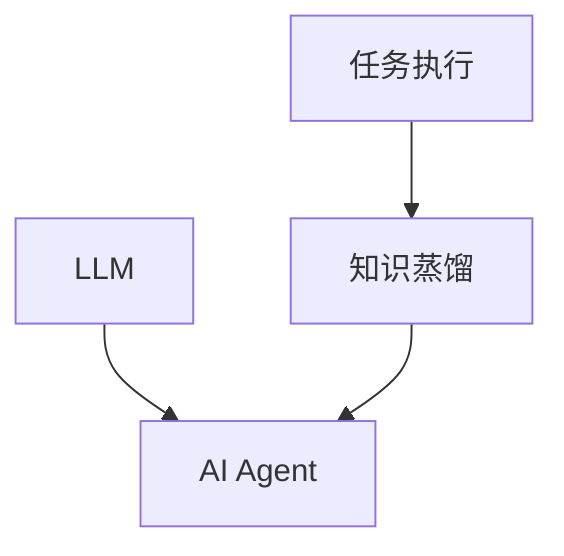
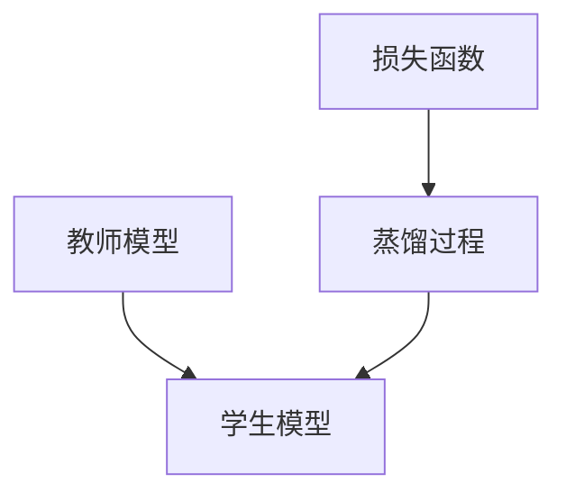
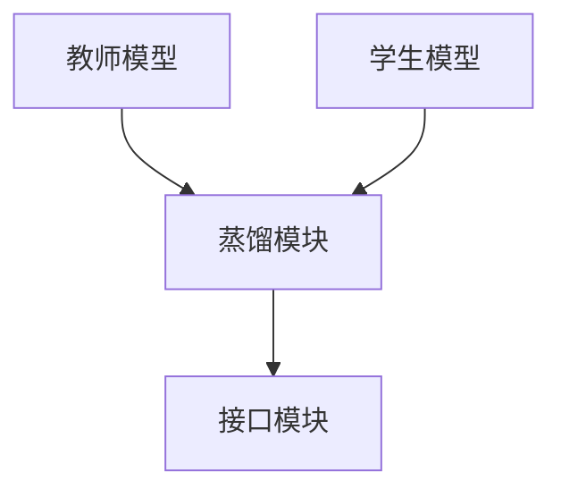

                 


# LLM在AI Agent知识蒸馏中的应用

> **关键词**：LLM, AI Agent, 知识蒸馏, 深度学习, 模型压缩  
> **摘要**：本文详细探讨了大语言模型（LLM）在AI Agent知识蒸馏中的应用，从背景、核心概念、算法原理到系统设计、项目实战及最佳实践，全面解析如何利用LLM提升AI Agent的知识获取与处理能力，降低计算复杂度，同时保持或提升性能。

---

## 第一部分：背景介绍

### 第1章：问题背景

#### 1.1 知识蒸馏的定义与背景
知识蒸馏是一种将复杂模型的知识迁移到简单模型的技术，旨在降低模型的计算复杂度，同时保持或提升性能。传统上，知识蒸馏通过教师模型（Teacher）指导学生模型（Student）学习，教师模型输出的概率分布作为软标签，学生模型通过最小化与教师模型的分布差异进行优化。

#### 1.2 LLM在AI Agent中的作用
大语言模型（LLM）如GPT-3、GPT-4等，具备强大的生成能力和理解能力，能够处理复杂的语言任务。AI Agent作为智能体，需要快速获取、处理和应用知识，LLM为其提供了强大的语言理解与生成能力。

#### 1.3 知识蒸馏的核心目标与意义
知识蒸馏的核心目标是将LLM的知识迁移到更小、更高效的模型中，使其能够在资源受限的环境中运行。这不仅降低了计算成本，还提高了AI Agent的部署灵活性。

---

### 第2章：问题描述

#### 2.1 AI Agent的知识获取与处理挑战
AI Agent需要处理大量异构数据，包括文本、图像、语音等，这导致模型复杂度高，计算资源消耗大。此外，实时性和高效性要求对模型性能提出了更高挑战。

#### 2.2 LLM在知识蒸馏中的问题与局限性
尽管LLM具备强大的知识表示能力，但直接使用LLM作为AI Agent可能面临计算资源不足、推理速度慢等问题。因此，如何高效地将LLM的知识迁移到更小模型中，成为关键问题。

#### 2.3 知识蒸馏的边界与外延
知识蒸馏的边界在于如何平衡模型压缩与性能保持，而外延则涉及多模态知识蒸馏、在线蒸馏等前沿方向。

---

## 第二部分：核心概念与联系

### 第3章：核心概念与联系

#### 3.1 LLM与AI Agent的核心概念
- **LLM**：基于Transformer架构，通过自监督学习掌握语言规律，能够生成连贯的文本。
- **AI Agent**：具备感知、决策和执行能力的智能体，需通过知识蒸馏获取高效处理能力。

#### 3.2 知识蒸馏的基本原理
知识蒸馏通过教师模型生成软标签，学生模型通过最小化标签差异学习教师知识。教师模型输出的概率分布反映了对样本的置信度，学生模型据此调整自己的预测。

#### 3.3 核心概念对比与ER实体关系图
| 对比维度 | LLM | AI Agent |
|----------|-----|----------|
| 功能     | 生成文本 | 执行任务 |
| 输入     | 文本 | 多模态数据 |
| 输出     | 文本 | 行动指令 |



---

## 第三部分：算法原理讲解

### 第4章：算法原理与实现

#### 4.1 知识蒸馏的算法原理
知识蒸馏的关键步骤包括：
1. 教师模型生成软标签。
2. 学生模型通过优化损失函数模仿教师输出。
3. 蒸馏过程结合标注数据进行端到端优化。

#### 4.2 算法实现的mermaid流程图


#### 4.3 算法实现的Python代码示例
```python
import torch
import torch.nn as nn

# 定义教师模型和学生模型
class TeacherModel(nn.Module):
    def __init__(self):
        super().__init__()
        self.fc = nn.Linear(10, 5)

class StudentModel(nn.Module):
    def __init__(self):
        super().__init__()
        self.fc = nn.Linear(10, 5)

# 定义蒸馏损失函数
class DistillationLoss(nn.Module):
    def __init__(self, T=1.0):
        super().__init__()
        self.T = T

    def forward(self, teacher_logits, student_logits, labels):
        # 教师模型输出软标签
        teacher_probs = nn.functional.softmax(teacher_logits / self.T, dim=-1)
        # 学生模型输出概率
        student_probs = nn.functional.softmax(student_logits, dim=-1)
        # 计算KL散度
        loss = torch.sum(torch.log(teacher_probs) * student_probs, dim=-1).mean()
        return loss

# 初始化模型和损失函数
teacher = TeacherModel()
student = StudentModel()
loss_fn = DistillationLoss(T=2.0)

# 模拟训练过程
optimizer = torch.optim.Adam(student.parameters())
for batch in batches:
    optimizer.zero_grad()
    teacher_logits = teacher(batch)
    student_logits = student(batch)
    loss = loss_fn(teacher_logits, student_logits, labels)
    loss.backward()
    optimizer.step()
```

#### 4.4 数学模型与公式
KL散度用于衡量两个概率分布之间的差异：
$$ D_{KL}(P||Q) = \sum_{i} P(i) \log \frac{P(i)}{Q(i)} $$
在蒸馏过程中，学生模型通过优化以下目标函数：
$$ \mathcal{L}_{distill} = D_{KL}(P||Q) $$

---

## 第四部分：系统分析与架构设计

### 第5章：系统分析与架构设计

#### 5.1 系统架构设计
系统由教师模型、学生模型、蒸馏模块和接口模块组成：


#### 5.2 接口设计
- 教师模型接口：提供软标签生成。
- 学生模型接口：接收输入，生成预测。
- 蒸馏模块接口：计算损失，优化模型。

#### 5.3 交互流程
1. 教师模型处理输入，生成软标签。
2. 学生模型处理输入，生成预测。
3. 蒸馏模块计算KL散度，优化学生模型。

---

## 第五部分：项目实战

### 第6章：项目实战

#### 6.1 环境安装
```bash
pip install torch transformers
```

#### 6.2 核心代码实现
```python
import torch
from torch import nn

# 定义教师模型和学生模型
class LlamaTeacher(nn.Module):
    def __init__(self):
        super().__init__()
        self.fc = nn.Linear(10, 5)

class LlamaStudent(nn.Module):
    def __init__(self):
        super().__init__()
        self.fc = nn.Linear(10, 5)

# 定义蒸馏损失函数
class DistillationLoss(nn.Module):
    def __init__(self, T=1.0):
        super().__init__()
        self.T = T

    def forward(self, teacher_logits, student_logits, labels):
        teacher_probs = nn.functional.softmax(teacher_logits / self.T, dim=-1)
        student_probs = nn.functional.softmax(student_logits, dim=-1)
        loss = torch.sum(teacher_probs * torch.log(student_probs), dim=-1).mean()
        return loss

# 初始化模型和损失函数
teacher = LlamaTeacher()
student = LlamaStudent()
loss_fn = DistillationLoss(T=2.0)
optimizer = torch.optim.Adam(student.parameters())

# 模拟训练过程
for batch in batches:
    optimizer.zero_grad()
    teacher_logits = teacher(batch)
    student_logits = student(batch)
    loss = loss_fn(teacher_logits, student_logits, labels)
    loss.backward()
    optimizer.step()
```

#### 6.3 案例分析与详细解读
通过实际案例，展示如何利用蒸馏技术将教师模型的知识迁移到学生模型，分析性能提升和资源消耗的优化。

---

## 第六部分：最佳实践与小结

### 第7章：最佳实践与小结

#### 7.1 最佳实践
- **选择合适的模型**：根据任务需求选择教师和学生模型。
- **调整蒸馏温度**：通过调整温度参数控制知识迁移的粒度。
- **结合标注数据**：将蒸馏与监督学习结合，提升迁移效果。

#### 7.2 小结
本文详细探讨了LLM在AI Agent知识蒸馏中的应用，从理论到实践，全面解析了如何通过蒸馏技术优化AI Agent的知识获取与处理能力。

#### 7.3 注意事项
- 确保数据质量，避免过拟合。
- 选择合适的蒸馏温度，防止信息丢失。
- 定期监控模型性能，优化蒸馏过程。

#### 7.4 拓展阅读
建议读者深入研究知识蒸馏的相关论文，参与开源项目，保持对新技术的关注。

---

**作者：AI天才研究院（AI Genius Institute） & 禅与计算机程序设计艺术（Zen And The Art of Computer Programming）**

