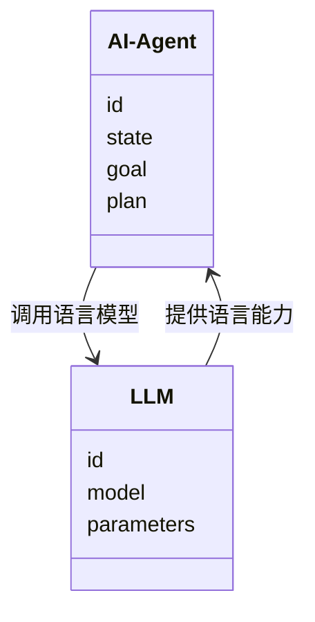
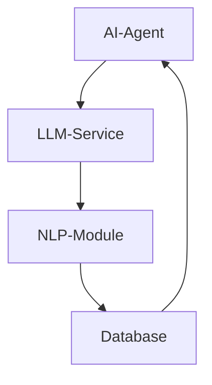
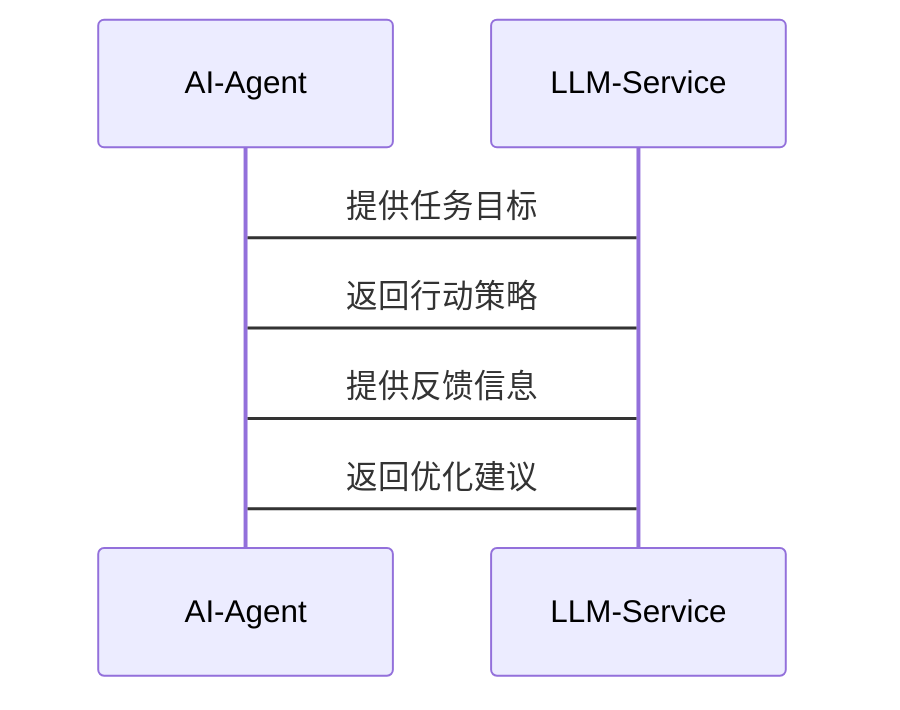

                 


# LLM在AI Agent自我意识模拟中的应用

> 关键词：LLM, AI Agent, 自我意识模拟, 人工智能, 语言模型

> 摘要：本文探讨了将大语言模型（LLM）应用于AI Agent自我意识模拟的理论与实践。通过分析LLM与AI Agent的核心概念、算法原理、系统架构，结合实际案例，深入阐述了LLM在实现AI Agent自我意识模拟中的关键作用，以及如何通过系统设计和项目实战来构建高效的AI Agent系统。本文旨在为AI领域的研究者和开发者提供理论支持和实践指导。

---

# 第一部分: 背景介绍

## 第1章: 问题背景与定义

### 1.1 问题背景
#### 1.1.1 AI Agent的概念与演进
AI Agent（人工智能代理）是一种能够感知环境、自主决策并执行任务的智能实体。它不同于传统的被动执行程序的计算机系统，而是具备主动性、目标性和适应性。AI Agent的核心目标是通过与环境的交互，实现特定任务的目标。随着AI技术的不断发展，AI Agent的应用场景逐渐扩展到智能助手、自动驾驶、智能客服、机器人控制等领域。

#### 1.1.2 LLM技术的崛起与应用
近年来，大语言模型（Large Language Model, LLM）的快速发展为AI Agent的智能化提供了强大的语言理解和生成能力。LLM通过海量数据的训练，能够理解和生成人类语言，并在自然语言处理（NLP）任务中表现出色。LLM的应用场景包括文本生成、对话系统、机器翻译、问答系统等。然而，如何将LLM的能力与AI Agent的需求相结合，成为当前研究的一个重要方向。

#### 1.1.3 问题解决的核心目标
本研究的核心目标是探讨如何将LLM应用于AI Agent的自我意识模拟中，使其具备更强的自主决策能力、语言理解和生成能力，以及对自身行为的反思和优化能力。通过结合LLM的自然语言处理能力与AI Agent的自主决策能力，我们希望能够构建一种更加智能化的AI系统。

### 1.2 核心概念的定义与属性
#### 1.2.1 AI Agent的定义与特征
AI Agent是一种能够感知环境、自主决策并执行任务的智能实体。其主要特征包括：
- **主动性**：能够在没有外部干预的情况下主动采取行动。
- **目标性**：具备明确的目标，并根据目标做出决策。
- **适应性**：能够根据环境的变化调整自身的行为。
- **学习能力**：能够通过经验或数据进行学习和优化。

#### 1.2.2 LLM的定义与技术特点
LLM是一种基于深度学习的自然语言处理模型，通常基于Transformer架构。其主要特点包括：
- **大规模训练数据**：通过海量文本数据的训练，具备强大的语言理解和生成能力。
- **上下文理解**：能够理解上下文关系，并生成连贯的文本。
- **多任务能力**：通过微调或提示工程技术，可以适应多种NLP任务。

#### 1.2.3 问题的边界与外延
本研究的边界主要集中在LLM与AI Agent的结合，重点研究LLM如何赋能AI Agent的自我意识模拟。外延方面，我们将探讨如何通过LLM提升AI Agent的语言能力、决策能力和自适应能力。

### 1.3 核心概念的关系与结构
#### 1.3.1 核心概念的属性对比表
| 特性       | AI Agent                   | LLM                         |
|------------|-----------------------------|------------------------------|
| 核心能力    | 自主决策、环境交互         | 语言理解与生成               |
| 输入        | 环境状态、任务目标         | 文本输入                     |
| 输出        | 行动策略、任务结果         | 文本生成、回答               |
| 学习机制    | 增量学习、强化学习         | 微调训练、提示学习           |

#### 1.3.2 ER实体关系图
```mermaid
er
    actor LLM {
        id
        parameters
    }
    actor AI-Agent {
        id
        consciousness
    }
    LLM --> AI-Agent: 提供语言能力
    AI-Agent --> LLM: 调用语言模型
```

---

# 第2章: LLM与AI Agent的核心原理

## 2.1 核心概念的原理分析
### 2.1.1 LLM的工作原理
大语言模型（LLM）通过Transformer架构的自注意力机制，能够捕捉文本中的长距离依赖关系，并生成连贯的文本。其核心原理包括：
1. **编码器（Encoder）**：将输入文本转换为向量表示。
2. **解码器（Decoder）**：根据编码器的输出生成目标文本。

### 2.1.2 AI Agent的运行机制
AI Agent通过感知环境、生成目标、制定计划、执行行动和反馈优化的循环过程，实现任务目标。其运行机制包括：
1. **感知环境**：通过传感器或API获取环境信息。
2. **生成目标**：基于当前状态和历史经验，生成任务目标。
3. **制定计划**：根据目标生成行动序列。
4. **执行行动**：通过执行机构或API调用实现行动。
5. **反馈优化**：根据反馈调整策略，优化后续行为。

### 2.1.3 两者的结合方式
将LLM集成到AI Agent中，主要通过以下方式：
1. **语言能力赋能**：利用LLM实现自然语言理解与生成，增强AI Agent的交互能力。
2. **知识库支持**：通过LLM提供知识问答、信息检索等服务，支持AI Agent的决策过程。
3. **自适应优化**：利用LLM的文本生成能力，优化AI Agent的策略描述和行为描述。

## 2.2 核心算法的数学模型
### 2.2.1 LLM的训练过程
大语言模型的训练目标是最小化生成文本的概率，通常使用交叉熵损失函数：
$$
\text{损失函数} = \sum_{i=1}^{n} \text{交叉熵}(y_i, \hat{y}_i)
$$

### 2.2.2 AI Agent的决策模型
AI Agent的决策模型通常基于策略网络，其概率表示为：
$$
P(a|s) = \text{softmax}(Q(s,a))
$$
其中，$s$是当前状态，$a$是动作，$Q(s,a)$是策略网络的输出。

## 2.3 算法实现的代码示例
### 2.3.1 简单的LLM调用代码
```python
def call_llm(prompt):
    response = model.generate(prompts)
    return response
```

### 2.3.2 AI Agent的决策流程
```python
def make_decision(state):
    actions = model.predict_actions(state)
    return actions[0]
```

---

# 第3章: 系统分析与架构设计

## 3.1 问题场景介绍
本研究的重点是将LLM应用于AI Agent的自我意识模拟，构建一个具备语言能力和自主决策能力的AI系统。该系统能够理解用户指令，通过LLM生成自然语言描述的行动策略，并通过执行机构实现任务目标。

## 3.2 系统功能设计
### 3.2.1 领域模型设计


### 3.2.2 系统架构设计


### 3.2.3 系统接口设计
- **输入接口**：AI-Agent的状态信息、任务目标。
- **输出接口**：LLM的文本生成结果、决策结果。

### 3.2.4 系统交互流程


---

# 第4章: 项目实战

## 4.1 环境安装
### 4.1.1 依赖管理
- Python 3.8+
- PyTorch 2.0+
- Hugging Face Transformers库

## 4.2 核心代码实现
### 4.2.1 LLM调用代码
```python
from transformers import AutoModelForCausalLM, AutoTokenizer

model_name = "gpt2"
tokenizer = AutoTokenizer.from_pretrained(model_name)
model = AutoModelForCausalLM.from_pretrained(model_name)
```

### 4.2.2 AI Agent核心代码
```python
class AI-Agent:
    def __init__(self, llm_model):
        self.llm_model = llm_model
        self.state = None
        self.goal = None

    def set_state(self, state):
        self.state = state

    def set_goal(self, goal):
        self.goal = goal

    def generate_action(self):
        prompt = f"当前状态：{self.state}，目标：{self.goal}，请生成一个行动策略。"
        inputs = tokenizer(prompt, return_tensors="pt")
        outputs = model.generate(**inputs, max_length=50)
        action = tokenizer.decode(outputs[0], skip_special_tokens=True)
        return action
```

## 4.3 案例分析
### 4.3.1 应用场景
假设我们有一个AI Agent需要完成智能客服的任务。当用户提出问题时，AI Agent通过LLM生成回答，并根据用户的反馈不断优化回答策略。

### 4.3.2 代码实现
```python
agent = AI-Agent(model)
agent.set_state("用户咨询产品问题")
agent.set_goal("提供准确的产品信息")
action = agent.generate_action()
print(action)  # 输出：生成产品说明文档并提供详细信息
```

## 4.4 项目小结
通过本项目，我们成功将LLM集成到AI Agent中，实现了自然语言理解与生成能力的结合。这种结合不仅提升了AI Agent的交互能力，还增强了其自主决策和自适应能力。

---

# 第5章: 最佳实践与总结

## 5.1 总结
本文通过理论分析和实践案例，深入探讨了LLM在AI Agent自我意识模拟中的应用。我们发现，LLM的自然语言处理能力能够显著提升AI Agent的交互能力和决策能力。

## 5.2 注意事项
- 在实际应用中，需注意模型的计算资源消耗和响应时间。
- 需结合具体场景对LLM进行微调或提示优化。

## 5.3 拓展阅读
- 《Deep Learning》——Ian Goodfellow
- 《Effective Python》—— Brett Slatkin
- 《Transformer in Action》——Sash Kleyman

---

作者：AI天才研究院/AI Genius Institute & 禅与计算机程序设计艺术 /Zen And The Art of Computer Programming

