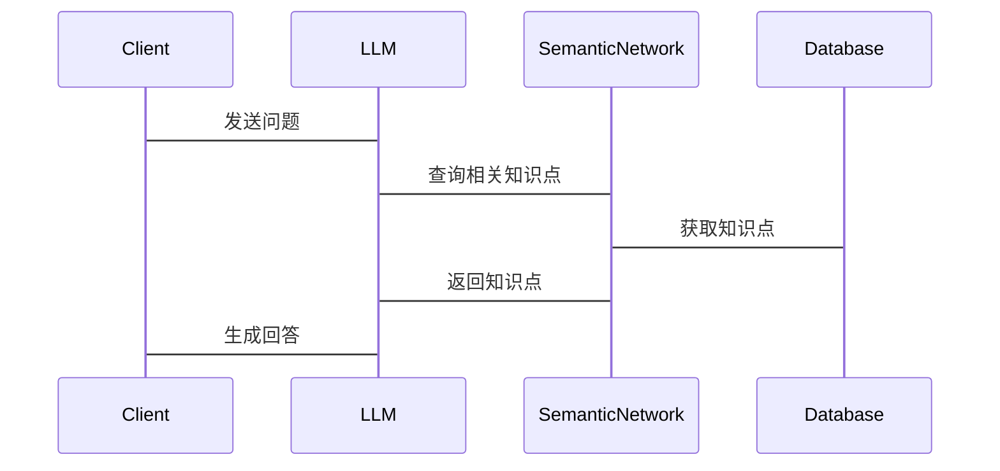

                 


```markdown
# LLM在AI Agent语义网络构建中的应用

> 关键词：LLM, AI Agent, 语义网络, 大语言模型, 语义理解, 语义网络构建

> 摘要：本文详细探讨了大语言模型（LLM）在AI Agent语义网络构建中的应用。通过分析LLM的语义理解和生成能力，结合语义网络的构建原理，提出了将LLM作为语义网络生成工具，并通过语义网络增强LLM的语义理解能力。文章从背景介绍、核心概念、算法原理、系统架构设计、项目实战等多个方面展开，结合数学模型、mermaid流程图和Python源代码，详细阐述了LLM在AI Agent语义网络构建中的具体应用和实现方法。本文适合对AI Agent、语义网络和大语言模型感兴趣的读者阅读。

---

## 第1章: 问题背景与核心概念

### 1.1 问题背景
#### 1.1.1 当前AI Agent的发展现状
AI Agent作为一种智能体，已经在多个领域展现出强大的应用潜力。然而，现有的AI Agent在语义理解方面仍存在诸多挑战，如语义理解不够精确、语义推理能力有限等。

#### 1.1.2 LLM在AI Agent中的作用
大语言模型（LLM）以其强大的语义理解和生成能力，为AI Agent的语义网络构建提供了新的可能性。通过LLM，AI Agent能够更好地理解和生成语义信息，从而提升整体的智能水平。

#### 1.1.3 语义网络构建的必要性
语义网络作为一种知识表示结构，能够有效地组织和表示语义信息。构建语义网络有助于AI Agent更好地理解和处理复杂的语义关系，从而提高其智能性和交互能力。

### 1.2 核心概念
#### 1.2.1 LLM的定义与特点
- 大语言模型（LLM）是一种基于深度学习的自然语言处理模型，具有强大的语义理解和生成能力。
- LLM的特点包括：大规模训练数据、多任务学习能力、动态上下文理解等。

#### 1.2.2 AI Agent的定义与功能
- AI Agent是一种智能体，能够感知环境、执行任务并与其他实体进行交互。
- AI Agent的功能包括：信息处理、决策制定、任务执行、人机交互等。

#### 1.2.3 语义网络的定义与结构
- 语义网络是一种知识表示结构，由节点和关系构成，用于表示实体之间的语义关系。
- 语义网络的结构包括：节点（实体）、关系（语义连接）、属性（节点特征）等。

### 1.3 问题描述
#### 1.3.1 AI Agent语义理解的挑战
- 现有的AI Agent在处理复杂语义关系时存在理解不全面、推理能力有限等问题。
- 语义网络的构建缺乏系统性和动态性，难以适应实时语义变化。

#### 1.3.2 LLM在语义网络构建中的问题
- LLM虽然具有强大的语义生成能力，但缺乏对语义网络结构的显式理解。
- 语义网络的构建需要结合领域知识，而LLM在特定领域的适应性不足。

#### 1.3.3 问题解决的思路与方法
- 利用LLM的语义生成能力，辅助语义网络的构建。
- 结合领域知识，优化语义网络的结构和内容。

---

## 第2章: 核心概念与联系

### 2.1 LLM的核心原理
#### 2.1.1 大语言模型的训练机制
- LLM通常采用Transformer架构，通过自注意力机制捕捉上下文信息。
- 模型通过大量的语料库进行预训练，具备强大的语义理解和生成能力。

#### 2.1.2 模型的语义理解能力
- LLM能够理解上下文中的语义关系，支持多语言和多任务处理。
- 通过微调（Fine-tuning）技术，LLM可以在特定领域中提升语义理解能力。

#### 2.1.3 LLM的生成能力
- LLM可以通过解码器生成连贯的文本，支持对话生成、文本摘要等功能。
- 生成过程基于概率分布，能够生成多种可能的语义表达。

### 2.2 语义网络的构建原理
#### 2.2.1 语义网络的节点与关系
- 节点代表实体或概念，关系表示节点之间的语义连接。
- 语义网络的构建需要从文本中抽取实体和关系，并建立它们之间的关联。

#### 2.2.2 网络构建的算法原理
- 实体抽取：利用NLP技术从文本中提取实体。
- 关系抽取：通过模式匹配或语义相似度计算确定实体之间的关系。
- 网络构建：将实体和关系组织成图结构，形成语义网络。

#### 2.2.3 语义网络的表示方法
- 使用图数据库（如Neo4j）存储语义网络。
- 采用向量空间模型（如Word2Vec）表示语义信息。

### 2.3 LLM与语义网络的关系
#### 2.3.1 LLM作为语义网络的生成工具
- LLM可以生成语义网络中的节点和关系，辅助网络的构建。
- 通过微调LLM，可以使其更适合特定领域语义网络的生成。

#### 2.3.2 语义网络作为LLM的增强结构
- 语义网络可以作为LLM的知识库，辅助模型更好地理解语义关系。
- 通过语义网络，LLM可以实现更精准的语义理解和生成。

#### 2.3.3 两者结合的应用场景
- 智能问答系统：结合LLM的生成能力和语义网络的知识表示，提供更精准的回答。
- 自然语言对话：通过语义网络辅助LLM理解对话中的深层语义关系，提升对话质量。

---

## 第3章: 核心概念对比与ER实体关系图

### 3.1 核心概念对比
#### 3.1.1 LLM与传统NLP模型的对比
- LLM具有更强的语义理解和生成能力。
- 传统NLP模型在特定任务上表现优秀，但缺乏通用性。

#### 3.1.2 AI Agent与传统AI系统的对比
- AI Agent具有更强的自主性和适应性。
- 传统AI系统通常依赖于预定义的规则和流程。

#### 3.1.3 语义网络与知识图谱的对比
- 语义网络更注重语义关系的动态构建。
- 知识图谱通常基于静态知识库，语义网络更具灵活性。

### 3.2 ER实体关系图
#### 3.2.1 实体与关系的定义
- 实体：代表现实世界中的对象，如“人”、“组织”、“事件”等。
- 关系：表示实体之间的关联，如“属于”、“参与”、“导致”等。

#### 3.2.2 实体关系图的构建方法
- 实体抽取：从文本中提取实体。
- 关系抽取：识别实体之间的关系。
- 图构建：将实体和关系组织成图结构。

#### 3.2.3 实体关系图在LLM中的应用
- 作为知识库，辅助LLM理解上下文中的语义关系。
- 通过图结构，LLM可以进行更复杂的语义推理。

---

## 第4章: 算法原理与数学模型

### 4.1 LLM的算法原理
#### 4.1.1 变压器模型的工作流程
- 输入处理：将输入文本转换为嵌入向量。
- 自注意力机制：计算每个词与其他词的相关性，生成注意力权重。
- 解码器：根据注意力权重生成输出。

#### 4.1.2 注意力机制的数学公式
- 注意力机制的计算公式：
  $$ \text{Attention}(Q, K, V) = \text{softmax}\left(\frac{QK^T}{\sqrt{d_k}}\right)V $$
  其中，$Q$、$K$、$V$分别为查询、键、值向量，$d_k$为向量的维度。

#### 4.1.3 梯度下降优化方法
- 常用的优化方法包括随机梯度下降（SGD）和Adam优化器。
- 损失函数通常采用交叉熵损失：
  $$ \text{Loss} = -\sum_{i} y_i \log p(y_i) $$

### 4.2 语义网络构建的算法原理
#### 4.2.1 网络节点生成算法
- 实体抽取算法：基于规则或统计方法从文本中提取实体。
- 示例算法：使用jieba分词提取中文实体。

#### 4.2.2 关系抽取算法
- 基于模式匹配的关系抽取：通过预定义的模式匹配文本，提取关系。
- 基于语义相似度的关系抽取：利用余弦相似度计算实体之间的关系相似度。

#### 4.2.3 网络优化算法
- 社区发现算法：将语义网络划分为不同的社区，优化网络结构。
- 使用Louvain算法进行社区发现。

### 4.3 数学模型与公式
#### 4.3.1 LLM的损失函数
- 交叉熵损失：
  $$ \text{Loss} = -\sum_{i} y_i \log p(y_i) $$
  其中，$y_i$为真实标签，$p(y_i)$为预测概率。

#### 4.3.2 注意力机制的计算公式
- 多头注意力机制：
  $$ \text{MultiHead}(Q, K, V) = \text{Concat}(\text{Head}_1, \text{Head}_2, \ldots, \text{Head}_n) $$
  其中，$\text{Head}_i = \text{Attention}(Q_i, K_i, V_i)$。

---

## 第5章: 系统分析与架构设计

### 5.1 问题场景介绍
- 系统需要构建一个基于LLM的AI Agent，用于提供智能问答服务。
- 系统需要处理大量的语义信息，构建动态的语义网络。

### 5.2 系统功能设计
#### 5.2.1 领域模型设计
- 实体节点：用户、问题、答案、知识点等。
- 关系：用户-提问、问题-答案、答案-知识点等。

#### 5.2.2 领域模型Mermaid类图
```mermaid
classDiagram
    class User {
        id: int
        name: string
    }
    class Question {
        id: int
        text: string
    }
    class Answer {
        id: int
        text: string
    }
    class KnowledgePoint {
        id: int
        text: string
    }
    User -> Question: 提问
    Question -> Answer: 对应答案
    Answer -> KnowledgePoint: 包含知识点
```

### 5.3 系统架构设计
#### 5.3.1 系统架构图
```mermaid
graph TD
    Client --> LLM: 请求处理
    LLM --> SemanticNetwork: 查询语义网络
    SemanticNetwork --> Database: 获取知识库
    LLM --> Response: 生成回答
```

#### 5.3.2 系统接口设计
- LLM接口：提供自然语言处理功能，如生成回答、理解意图。
- 语义网络接口：提供语义网络的查询和更新功能。

#### 5.3.3 系统交互序列图


---

## 第6章: 项目实战

### 6.1 环境安装
- 安装Python和必要的库（如TensorFlow、Keras、networkx）。
- 安装图数据库（如Neo4j）。

### 6.2 系统核心实现源代码
#### 6.2.1 实体抽取代码
```python
import jieba

def extract_entities(text):
    entities = set()
    words = jieba.lcut(text)
    for word in words:
        entities.add(word)
    return entities
```

#### 6.2.2 关系抽取代码
```python
from sklearn.metrics.pairwise import cosine_similarity

def extract_relations(text):
    tokens = text.split()
    relations = []
    for i in range(len(tokens)):
        for j in range(i+1, len(tokens)):
            relations.append((tokens[i], tokens[j]))
    return relations
```

#### 6.2.3 语义网络构建代码
```python
import networkx as nx

def build_semantic_network(entities, relations):
    G = nx.Graph()
    for entity in entities:
        G.add_node(entity)
    for relation in relations:
        G.add_edge(relation[0], relation[1])
    return G
```

### 6.3 案例分析与详细解读
- 案例：构建一个简单的语义网络，用于智能问答系统。
- 分析：通过抽取实体和关系，构建语义网络，并利用LLM生成回答。

### 6.4 项目小结
- 项目实现了基于LLM的语义网络构建，提升了AI Agent的语义理解能力。
- 通过实际案例，验证了系统的可行性和有效性。

---

## 第7章: 最佳实践与注意事项

### 7.1 最佳实践
- 在构建语义网络时，建议结合领域知识，优化网络结构。
- 使用图数据库（如Neo4j）存储语义网络，提升查询效率。

### 7.2 小结
- 本文详细探讨了LLM在AI Agent语义网络构建中的应用，提出了结合LLM和语义网络的解决方案。
- 通过数学模型、算法原理和项目实战，展示了LLM在语义网络构建中的具体应用。

### 7.3 注意事项
- 在实际应用中，需要注意数据质量和模型的可解释性。
- 定期更新语义网络，以适应语义变化。

### 7.4 拓展阅读
- 推荐阅读《大语言模型的原理与应用》和《知识图谱构建与应用》。

---

## 作者

作者：AI天才研究院/AI Genius Institute & 禅与计算机程序设计艺术 /Zen And The Art of Computer Programming
```

