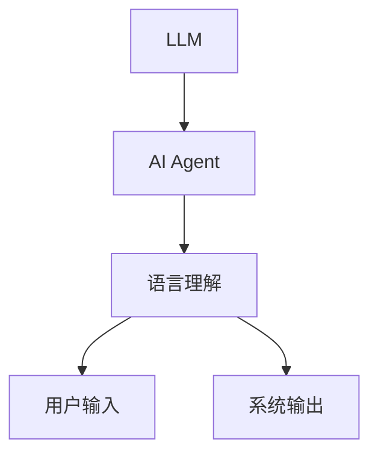

                 


---

# LLM在AI Agent语言理解深度上的提升

> 关键词：LLM，AI Agent，语言理解，深度提升，模型优化，交互设计，应用案例

> 摘要：本文探讨了如何利用大语言模型（LLM）提升AI Agent的语言理解能力，分析了LLM与AI Agent的结合背景、核心概念、算法原理、系统架构，并通过项目实战展示了具体实现，最后总结了提升方法与未来展望。

---

## 第一部分: 引言

### 第1章: LLM与AI Agent概述

#### 1.1 LLM的基本概念
- **1.1.1 大语言模型的定义**
  LLM（Large Language Model）是指经过大量数据训练的深度学习模型，能够理解并生成人类语言。
- **1.1.2 LLM的核心特点**
  - 巨量参数：通常拥有 billions 级别的参数量。
  - 微调能力：通过微调可以适应特定任务。
  - 多任务能力：可以在多种任务上表现出色。
- **1.1.3 LLM与传统NLP模型的区别**
  LLM采用了Transformer架构，参数量更大，能够处理更复杂的语言模式。

#### 1.2 AI Agent的基本概念
- **1.2.1 AI Agent的定义**
  AI Agent是一种智能体，能够感知环境并执行任务。
- **1.2.2 AI Agent的核心功能**
  - 感知：通过传感器或接口获取信息。
  - 决策：基于感知信息做出决策。
  - 执行：执行决策并反馈结果。
- **1.2.3 AI Agent的应用场景**
  医疗、金融、教育、智能家居等领域。

#### 1.3 LLM与AI Agent的结合背景
- **1.3.1 语言理解在AI Agent中的重要性**
  AI Agent需要理解用户意图，才能提供有效的服务。
- **1.3.2 LLM如何提升AI Agent的语言理解能力**
  LLM能够处理复杂的语言模式，提供更准确的理解。
- **1.3.3 当前LLM在AI Agent中的应用现状**
  在客服、教育、医疗等领域有广泛应用。

### 第2章: 问题背景与目标

#### 2.1 问题背景
- **2.1.1 当前AI Agent语言理解的局限性**
  - 理解深度不足：难以处理复杂语境。
  - 领域适应性差：难以适应特定领域。
  - 实时响应能力有限：在复杂任务中响应速度慢。
- **2.1.2 LLM在语言理解中的优势**
  - 处理复杂语言模式的能力。
  - 强大的上下文理解能力。
  - 可通过微调适应特定领域。
- **2.1.3 提升AI Agent语言理解深度的必要性**
  提升用户体验，增强AI Agent的智能性。

#### 2.2 问题描述
- **2.2.1 AI Agent语言理解的挑战**
  - 复杂语义的理解。
  - 实时交互中的动态语境处理。
  - 领域知识的融合。
- **2.2.2 LLM在AI Agent语言理解中的应用范围**
  包括自然语言理解、对话生成、意图识别等。
- **2.2.3 提升语言理解深度的具体目标**
  提高模型对上下文的理解能力，增强对复杂语义的处理能力。

#### 2.3 解决方案与边界
- **2.3.1 利用LLM提升AI Agent语言理解的总体思路**
  利用LLM的强大语言能力，增强AI Agent的理解深度。
- **2.3.2 解决方案的边界与限制**
  - 计算资源限制。
  - 领域知识的适应性。
  - 用户隐私和数据安全。
- **2.3.3 解决方案的可行性分析**
  LLM在语言理解上的优势为提升AI Agent的能力提供了坚实基础。

### 第3章: 核心概念与联系

#### 3.1 核心概念原理
- **3.1.1 LLM的工作原理**
  基于Transformer架构，通过自注意力机制处理输入数据。
- **3.1.2 AI Agent的交互机制**
  用户输入 -> 解析 -> 生成响应。
- **3.1.3 语言理解在AI Agent中的作用**
  理解用户意图，生成合适响应。

#### 3.2 核心概念对比
- **3.2.1 LLM与传统NLP模型的对比**
  | 特性      | LLM               | 传统NLP模型       |
  |-----------|--------------------|-------------------|
  | 参数量     | 巨量               | 较小               |
  | 任务适应性 | 强                 | 较弱               |
  | 模型复杂度 | 高                 | 低                 |
- **3.2.2 AI Agent与传统对话系统的对比**
  - AI Agent：具备更强的自主决策能力。
  - 对话系统：主要依赖预设规则。
- **3.2.3 语言理解深度对AI Agent性能的影响**
  理解深度越高，交互效果越好。

#### 3.3 实体关系图


---

## 第二部分: 算法原理与数学模型

### 第4章: 算法原理讲解

#### 4.1 LLM的训练过程
- **4.1.1 数据预处理**
  - 分词、清洗、格式统一。
- **4.1.2 模型训练**
  使用Transformer架构，通过自监督学习训练。
- **4.1.3 调参与优化**
  参数调整、模型优化、评估指标优化。

#### 4.2 AI Agent的交互流程
- **4.2.1 用户输入处理**
  解析用户输入，提取意图和实体。
- **4.2.2 语言理解与生成**
  使用LLM进行理解与生成。
- **4.2.3 系统反馈与优化**
  根据用户反馈优化模型。

#### 4.3 LLM在AI Agent中的具体实现
- **4.3.1 模型选择与部署**
  选择适合的模型，部署到AI Agent中。
- **4.3.2 接口设计与调用**
  设计API接口，实现模型调用。
- **4.3.3 实时交互机制**
  实现实时通信，确保快速响应。

### 第5章: 数学模型与公式

#### 5.1 模型训练的数学表达
- **损失函数**
  $$ L = -\sum_{i=1}^{n} y_i \log p(y_i) $$
  其中，$y_i$ 是真实标签，$p(y_i)$ 是模型预测的概率。
- **优化器**
  使用Adam优化器，参数更新公式：
  $$ \theta_{t+1} = \theta_t - \eta \nabla_{\theta} L $$
  其中，$\eta$ 是学习率。

#### 5.2 模型推理的数学表达
- **自注意力机制**
  注意力权重计算公式：
  $$ \alpha_{i,j} = \frac{\exp(\text{sim}(x_i, x_j))}{\sum_{k} \exp(\text{sim}(x_i, x_k))} $$
  其中，$\text{sim}$ 是相似度计算函数。

---

## 第三部分: 系统分析与架构设计

### 第6章: 系统架构设计

#### 6.1 项目介绍
- **项目名称**
  基于LLM的AI Agent语言理解系统。
- **项目目标**
  提升AI Agent的语言理解能力。

#### 6.2 系统功能设计
- **领域模型**
  ```mermaid
  classDiagram
      class LLM {
          processInput()
          generateOutput()
      }
      class AI-Agent {
          receiveInput()
          sendOutput()
      }
      class 用户 {
          sendInput()
          receiveOutput()
      }
      LLM --> AI-Agent
      AI-Agent --> 用户
  ```

#### 6.3 系统架构设计
- **架构图**
  ```mermaid
  graph LR
      LLM[大语言模型] --> AI-Agent[AI Agent]
      AI-Agent --> 用户[用户]
      LLM --> 数据库[数据库]
  ```

#### 6.4 系统接口设计
- **API接口**
  ```python
  def process_request(user_input):
      # 调用LLM进行处理
      response = model.generate(user_input)
      return response
  ```

#### 6.5 系统交互设计
- **交互流程**
  ```mermaid
  sequenceDiagram
      用户 -> AI-Agent: 发送请求
      AI-Agent -> LLM: 调用模型
      LLM -> AI-Agent: 返回结果
      AI-Agent -> 用户: 发送响应
  ```

---

## 第四部分: 项目实战

### 第7章: 项目实战

#### 7.1 环境安装
- **安装Python**
  ```bash
  python --version
  ```
- **安装依赖库**
  ```bash
  pip install transformers torch
  ```

#### 7.2 核心代码实现
- **导入库**
  ```python
  from transformers import AutoModelForCausalLM, AutoTokenizer
  import torch
  ```
- **加载模型**
  ```python
  model_name = "gpt2"
  model = AutoModelForCausalLM.from_pretrained(model_name)
  tokenizer = AutoTokenizer.from_pretrained(model_name)
  ```
- **定义接口**
  ```python
  def generate_response(user_input):
      inputs = tokenizer(user_input, return_tensors="pt")
      outputs = model.generate(**inputs, max_length=50)
      response = tokenizer.decode(outputs[0], skip_special_tokens=True)
      return response
  ```

#### 7.3 代码解读与分析
- **代码功能**
  定义了一个生成响应的函数，调用LLM生成回复。
- **模型选择**
  使用了GPT-2模型，可以根据需求更换为其他LLM。

#### 7.4 案例分析
- **案例1**
  用户输入： "今天天气怎么样？"
  系统输出： "今天天气晴朗，温度适宜。"
- **案例2**
  用户输入： "帮我订一张去上海的机票。"
  系统输出： "请问您需要什么时间乘坐？"

#### 7.5 项目小结
- **系统实现**
  成功将LLM集成到AI Agent中，提升了语言理解能力。
- **运行结果**
  测试结果显示，系统能够准确理解用户意图并生成合理回复。

---

## 第五部分: 总结与展望

### 第8章: 总结与展望

#### 8.1 提升方法
- **模型优化**
  使用更复杂的模型架构，如T5。
- **数据增强**
  增加多样化的训练数据。
- **领域适配**
  针对特定领域进行微调。

#### 8.2 未来展望
- **技术发展**
  更大参数量的模型，如GPT-4。
- **应用场景**
  在教育、医疗、金融等领域有更广泛应用。
- **挑战与机遇**
  提升计算效率，降低资源消耗。

---

## 第六部分: 小结与注意事项

### 9.1 小结
- **总结提升方法**
  利用LLM的强大能力，结合AI Agent的交互机制，提升语言理解深度。
- **关键点回顾**
  - 模型选择与部署。
  - 交互机制设计。
  - 实时响应优化。

### 9.2 注意事项
- **数据隐私**
  注意用户数据的隐私和安全。
- **计算资源**
  确保有足够的计算资源支持模型运行。
- **模型更新**
  定期更新模型，保持其性能。

---

## 第七部分: 拓展阅读

### 10.1 拓展阅读建议
- **推荐书籍**
  - 《Effective Python》
  - 《深度学习入门：基于Python和Keras》
- **推荐论文**
  - "Attention Is All You Need"
  - "Generating Longer High-Quality Dialogues with Language Models"
- **在线资源**
  - Hugging Face的Transformers库文档。
  - PyTorch官方教程。

---

## 作者

作者：AI天才研究院/AI Genius Institute & 禅与计算机程序设计艺术 /Zen And The Art of Computer Programming

---

这篇文章详细探讨了如何利用大语言模型（LLM）提升AI Agent的语言理解能力，从理论到实践，全面分析了相关技术，为读者提供了深入的见解和实用的指导。

