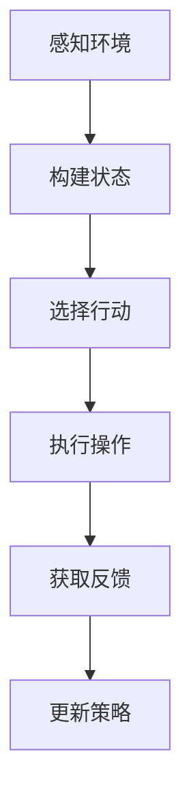
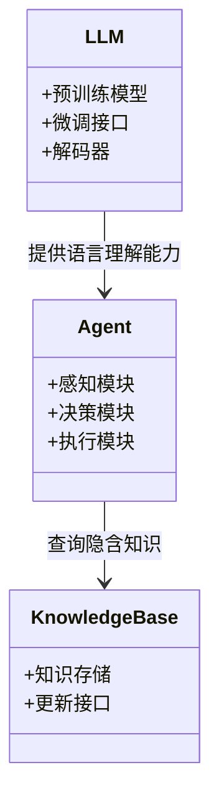

                 


```markdown
# LLM在AI Agent隐含知识提取中的应用

> 关键词：LLM, AI Agent, 隐含知识提取, 大语言模型, 人工智能, 知识表示

> 摘要：本文深入探讨了大语言模型（LLM）在AI Agent隐含知识提取中的应用，分析了LLM与AI Agent的核心原理、算法流程、系统架构，并通过实战案例展示了如何利用LLM进行隐含知识的提取与应用。文章还讨论了优化策略、系统设计中的关键问题及解决方案，为AI Agent的实践提供了有价值的参考。

---

## 第一部分: LLM与AI Agent的基础概念

### 第1章: LLM的基本概念

#### 1.1 大语言模型的定义
大语言模型（Large Language Model, LLM）是指经过大量数据预训练的深度学习模型，具备处理自然语言文本的能力。这些模型通常基于Transformer架构，能够理解上下文并生成连贯的文本。

#### 1.2 LLM的核心特点
- **大规模数据训练**：LLM通常使用海量文本数据进行预训练，能够捕捉语言的统计规律。
- **上下文理解能力强**：通过Transformer的自注意力机制，LLM能够理解文本的上下文关系。
- **多任务学习能力**：LLM可以在多种任务（如翻译、问答、文本摘要）上进行微调，适应不同的应用场景。

#### 1.3 LLM与传统NLP模型的区别
传统NLP模型（如基于规则的模型或浅层学习模型）依赖于人工规则或小规模数据，而LLM通过深度学习和大规模数据训练，具有更强的泛化能力和理解能力。

### 第2章: AI Agent的基本概念

#### 2.1 AI Agent的定义
AI Agent（人工智能代理）是指能够感知环境、执行任务并做出决策的智能实体。它可以是一个软件程序，也可以是嵌入在物理设备中的智能系统。

#### 2.2 AI Agent的核心功能
- **感知环境**：通过传感器或数据输入接口获取环境信息。
- **决策与推理**：基于获取的信息，通过内部模型或算法做出决策。
- **执行操作**：根据决策结果执行具体的操作，如发送请求、调整参数等。

#### 2.3 AI Agent的应用场景
- **智能助手**：如Siri、Alexa等，能够执行语音指令。
- **自动驾驶**：通过感知环境信息，做出驾驶决策。
- **智能客服**：通过自然语言处理技术，为用户提供服务。

### 第3章: 隐含知识提取的背景与挑战

#### 3.1 隐含知识的概念
隐含知识是指隐藏在文本中的深层信息，需要通过分析和推理才能提取。例如，从一段新闻中提取事件的背景信息或人物关系。

#### 3.2 隐含知识提取的重要性
- **提高信息利用率**：通过提取隐含知识，可以更高效地利用文本数据。
- **增强AI Agent的智能性**：使AI Agent能够理解更复杂的信息，从而做出更智能的决策。
- **支持复杂任务**：在医疗、法律等领域，隐含知识的提取可以帮助AI Agent做出更准确的判断。

#### 3.3 隐含知识提取的难点
- **语义理解**：隐含知识往往依赖于上下文，理解语义是关键。
- **知识表示**：如何将隐含知识有效地表示出来，以便后续使用。
- **动态更新**：隐含知识可能随时间变化，需要实时更新。

---

## 第二部分: LLM在AI Agent中的应用原理

### 第4章: LLM与AI Agent的核心原理

#### 4.1 LLM的训练与推理过程
- **预训练**：使用大规模文本数据进行无监督学习，目标是让模型预测下一个词。
- **微调**：在特定任务上进行有监督学习，调整模型参数以适应任务需求。
- **解码**：根据输入生成输出，通常使用贪心算法或采样方法。

#### 4.2 AI Agent的决策机制
- **状态感知**：通过传感器或API获取当前状态信息。
- **行动选择**：基于当前状态和知识库，选择最优行动。
- **结果反馈**：执行行动后，获取反馈信息，并根据反馈调整策略。

#### 4.3 LLM在AI Agent中的知识提取流程
- **输入处理**：将原始文本输入LLM，进行分词、编码等预处理。
- **知识抽取**：LLM通过自注意力机制，提取文本中的隐含信息。
- **知识整合**：将提取的信息整合到知识库中，供后续使用。

### 第5章: 核心概念对比与ER关系图

#### 5.1 LLM与AI Agent的核心概念对比
| 概念 | LLM | AI Agent |
|------|------|----------|
| 功能 | 文本生成、理解 | 感知、决策、执行 |
| 输入 | 文本数据 | 状态信息 |
| 输出 | 文本、摘要 | 行动、结果 |

#### 5.2 ER实体关系图
```mermaid
er
actor: User
agent: AI Agent
llm: Large Language Model
knowledge_base: Knowledge Base

actor --> agent: 发出指令
agent --> llm: 请求解释
llm --> knowledge_base: 更新知识
agent --> actor: 返回结果
```

---

## 第三部分: LLM与AI Agent的算法实现

### 第6章: LLM的算法原理

#### 6.1 Transformer模型
- **编码器**：将输入序列编码为向量表示。
- **解码器**：根据编码结果生成输出序列。
- **自注意力机制**：计算词与词之间的相关性，生成位置编码。

#### 6.2 注意力机制公式
$$\text{Attention}(Q, K, V) = \text{softmax}\left(\frac{QK^T}{\sqrt{d_k}}\right)V$$
其中，$Q$是查询向量，$K$是键向量，$V$是值向量，$d_k$是向量维度。

### 第7章: AI Agent的算法流程

#### 7.1 决策树算法


#### 7.2 深度强化学习
- **状态空间**：环境中的所有可能状态。
- **动作空间**：AI Agent可以执行的所有动作。
- **奖励函数**：定义每种动作的奖励值，指导学习方向。

---

## 第四部分: 系统设计与实现

### 第8章: 系统架构设计

#### 8.1 系统功能模块


#### 8.2 系统架构图


---

## 第五部分: 项目实战与优化

### 第9章: 项目实战

#### 9.1 环境安装
```bash
pip install transformers
pip install torch
pip install mermaid
```

#### 9.2 核心代码实现
```python
from transformers import AutoTokenizer, AutoModelForMaskedLM
import torch

model_name = "bert-base-uncased"
tokenizer = AutoTokenizer.from_pretrained(model_name)
model = AutoModelForMaskedLM.from_pretrained(model_name)

def extract_concepts(text):
    inputs = tokenizer(text, return_tensors="pt")
    outputs = model(**inputs)
    # 处理输出以提取隐含知识
    return extracted_concepts
```

#### 9.3 案例分析
- **案例背景**：从新闻文本中提取事件的主要参与者。
- **代码实现**：使用LLM对文本进行分词、编码、解码，提取关键实体。
- **结果分析**：展示提取的实体及其关系。

### 第10章: 优化与扩展

#### 10.1 模型优化策略
- **模型调优**：在特定任务上进行微调，提升性能。
- **参数优化**：调整学习率、批量大小等超参数，优化训练效果。

#### 10.2 系统扩展
- **多模态支持**：结合图像、语音等多模态数据，提升AI Agent的感知能力。
- **分布式部署**：将系统部署到云平台，提升处理能力。

---

## 第六部分: 总结与展望

### 第11章: 总结

#### 11.1 核心总结
- LLM通过大规模预训练，具备强大的语言理解能力。
- AI Agent通过感知环境、决策和执行，能够完成复杂的任务。
- 隐含知识的提取是连接LLM与AI Agent的关键环节，需要结合多种技术手段。

### 第12章: 未来展望

#### 12.1 技术发展趋势
- **更强大的模型**：如GPT-4、PaLM等，具备更强的理解和生成能力。
- **多模态融合**：结合视觉、听觉等多模态信息，提升AI Agent的感知能力。
- **实时更新**：实现隐含知识的动态更新，适应快速变化的环境。

#### 12.2 应用场景扩展
- **医疗领域**：辅助医生诊断，提取病历中的隐含信息。
- **金融领域**：分析市场动态，提取潜在的投资机会。
- **教育领域**：为学生提供个性化的学习建议。

---

## 作者信息

作者：AI天才研究院/AI Genius Institute & 禅与计算机程序设计艺术 /Zen And The Art of Computer Programming
```

