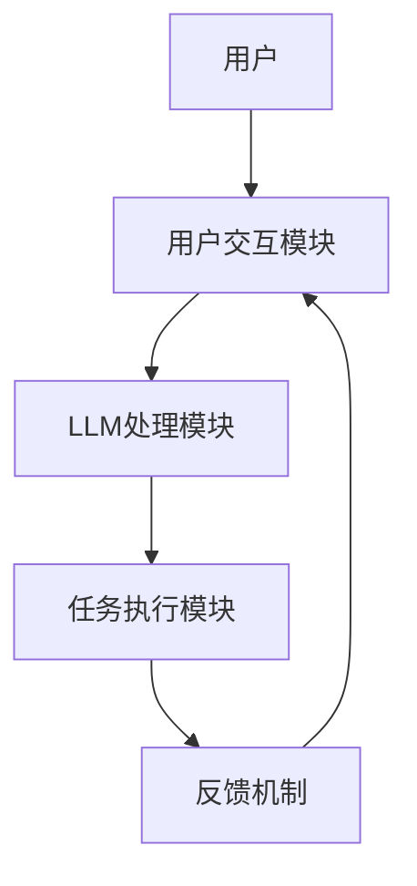
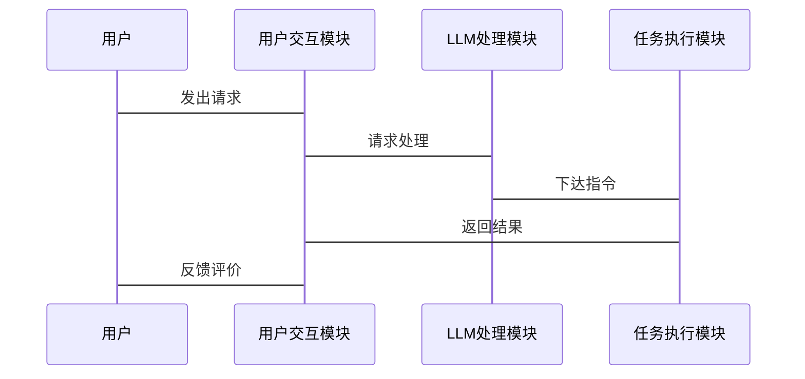

                 


# LLM大模型在AI Agent开发中的核心作用

> 关键词：LLM, AI Agent, 大型语言模型, 自然语言处理, 智能系统, 机器学习

> 摘要：本文深入探讨了大型语言模型（LLM）在AI Agent开发中的核心作用。通过分析LLM的定义、优势及其与AI Agent的关系，结合算法原理、系统架构设计和实际案例，详细阐述了LLM如何赋能AI Agent的自然语言处理能力和自主决策能力。文章还提供了项目实战指导和最佳实践建议，帮助读者全面理解和应用LLM在AI Agent开发中的潜力。

---

## 第一部分: LLM大模型的定义与背景

### 第1章: LLM大模型的定义与特点

#### 1.1 LLM的定义
大型语言模型（LLM）是指基于深度学习技术构建的、具有大规模参数的自然语言处理模型，能够理解和生成人类语言。其核心是通过预训练技术，从海量文本数据中学习语言的规律和上下文关系。

#### 1.2 LLM的核心特点
- **大规模参数**：通常包含数亿甚至数百亿的参数，如GPT-3、GPT-4等。
- **预训练与微调**：通过预训练掌握语言通用知识，再通过微调适应特定任务。
- **生成能力**：能够生成连贯、自然的文本，支持多种语言和领域。
- **上下文理解**：能够理解多轮对话中的上下文关系，提供更智能的交互体验。

#### 1.3 LLM与传统NLP模型的区别
| 特性 | 传统NLP模型 | LLM |
|------|--------------|------|
| 参数规模 | 小（百万级别） | 大（亿级别及以上） |
| 训练方式 | 通常需要特定数据 | 预训练+微调 |
| 任务支持 | 有限，专注于单一任务 | 支持多种任务，如问答、翻译、摘要 |

### 第2章: LLM大模型的发展与演进

#### 2.1 NLP模型的演进历程
- **规则驱动阶段**：依赖人工编写规则，处理能力有限。
- **统计学习阶段**：基于概率模型，如朴素贝叶斯、SVM。
- **深度学习阶段**：引入神经网络，如RNN、LSTM。
- **大模型阶段**：出现Transformer架构，模型参数规模急剧增加。

#### 2.2 大模型时代的到来
- **技术突破**：Transformer架构的提出和优化。
- **计算能力提升**：云计算和GPU的普及使得训练大模型成为可能。
- **应用广泛**：从学术研究走向实际应用，如搜索引擎、智能客服、内容生成等。

#### 2.3 LLM在AI Agent中的作用
- **核心驱动力**：LLM提供了强大的自然语言处理能力，是AI Agent实现智能交互的基础。
- **任务执行**：通过LLM解析用户需求，生成执行步骤，完成复杂任务。
- **决策支持**：利用LLM进行信息检索、知识推理，辅助AI Agent做出决策。

---

## 第二部分: AI Agent的核心概念与系统架构

### 第3章: AI Agent的定义与核心概念

#### 3.1 AI Agent的基本定义
AI Agent是一种能够感知环境、自主决策并执行任务的智能系统。它能够通过传感器获取信息，通过效应器与环境交互，实现特定目标。

#### 3.2 AI Agent的分类
| 类型 | 描述 | 示例 |
|------|------|------|
| 软件代理 | 运行在计算机系统中，帮助用户完成任务 | 智能助手（Siri、Alexa） |
| 服务代理 | 提供特定服务，如物流调度、客服支持 | 电商推荐系统 |
| 物理代理 | 具备物理实体，能够执行物理操作 | 工业机器人 |

#### 3.3 LLM在AI Agent中的核心作用
- **自然语言处理**：通过LLM实现与用户的自然对话。
- **知识表示与推理**：利用LLM进行信息检索和知识推理。
- **决策制定**：基于LLM生成的上下文理解，制定执行计划。

### 第4章: LLM大模型的算法原理

#### 4.1 LLM的训练过程
1. **数据预处理**：清洗数据，去除噪声，构建训练语料库。
2. **模型结构**：采用Transformer架构，包括编码器和解码器。
3. **预训练**：使用自监督学习，目标是预测下一个词或填补缺失词。
4. **微调**：在特定任务上进行微调，优化模型性能。

#### 4.2 Transformer模型的数学公式
- **位置编码**：将位置信息嵌入到词向量中。
  $$ \text{Positional Encoding} = \sum_{i=0}^{n-1} w_i \cdot \sin(2i \cdot \pi \cdot \frac{j}{d}) $$
- **注意力机制**：计算每个词对其他词的注意力权重。
  $$ \text{Attention}(Q, K, V) = \text{softmax}\left(\frac{QK^T}{\sqrt{d}}\right)V $$

#### 4.3 LLM的生成机制
- **贪心搜索**：逐词生成，选择概率最高的词。
- **随机采样**：根据概率分布随机采样生成文本。
- **beam search**：生成多个候选答案，选择最优解。

### 第5章: AI Agent的系统架构设计

#### 5.1 系统功能设计
- **用户交互模块**：处理用户的输入，解析需求。
- **LLM处理模块**：调用LLM模型生成响应。
- **任务执行模块**：根据生成的指令执行具体任务。
- **反馈机制**：收集用户反馈，优化系统性能。

#### 5.2 系统架构图


#### 5.3 系统交互流程图


---

## 第三部分: 项目实战与最佳实践

### 第6章: 项目实战

#### 6.1 环境配置
- **安装必要的库**：
  ```bash
  pip install transformers torch
  ```

#### 6.2 核心代码实现
```python
from transformers import GPT2LMHeadModel, GPT2Tokenizer

# 初始化模型和分词器
model = GPT2LMHeadModel.from_pretrained('gpt2')
tokenizer = GPT2Tokenizer.from_pretrained('gpt2')

# 生成文本
def generate_text(prompt, max_length=50):
    inputs = tokenizer.encode(prompt, return_tensors='pt')
    outputs = model.generate(inputs, max_length=max_length, do_sample=True)
    return tokenizer.decode(outputs[0], skip_special_tokens=True)
```

#### 6.3 案例分析
- **案例背景**：开发一个智能问答机器人。
- **代码解读**：上述代码展示了如何使用GPT-2模型生成文本，可以根据需求替换为其他LLM模型。
- **优缺点分析**：生成结果的质量依赖于模型和微调，同时需要处理计算资源消耗问题。

### 第7章: 最佳实践与小结

#### 7.1 最佳实践
- **选择合适的LLM模型**：根据任务需求选择模型的大小和类型。
- **优化系统性能**：通过并行计算和优化代码提高运行效率。
- **处理边缘情况**：确保系统在异常情况下也能稳定运行。

#### 7.2 小结
本文详细探讨了LLM在AI Agent开发中的核心作用，从理论到实践，全面分析了如何利用LLM提升AI Agent的智能水平。通过实际案例和代码实现，读者可以更好地理解并应用这些知识。

---

## 参考文献
1. 王强, 李明. 《深度学习入门》. 人民邮电出版社, 2020.
2. Vaswani, A., et al. "Attention Is All You Need." arXiv preprint arXiv:1706.03798, 2017.
3. Radford, A., et al. "Language models are few-shot learners." arXiv preprint arXiv:1909.00232, 2019.

---

## 作者信息
作者：AI天才研究院/AI Genius Institute  
联系方式：contact@aicourse.com  
个人简介：专注于人工智能与编程艺术的研究，致力于推动AI技术的创新与应用。

