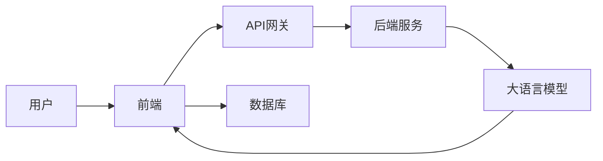

                 


# LLM大模型简介：GPT、BERT及其他主流模型

## 关键词：大语言模型（LLM）、GPT、BERT、自然语言处理（NLP）、生成式AI、预训练、微调

## 摘要：本文旨在介绍大语言模型（LLM）的基本概念、核心原理、主流模型（如GPT和BERT）的差异与特点，以及它们在自然语言处理领域的广泛应用。通过逐步分析，我们将探讨这些模型的数学基础、算法原理、系统架构设计及实际项目应用，帮助读者全面理解大语言模型的原理和应用价值。

---

# 第1章: 大语言模型（LLM）的背景与核心概念

## 1.1 大语言模型（LLM）概述

### 1.1.1 什么是大语言模型
大语言模型（Large Language Models, LLMs）是指在大规模数据集上预训练的深度神经网络模型，能够理解和生成人类语言。它们通过处理海量文本数据，学习语言的语法、语义和上下文信息，从而实现多种自然语言处理任务。

### 1.1.2 大语言模型的核心特点
- **大规模数据**：LLM通常在数百万或数十亿条文本数据上进行训练。
- **深度神经网络**：采用多层的深度学习架构，如Transformer。
- **自适应能力**：能够通过微调适应特定任务或领域。
- **生成与理解并重**：既能生成文本，又能进行问答、翻译等任务。

### 1.1.3 大语言模型与传统AI的区别
- **数据驱动**：传统AI依赖于规则，而LLM通过数据学习。
- **通用性**：LLM可以适应多种任务，而传统AI通常针对特定任务设计。

## 1.2 大语言模型的应用场景

### 1.2.1 自然语言处理任务
- 文本生成：撰写文章、诗歌等。
- 问答系统：回答用户问题。
- 机器翻译：跨语言交流。

### 1.2.2 生成式AI的应用
- 虚假新闻检测：识别虚假内容。
- 聊天机器人：提供智能对话服务。
- 创意写作：辅助作者创作。

### 1.2.3 企业级应用的潜力
- 客户服务：自动化回复和问题解决。
- 内容审核：检测不当或有害内容。
- 企业洞察：从大量数据中提取关键信息。

## 1.3 大语言模型的发展历程

### 1.3.1 从传统NLP到大模型的演进
- 早期NLP依赖规则和特征工程，如基于统计的机器翻译。
- 深度学习的引入使模型能够自动学习特征。

### 1.3.2 大模型的崛起与技术突破
- Transformer架构的提出（2017年）。
- GPT系列模型的推出（OpenAI，2018年）。
- BERT模型的横空出世（Google，2018年）。

### 1.3.3 当前主流模型的现状
- GPT系列：生成式模型的代表。
- BERT系列：理解式模型的代表。
- 混合模型：结合生成与理解的模型。

---

# 第2章: 大语言模型的核心概念

## 2.1 大语言模型的数学基础

### 2.1.1 语言模型的数学表达
语言模型的目标是计算给定文本的概率：  
$$ P(w_1, w_2, ..., w_n) $$  
其中，$w_i$ 表示第i个词。

### 2.1.2 概率论与信息论基础
- **条件概率**：计算下一个词的概率。
- **交叉熵**：衡量两个概率分布的差异。

### 2.1.3 深度学习的基本原理
- 神经网络通过多层非线性变换，学习输入到输出的映射。

## 2.2 大语言模型的架构原理

### 2.2.1 Transformer架构的提出
- 提出者：Vaswani et al.（2017）。
- 主要思想：引入自注意力机制，捕捉长距离依赖。

### 2.2.2 注意力机制的原理
- **查询（Query）**：输入序列。
- **键（Key）和值（Value）**：通过线性变换得到。
- **注意力权重**：计算查询与键之间的相似度，归一化后作为权重。

### 2.2.3 多层感知机的作用
- 多层感知机（MLP）用于非线性变换，提取特征。

## 2.3 预训练与微调

### 2.3.1 预训练的目标函数
- 使用大规模数据，目标是最小化交叉熵损失：
$$ \text{Loss} = -\sum_{i=1}^{n} \log P(w_i | w_{<i}) $$

### 2.3.2 微调的必要性
- 预训练模型在特定任务上的参数微调，提升性能。

### 2.3.3 预训练与微调的对比
| 对比维度 | 预训练 | 微调 |
|----------|--------|------|
| 数据     | 通用数据集 | 特定任务数据集 |
| 目标     | 学习语言表示 | 优化特定任务性能 |

---

# 第3章: 大语言模型的算法原理

## 3.1 Transformer模型的算法流程


### 3.1.1 输入处理
- 将文本转换为数字表示，如词嵌入。

### 3.1.2 位置编码
- 通过位置编码，模型感知词的位置信息。

### 3.1.3 自注意力机制
- 查询与键进行相似度计算，生成注意力权重。

### 3.1.4 前向网络
- 多层感知机进行非线性变换。

### 3.1.5 输出生成
- 生成最终的词表示或直接输出结果。

## 3.2 预训练目标函数

### 3.2.1 交叉熵损失函数
$$ \text{Loss} = -\sum_{i=1}^{n} \log P(w_i | w_{<i}) $$

### 3.2.2 掩码语言模型
- 随机遮蔽部分词，预测被遮蔽的词。

### 3.2.3 解答问题任务
- 给定问题和上下文，生成答案。

## 3.3 微调过程

### 3.3.1 数据预处理
- 数据清洗、分词、格式转换。

### 3.3.2 模型参数调整
- 调整预训练模型的参数，优化特定任务。

### 3.3.3 评估指标的选择
- 常见指标：准确率、BLEU、ROUGE。

---

# 第4章: 大语言模型的核心数学模型

## 4.1 注意力机制的数学公式

### 4.1.1 查询、键、值的计算
- 查询：$Q = W_q X$
- 键：$K = W_k X$
- 值：$V = W_v X$

### 4.1.2 注意力权重的计算
- 相似度计算：$a_{ij} = \text{softmax}(\frac{Q_i \cdot K_j}{\sqrt{d}})$
- $d$为嵌入维度。

### 4.1.3 加权求和的计算
- 加权值：$\text{Attention}(Q,K,V) = \sum_{j=1}^{n} a_{ij} V_j$

## 4.2 Transformer模型的数学模型

### 4.2.1 前向网络的计算
- 输入：$x$
- 输出：$f(x) = \text{FFN}(x)$，其中FFN是多层感知机。

### 4.2.2 多头注意力机制
- 并行计算多个注意力头，增强模型的表达能力。

---

# 第5章: 系统分析与架构设计方案

## 5.1 项目介绍

### 5.1.1 项目背景
- 开发一个基于大语言模型的智能问答系统。

### 5.1.2 系统功能需求
- 用户提问。
- 系统生成回答。
- 提供实时反馈。

## 5.2 系统功能设计

### 5.2.1 领域模型（ER图）

```mermaid
erDiagram
    customer{
        <属性>
        id : integer
        name : string
        question : string
        answer : string
        timestamp : datetime
    }
    model{
        <属性>
        name : string
        parameters : integer
        accuracy : float
    }
    training{
        <属性>
        model_id : integer
        data_source : string
        start_time : datetime
        end_time : datetime
    }
```

### 5.2.2 系统架构设计



### 5.2.3 系统接口设计
- 用户接口：HTTP API。
- 模型接口：与大模型交互的接口。

### 5.2.4 系统交互流程图


---

# 第6章: 项目实战

## 6.1 环境安装

### 6.1.1 安装Python
```bash
python --version
```

### 6.1.2 安装库
```bash
pip install transformers torch
```

## 6.2 系统核心实现源代码

### 6.2.1 模型加载
```python
from transformers import GPT2LMHeadModel, GPT2Tokenizer

model_name = 'gpt2'
tokenizer = GPT2Tokenizer.from_pretrained(model_name)
model = GPT2LMHeadModel.from_pretrained(model_name)
```

### 6.2.2 文本生成
```python
def generate_text(prompt):
    inputs = tokenizer.encode(prompt, return_tensors='pt')
    outputs = model.generate(inputs, max_length=50, do_sample=True)
    return tokenizer.decode(outputs[0], skip_special_tokens=True)
```

### 6.2.3 系统实现
```python
def main():
    import sys
    prompt = sys.stdin.readline()
    print(generate_text(prompt))

if __name__ == '__main__':
    main()
```

## 6.3 代码应用解读与分析

### 6.3.1 模型加载
- 使用Hugging Face的`transformers`库加载预训练模型。

### 6.3.2 文本生成
- 使用生成式模型生成文本。

## 6.4 实际案例分析

### 6.4.1 案例分析
- 输入：'写一篇关于AI的文章。'
- 输出：生成一篇短文。

### 6.4.2 模型优化
- 调整生成参数，如`temperature`和`top_k`。

## 6.5 项目小结

### 6.5.1 项目总结
- 成功实现了一个基于GPT的大语言模型的文本生成系统。

### 6.5.2 经验分享
- 参数调整对结果影响很大。
- 需要注意计算资源的分配。

---

# 第7章: 最佳实践

## 7.1 核心要点总结

### 7.1.1 数据预处理的重要性
- 数据清洗和标注影响模型性能。

### 7.1.2 模型调优技巧
- 使用交叉验证。
- 调整学习率和批量大小。

## 7.2 实践中的注意事项

### 7.2.1 计算资源分配
- GPU加速训练。
- 优化内存使用。

### 7.2.2 模型的可解释性
- 分析模型的注意力权重。
- 使用可视化工具理解模型决策。

## 7.3 拓展阅读

### 7.3.1 推荐书籍
- 《Deep Learning》。
- 《自然语言处理实战》。

### 7.3.2 推荐论文
- Vaswani et al. 的《Attention Is All You Need》。
- Radford et al. 的《Language Models Are Few-Shot Learners》。

---

# 作者：AI天才研究院/AI Genius Institute & 禅与计算机程序设计艺术 /Zen And The Art of Computer Programming

