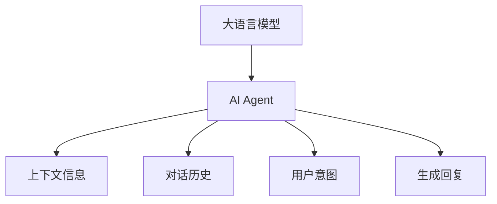
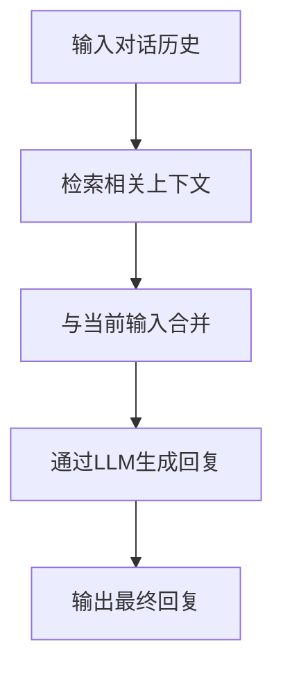
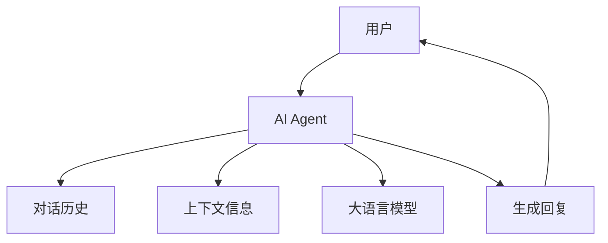

                 


```markdown
# LLM支持的AI Agent上下文感知对话生成

> 关键词：LLM, AI Agent, 上下文感知, 对话生成, 大语言模型, 对话系统, 人工智能

> 摘要：本文深入探讨了基于大语言模型（LLM）的AI Agent上下文感知对话生成技术，从背景、核心概念、算法原理到系统架构、项目实战和最佳实践进行了全面分析，帮助读者系统掌握该领域的关键技术与应用。

---

## 第一部分: LLM支持的AI Agent上下文感知对话生成背景介绍

### 第1章: 问题背景与定义

#### 1.1 问题背景
当前的对话生成技术在处理上下文信息时面临诸多挑战。传统的基于规则的对话生成方法难以应对复杂多变的对话场景，容易产生不连贯或不相关的内容。而随着大语言模型（LLM）的崛起，我们可以通过其强大的上下文理解和生成能力，显著提升对话的自然度和相关性。LLM支持的AI Agent能够实时捕捉和利用对话历史、用户意图、情感倾向等信息，从而实现更加智能和个性化的对话生成。

#### 1.2 问题定义
LLM支持的AI Agent是指通过大语言模型提供语义理解和生成能力的智能体，能够通过上下文感知技术实现动态对话生成。上下文感知对话生成是指在对话过程中，AI Agent能够根据当前对话的历史记录、用户状态以及其他相关信息，动态调整生成的回复内容，以更好地满足用户需求。

#### 1.3 问题解决方法
目前，主流的基于LLM的对话生成方法包括：
1. **基于检索的增强生成**：通过检索历史对话记录或外部知识库，生成更相关的内容。
2. **对话状态跟踪**：通过维护对话状态，动态调整生成策略。
3. **基于上下文的注意力机制**：在生成回复时，重点关注对话历史中的关键信息。

### 第2章: 核心概念与联系

#### 2.1 核心概念原理
上下文感知对话生成的核心在于模型如何利用上下文信息。LLM通过自注意力机制（Self-Attention）能够自动捕捉对话历史中的关键信息，并将其融入回复生成过程中。这种机制使得模型能够在生成回复时，自然地结合上下文信息，提升对话的连贯性和相关性。

#### 2.2 核心概念对比分析
以下表格对比了基于规则的对话生成方法和基于LLM的对话生成方法的特点：

| 对比维度 | 基于规则的方法 | 基于LLM的方法 |
|----------|----------------|---------------|
| 处理能力 | 静态规则，缺乏灵活性 | 动态上下文感知，高度灵活 |
| 模型复杂度 | 低 | 高 |
| 对话自然度 | 一般，可能生硬 | 更加自然流畅 |
| 适应性 | 固定场景，难以扩展 | 多场景适应性强 |

#### 2.3 实体关系图


---

## 第二部分: LLM支持的AI Agent上下文感知对话生成的核心算法

### 第3章: 算法原理讲解

#### 3.1 基于LLM的检索增强生成模型
以下是一个典型的基于LLM的检索增强生成模型的工作流程图：



#### 3.2 算法实现代码
以下是基于LLM的对话生成模型的Python代码示例：

```python
import transformers

# 初始化模型和tokenizer
model = transformers.GPT2LMHeadModel.from_pretrained('gpt2')
tokenizer = transformers.GPT2Tokenizer.from_pretrained('gpt2')

# 对话历史输入
context = "今天天气很好，你呢？"
inputs = tokenizer.encode(context, return_tensors='pt')

# 生成回复
outputs = model.generate(inputs, max_length=50, num_beams=5, temperature=0.7)
response = tokenizer.decode(outputs[0], skip_special_tokens=True)
print(response)
```

#### 3.3 数学模型推导
模型的损失函数可以表示为：

$$
\text{Loss} = -\sum_{i=1}^{n} \log P(x_i | x_{<i})
$$

其中，$x_i$ 表示生成的第 $i$ 个词，$P(x_i | x_{<i})$ 是模型在给定前 $i-1$ 个词的条件下生成第 $i$ 个词的概率。

---

## 第三部分: 系统分析与架构设计方案

### 第4章: 系统架构设计

#### 4.1 应用场景介绍
我们以智能客服系统为例，设计一个基于LLM的AI Agent对话生成系统。该系统需要支持多轮对话，能够根据用户的问题历史和上下文信息生成合适的回复。

#### 4.2 系统功能设计
以下是系统的主要功能模块：

1. **对话管理模块**：负责维护对话状态和历史记录。
2. **上下文理解模块**：分析对话历史，提取关键信息。
3. **生成模块**：基于LLM生成回复内容。

#### 4.3 系统架构设计


---

## 第四部分: 项目实战

### 第5章: 项目实战

#### 5.1 环境安装
安装必要的Python库：

```bash
pip install transformers
```

#### 5.2 核心代码实现
以下是对话生成模块的实现代码：

```python
import transformers

class DialogGenerator:
    def __init__(self):
        self.model = transformers.GPT2LMHeadModel.from_pretrained('gpt2')
        self.tokenizer = transformers.GPT2Tokenizer.from_pretrained('gpt2')
    
    def generate_response(self, context):
        inputs = self.tokenizer.encode(context, return_tensors='pt')
        outputs = self.model.generate(inputs, max_length=50, num_beams=5, temperature=0.7)
        response = self.tokenizer.decode(outputs[0], skip_special_tokens=True)
        return response

# 使用示例
generator = DialogGenerator()
response = generator.generate_response("今天天气很好，你呢？")
print(response)
```

#### 5.3 案例分析
通过上述代码，我们可以实现一个简单的对话生成系统。用户输入对话历史，系统根据上下文生成回复。例如：

- 输入：用户说“今天天气很好，你呢？”
- 系统回复：“谢谢，我也很好！有什么我可以帮你的吗？”

---

## 第五部分: 最佳实践与总结

### 第6章: 最佳实践

#### 6.1 实践建议
1. **上下文窗口优化**：根据具体场景调整上下文窗口的大小，避免信息过载。
2. **对话状态管理**：定期清理无用的对话历史，优化系统性能。
3. **模型调优**：根据实际需求调整模型的参数，如温度（temperature）和采样个数（num_beams）。

#### 6.2 注意事项
- 避免过度依赖LLM，结合规则和模型生成更优结果。
- 注意模型的计算成本，合理优化资源使用。

#### 6.3 拓展阅读
推荐阅读以下资料，深入学习相关技术：
- [Transformers: Pre-trained Models in PyTorch](https://huggingface.co/transformers/)
- [对话生成的前沿研究](https://arxiv.org/abs/2005.13567)

---

## 第六部分: 结语

通过本文的详细讲解，我们系统地介绍了基于LLM的AI Agent上下文感知对话生成技术。从背景到实现，从理论到实践，读者可以全面掌握该领域的关键技术与应用。未来，随着LLM技术的不断发展，AI Agent的对话生成能力将更加智能化和个性化。

---

## 作者：AI天才研究院/AI Genius Institute & 禅与计算机程序设计艺术 /Zen And The Art of Computer Programming
```

