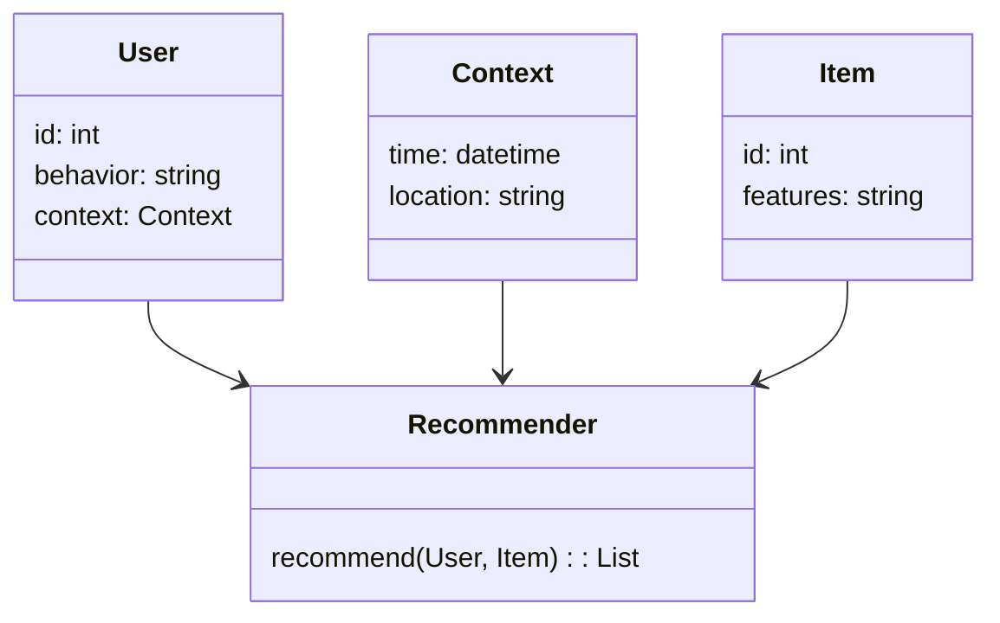
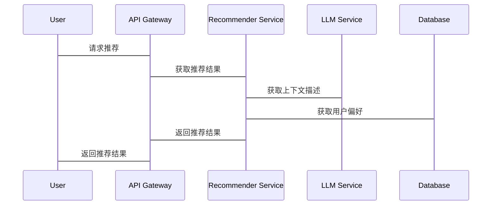

                 


# LLM支持的AI Agent上下文感知推荐技术

> 关键词：LLM, AI Agent, 上下文感知推荐, 推荐系统, 人工智能, 大语言模型

> 摘要：本文详细探讨了LLM支持的AI Agent如何通过上下文感知推荐技术来提升推荐系统的智能化和个性化。文章从背景介绍、核心概念、算法原理、系统架构、项目实战到总结，全面分析了该技术的实现细节和应用潜力。

---

## 第一章: 上下文感知推荐技术的背景与问题

### 1.1 问题背景

#### 1.1.1 当前推荐系统的发展现状
推荐系统作为人工智能领域的核心应用之一，广泛应用于电子商务、社交媒体、视频平台等领域。传统推荐系统主要基于协同过滤、基于内容的推荐或混合推荐方法。然而，这些方法在处理动态变化的用户需求和复杂场景时显得力不从心。

#### 1.1.2 上下文感知推荐技术的提出背景
随着用户需求的多样化和场景的复杂化，传统的推荐系统难以满足实时性和个性化的要求。上下文感知推荐技术通过结合用户行为、时间、位置等多种上下文信息，提供更加精准和个性化的推荐。

#### 1.1.3 LLM在推荐系统中的应用潜力
大语言模型（LLM）凭借其强大的自然语言处理能力和知识表示能力，为推荐系统带来了新的可能性。通过LLM，AI Agent能够更好地理解和分析上下文信息，从而提升推荐的准确性和相关性。

### 1.2 问题描述

#### 1.2.1 推荐系统的核心问题
推荐系统的核心问题是如何在海量数据中找到最符合用户需求的内容，并实时动态地更新推荐结果。

#### 1.2.2 上下文感知推荐的定义
上下文感知推荐是指在推荐过程中，结合用户的实时上下文信息（如用户行为、位置、时间等），动态调整推荐策略，以提供更加个性化的推荐结果。

#### 1.2.3 当前推荐系统的主要挑战
- 数据稀疏性：用户数据不足时，推荐系统难以准确捕捉用户偏好。
- 动态变化：用户需求和场景可能会快速变化，推荐系统需要实时适应。
- 多模态数据处理：如何有效地整合文本、图像、视频等多种数据类型。

### 1.3 问题解决

#### 1.3.1 上下文感知推荐的核心思路
通过整合用户的实时上下文信息，利用LLM的强大语言理解能力，动态生成上下文相关的特征表示，进而优化推荐结果。

#### 1.3.2 LLM在上下文感知中的作用
LLM能够理解上下文信息中的自然语言描述，提取关键特征，并生成与上下文相关的推荐理由。

#### 1.3.3 技术实现的总体框架
- 数据采集：获取用户行为、位置、时间等上下文信息。
- 上下文分析：利用LLM对上下文信息进行解析和理解。
- 特征提取：生成与推荐目标相关的特征表示。
- 推荐生成：结合传统推荐算法生成最终的推荐结果。

### 1.4 边界与外延

#### 1.4.1 上下文感知推荐的边界
- 仅关注与推荐目标直接相关的上下文信息，如用户行为、位置等。
- 不考虑与推荐目标无关的信息，如用户隐私数据。

#### 1.4.2 推荐系统的相关概念
- 协同过滤：基于用户相似性进行推荐。
- 基于内容的推荐：基于物品本身的特征进行推荐。
- 混合推荐：结合多种推荐方法。

#### 1.4.3 技术的适用范围与限制
- 适用于需要动态调整推荐策略的场景。
- 限制在于对实时上下文信息的处理能力依赖于LLM的性能。

---

## 第二章: 上下文感知推荐技术的核心概念

### 2.1 LLM与AI Agent的结合

#### 2.1.1 LLM的基本原理
- 基于深度学习的自然语言处理模型，如GPT、BERT等。
- 通过大量数据训练，具备语义理解和生成能力。

#### 2.1.2 AI Agent的工作机制
- AI Agent通过感知环境信息，执行任务并提供反馈。
- 利用LLM进行自然语言处理和上下文理解。

#### 2.1.3 LLM支持的AI Agent的特点
- 具备强大的自然语言理解能力。
- 能够动态调整推荐策略。

### 2.2 上下文感知的核心原理

#### 2.2.1 上下文的定义与分类
- 用户行为：点击、收藏、购买等。
- 时间：用户操作的时间点。
- 场景：用户所在的地理位置、设备类型等。

#### 2.2.2 上下文感知的实现方式
- 基于规则的上下文分析。
- 基于机器学习的上下文建模。

#### 2.2.3 上下文与推荐的关系
上下文信息影响推荐结果的多样性和相关性。

### 2.3 推荐系统的核心要素

#### 2.3.1 推荐系统的组成
- 用户模型：表示用户偏好。
- 物品模型：表示推荐物品的特征。
- 推荐算法：生成推荐结果。

#### 2.3.2 推荐算法的分类
- 协同过滤：基于用户相似性。
- 基于内容的推荐：基于物品特征。
- 混合推荐：结合多种方法。

#### 2.3.3 推荐系统的性能指标
- 准确性：推荐结果与用户兴趣的匹配程度。
- 多样性：推荐结果的多样性。
- 可解释性：推荐结果的可解释程度。

### 2.4 核心概念的对比分析

#### 2.4.1 核心概念组成
- 用户上下文：用户行为、时间、位置。
- 物品特征：物品本身的属性。
- 推荐算法：协同过滤、内容推荐等。

#### 2.4.2 概念之间的关系
- 用户上下文与推荐结果之间的关系。
- 推荐算法与物品特征的结合。

#### 2.4.3 系统架构的核心要素
- 数据采集模块：获取用户行为、位置等信息。
- 上下文分析模块：解析上下文信息。
- 推荐生成模块：结合上下文信息生成推荐结果。

---

## 第三章: 上下文感知推荐技术的算法原理

### 3.1 算法原理概述

#### 3.1.1 上下文感知推荐的算法框架
- 数据预处理：提取用户行为、位置等信息。
- 上下文表示：生成上下文向量。
- 推荐生成：基于上下文向量生成推荐结果。

#### 3.1.2 算法实现步骤
1. 数据采集：获取用户行为、位置等信息。
2. 上下文分析：利用LLM对上下文信息进行解析。
3. 上下文表示：将上下文信息转化为特征向量。
4. 推荐生成：结合特征向量生成推荐结果。

### 3.2 算法实现细节

#### 3.2.1 上下文表示的实现
- 使用LLM生成上下文描述文本。
- 将文本转换为向量表示，如使用BERT模型生成向量。

#### 3.2.2 推荐生成的实现
- 结合上下文向量和用户偏好向量，利用协同过滤算法生成推荐结果。

#### 3.2.3 算法优化
- 使用注意力机制，增强对重要上下文信息的关注。
- 通过在线学习，实时更新推荐模型。

### 3.3 算法的数学模型

#### 3.3.1 上下文向量的表示
$$ c = f_{LLM}(u, t, s) $$
其中，$c$ 是上下文向量，$u$ 是用户信息，$t$ 是时间信息，$s$ 是位置信息，$f_{LLM}$ 是大语言模型的处理函数。

#### 3.3.2 推荐结果的生成
$$ r = \arg\max_{i} (w_i \cdot c + b_i) $$
其中，$w_i$ 是物品 $i$ 的权重向量，$b_i$ 是偏置项。

---

## 第四章: 系统分析与架构设计方案

### 4.1 问题场景介绍

#### 4.1.1 项目介绍
- 项目名称：LLM支持的AI Agent上下文感知推荐系统。
- 项目目标：提升推荐系统的个性化和实时性。

#### 4.1.2 问题场景
- 用户在不同时间、不同地点使用系统时，推荐结果应有所不同。

### 4.2 系统功能设计

#### 4.2.1 领域模型设计


#### 4.2.2 系统架构设计


#### 4.2.3 系统接口设计
- API接口：提供推荐结果查询、用户信息获取等接口。

#### 4.2.4 系统交互流程


---

## 第五章: 项目实战

### 5.1 环境安装

#### 5.1.1 Python环境安装
- 安装Python 3.8及以上版本。
- 安装必要的库：`transformers`, `numpy`, `scikit-learn`。

#### 5.1.2 项目依赖安装
```bash
pip install transformers numpy scikit-learn
```

### 5.2 系统核心实现

#### 5.2.1 数据预处理代码
```python
import pandas as pd

def preprocess(data):
    # 提取用户行为、时间、位置信息
    df = pd.DataFrame(data)
    return df
```

#### 5.2.2 上下文分析代码
```python
from transformers import GPT2Tokenizer, GPT2Model

def get_context_vector(context):
    tokenizer = GPT2Tokenizer.from_pretrained('gpt2')
    model = GPT2Model.from_pretrained('gpt2')
    inputs = tokenizer(context, return_tensors='pt')
    outputs = model(**inputs)
    return outputs.last_hidden_state.squeeze().numpy()
```

#### 5.2.3 推荐生成代码
```python
def generate_recommendations(user_context, item_features):
    # 使用协同过滤算法生成推荐结果
    # user_context为上下文向量，item_features为物品特征矩阵
    # 返回推荐的物品列表
    pass
```

### 5.3 项目总结

#### 5.3.1 项目实现要点
- 数据预处理：准确提取上下文信息。
- 上下文分析：有效利用LLM进行上下文理解。
- 推荐生成：结合上下文信息提升推荐准确性。

#### 5.3.2 项目优化建议
- 引入在线学习，实时更新推荐模型。
- 优化上下文表示方法，提升推荐的实时性。

---

## 第六章: 总结与展望

### 6.1 核心内容回顾

#### 6.1.1 文章核心内容
- LLM在上下文感知推荐中的应用。
- 上下文感知推荐的算法实现。
- 系统架构设计与项目实战。

### 6.2 技术总结

#### 6.2.1 技术优势
- 提升推荐系统的个性化和实时性。
- 结合LLM的强大语言处理能力。

#### 6.2.2 技术挑战
- 实时处理的性能问题。
- 多模态数据的处理难度。

### 6.3 未来展望

#### 6.3.1 技术发展
- 更强大的LLM模型的应用。
- 多模态推荐系统的进一步发展。

#### 6.3.2 应用场景
- 在线教育中的个性化学习推荐。
- 智能客服中的上下文感知推荐。

---

## 作者：AI天才研究院 & 禅与计算机程序设计艺术

---

通过以上思考，我整理出了一个详细的目录结构，并按照用户的要求，逐步展开了每一部分的内容。接下来，我会根据这个结构撰写完整的技术博客文章。

