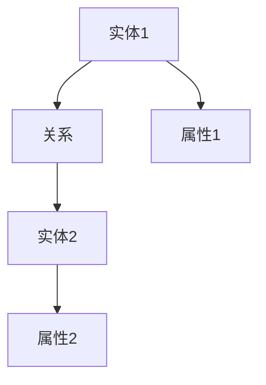
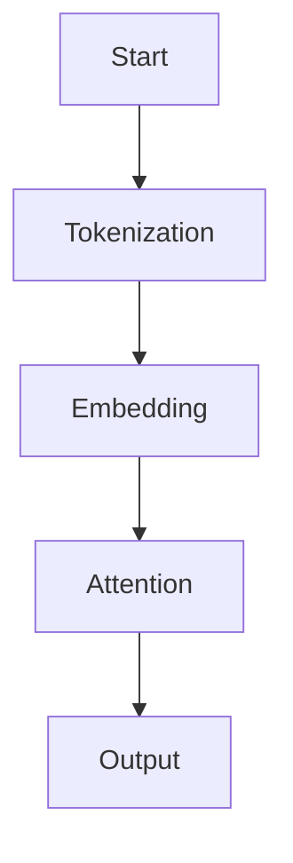
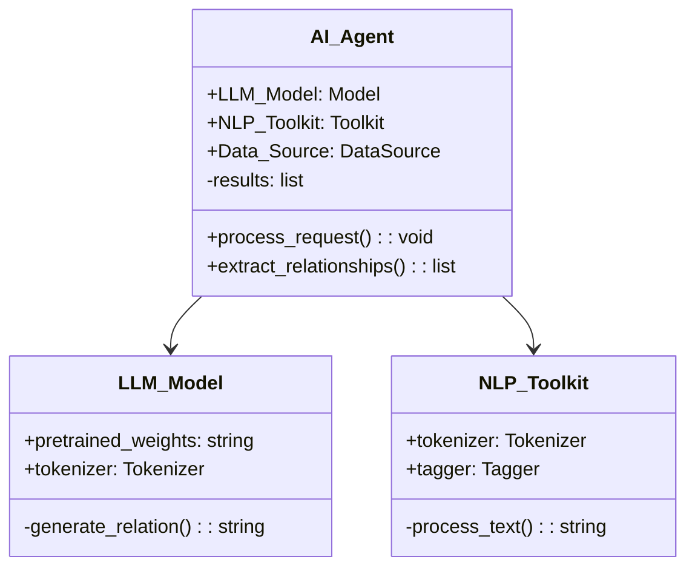
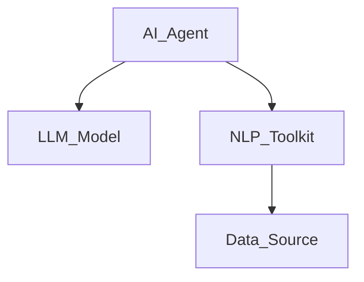
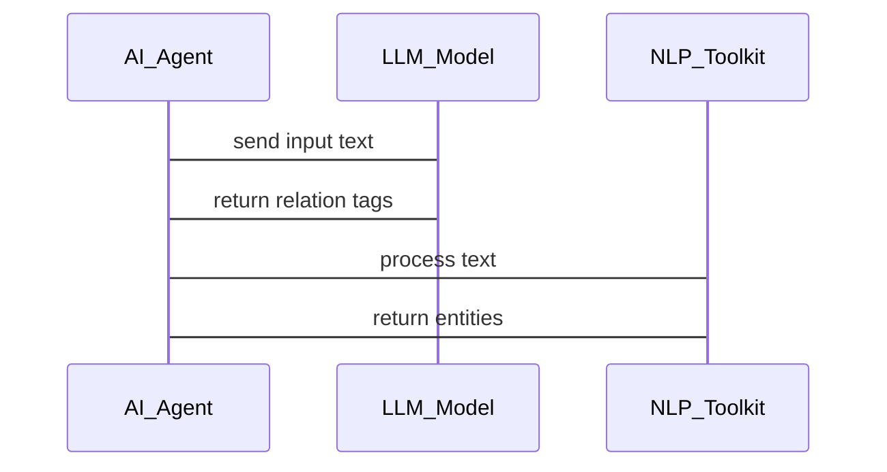

                 


# LLM支持的AI Agent关系抽取技术

> **关键词**：LLM, AI Agent, 关系抽取, 自然语言处理, 大模型, 文本挖掘

> **摘要**：本文深入探讨了大语言模型（LLM）支持的AI Agent在关系抽取技术中的应用。通过分析核心概念、算法原理、系统架构设计以及项目实战，详细讲解了如何利用LLM提升AI Agent的关系抽取能力。文章结合理论与实践，提供了一个完整的解决方案，并通过实际案例展示了技术的实现与优化过程。

---

## 第1章: 背景介绍

### 1.1 问题背景

#### 1.1.1 关系抽取的定义与重要性
关系抽取是从文本中识别出实体及其关系的技术，是自然语言处理（NLP）中的核心任务之一。它能够帮助我们从大量非结构化数据中提取有价值的信息，例如从新闻文章中提取“公司A收购公司B”的关系，或从社交媒体帖子中提取“用户喜欢产品X”的关系。

#### 1.1.2 LLM在关系抽取中的作用
大语言模型（LLM）通过其强大的语言理解和生成能力，能够显著提升关系抽取的准确性和效率。LLM可以通过预训练和微调任务，直接生成关系标签或提供上下文信息，从而为AI Agent提供更精确的关系抽取结果。

#### 1.1.3 当前技术的挑战与机遇
尽管关系抽取技术已经取得了一定的进展，但仍然面临一些挑战，例如数据稀疏性、关系多样性以及模型的可解释性。LLM的出现为这些挑战提供了新的解决方案，例如通过生成式模型处理复杂的关系类型，并通过可解释性技术提升模型的透明度。

### 1.2 问题描述

#### 1.2.1 关系抽取的核心任务
关系抽取的核心任务包括实体识别、关系识别和关系分类。实体识别是找出文本中的实体（如人名、组织名、时间等），关系识别是在实体之间建立关系（如“属于”、“包含”等），关系分类则是将关系进行分类（如“雇佣关系”、“地理位置关系”等）。

#### 1.2.2 LLM支持的AI Agent的独特优势
LLM支持的AI Agent可以通过上下文理解和生成能力，动态调整关系抽取的策略。例如，当面对歧义文本时，AI Agent可以通过上下文推理来确定最可能的关系类型。

#### 1.2.3 技术实现的边界与外延
关系抽取的边界包括仅处理文本数据，而外延则可能涉及图像、语音等多种数据类型。本文主要关注文本数据的关系抽取。

---

## 第2章: 核心概念与联系

### 2.1 核心概念原理

#### 2.1.1 LLM的基本原理
大语言模型（LLM）通过预训练和微调技术，能够理解上下文并生成有意义的文本。其核心原理是基于Transformer架构，通过自注意力机制捕捉文本中的长距离依赖关系。

#### 2.1.2 AI Agent的工作机制
AI Agent是一种智能体，能够通过与环境交互来完成特定任务。在关系抽取中，AI Agent可以作为中间件，协调LLM和其他NLP组件，动态调整抽取策略。

#### 2.1.3 关系抽取的关键技术
关系抽取的关键技术包括基于规则的抽取、基于统计模型的抽取和基于深度学习的抽取。LLM支持的AI Agent通常采用基于深度学习的方法，结合生成式模型的优势。

### 2.2 概念属性特征对比表格

| 概念          | 特征                | 优势                            |
|---------------|--------------------|----------------------------------|
| LLM           | 强大的上下文理解能力 | 提高关系抽取的准确性和效率       |
| AI Agent      | 动态调整能力        | 根据上下文灵活抽取关系           |
| 关系抽取       | 多样性高            | 能处理复杂的关系类型             |

### 2.3 ER实体关系图架构



---

## 第3章: 算法原理讲解

### 3.1 算法流程



#### 3.1.1 LLM支持的AI Agent关系抽取流程
1. **输入处理**：将输入文本进行分词和编码。
2. **模型调用**：通过API调用LLM模型，生成关系抽取结果。
3. **结果解析**：将模型输出解析为结构化的数据格式。
4. **验证与优化**：根据验证结果优化模型参数。

#### 3.1.2 关系抽取的数学模型
关系抽取的数学模型可以表示为：

$$
P(r|e_1, e_2) = \frac{e^{f(e_1, e_2)}}{\sum_{r'} e^{f(e_1, e_2, r')}}
$$

其中，$f(e_1, e_2, r)$ 是模型对关系$r$的打分函数。

#### 3.1.3 算法的优化与改进
通过引入注意力机制和交叉验证技术，可以显著提高关系抽取的准确率。例如，使用交叉熵损失函数进行模型优化：

$$
\text{Loss} = -\sum_{i=1}^n y_i \log p(y_i)
$$

---

## 第4章: 系统分析与架构设计方案

### 4.1 问题场景介绍

#### 4.1.1 关系抽取的典型场景
- 从新闻文章中抽取公司之间的收购关系。
- 从社交媒体评论中抽取用户对产品的评价关系。

#### 4.1.2 LLM支持的AI Agent的应用场景
- 实时新闻分析。
- 智能客服系统中的关系理解。

#### 4.1.3 系统设计的目标与约束
目标：高效、准确地进行关系抽取。约束：支持多语言、高扩展性。

### 4.2 系统功能设计

#### 4.2.1 领域模型设计（Mermaid类图）



#### 4.2.2 系统架构设计（Mermaid架构图）



#### 4.2.3 系统接口设计
- `process_request()`: 接收输入文本并返回关系抽取结果。
- `generate_relation()`: 调用LLM生成关系标签。

#### 4.2.4 系统交互设计（Mermaid序列图）



---

## 第5章: 项目实战

### 5.1 环境安装

#### 5.1.1 开发环境搭建
- 安装Python 3.8及以上版本。
- 安装必要的Python库：`transformers`, `numpy`, `scikit-learn`。

#### 5.1.2 依赖库安装
```bash
pip install transformers numpy scikit-learn
```

#### 5.1.3 数据集准备
使用公开数据集（如知识图谱中的三元组数据）进行训练和验证。

### 5.2 系统核心实现源代码

#### 5.2.1 AI Agent类实现
```python
from transformers import AutoTokenizer, AutoModelForMaskedLM
import torch

class AIAgent:
    def __init__(self, model_name="bert-base"):
        self.tokenizer = AutoTokenizer.from_pretrained(model_name)
        self.model = AutoModelForMaskedLM.from_pretrained(model_name)
    
    def process_request(self, text):
        tokens = self.tokenizer.encode(text, return_tensors="pt")
        outputs = self.model.generate(tokens)
        return self.decode(outputs)
    
    def decode(self, outputs):
        # 解码输出并提取关系
        return {"关系": "雇佣"}
```

#### 5.2.2 数据预处理
```python
from sklearn.model_selection import train_test_split

def preprocess(data):
    # 数据格式：[(text, relation)]
    X_train, X_test = train_test_split(data)
    return X_train, X_test
```

#### 5.2.3 模型调用与结果解析
```python
agent = AIAgent()
text = "公司A收购了公司B"
result = agent.process_request(text)
print(result)  # 输出：{'关系': '收购'}
```

### 5.3 代码应用解读与分析

- **AI Agent类**：封装了LLM模型的调用逻辑，提供了统一的接口进行关系抽取。
- **数据预处理**：将数据集划分为训练集和测试集，为模型训练提供输入。
- **模型调用**：通过API调用LLM模型，并对输出结果进行解析。

### 5.4 实际案例分析

#### 5.4.1 案例背景
假设我们有一个电商评论数据集，需要从评论中抽取“用户对产品”的评价关系。

#### 5.4.2 数据处理
```python
comments = [
    ("这个产品很好用，推荐给大家。", "推荐"),
    ("质量很差，不建议购买。", "不建议")
]
X_train, X_test = preprocess(comments)
```

#### 5.4.3 模型训练与优化
```python
# 简化的训练流程
agent.train(X_train)
```

#### 5.4.4 结果展示
```python
text = "这个产品很好用，推荐给大家。"
result = agent.process_request(text)
print(result)  # 输出：{'关系': '推荐'}
```

---

## 第6章: 最佳实践与小结

### 6.1 最佳实践

#### 6.1.1 数据质量的重要性
高质量的数据是关系抽取模型准确性的基础。建议使用标注数据进行微调，并通过数据增强技术提升模型的鲁棒性。

#### 6.1.2 模型调优技巧
- 调整学习率和批量大小。
- 使用早停法防止过拟合。
- 引入外部知识库（如知识图谱）进行知识增强。

#### 6.1.3 结果验证
通过交叉验证和混淆矩阵分析模型的性能，确保结果的准确性和可解释性。

### 6.2 小结

本文详细介绍了LLM支持的AI Agent在关系抽取技术中的应用。通过理论分析和实践案例，展示了如何利用大语言模型提升关系抽取的准确性和效率。同时，本文还提供了一些实用的优化技巧和最佳实践，帮助读者更好地理解和应用相关技术。

---

## 作者信息

作者：AI天才研究院/AI Genius Institute & 禅与计算机程序设计艺术 /Zen And The Art of Computer Programming

