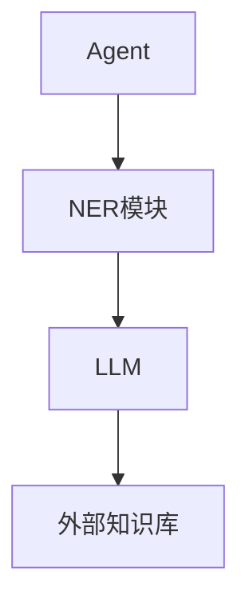
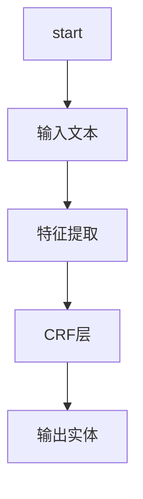
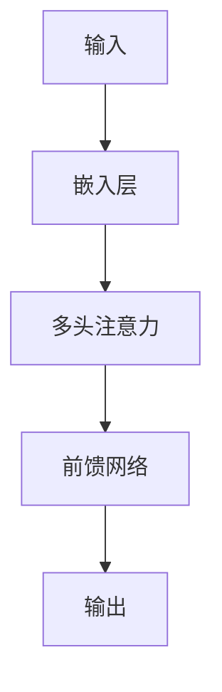
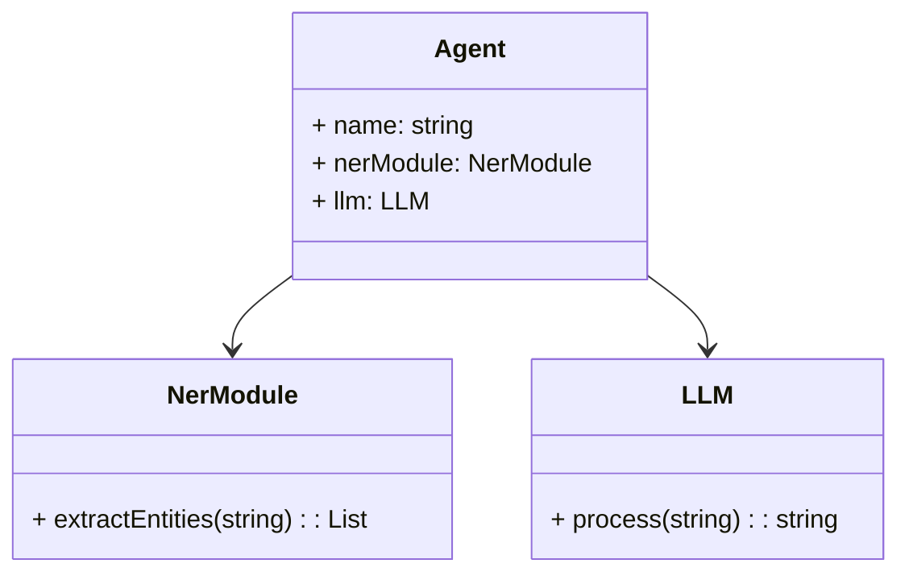
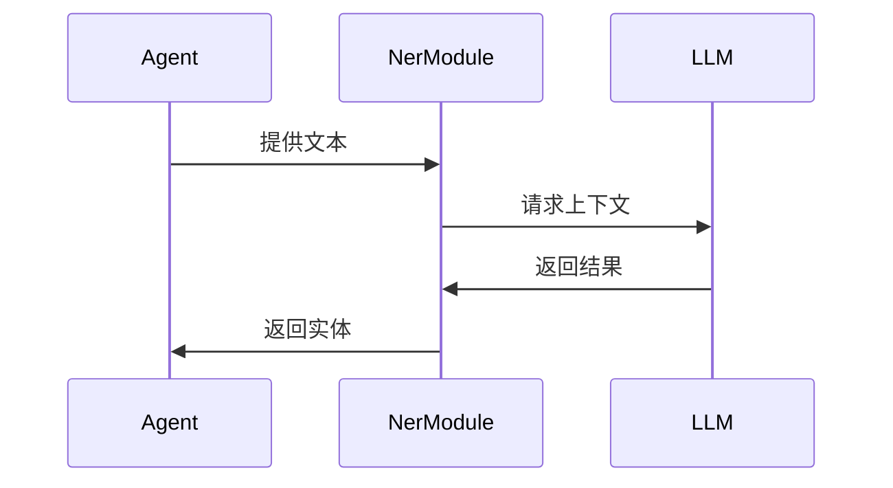

                 


# LLM支持的AI Agent命名实体识别

> 关键词：LLM, AI Agent, 命名实体识别, NLP, Transformer, 系统设计

> 摘要：本文探讨了如何利用大语言模型（LLM）支持AI代理（AI Agent）进行命名实体识别。通过分析命名实体识别的核心概念、算法原理、系统架构以及项目实战，展示了如何设计和实现一个高效的基于LLM的AI Agent系统，帮助读者理解其技术细节和应用场景。

---

## 第一章 背景介绍

### 1.1 问题背景
命名实体识别（NER）是自然语言处理中的关键任务，旨在从文本中提取特定实体。AI Agent需要理解上下文，执行复杂任务，因此NER对其至关重要。

### 1.2 问题描述
NER涉及识别人名、地名等实体，AI Agent需结合NER进行语义理解，执行任务。挑战在于处理歧义和上下文依赖。

### 1.3 问题解决
通过LLM处理NER，提升准确性和上下文理解。结合AI Agent实现复杂任务。

### 1.4 边界与外延
NER限于识别特定实体，不涉及语义理解。外延包括情感分析等其他NLP任务。

### 1.5 核心要素
涉及文本分析、上下文理解、任务执行。算法、模型和系统设计是关键。

---

## 第二章 核心概念与联系

### 2.1 核心概念
NER定义：识别文本中的实体。属性包括实体类型、位置和角色。

### 2.2 概念对比
| 概念 | 特性 |
|------|------|
| 实体识别 | 识别位置 |
| 实体链接 | 链接外部知识库 |

### 2.3 ER实体关系图


---

## 第三章 算法原理

### 3.1 算法概述
NER常用CRF和Transformer架构。LLM通过自注意力机制处理上下文。

### 3.2 CRF流程图


### 3.3 Transformer模型


### 3.4 数学公式
条件概率公式：
$$ P(y|x) = \frac{1}{Z} \exp(\sum_{i} w_i y_i) $$
自注意力机制：
$$ \text{Attention}(Q,K,V) = \text{softmax}\left(\frac{QK^T}{\sqrt{d}}\right)V $$

---

## 第四章 系统分析与架构设计

### 4.1 项目介绍
设计一个支持NER的AI Agent，帮助用户处理文本任务。

### 4.2 功能设计


### 4.3 架构设计


### 4.4 接口设计
REST API：`POST /ner/{text}` 返回实体列表。

### 4.5 交互流程


---

## 第五章 项目实战

### 5.1 环境安装
安装Python和相关库：
```bash
pip install spacy transformers
python -m spacy download en_core_web_sm
```

### 5.2 核心实现
代码示例：
```python
import spacy

nlp = spacy.load("en_core_web_sm")
doc = nlp("John went to Paris.")
for ent in doc.ents:
    print(ent.text, ent.label_)
```

### 5.3 案例分析
处理文本提取实体，结合LLM进行上下文分析，优化识别结果。

### 5.4 项目小结
通过spaCy实现NER，LLM提升效果。代码示例展示如何集成。

---

## 第六章 总结与展望

### 6.1 总结
本文介绍了利用LLM支持AI Agent进行NER的方法，涵盖算法、系统设计和实战。

### 6.2 未来展望
优化模型性能，扩展至多语言和复杂场景，提升数据隐私。

---

## 作者

作者：AI天才研究院/AI Genius Institute & 禅与计算机程序设计艺术/Zen And The Art of Computer Programming

---

通过以上结构，文章详细探讨了LLM在AI Agent中的NER应用，为读者提供了全面的技术指导。

