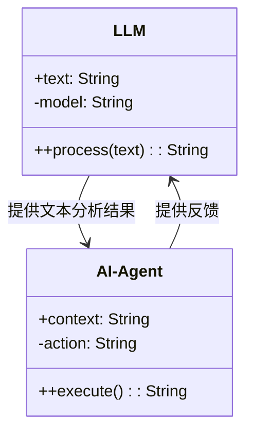
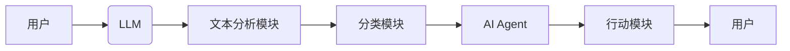

                 


# LLM支持的AI Agent文本风格识别

> 关键词：LLM, AI Agent, 文本风格识别, 语言模型, 人工智能

> 摘要：本文深入探讨了大语言模型（LLM）支持的AI Agent在文本风格识别中的应用。通过分析问题背景、核心概念、算法原理、系统架构以及项目实战，本文为读者提供了从理论到实践的全面指导。结合具体案例，文章详细解释了LLM与AI Agent协同工作的原理，并给出了实际应用中的最佳实践和未来发展方向。

---

# 第1章: 问题背景与核心概念

## 1.1 问题背景

### 1.1.1 文本风格识别的定义与意义
文本风格识别是指通过分析文本内容，判断其所属的风格类别。例如，判断一段文字是正式的商业信函还是非正式的社交媒体帖子。这种技术在自然语言处理（NLP）领域具有重要意义，因为它可以帮助AI系统更好地理解文本的语境和意图。

### 1.1.2 LLM与AI Agent的结合
大语言模型（LLM）如GPT-3、PaLM等，具备强大的文本生成和理解能力。AI Agent是一种能够自主决策和执行任务的智能体。两者的结合使得AI Agent能够利用LLM的强大能力，更准确地识别和处理文本风格。

### 1.1.3 当前技术的挑战与机遇
尽管LLM在文本生成方面表现出色，但其在文本风格识别方面仍面临挑战。例如，如何在不同语境下准确判断文本风格，如何优化LLM与AI Agent的协同工作等。这些挑战为技术进步提供了机遇。

---

## 1.2 核心概念与联系

### 1.2.1 LLM与AI Agent的关系
- **LLM**：作为AI Agent的“大脑”，提供文本理解和生成能力。
- **AI Agent**：作为执行者，负责接收LLM的输出并采取行动。

### 1.2.2 文本风格识别的关键要素
- **特征提取**：识别文本中的关键词汇、句式结构等。
- **分类模型**：基于特征进行文本风格分类。
- **上下文理解**：结合文本的上下文信息，提高识别准确率。

### 1.2.3 核心概念对比分析
通过对比LLM与传统NLP模型，可以发现LLM在文本风格识别方面具有更强的上下文理解和生成能力。AI Agent则为LLM提供了一个实际的应用场景。

---

# 第2章: LLM与AI Agent的原理

## 2.1 LLM的基本原理

### 2.1.1 大语言模型的训练机制
- **预训练**：基于大规模数据进行无监督学习。
- **微调**：针对特定任务进行有监督微调。

### 2.1.2 模型的输入输出机制
- **输入**：文本片段或上下文信息。
- **输出**：生成的文本或分类结果。

### 2.1.3 模型的推理过程
- **上下文理解**：模型通过分析上下文信息，生成符合语境的输出。
- **动态调整**：根据实时反馈优化输出结果。

---

## 2.2 AI Agent的工作原理

### 2.2.1 AI Agent的定义与功能
- **定义**：AI Agent是一种能够感知环境并采取行动以实现目标的智能体。
- **功能**：信息获取、决策制定、任务执行。

### 2.2.2 AI Agent的核心算法
- **状态感知**：通过传感器获取环境信息。
- **决策制定**：基于当前状态和目标，选择最优行动方案。
- **行动执行**：通过执行器完成任务。

### 2.2.3 AI Agent与人类的交互方式
- **自然语言交互**：通过文本或语音与人类进行对话。
- **实时反馈**：根据人类反馈调整行动策略。

---

## 2.3 LLM支持的AI Agent文本风格识别

### 2.3.1 文本风格识别的实现流程
1. **输入文本**：AI Agent接收用户输入的文本片段。
2. **特征提取**：LLM提取文本的关键词汇、句式结构等特征。
3. **风格分类**：基于特征进行文本风格分类。
4. **结果输出**：AI Agent根据分类结果采取相应行动。

### 2.3.2 LLM在文本风格识别中的作用
- **特征提取**：LLM能够识别文本中的关键词汇和语义信息。
- **分类决策**：LLM为AI Agent提供分类结果，帮助其制定下一步行动。

### 2.3.3 AI Agent对文本风格识别的优化
- **实时调整**：根据实时反馈优化文本风格识别的准确率。
- **上下文理解**：结合上下文信息，提高识别的准确性。

---

# 第3章: 文本风格识别的算法原理

## 3.1 文本风格识别的核心算法

### 3.1.1 基于LLM的文本分析
- **预训练模型**：使用大规模数据预训练的LLM进行文本分析。
- **微调模型**：针对特定任务（如文本风格识别）进行微调。

### 3.1.2 基于AI Agent的文本分类
- **特征提取**：提取文本的关键特征。
- **分类器训练**：训练分类器，实现文本风格分类。

### 3.1.3 综合算法的实现流程
1. **特征提取**：提取文本的关键词汇、句式结构等特征。
2. **分类器训练**：基于特征训练分类器。
3. **模型优化**：通过反馈优化模型性能。

---

## 3.2 算法原理的数学模型

### 3.2.1 文本表示的数学模型
$$
\text{文本表示} = \sum_{i=1}^{n} w_i \cdot f_i
$$
其中，\( w_i \) 是特征 \( f_i \) 的权重。

### 3.2.2 文本分类的数学模型
$$
P(y|x) = \prod_{i=1}^{n} P(f_i | y)
$$
其中，\( y \) 是分类结果，\( x \) 是输入文本。

### 3.2.3 LLM与AI Agent的协同模型
$$
P(y|x) = \prod_{i=1}^{m} P(a_i | y)
$$
其中，\( a_i \) 是AI Agent的行动，\( y \) 是分类结果。

---

## 3.3 算法实现的详细步骤

### 3.3.1 数据预处理
1. **清洗数据**：去除噪声数据，提取有用特征。
2. **特征提取**：提取关键词汇、句式结构等特征。

### 3.3.2 模型训练
1. **选择模型**：选择适合的文本分类模型（如SVM、随机森林等）。
2. **训练模型**：基于特征训练分类器。

### 3.3.3 模型评估
1. **评估指标**：准确率、召回率、F1值。
2. **优化模型**：通过反馈优化模型性能。

---

# 第4章: 系统分析与架构设计

## 4.1 问题场景介绍

### 4.1.1 文本风格识别的应用场景
- **社交媒体分析**：识别用户评论的风格。
- **客户服务**：根据客户语言风格提供个性化服务。

### 4.1.2 LLM支持的AI Agent的系统架构
- **输入模块**：接收用户输入。
- **处理模块**：进行文本分析和分类。
- **输出模块**：输出分类结果或采取行动。

---

## 4.2 系统功能设计

### 4.2.1 领域模型设计


### 4.2.2 系统架构设计


### 4.2.3 系统接口设计
- **输入接口**：接收用户输入的文本片段。
- **输出接口**：输出分类结果或采取相应行动。

---

## 4.3 系统交互设计

### 4.3.1 系统交互流程
1. 用户输入文本片段。
2. 系统进行文本分析和分类。
3. AI Agent根据分类结果采取行动。
4. 系统输出结果或反馈。

### 4.3.2 系统交互的优化建议
- **实时反馈**：根据用户反馈优化分类结果。
- **上下文理解**：结合上下文信息提高准确性。

### 4.3.3 系统交互的实现方式
- **API接口**：通过API实现系统各模块之间的交互。
- **事件驱动**：通过事件驱动实现实时反馈。

---

# 第5章: 项目实战与案例分析

## 5.1 环境安装与配置

### 5.1.1 开发环境的选择
- **编程语言**：Python
- **框架**：TensorFlow、PyTorch
- **工具**：Jupyter Notebook、VS Code

### 5.1.2 开发工具的安装
```bash
pip install tensorflow transformers
```

### 5.1.3 系统依赖的配置
- **GPU支持**：安装NVIDIA GPU驱动和CUDA toolkit。
- **环境变量**：配置相关环境变量。

---

## 5.2 系统核心实现

### 5.2.1 文本风格识别的代码实现
```python
from transformers import pipeline

# 初始化文本分类器
classifier = pipeline("text-classification", model="facebook/bart-large-mnli")

# 分类结果
result = classifier("This is a formal business letter.")
print(result)
```

### 5.2.2 LLM与AI Agent的接口实现
```python
class AI-Agent:
    def __init__(self):
        self.llm = LLM()

    def execute(self):
        # 获取用户输入
        input_text = input("请输入文本：")
        # 调用LLM进行分析
        analysis = self.llm.process(input_text)
        # 根据分析结果采取行动
        action = self.decide_action(analysis)
        return action

    def decide_action(self, analysis):
        # 示例：判断文本风格是否为正式
        if analysis["formal"]:
            return "采取正式行动"
        else:
            return "采取非正式行动"
```

### 5.2.3 系统功能的测试与优化
- **测试用例**：设计多个测试用例，覆盖不同文本风格。
- **优化模型**：根据测试结果优化模型参数。

---

## 5.3 案例分析与详细解读

### 5.3.1 实际案例的背景介绍
假设我们正在开发一个社交媒体分析工具，需要识别用户评论的风格。

### 5.3.2 案例实现的详细过程
1. **数据收集**：收集社交媒体上的用户评论。
2. **特征提取**：提取关键词汇、情感倾向等特征。
3. **模型训练**：基于特征训练分类器。
4. **系统实现**：实现AI Agent，根据分类结果采取相应行动。

### 5.3.3 案例分析的总结与反思
- **成功经验**：AI Agent能够准确识别用户评论的风格。
- **改进建议**：进一步优化模型，提高识别准确率。

---

# 第6章: 总结与展望

## 6.1 核心知识点总结

### 6.1.1 LLM与AI Agent的结合
- LLM提供强大的文本分析能力。
- AI Agent负责执行任务和采取行动。

### 6.1.2 文本风格识别的关键技术
- 特征提取与分类。
- 上下文理解与实时反馈。

### 6.1.3 系统设计与实现的要点
- 系统架构设计。
- 模型训练与优化。

---

## 6.2 未来发展的展望

### 6.2.1 技术进步的潜力
- 更强的上下文理解能力。
- 更高效的模型训练方法。

### 6.2.2 应用场景的扩展
- 教育领域：个性化教学。
- 医疗领域：患者病情分析。

### 6.2.3 挑战与机遇的分析
- 挑战：模型的泛化能力。
- 机遇：技术进步带来的新应用。

---

## 6.3 最佳实践与注意事项

### 6.3.1 最佳实践
- 定期优化模型。
- 结合实际需求选择模型。

### 6.3.2 小结
通过结合LLM与AI Agent，文本风格识别技术将更加智能化和高效化。

### 6.3.3 注意事项
- 注意数据隐私和安全。
- 避免模型过拟合。

### 6.3.4 拓展阅读
- 《Large Language Models: A Survey》
- 《Introduction to AI Agents》

---

# 作者

作者：AI天才研究院/AI Genius Institute & 禅与计算机程序设计艺术 /Zen And The Art of Computer Programming

---

# 结语

本文通过系统地分析LLM支持的AI Agent在文本风格识别中的应用，为读者提供了从理论到实践的全面指导。通过具体案例的分析，我们展示了如何将复杂的理论应用于实际场景中。未来，随着技术的不断进步，文本风格识别将变得更加智能化和高效化。

