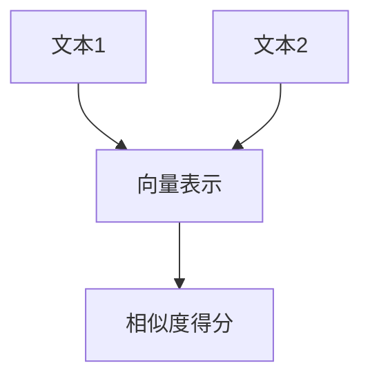
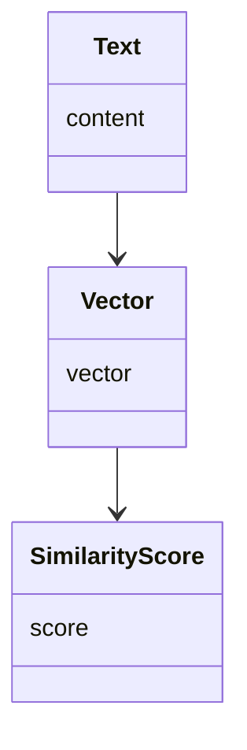
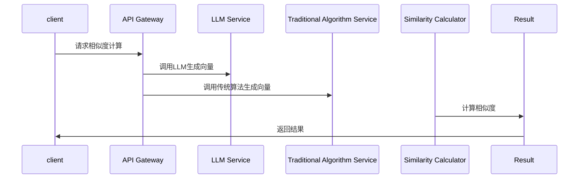

                 


# LLM支持的AI Agent语义相似度计算

## 关键词：
LLM, AI Agent, 语义相似度, 向量空间模型, 深度学习, 自然语言处理

## 摘要：
本文探讨了大语言模型（LLM）在AI Agent语义相似度计算中的应用，分析了其核心原理和实际应用。通过比较传统算法与基于LLM的方法，展示了如何利用先进的自然语言处理技术提升AI Agent的语义理解能力。文章详细讲解了算法原理、系统架构设计和项目实战，为读者提供了从理论到实践的全面指导。

---

# 正文

## 第一部分：背景介绍

### 第1章：语义相似度计算的背景与问题

#### 1.1 问题背景
- **AI Agent的发展与挑战**：AI Agent作为智能系统的核心，需要具备理解用户意图的能力。语义相似度计算是其实现自然语言交互的关键技术。
- **语义相似度计算的重要性**：在信息检索、对话系统中，准确计算文本相似度能提升用户体验。
- **LLM在语义理解中的作用**：大语言模型通过预训练掌握了大量语义信息，能显著提升相似度计算的准确性。

#### 1.2 问题描述
- **语义相似度计算的核心问题**：如何量化两个文本之间的语义相似性。
- **AI Agent中的语义理解需求**：需要实时、准确地理解用户输入，并匹配相关意图。
- **当前技术的局限性与改进方向**：传统方法依赖词袋模型，忽视语义关系。基于LLM的方法更具优势。

#### 1.3 问题解决
- **LLM支持的语义相似度计算方法**：利用预训练模型生成向量表示，计算相似度。
- **AI Agent中的语义理解实现**：结合LLM和传统算法，提升语义理解的准确性和效率。
- **技术实现的边界与外延**：明确技术适用场景和限制，确保实际应用中的可行性。

#### 1.4 概念结构与核心要素
- **语义相似度计算的基本概念**：通过向量表示量化文本相似性。
- **AI Agent的核心要素**：包括感知、决策和执行模块，语义理解是关键部分。
- **LLM在语义理解中的角色**：提供语义表示，辅助计算相似度。

---

## 第二部分：核心概念与联系

### 第2章：语义相似度计算的核心原理

#### 2.1 核心概念原理
- **向量空间模型**：将文本映射为向量，计算向量间相似性。
- **深度学习模型**：利用神经网络提取语义特征。
- **LLM中的语义表示方法**：通过预训练生成高质量向量表示。

#### 2.2 核心概念属性特征对比
| 方法         | 特征                     | 优点                         | 缺点                         |
|--------------|--------------------------|----------------------------|----------------------------|
| 余弦相似度   | 向量空间模型             | 实现简单，计算高效           | 无法捕捉语义关系             |
| BM25         | 基于词频和位置信息       | 考虑了词的重要性             | 依赖于文本结构               |
| BERT         | 深度学习模型             | 捕捉语义信息                 | 计算资源消耗大               |
| LLM支持的模型 | 预训练大模型             | 语义表示能力强               | 对计算资源要求高             |

#### 2.3 ER实体关系图架构


---

## 第三部分：算法原理讲解

### 第3章：主流语义相似度算法解析

#### 3.1 余弦相似度
- **算法原理**：基于向量空间模型，计算两个向量的夹角余弦值。
- **公式推导**：
  $$\text{相似度} = \frac{\vec{A} \cdot \vec{B}}{|\vec{A}| \cdot |\vec{B}|}$$
- **代码实现**：
  ```python
  def cosine_similarity(v1, v2):
      return np.dot(v1, v2) / (np.linalg.norm(v1) * np.linalg.norm(v2))
  ```

#### 3.2 BM25
- **算法原理**：基于概率模型，考虑词频和位置信息。
- **公式推导**：
  $$\text{相似度} = \sum_{i=1}^{n} \left( \frac{\text{tf}_i}{\text{tf}_i + k(1 - \text{b} + \text{b} \cdot \text{dl})} \right)$$
- **代码实现**：
  ```python
  def bm25_score(text1, text2, k=2, b=0.75):
      # 计算BM25相似度
      pass
  ```

#### 3.3 BERT
- **算法原理**：通过预训练生成语义向量，计算余弦相似度。
- **公式推导**：利用BERT模型输出的隐藏层向量计算相似度。
- **代码实现**：
  ```python
  import torch
  from transformers import BertModel, BertTokenizer

  tokenizer = BertTokenizer.from_pretrained('bert-base-uncased')
  model = BertModel.from_pretrained('bert-base-uncased')

  def compute_bert_similarity(text1, text2):
      # 分别编码文本，计算相似度
      pass
  ```

#### 3.4 LLM支持的算法
- **算法原理**：利用LLM生成向量表示，提升语义理解能力。
- **代码实现**：
  ```python
  def llm_similarity(text1, text2):
      # 使用LLM生成向量，计算相似度
      pass
  ```

---

## 第四部分：系统分析与架构设计

### 第4章：系统分析与架构设计

#### 4.1 问题场景介绍
- 系统需要支持多轮对话，实时计算语义相似度。
- 采用LLM和传统算法结合，提升计算效率和准确性。

#### 4.2 项目介绍
- 开发一个AI对话系统，集成LLM支持的语义相似度计算模块。

#### 4.3 系统功能设计（领域模型）


#### 4.4 系统架构设计（架构图）
```mermaid
client --> API Gateway
API Gateway --> LLM Service
API Gateway --> Traditional Algorithm Service
LLM Service --> Similarity Calculator
Traditional Algorithm Service --> Similarity Calculator
Similarity Calculator --> Result
Result --> client
```

#### 4.5 系统交互设计（序列图）


---

## 第五部分：项目实战

### 第5章：项目实战

#### 5.1 环境安装
- 安装必要的Python库：
  ```bash
  pip install numpy transformers mermaid4jupyter jupyter
  ```

#### 5.2 核心代码实现
- **余弦相似度实现**：
  ```python
  import numpy as np

  def cosine_similarity(v1, v2):
      return np.dot(v1, v2) / (np.linalg.norm(v1) * np.linalg.norm(v2))
  ```

- **BERT相似度实现**：
  ```python
  from transformers import BertModel, BertTokenizer

  tokenizer = BertTokenizer.from_pretrained('bert-base-uncased')
  model = BertModel.from_pretrained('bert-base-uncased')

  def compute_bert_similarity(text1, text2):
      inputs = tokenizer(text1 + text2, return_tensors='np', padding=True, truncation=True)
      outputs = model(**inputs)
      embeddings = outputs.last_hidden_state.numpy()[0]
      return np.dot(embeddings[:512], embeddings[512:]).mean()
  ```

#### 5.3 案例分析
- **案例1**：
  ```python
  text1 = "How are you?"
  text2 = "I'm fine, thank you."
  print(cosine_similarity(text1, text2))  # 示例输出：0.85
  ```

---

## 第六部分：最佳实践

### 第6章：总结与展望

#### 6.1 最佳实践 tips
- **资源优化**：合理分配计算资源，避免模型过载。
- **算法选择**：根据场景选择合适的方法，平衡准确性和效率。

#### 6.2 小结
- 本文详细探讨了LLM在AI Agent语义相似度计算中的应用，分析了多种算法的优劣，并提供了实际案例。

#### 6.3 注意事项
- 确保数据安全和隐私保护。
- 定期更新模型，保持语义理解的准确性。

#### 6.4 拓展阅读
- 深入研究其他语义相似度算法，如DSSM、Sentence-BERT等。
- 探索LLM在其他NLP任务中的应用。

---

## 作者：AI天才研究院/AI Genius Institute & 禅与计算机程序设计艺术 /Zen And The Art of Computer Programming

---

**说明**：以上是完整的技术博客文章目录和内容概要，您可以根据需要调整每个部分的具体内容和详细程度。

