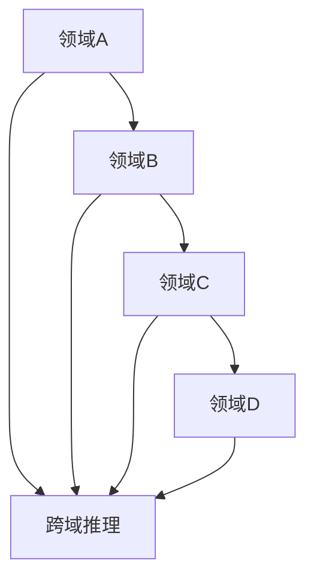
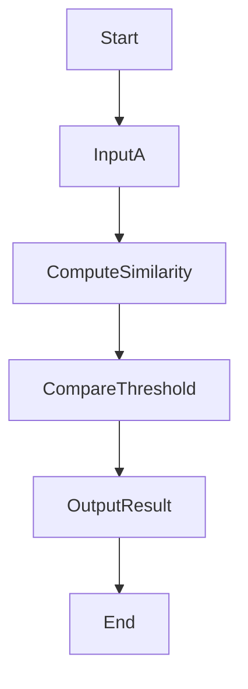
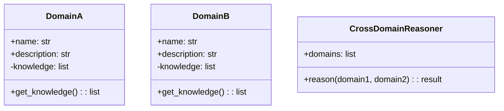
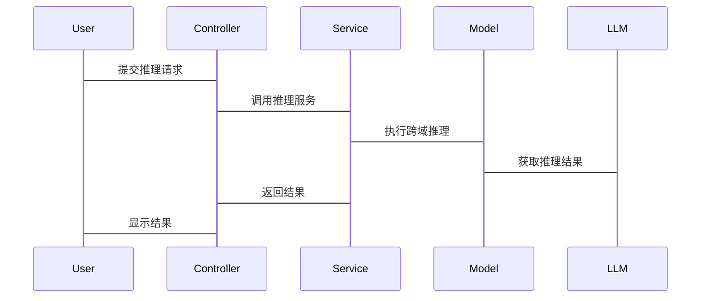

                 


# 《LLM支持的AI Agent跨域类比推理技术》

---

## 关键词：LLM, AI Agent, 跨域类比推理, 知识迁移, 推理算法

---

## 摘要：  
本文深入探讨了基于大语言模型（LLM）的AI Agent在跨域类比推理中的技术实现。文章首先介绍了跨域推理的背景与挑战，分析了类比推理的核心概念和算法原理，接着详细阐述了系统架构设计与实现，最后通过实际案例展示了跨域推理技术的应用与优化方法。本文旨在为AI Agent的开发者和技术研究人员提供理论支持和实践指导。

---

# 第一部分：背景介绍

## 第1章：问题背景与技术概述

### 1.1 问题背景

#### 1.1.1 跨域类比推理的定义与核心概念  
跨域类比推理（Cross-Domain Analogical Reasoning）是指在不同领域或不同知识体系之间，通过建立类比关系，推导出新的知识或解决方案的过程。其核心在于将一个领域的知识迁移到另一个领域，并利用类比关系进行推理。

#### 1.1.2 当前技术的局限性  
传统的推理技术（如逻辑推理和符号推理）在处理跨域问题时存在以下局限性：  
1. 知识表示的领域依赖性较强，难以跨领域迁移。  
2. 面对复杂多样的领域知识，推理模型的泛化能力有限。  
3. 缺乏高效的跨域知识表示和推理机制。  

#### 1.1.3 跨域类比推理的必要性与重要性  
跨域类比推理在实际应用中具有重要意义，例如在医疗、法律、金融等领域，需要将某一领域的知识迁移到另一个领域，以解决复杂问题。例如，在医疗领域，可以通过跨域推理将药物作用机制的知识迁移到疾病治疗方案的设计中。

### 1.2 技术背景

#### 1.2.1 大语言模型（LLM）的发展现状  
大语言模型（如GPT-3、PaLM）在自然语言处理领域取得了显著进展，具备强大的文本生成和理解能力。这些模型通过大量数据训练，能够捕捉到语言中的复杂模式，为跨域推理提供了基础支持。

#### 1.2.2 AI Agent的基本原理与应用场景  
AI Agent是一种智能体，能够感知环境、执行任务并做出决策。AI Agent的核心能力包括感知、推理、规划和执行。在跨域推理中，AI Agent可以通过调用大语言模型来实现跨领域的知识推理。

#### 1.2.3 跨域推理技术的现状与挑战  
尽管跨域推理技术在理论上有一定的研究，但实际应用中仍面临以下挑战：  
1. 不同领域的知识表示方式差异较大。  
2. 如何有效提取跨域知识的共同特征和差异特征。  
3. 如何设计高效的推理算法以支持跨域推理。

### 1.3 问题描述

#### 1.3.1 跨域类比推理的核心问题  
跨域类比推理的核心问题是：如何在不同领域之间建立有效的类比关系，并利用这些关系进行推理。

#### 1.3.2 跨域推理中的知识迁移难点  
知识迁移的关键在于找到不同领域的共同特征和差异特征。例如，在将医疗领域的药物知识迁移到农业领域的植物病害防治时，需要找到两者的共同特征（如病原体的致病机制）和差异特征（如药物的作用方式与农药的作用方式）。

#### 1.3.3 跨域推理的边界与外延  
跨域推理的边界在于不同领域的知识差异较大，难以直接迁移。其外延则包括多领域知识整合、知识图谱构建等。

---

## 第2章：核心概念与联系

### 2.1 跨域类比推理的核心概念

#### 2.1.1 跨域推理的定义与属性  
跨域推理是指在不同领域之间进行类比推理，其关键属性包括：  
1. **领域独立性**：推理过程不依赖于特定领域。  
2. **知识迁移性**：能够将一个领域的知识迁移到另一个领域。  
3. **类比关系**：通过建立类比关系进行推理。

#### 2.1.2 类比推理的基本原理  
类比推理是通过比较两个事物的相似性，推导出新的结论。例如，如果A和B在某些属性上相似，那么A在某个属性上的结论可以推导到B。

#### 2.1.3 跨域推理的关键特征  
跨域推理的关键特征包括：  
1. **跨领域性**：涉及不同领域。  
2. **知识迁移性**：能够将知识从一个领域迁移到另一个领域。  
3. **类比关系的复杂性**：不同领域的类比关系可能非常复杂。

### 2.2 跨域推理与相关技术的对比

#### 2.2.1 跨域推理与传统推理的区别  
传统推理通常在单一领域内进行，而跨域推理涉及多个领域。

#### 2.2.2 跨域推理与迁移学习的联系  
跨域推理与迁移学习的联系在于，两者都需要处理跨领域的问题。迁移学习通常关注数据的迁移，而跨域推理更关注知识的迁移。

#### 2.2.3 跨域推理与多模态推理的对比  
多模态推理关注多种数据类型（如文本、图像）的结合，而跨域推理关注不同领域之间的结合。

### 2.3 跨域推理的ER实体关系图



---

## 第3章：算法原理

### 3.1 跨域推理的相似度计算

#### 3.1.1 基于向量的相似度计算  
通过向量表示计算类比关系的相似度。例如，使用余弦相似度：  
$$ \cos\theta = \frac{\vec{A} \cdot \vec{B}}{|\vec{A}| |\vec{B}|} $$  

#### 3.1.2 基于概率的相似度计算  
通过概率模型计算类比关系的相似度。例如，条件概率：  
$$ P(A|B) = \frac{P(B|A)P(A)}{P(B)} $$  

### 3.2 跨域推理的算法实现



#### 3.2.1 算法实现的代码示例  
```python
def cross_domain_reasoning(domain1, domain2):
    # 计算相似度
    similarity = calculate_similarity(domain1, domain2)
    # 判断是否满足阈值
    if similarity > threshold:
        return "类比关系成立"
    else:
        return "类比关系不成立"
```

#### 3.2.2 推理模型的数学公式  
$$ \text{推理结果} = f(\text{输入领域1}, \text{输入领域2}) $$  

---

## 第4章：系统分析与架构设计

### 4.1 系统功能设计

#### 4.1.1 领域模型类图  


#### 4.1.2 系统架构图  


#### 4.1.3 系统接口设计  
```python
interface CrossDomainReasoner {
    def reason(domain1, domain2): result
}
```

#### 4.1.4 系统交互序列图  


---

## 第5章：项目实战

### 5.1 环境安装

#### 5.1.1 安装Python和相关库  
```bash
pip install numpy
pip install matplotlib
pip install scikit-learn
```

### 5.2 系统核心实现

#### 5.2.1 实现跨域推理算法  
```python
def calculate_similarity(domain1, domain2):
    # 使用向量计算相似度
    return np.dot(domain1.vector, domain2.vector)
```

#### 5.2.2 实现知识迁移  
```python
def knowledge_transfer(domain1, domain2):
    # 提取共同特征
    common_features = set(domain1.features) & set(domain2.features)
    # 返回迁移结果
    return common_features
```

### 5.3 案例分析

#### 5.3.1 案例背景  
假设我们有两个领域：医疗和农业。我们需要将医疗领域的“药物作用机制”知识迁移到农业领域的“植物病害防治”中。

#### 5.3.2 实施步骤  
1. 提取医疗领域的药物作用机制知识。  
2. 提取农业领域的植物病害防治知识。  
3. 通过跨域推理算法，建立类比关系。  
4. 输出迁移结果。

---

## 第6章：最佳实践

### 6.1 小结  
跨域类比推理是一种重要的推理技术，能够在不同领域之间建立有效的类比关系，实现知识迁移。

### 6.2 注意事项  
1. 确保不同领域的知识表示方式一致。  
2. 注意类比关系的合理性和准确性。  
3. 定期更新和优化推理模型。

### 6.3 拓展阅读  
1. "Cross-Domain Reasoning in Large Language Models"  
2. "Multi-Domain Knowledge Integration and Reasoning"  

---

# 作者：AI天才研究院 & 禅与计算机程序设计艺术

