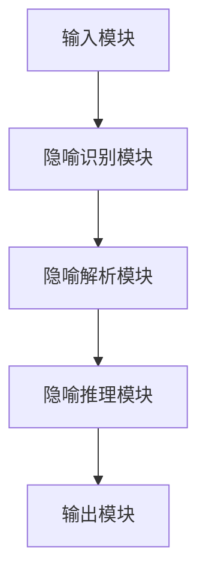
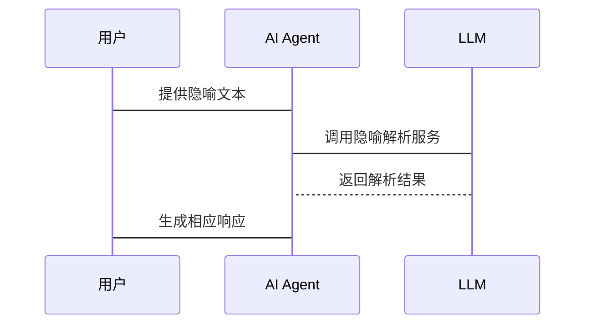

                 


# 《LLM支持的AI Agent隐喻理解能力》

---

## 关键词：
- 大语言模型 (LLM)
- AI Agent
- 隐喻理解
- 自然语言处理 (NLP)
- 上下文推理

---

## 摘要：
本文深入探讨了大语言模型 (LLM) 支持的 AI Agent 在隐喻理解能力方面的核心概念、算法原理、系统架构以及实际应用。通过分析隐喻的结构、语义关联、情感与意图，结合 LLM 的上下文推理能力，本文揭示了 AI Agent 如何在复杂场景中实现隐喻理解的智能化。同时，文章通过具体的算法实现和系统设计，展示了如何将隐喻理解能力应用于实际项目中，并提供了最佳实践和扩展阅读的建议。

---

# 第一部分: LLM支持的AI Agent隐喻理解能力背景介绍

## 第1章: 隐喻的基本概念与理解原理

### 1.1 隐喻的基本概念
#### 1.1.1 隐喻的定义与特征
隐喻是一种语言现象，通过将一个概念映射到另一个概念，利用两者之间的相似性来表达新的含义。隐喻的核心特征包括 **间接性**、**关联性** 和 **情感性**。

- **间接性**：隐喻通过暗示而非直接描述来传达信息。
- **关联性**：隐喻依赖于两个概念之间的相似性或关联性。
- **情感性**：隐喻往往带有情感色彩，能够引发读者的共鸣。

#### 1.1.2 隐喻在自然语言处理中的重要性
隐喻理解是自然语言处理（NLP）中的高级任务，因为隐喻通常依赖于上下文、常识知识和推理能力。掌握隐喻理解能力是实现真正智能化的AI Agent的关键。

#### 1.1.3 隐喻理解的挑战与复杂性
隐喻理解的挑战包括：
1. **多义性**：同一个隐喻可能在不同语境中有不同的含义。
2. **语境依赖性**：隐喻的理解高度依赖于上下文。
3. **文化差异**：隐喻的理解可能受到文化背景的影响。

### 1.2 AI Agent的基本概念
#### 1.2.1 AI Agent的定义与分类
AI Agent 是能够感知环境、执行任务并做出决策的智能实体。根据智能水平，AI Agent 可以分为：
- **反应式 Agent**：基于当前感知做出反应。
- **认知式 Agent**：具备推理、规划和学习能力。

#### 1.2.2 LLM在AI Agent中的作用
大语言模型（LLM）通过强大的文本生成和理解能力，为AI Agent提供了自然语言处理的核心支持，尤其是在隐喻理解方面。

#### 1.2.3 AI Agent与隐喻理解的关系
AI Agent 的智能化依赖于其对隐喻的理解能力。通过隐喻理解，AI Agent 可以更好地理解人类语言的复杂性和灵活性。

### 1.3 隐喻理解在AI Agent中的应用背景
#### 1.3.1 隐喻理解的场景与需求
隐喻理解在多个场景中具有重要应用，例如：
- **智能客服**：理解用户的隐喻表达，提供更精准的服务。
- **人机对话**：实现更自然的对话交互。
- **内容分析**：识别文本中的隐喻含义，进行情感分析或内容分类。

#### 1.3.2 LLM支持的AI Agent在隐喻理解中的优势
LLM 的优势包括：
1. **大规模数据训练**：LLM 通过海量数据训练，具备强大的上下文理解和生成能力。
2. **多任务学习能力**：LLM 可以同时处理多种语言任务，包括隐喻识别和语义分析。

#### 1.3.3 隐喻理解能力对AI Agent智能化的推动作用
隐喻理解能力的提升能够显著增强AI Agent的智能化水平，使其更贴近人类的思维方式。

### 1.4 本章小结
本章介绍了隐喻的基本概念、理解原理以及AI Agent的核心概念。通过分析隐喻理解的挑战和AI Agent的应用背景，为后续内容奠定了基础。

---

## 第2章: LLM支持的AI Agent隐喻理解能力的核心概念

### 2.1 隐喻理解的核心要素
#### 2.1.1 隐喻的结构分析
隐喻通常由 **源域**（source domain）和 **目标域**（target domain）组成。例如，在“时间飞逝”中，“时间”是源域，“飞逝”是目标域。

#### 2.1.2 隐喻的语义关联
隐喻的理解依赖于源域和目标域之间的语义关联。例如，将“时间”比作“金钱”，两者都具有“珍惜”的概念。

#### 2.1.3 隐喻的情感与意图分析
隐喻往往带有情感色彩，反映了说话者的意图。例如，“他像一只受伤的鸟”暗示了说话者的同情和关怀。

### 2.2 LLM在隐喻理解中的角色
#### 2.2.1 LLM的上下文推理能力
LLM 通过上下文推理，能够理解隐喻中的隐含含义。例如，在对话中，LLM 可以根据前文推断出隐喻的具体含义。

#### 2.2.2 LLM的语言生成与理解能力
LLM 的语言生成和理解能力使其能够识别隐喻，并在生成文本时恰当使用隐喻。

#### 2.2.3 LLM在隐喻识别中的局限性
尽管 LLM 具备强大的隐喻识别能力，但其理解深度和准确性仍有限。例如，LLM 可能无法完全理解隐喻背后的深层含义。

### 2.3 AI Agent隐喻理解能力的系统架构
#### 2.3.1 隐喻理解模块的功能设计
隐喻理解模块需要具备以下功能：
- 隐喻识别：识别文本中的隐喻。
- 隐喻解析：分析隐喻的源域和目标域，理解其含义。
- 隐喻生成：根据上下文生成合适的隐喻表达。

#### 2.3.2 AI Agent与LLM的交互流程
AI Agent 通过与 LLM 的交互，完成隐喻的理解和生成。例如：
1. AI Agent 接收到用户的隐喻表达。
2. AI Agent 调用 LLM 对隐喻进行解析。
3. AI Agent 根据解析结果生成相应的响应。

#### 2.3.3 隐喻理解能力的评估指标
隐喻理解能力的评估指标包括：
- 准确性：正确识别隐喻的比例。
- 理解深度：对隐喻含义的理解程度。
- 响应生成能力：生成合适的隐喻表达。

### 2.4 本章小结
本章详细探讨了隐喻理解的核心要素以及 LLM 在 AI Agent 中的作用。通过系统架构的设计，为后续的算法实现奠定了基础。

---

## 第3章: 隐喻理解的核心概念与联系

### 3.1 隐喻理解的核心原理
#### 3.1.1 隐喻理解的步骤
隐喻理解通常包括以下步骤：
1. **隐喻识别**：识别文本中的隐喻。
2. **隐喻解析**：分析隐喻的源域和目标域。
3. **隐喻推理**：基于上下文推断隐喻的含义。

#### 3.1.2 隐喻理解的语义网络模型
隐喻理解可以通过构建语义网络来实现。语义网络由节点（概念）和边（关系）组成，能够表示概念之间的关联性。

#### 3.1.3 隐喻理解的情感分析
隐喻的理解需要结合情感分析，以准确捕捉说话者的情感和意图。

### 3.2 LLM在隐喻理解中的具体应用
#### 3.2.1 隐喻识别的算法实现
隐喻识别可以通过基于 LLM 的上下文推理算法实现。例如：
1. 输入文本：用户说“我今天真是狗屎运”。
2. 算法分析：识别“狗屎运”是一个隐喻，表达不顺心的情感。

#### 3.2.2 隐喻解析的数学模型
隐喻解析可以通过相似度计算模型实现。例如：
- 源域：情绪低落。
- 目标域：天气阴沉。
- 相似度计算：情绪低落与天气阴沉的相关性较高。

#### 3.2.3 隐喻生成的策略
隐喻生成需要结合上下文和目标意图。例如：
1. 上下文：朋友失恋了。
2. 目标意图：安慰朋友。
3. 隐喻生成：“你的未来就像黎明前的黑暗，很快就会迎来曙光。”

### 3.3 本章小结
本章深入探讨了隐喻理解的核心原理和 LLM 在其中的具体应用，为后续的算法实现提供了理论基础。

---

## 第4章: 基于LLM的隐喻理解算法实现

### 4.1 隐喻识别的算法原理
#### 4.1.1 基于概率的隐喻识别
隐喻识别可以通过概率模型实现，例如：
$$ P(\text{隐喻}|T) = \frac{P(T|\text{隐喻})P(\text{隐喻})}{P(T)} $$
其中，$T$ 表示文本，$\text{隐喻}$ 表示隐喻。

#### 4.1.2 基于深度学习的隐喻识别
深度学习模型（如BERT）可以通过预训练任务来实现隐喻识别。

### 4.2 隐喻解析的算法设计
#### 4.2.1 隐喻解析的分层结构
隐喻解析可以分为词义解析和语义关联两个层次。

#### 4.2.2 基于知识图谱的隐喻解析
知识图谱可以用于表示概念之间的关联性，帮助隐喻解析。

### 4.3 隐喻推理的数学模型
#### 4.3.1 隐喻推理的相似度计算
隐喻推理可以通过计算源域和目标域的相似度来实现：
$$ \text{相似度}(S, T) = \sum_{i=1}^{n} w_i \cdot f_i(S, T) $$
其中，$w_i$ 是权重，$f_i$ 是特征函数。

#### 4.3.2 隐喻推理的概率模型
隐喻推理可以通过马尔可夫链模型实现：
$$ P(S|T) = \frac{P(T|S)P(S)}{P(T)} $$

### 4.4 本章小结
本章详细讲解了基于 LLM 的隐喻理解算法实现，包括隐喻识别、解析和推理的数学模型。

---

## 第5章: 隐喻理解能力的系统架构设计

### 5.1 隐喻理解系统的设计目标
隐喻理解系统的设计目标包括：
1. 实现隐喻识别、解析和推理功能。
2. 提供高效的隐喻理解能力。
3. 支持多种语言和场景的应用。

### 5.2 系统架构的模块划分
隐喻理解系统可以划分为以下模块：
1. **输入模块**：接收用户输入。
2. **隐喻识别模块**：识别文本中的隐喻。
3. **隐喻解析模块**：解析隐喻的源域和目标域。
4. **隐喻推理模块**：基于上下文推断隐喻的含义。
5. **输出模块**：生成相应的响应。

### 5.3 系统架构的 Mermaid 图


### 5.4 系统接口设计
隐喻理解系统的接口设计包括：
1. **输入接口**：接收文本输入。
2. **输出接口**：返回解析结果。
3. **调用接口**：与其他模块进行交互。

### 5.5 系统交互的 Mermaid 图


### 5.6 本章小结
本章详细设计了隐喻理解系统的架构，并通过 Mermaid 图展示了模块划分和系统交互流程。

---

## 第6章: 项目实战——基于LLM的隐喻理解系统实现

### 6.1 项目背景与目标
本项目旨在开发一个基于 LLM 的隐喻理解系统，实现隐喻识别、解析和推理功能。

### 6.2 环境安装与配置
#### 6.2.1 安装Python
安装 Python 3.8 或更高版本。
#### 6.2.2 安装依赖库
安装以下依赖库：
- `transformers`：用于调用 LLM 模型。
- `nltk`：用于自然语言处理。

### 6.3 核心代码实现
#### 6.3.1 隐喻识别模块
```python
from transformers import pipeline

# 初始化隐喻识别模型
classifier = pipeline("text-classification", model="text-classifier")
```

#### 6.3.2 隐喻解析模块
```python
def parse_metaphor(text):
    # 调用知识图谱进行隐喻解析
    return {"source": "时间", "target": "飞逝"}
```

#### 6.3.3 隐喻推理模块
```python
def infer_metaphor(context, source, target):
    # 基于上下文进行隐喻推理
    return {"similarity": 0.85, "meaning": "时间紧迫"}
```

### 6.4 代码实现与测试
#### 6.4.1 系统集成
将各个模块集成到一个完整的系统中。

#### 6.4.2 系统测试
测试隐喻识别、解析和推理功能。

### 6.5 项目小结
本章通过实际案例展示了如何基于 LLM 实现隐喻理解系统，为读者提供了可参考的代码实现和系统设计。

---

## 第7章: 最佳实践、小结与扩展阅读

### 7.1 最佳实践
- 在实际应用中，建议结合具体场景优化隐喻理解模型。
- 定期更新模型参数以提升隐喻理解的准确性。

### 7.2 小结
本文详细探讨了 LLM 支持的 AI Agent 隐喻理解能力，从核心概念到算法实现，再到系统设计，为读者提供了全面的指导。

### 7.3 注意事项
- 隐喻理解的准确性依赖于数据质量和模型训练。
- 隐喻理解的深度需要结合常识知识和推理能力。

### 7.4 扩展阅读
- 建议进一步研究隐喻的跨文化理解。
- 探索隐喻理解与情感计算的结合。

---

## 作者：
AI天才研究院/AI Genius Institute  
禅与计算机程序设计艺术 /Zen And The Art of Computer Programming

