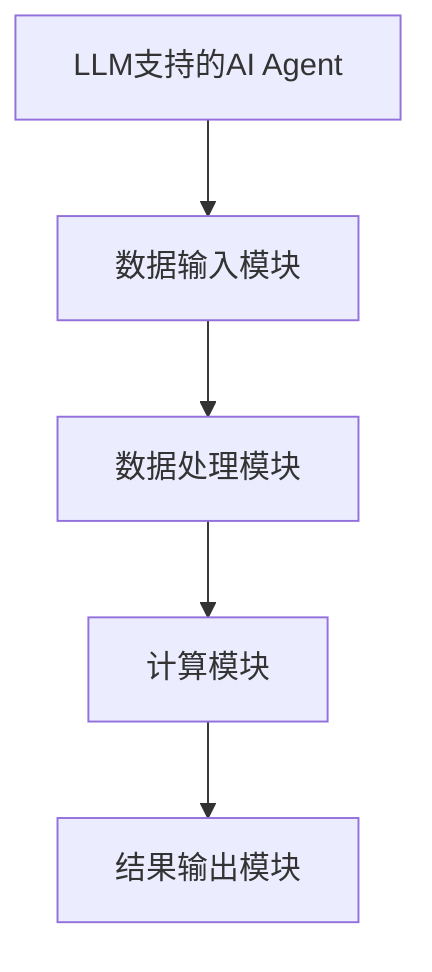
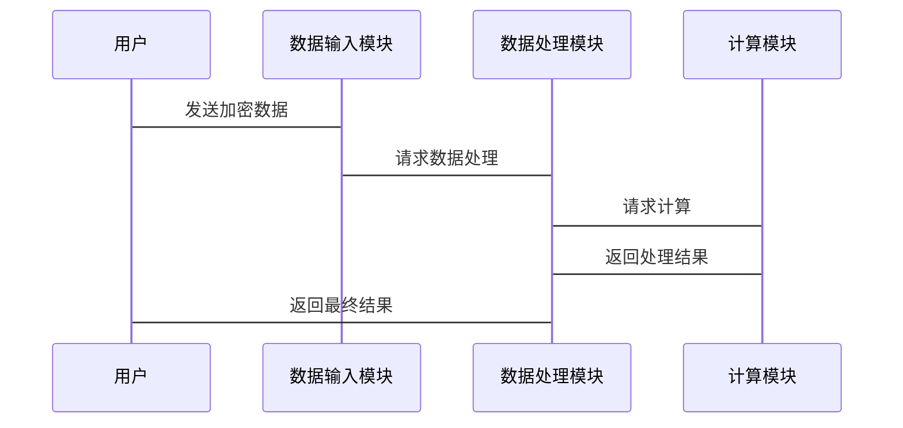

                 


# LLM支持的AI Agent隐私计算技术

> 关键词：LLM, AI Agent, 隐私计算, 数据隐私, 人工智能, 安全技术

> 摘要：本文探讨了大语言模型（LLM）支持的AI Agent在隐私计算技术中的应用。通过分析LLM与AI Agent的核心概念、隐私计算的关键技术以及它们的结合方式，详细阐述了LLM支持的AI Agent在隐私保护中的实现机制和系统架构设计。文章结合实际案例，展示了如何通过系统设计和算法实现，保障AI Agent在数据处理过程中的隐私安全。

---

# 第1章: 引言

## 1.1 背景介绍
随着人工智能技术的快速发展，大语言模型（LLM）和AI Agent的应用越来越广泛。然而，数据隐私和安全问题也随之凸显。如何在AI Agent中有效保护数据隐私，成为当前研究的热点。

## 1.2 问题描述
本文聚焦于LLM支持的AI Agent在隐私计算中的应用，探讨如何在AI Agent中实现数据的隐私保护，确保模型在训练和推理过程中不泄露敏感信息。

## 1.3 研究意义
通过结合LLM和隐私计算技术，可以在提高AI Agent智能性的同时，有效保护用户隐私，为人工智能的安全应用提供技术支持。

## 1.4 研究目标
本文旨在研究和实现一种基于LLM的AI Agent隐私计算技术，提出一种既能利用大语言模型的强大能力，又能确保数据隐私的解决方案。

---

# 第2章: 核心概念与原理

## 2.1 LLM的基本概念
### 2.1.1 LLM的定义与特点
大语言模型（LLM）是一种基于深度学习的自然语言处理模型，具有强大的文本生成和理解能力。

### 2.1.2 LLM的训练过程
通过大量的数据训练，模型参数不断优化，最终形成强大的语言生成能力。

## 2.2 AI Agent的核心概念
### 2.2.1 AI Agent的定义
AI Agent是一种智能体，能够感知环境并采取行动以实现特定目标。

### 2.2.2 AI Agent的分类
根据功能和应用场景的不同，AI Agent可以分为多种类型，如任务型、服务型等。

## 2.3 隐私计算技术
### 2.3.1 隐私计算的定义
隐私计算是一种在保护数据隐私的前提下，对数据进行处理和分析的技术。

### 2.3.2 隐私计算的关键技术
包括数据加密、隐私保护机制、同态加密等。

## 2.4 LLM与隐私计算的结合
### 2.4.1 数据层面的隐私保护
通过数据加密和脱敏技术，保护训练数据的隐私。

### 2.4.2 计算层面的隐私保护
在模型训练和推理过程中，采用隐私计算技术，确保中间结果不被泄露。

### 2.4.3 结果层面的隐私保护
对模型输出结果进行隐私保护，防止敏感信息泄露。

---

# 第3章: LLM支持的AI Agent隐私计算技术的算法原理

## 3.1 LLM的训练过程
### 3.1.1 模型训练的数学公式
使用最大似然估计（MLE）对模型参数进行优化：

$$ L = -\log P(x_1, x_2, ..., x_n) $$

### 3.1.2 训练过程中的隐私保护
通过联邦学习（Federated Learning）技术，保护训练数据的隐私。

## 3.2 隐私计算技术的实现
### 3.2.1 同态加密技术
使用同态加密对数据进行加密，确保在加密状态下进行计算：

$$ E(x \cdot y) = E(x) \cdot E(y) $$

### 3.2.2 差分隐私技术
通过在计算结果中添加噪声，保护数据隐私：

$$ y = f(x) + \epsilon $$

## 3.3 LLM与隐私计算的结合
### 3.3.1 数据输入的隐私保护
对输入数据进行加密或脱敏处理，确保数据在传输和处理过程中的安全性。

### 3.3.2 计算过程的隐私保护
在模型训练和推理过程中，采用隐私计算技术，确保中间结果不被泄露。

### 3.3.3 结果输出的隐私保护
对模型输出结果进行加密或匿名化处理，防止敏感信息泄露。

---

# 第4章: 系统设计与架构

## 4.1 系统架构设计
### 4.1.1 系统模块划分
- 数据输入模块
- 数据处理模块
- 计算模块
- 结果输出模块

### 4.1.2 系统架构图（Mermaid）



## 4.2 数据流设计
### 4.2.1 数据输入流程
- 用户输入数据经过加密后传输到系统。
- 数据输入模块对数据进行解析和初步处理。

### 4.2.2 数据处理流程
- 数据处理模块对数据进行清洗和预处理。
- 处理后的数据传输到计算模块。

## 4.3 接口设计
### 4.3.1 数据输入接口
- 接收加密数据，进行解密和解析。
- 提供API接口供其他模块调用。

### 4.3.2 数据处理接口
- 提供数据清洗和预处理的API。
- 支持多种数据格式的处理。

## 4.4 系统交互流程
### 4.4.1 系统交互序列图（Mermaid）



---

# 第5章: 项目实战

## 5.1 项目环境配置
### 5.1.1 环境要求
- Python 3.8+
- PyTorch 1.9+
- transformers库

### 5.1.2 安装依赖
```bash
pip install torch transformers
```

## 5.2 核心代码实现
### 5.2.1 数据处理模块
```python
def preprocess_data(data):
    # 数据清洗和预处理
    processed_data = data清洗逻辑
    return processed_data
```

### 5.2.2 计算模块
```python
def compute(processed_data):
    # 使用LLM进行计算
    result = model推理逻辑
    return result
```

### 5.2.3 结果输出模块
```python
def output_result(result):
    # 对结果进行加密或匿名化处理
    encrypted_result = 加密逻辑
    return encrypted_result
```

## 5.3 功能解读
### 5.3.1 数据输入模块
- 负责接收输入数据并进行初步处理。
- 提供数据加密和解密功能。

### 5.3.2 数据处理模块
- 对数据进行清洗和预处理，确保数据质量。
- 支持多种数据格式的处理。

### 5.3.3 计算模块
- 使用LLM进行数据处理和计算。
- 确保计算过程中的数据隐私。

### 5.3.4 结果输出模块
- 对计算结果进行加密或匿名化处理。
- 返回最终结果。

## 5.4 案例分析
### 5.4.1 案例背景
- 用户希望通过AI Agent进行数据分析，同时保护数据隐私。

### 5.4.2 实施步骤
1. 用户输入加密数据。
2. 数据输入模块接收数据并进行解密。
3. 数据处理模块对数据进行清洗和预处理。
4. 计算模块使用LLM进行数据分析。
5. 结果输出模块对结果进行加密或匿名化处理。
6. 返回最终结果。

---

# 第6章: 总结与展望

## 6.1 研究总结
本文研究了LLM支持的AI Agent在隐私计算技术中的应用，提出了基于同态加密和差分隐私的隐私保护方案，确保了数据在处理过程中的隐私安全。

## 6.2 最佳实践
- 在实际应用中，建议结合具体场景选择合适的隐私保护技术。
- 定期对系统进行安全测试，确保隐私保护机制的有效性。

## 6.3 未来展望
随着技术的发展，未来可以在以下方面进行进一步研究：
1. 开发更高效的隐私计算算法，提高计算效率。
2. 研究更强大的数据加密技术，保护数据隐私。
3. 探讨多模态数据的隐私保护方法，扩展AI Agent的应用场景。

---

# 作者：AI天才研究院/AI Genius Institute & 禅与计算机程序设计艺术 /Zen And The Art of Computer Programming

