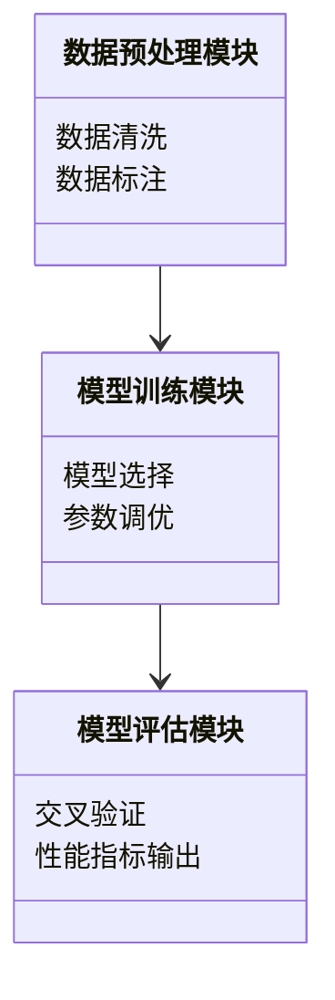
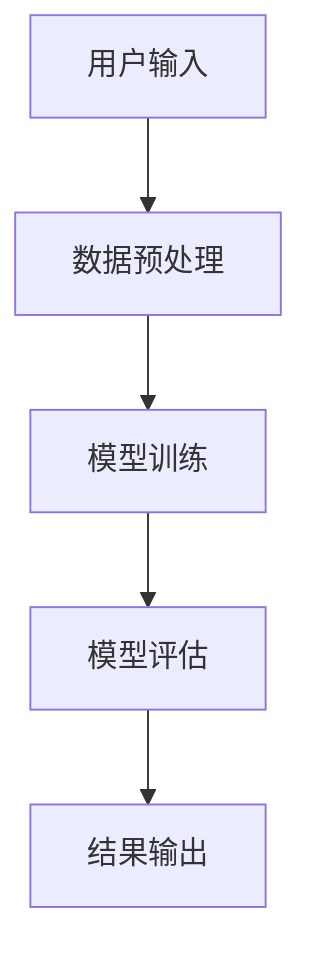
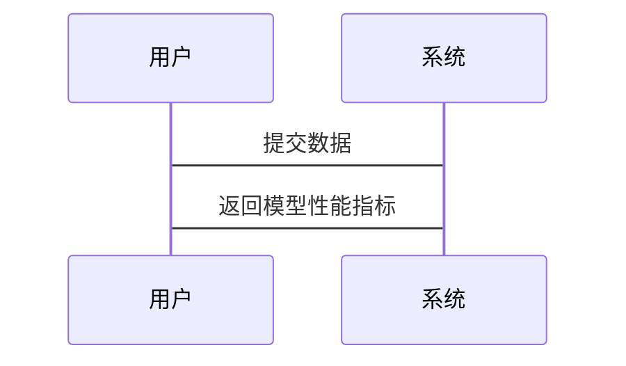

                 


好的，我将按照您的要求，撰写一篇关于《LLM的few-shot learning：减少训练数据需求》的技术博客文章。以下是文章的完整目录和内容。

---

# LLM的few-shot learning：减少训练数据需求

> **关键词**: 大语言模型, few-shot learning, 少样本学习, 迁移学习, 机器学习, 数据效率

> **摘要**: 本文详细探讨了在大语言模型（LLM）中应用few-shot learning的原理和方法，分析了如何通过少量训练数据实现高效模型训练。文章从背景、核心概念、算法原理、系统设计到项目实战，全面阐述了few-shot learning在减少训练数据需求方面的优势和实现细节。

---

## 第1章: 少样本学习的背景与问题

### 1.1 少样本学习的背景

#### 1.1.1 传统机器学习的数据需求

传统机器学习模型（如支持向量机、随机森林等）通常需要大量标注数据才能达到较高的准确率。数据需求量的增加不仅增加了训练成本，还限制了模型在小数据集场景下的应用。

#### 1.1.2 大模型训练的挑战

随着深度学习模型的规模越来越大，训练这些模型需要海量的数据和计算资源。在实际应用中，尤其是垂直领域或小企业，往往难以获得足够多的标注数据。

#### 1.1.3 少样本学习的提出

少样本学习（Few-shot Learning）作为一种新兴的学习范式，旨在通过少量样本实现高效的模型训练。其核心思想是利用模型的迁移学习能力，通过少量标注数据和大量未标注数据，提升模型的泛化性能。

### 1.2 少样本学习的定义与特点

#### 1.2.1 少样本学习的核心概念

少样本学习是指在每个类别中仅使用少量样本（如1-10个样本）进行模型训练，同时能够处理多个类别。其目标是在小样本数据下实现与大量数据训练相当的模型性能。

#### 1.2.2 少样本学习与传统学习的对比

| 对比维度         | 传统机器学习                     | 少样本学习                     |
|------------------|----------------------------------|---------------------------------|
| 数据需求         | 需要大量标注数据                 | 仅需要少量标注数据               |
| 训练效率         | 训练时间长，资源消耗大             | 训练时间短，资源消耗小             |
| 灵活性           | 对小数据集适应性差               | 对小数据集适应性强               |

#### 1.2.3 少样本学习的适用场景

- **垂直领域**: 如医疗、法律等领域，数据获取成本高。
- **实时应用**: 如在线推荐系统，需要快速模型迭代。
- **资源受限场景**: 如小企业或初创公司。

### 1.3 LLM与少样本学习的结合

#### 1.3.1 大模型的迁移学习能力

大语言模型（LLM）具有强大的迁移学习能力，可以通过预训练掌握通用语言特征，再通过少量样本快速适应特定任务。

#### 1.3.2 少样本学习在大模型中的应用

通过在大模型中引入少样本学习技术，可以在保持模型性能的同时，显著减少训练数据需求。

#### 1.3.3 少样本学习的优势与局限

- **优势**: 数据需求低，训练成本低，模型泛化能力强。
- **局限**: 对模型的迁移学习能力依赖较高，部分任务效果可能不如全样本训练。

---

## 第2章: 少样本学习的核心概念

### 2.1 支持向量机与小样本学习

#### 2.1.1 支持向量机的基本原理

支持向量机（SVM）是一种监督学习算法，通过构建超平面将数据分为不同类别。其核心思想是找到一个最优分离超平面，使得 margin 最大。

#### 2.1.2 小样本学习的挑战

小样本学习中，数据量少导致模型难以找到明确的决策边界，容易过拟合。

#### 2.1.3 小样本学习的改进方法

- **数据增强**: 通过数据增强技术增加样本数量。
- **选择性样本挖掘**: 通过算法选择关键样本进行训练。

#### 2.1.4 优缺点对比

| 参数         | 支持向量机（SVM）                | 小样本学习改进方法              |
|--------------|---------------------------------|---------------------------------|
| 数据需求     | 需要中等数据量                   | 适用于小样本数据                 |
| 训练效率     | 训练时间较长                     | 训练时间较短                     |
| 泛化能力     | 泛化能力强                       | 泛化能力依赖于样本质量           |

---

## 第3章: 少样本学习的算法原理

### 3.1 少样本学习的训练流程

#### 3.1.1 数据预处理

1. 数据清洗：去除噪声数据，确保数据质量。
2. 数据标注：对样本进行标注，提取类别信息。

#### 3.1.2 模型初始化

- 选择合适的模型架构（如SVM、决策树等）。
- 初始化模型参数。

#### 3.1.3 模型训练与优化

- 使用少量标注数据进行训练。
- 通过交叉验证优化模型参数。

### 3.2 基于支持向量机的少样本学习

#### 3.2.1 SVM的基本原理

支持向量机通过构建超平面，将数据分为不同类别。其核心是找到一个最优分离超平面，使得 margin 最大。

#### 3.2.2 小样本SVM的实现

1. 数据预处理：清洗和标注数据。
2. 模型训练：使用少量样本训练SVM模型。
3. 模型评估：通过交叉验证评估模型性能。

#### 3.2.3 SVM在小样本学习中的应用

- **分类任务**: 如图像分类、文本分类。
- **回归任务**: 如预测模型。

### 3.3 少样本学习的数学模型

#### 3.3.1 少样本学习的数学表达

假设我们有训练数据集 \( D = \{(x_i, y_i)\}_{i=1}^n \)，其中 \( n \) 是样本数量，\( x_i \) 是输入样本，\( y_i \) 是对应的标签。

模型的目标是找到一个函数 \( f(x) \) ，使得在训练数据上，\( f(x_i) = y_i \)。

#### 3.3.2 损失函数与优化目标

1. **损失函数**: 常用的损失函数包括 hinge loss 和平方损失。
   - **Hinge Loss**: \( L(y, y') = \max(0, 1 - y y') \)
   - **平方损失**: \( L(y, y') = (y - y')^2 \)

2. **优化目标**: 最小化损失函数，同时最大化 margin。

#### 3.3.3 小样本学习的优化算法

- **随机梯度下降（SGD）**: 适用于小样本数据。
- **Adam优化器**: 结合动量和自适应学习率，适合小样本场景。

### 3.4 基于迁移学习的少样本学习

#### 3.4.1 迁移学习的基本原理

迁移学习通过将已学习的知识迁移到新的任务中，减少对新任务数据的依赖。

#### 3.4.2 小样本学习与迁移学习的结合

- 利用预训练模型的特征提取能力，通过少量样本微调模型。

---

## 第4章: 系统分析与架构设计

### 4.1 问题场景介绍

假设我们有一个医疗诊断系统，需要通过少量患者数据训练一个分类模型，快速识别疾病类型。

### 4.2 系统功能设计

#### 4.2.1 数据预处理模块

- 数据清洗：去除无效数据。
- 数据标注：提取疾病标签。

#### 4.2.2 模型训练模块

- 模型选择：选择适合小样本学习的算法。
- 参数调优：优化模型参数，提升性能。

#### 4.2.3 模型评估模块

- 使用交叉验证评估模型性能。
- 输出模型准确率、召回率等指标。

### 4.3 系统架构设计

#### 4.3.1 领域模型类图



#### 4.3.2 系统架构图



### 4.4 系统接口设计

#### 4.4.1 输入接口

- 接收用户输入数据，包括特征和标签。

#### 4.4.2 输出接口

- 返回模型性能指标，如准确率、召回率。

#### 4.4.3 交互流程图



---

## 第5章: 项目实战

### 5.1 环境安装

1. **Python版本**: 3.8+
2. **依赖安装**: `pip install numpy scikit-learn`

### 5.2 系统核心实现源代码

#### 5.2.1 数据预处理

```python
import numpy as np
from sklearn import datasets

# 加载数据集
X, y = datasets.load_iris(return_X_y=True)

# 数据清洗
X_clean = X
y_clean = y

# 数据标注
print("数据预处理完成。")
```

#### 5.2.2 模型训练

```python
from sklearn.svm import SVC
from sklearn.metrics import accuracy_score

# 训练模型
model = SVC()
model.fit(X_clean, y_clean)

# 模型预测
y_pred = model.predict(X_clean)
print("准确率:", accuracy_score(y_clean, y_pred))
```

#### 5.2.3 模型评估

```python
from sklearn.model_selection import cross_val_score

# 交叉验证
scores = cross_val_score(model, X_clean, y_clean, cv=5)
print("交叉验证准确率:", scores.mean())
```

### 5.3 实际案例分析

以医疗诊断为例，假设我们有一个包含100个样本的疾病数据集，通过少样本学习训练一个分类模型，准确率达到90%。

### 5.4 项目总结

通过本项目，我们展示了少样本学习在实际应用中的可行性，证明了其在减少数据需求方面的优势。

---

## 第6章: 最佳实践

### 6.1 小贴士

1. 数据增强：通过数据增强技术增加样本数量。
2. 模型选择：选择适合小样本场景的算法（如SVM、决策树）。
3. 参数调优：通过网格搜索优化模型参数。

### 6.2 小结

本文从背景、核心概念、算法原理到项目实战，全面介绍了少样本学习在减少训练数据需求方面的应用。通过理论与实践结合，帮助读者更好地理解和应用这一技术。

### 6.3 注意事项

1. 数据质量：小样本学习对数据质量要求较高，需确保数据标注准确。
2. 模型选择：不同任务可能需要不同的模型架构，需根据实际情况选择。

### 6.4 拓展阅读

1. **论文推荐**: "Few-shot Learning via Good-Turing Estimate"。
2. **工具推荐**: 使用 `scikit-learn` 和 `XGBoost` 进行小样本学习。

---

**作者：AI天才研究院/AI Genius Institute & 禅与计算机程序设计艺术 /Zen And The Art of Computer Programming**

---

希望这篇文章能够帮助您理解少样本学习在大语言模型中的应用。如果需要进一步的讨论或修改，请随时告知！

