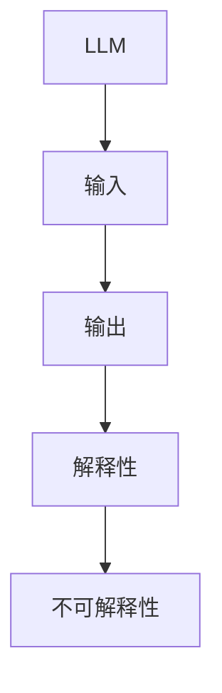
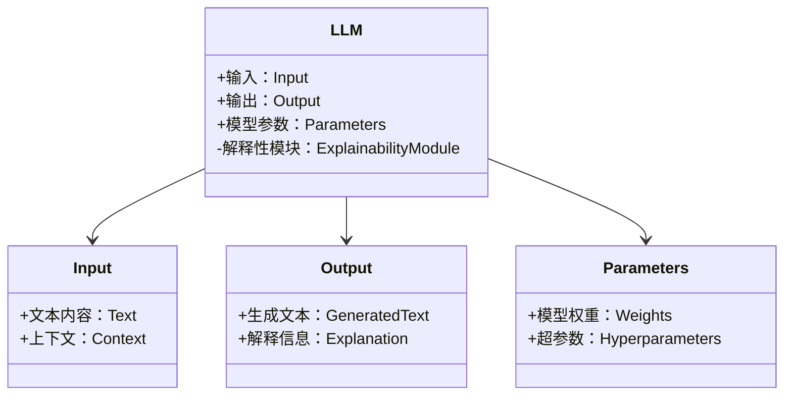
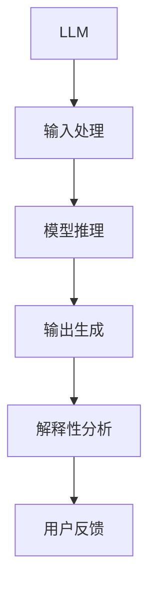
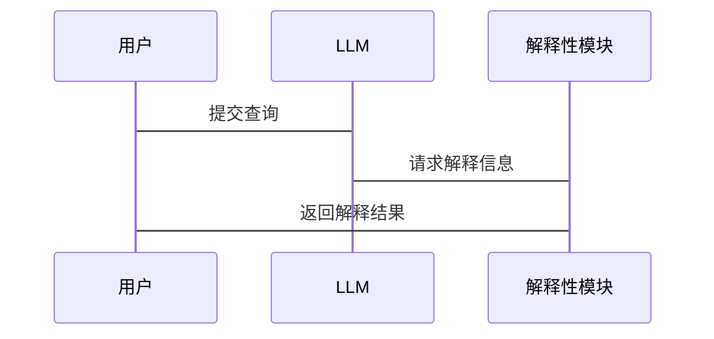

                 


# LLM的可解释性：理解AI Agent的决策过程

**关键词**：LLM，可解释性，AI决策过程，大语言模型，解释性技术

**摘要**：  
大语言模型（LLM）作为人工智能领域的重要技术，其决策过程的可解释性是当前研究和应用中的关键问题。本文从LLM的基本概念出发，深入分析其可解释性的核心问题、技术实现、数学模型以及实际应用中的挑战与解决方案。通过系统化的分析和案例研究，帮助读者理解如何实现和评估LLM的可解释性，从而更好地应用于实际场景中。

---

# 第1章: LLM的可解释性概述

## 1.1 什么是LLM  
### 1.1.1 大语言模型的定义  
大语言模型（Large Language Model, LLM）是指基于深度学习技术训练的大型神经网络模型，能够理解和生成人类语言。这类模型通常基于Transformer架构，通过大量的训练数据学习语言的语法、语义和上下文关系。  

### 1.1.2 LLM的核心特点  
- **大规模数据训练**：LLM通常使用数百万或数十亿的文本数据进行训练，使其能够覆盖多种语言和领域知识。  
- **多任务能力**：LLM可以在多种任务上表现出色，例如文本生成、问答、翻译、摘要等。  
- **上下文理解**：LLM能够通过上下文推理生成合理的回答。  

### 1.1.3 LLM与传统AI模型的区别  
与传统AI模型（如基于规则的模型或小规模的机器学习模型）相比，LLM具有更强的通用性和灵活性，但其复杂的内部结构也带来了可解释性方面的挑战。

---

## 1.2 可解释性的重要性  
### 1.2.1 可解释性在AI中的作用  
可解释性是指用户能够理解AI模型的决策过程和结果背后的原因。在LLM中，可解释性对于信任建立、错误诊断和改进模型性能至关重要。  

### 1.2.2 LLM决策过程中的黑箱问题  
LLM的内部计算过程通常是不可见的，用户无法直接观察到模型如何从输入生成输出。这种“黑箱”特性使得理解和解释模型的决策过程变得困难。  

### 1.2.3 可解释性对用户信任的影响  
当用户无法理解AI的决策过程时，他们可能会对模型的输出产生怀疑，甚至拒绝使用相关技术。因此，提升LLM的可解释性是推动其广泛应用的重要前提。

---

## 1.3 LLM的决策过程  
### 1.3.1 LLM的输入处理流程  
1. 输入文本经过分词处理，生成词汇表。  
2. 词汇表被映射为向量，输入到模型中进行编码。  
3. 模型通过自注意力机制捕捉文本中的语义关系。  

### 1.3.2 模型的内部计算过程  
1. 模型通过编码器将输入文本转换为隐含向量。  
2. 解码器根据编码结果逐步生成输出文本。  
3. 每一步生成的输出都会影响后续的生成过程。  

### 1.3.3 输出结果的解释性分析  
- **文本生成**：模型根据概率分布选择最可能的下一个词。  
- **决策路径**：分析模型在生成过程中选择特定词的原因。  

---

## 1.4 本章小结  
本章介绍了LLM的基本概念和核心特点，重点探讨了可解释性在LLM中的重要性，以及模型决策过程中的黑箱问题。接下来，我们将深入分析可解释性的核心概念和技术实现。

---

# 第2章: LLM可解释性的核心概念

## 2.1 可解释性的定义与分类  
### 2.1.1 解释性的定义  
可解释性是指模型的决策过程可以被人类理解和解释的程度。  

### 2.1.2 可解释性的分类  
- **层次化解释性**：从整体到局部的多级解释。  
- **局部可解释性**：关注模型在特定输入下的决策过程。  
- **全局可解释性**：分析模型在所有输入下的整体行为。  

### 2.1.3 解释性与模型性能的关系  
高解释性并不一定意味着模型性能更好，但解释性能够帮助用户信任和优化模型。

---

## 2.2 LLM的解释性特征  
### 2.2.1 属性特征对比表格  
| 特征 | 解释性 | 不可解释性 |
|------|--------|------------|
| 理解度 | 高     | 低         |
| 透明度 | 高     | 低         |
| 可控性 | 高     | 低         |

### 2.2.2 ER实体关系图  


---

## 2.3 本章小结  
本章通过定义和分类，分析了LLM的解释性特征，并通过对比表格和ER图帮助读者理解可解释性的核心概念。接下来，我们将深入探讨LLM的算法原理与可解释性技术。

---

# 第3章: LLM的算法原理与可解释性

## 3.1 LLM的算法原理  
### 3.1.1 大语言模型的结构  
- LLM通常基于Transformer架构，包含编码器和解码器两部分。  
- 编码器负责将输入文本转换为隐含向量，解码器根据编码结果生成输出文本。  

### 3.1.2 模型的训练过程  
1. 预处理数据：分词、去停用词、构建词汇表。  
2. 定义损失函数：通常使用交叉熵损失。  
3. 优化模型参数：通过反向传播和梯度下降更新参数。  

### 3.1.3 模型的推理机制  
- 在推理阶段，模型根据输入生成概率分布，选择概率最高的词作为输出。  

---

## 3.2 可解释性技术的实现  
### 3.2.1 层次化解释方法  
- 层次化解释方法通过分析模型的中间层输出，逐步解释模型的决策过程。  

### 3.2.2 局部可解释性方法  
- 局部可解释性方法通过分析模型在特定输入下的决策过程，提供局部解释。  

### 3.2.3 全局可解释性方法  
- 全局可解释性方法通过分析模型在所有输入下的整体行为，提供全局解释。  

---

## 3.3 算法原理的数学模型  
### 3.3.1 模型的数学表达  
$$ P(y|x) = \arg\max_y \text{score}(y|x) $$  
其中，$P(y|x)$表示在输入$x$下，输出$y$的概率分布，$\text{score}(y|x)$表示模型对输入$x$和输出$y$的评分。  

### 3.3.2 解释性计算公式  
$$ \text{解释度} = \frac{\text{可解释部分}}{\text{总决策权重}} $$  

---

## 3.4 本章小结  
本章通过分析LLM的算法原理，探讨了可解释性技术的实现方法，并通过数学公式进一步解释了模型的决策过程。接下来，我们将深入探讨LLM的数学模型与公式。

---

# 第4章: LLM的数学模型与公式

## 4.1 模型的数学表达  
### 4.1.1 概率模型  
$$ P(y|x) = \frac{P(x|y)P(y)}{P(x)} $$  
其中，$P(y|x)$表示条件概率，$P(x|y)$是似然函数，$P(y)$是先验概率，$P(x)$是边缘概率。  

### 4.1.2 损失函数  
$$ \text{损失} = -\sum_{i=1}^{n} \log P(y_i|x_i) $$  
其中，损失函数用于衡量模型预测结果与真实结果的差异。  

---

## 4.2 解释性计算的数学公式  
### 4.2.1 层次化解释公式  
$$ \text{解释权重} = \sum_{i=1}^{m} w_i x_i $$  
其中，$w_i$表示模型在第$i$个特征上的权重，$x_i$表示输入特征。  

### 4.2.2 局部解释公式  
$$ \text{局部权重} = \frac{\partial f}{\partial x_i} $$  
其中，$\frac{\partial f}{\partial x_i}$表示模型在输入$x_i$处的导数，用于衡量$x_i$对模型输出的影响程度。  

---

## 4.3 本章小结  
本章通过数学公式详细解释了LLM的决策过程和可解释性计算方法。接下来，我们将深入探讨系统的分析与架构设计方案。

---

# 第5章: LLM的系统分析与架构设计

## 5.1 问题场景介绍  
在实际应用中，LLM通常需要处理复杂的任务，例如智能客服、自动写作等。为了实现这些任务，需要设计高效的系统架构。

---

## 5.2 系统功能设计  
### 5.2.1 领域模型（ER类图）  


### 5.2.2 系统架构设计  


---

## 5.3 系统接口设计  
- **输入接口**：接受用户输入的文本或查询。  
- **输出接口**：返回生成的文本和解释性信息。  
- **解释性接口**：提供模型决策过程的解释信息。  

---

## 5.4 系统交互设计  


---

## 5.5 本章小结  
本章通过系统分析与架构设计，展示了如何实现可解释性LLM的系统架构。接下来，我们将深入探讨项目的实战部分。

---

# 第6章: LLM的项目实战

## 6.1 环境安装  
- **Python**：安装Python 3.8及以上版本。  
- **库的安装**：安装PyTorch、Hugging Face Transformers等库。  

## 6.2 核心实现  
### 6.2.1 模型加载与初始化  
```python
from transformers import GPT2LMHeadModel, GPT2Tokenizer

model = GPT2LMHeadModel.from_pretrained('gpt2')
tokenizer = GPT2Tokenizer.from_pretrained('gpt2')
```

### 6.2.2 解释性模块实现  
```python
def generate_explanation(input_text, model, tokenizer):
    inputs = tokenizer(input_text, return_tensors='np')
    outputs = model.generate(inputs.input_ids, max_length=50)
    return tokenizer.decode(outputs[0], skip_special_tokens=True)
```

### 6.2.3 案例分析  
```python
input_text = "今天天气如何？"
output = generate_explanation(input_text, model, tokenizer)
print(output)  # 输出生成的文本
```

---

## 6.3 本章小结  
本章通过项目实战，展示了如何在实际场景中实现可解释性LLM。接下来，我们将总结全文并展望未来的研究方向。

---

# 第7章: 总结与展望

## 7.1 本章总结  
本文从LLM的基本概念出发，深入探讨了可解释性的核心问题、技术实现和系统设计。通过数学公式和实际案例，展示了如何实现可解释性LLM的系统架构。

---

## 7.2 未来研究方向  
- **模型优化**：进一步优化LLM的可解释性算法。  
- **跨领域应用**：探索LLM在更多领域的可解释性应用。  
- **人机交互**：研究如何通过更直观的交互方式提升模型的可解释性。  

---

## 7.3 最佳实践Tips  
- 在实际应用中，建议结合具体场景选择合适的可解释性技术。  
- 定期监控模型的解释性表现，及时优化模型性能。  

---

## 7.4 本章小结  
本文通过系统化的分析和案例研究，帮助读者理解LLM的可解释性及其应用。希望本文能够为相关研究和实践提供有价值的参考。

---

# 作者：AI天才研究院/AI Genius Institute & 禅与计算机程序设计艺术 /Zen And The Art of Computer Programming

