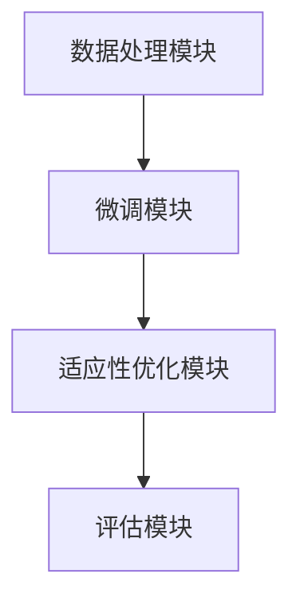

                 


# LLM的微调与适应：针对特定用户群优化

> **关键词**: 大语言模型, 微调, 适应性优化, 用户需求, 特定领域, 优化方法

> **摘要**: 本文深入探讨了大语言模型（LLM）的微调与适应技术，分析了如何针对特定用户群进行优化。从理论基础到算法实现，再到系统设计与项目实战，全面解析了微调与适应的核心概念、方法和应用场景。通过详细的技术分析和实际案例，展示了如何通过微调和适应性优化，提升LLM在特定领域和用户需求下的性能与效果。

---

# 第1章 引言

## 1.1 背景与目标

随着大语言模型（LLM）的快速发展，其在自然语言处理（NLP）领域的应用日益广泛。然而，通用模型往往难以满足特定领域或特定用户群体的个性化需求。例如，医疗领域的专业术语、法律领域的文档处理，以及企业内部的特定流程优化，都需要模型具备更强的适应性。

**目标**：通过微调（Fine-tuning）和适应性优化（Adaptation）技术，使LLM更好地适应特定用户群体的需求，提升模型的性能和用户体验。

---

## 1.2 用户需求分析

针对特定用户群的优化，首先需要明确用户的需求特点。例如：

- **领域专家**：需要模型具备特定领域的专业知识。
- **普通用户**：注重用户体验，要求模型输出简洁易懂。
- **企业用户**：关注模型的稳定性、可扩展性和集成性。

通过对用户需求的分析，我们可以制定相应的优化策略。

---

# 第2章 微调与适应的核心概念

## 2.1 微调的定义与特点

**微调**是指在预训练模型的基础上，通过使用特定领域的数据进行进一步训练，以适应特定任务或领域的过程。其特点包括：

1. **针对性**：专注于特定任务或领域。
2. **高效性**：相比从头训练，微调的计算成本较低。
3. **可解释性**：微调后的模型通常更易于理解和分析。

---

## 2.2 适应性优化的内涵

**适应性优化**是指通过动态调整模型的参数或架构，使其能够适应不同的输入或任务。其核心在于：

1. **动态性**：模型能够根据输入数据动态调整输出。
2. **灵活性**：适应不同场景和用户需求。
3. **高效性**：优化过程通常在推理阶段完成，而非重新训练模型。

---

## 2.3 微调与适应的区别与联系

| **维度** | **微调** | **适应性优化** |
|----------|----------|----------------|
| **目标** | 针对特定领域优化 | 针对特定输入动态调整输出 |
| **过程** | 预训练后，使用特定数据再训练 | 在推理阶段，动态调整模型行为 |
| **应用场景** | 特定领域任务 | 多场景、多用户需求 |

---

# 第3章 微调与适应的算法原理

## 3.1 微调算法的实现流程

### 3.1.1 微调的步骤

1. **数据预处理**：收集并清洗特定领域的数据。
2. **模型加载**：加载预训练好的模型。
3. **微调训练**：使用特定数据对模型进行训练，调整模型参数。
4. **评估与优化**：通过验证集评估模型性能，进一步优化。

### 3.1.2 微调的数学模型

假设预训练模型的损失函数为$L_{pre}$，微调阶段的损失函数为$L_{ft}$，则微调过程可以表示为：

$$
L_{ft} = \lambda L_{pre} + (1-\lambda) L_{new}
$$

其中，$\lambda$为平衡系数，$L_{new}$为新任务的损失函数。

---

## 3.2 适应性优化的核心算法

### 3.2.1 适应性优化的实现流程

1. **输入分析**：分析输入数据的特征。
2. **参数调整**：动态调整模型参数，以适应输入。
3. **输出优化**：生成符合输入需求的输出。

### 3.2.2 适应性优化的数学模型

假设输入为$x$，输出为$y$，模型参数为$\theta$，则适应性优化的目标函数可以表示为：

$$
\theta^* = \arg\min_{\theta} \sum_{i=1}^n (y_i - f_\theta(x_i))^2
$$

其中，$f_\theta$为模型函数，$y_i$为期望输出。

---

# 第4章 微调与适应的系统设计

## 4.1 系统架构设计

### 4.1.1 系统功能模块

1. **数据处理模块**：负责数据预处理和加载。
2. **微调模块**：执行微调训练。
3. **适应性优化模块**：动态调整模型输出。
4. **评估模块**：评估模型性能。

### 4.1.2 系统架构图



---

## 4.2 系统交互设计

### 4.2.1 系统交互流程

1. **用户输入**：用户提供特定领域数据。
2. **数据处理**：数据预处理模块清洗数据。
3. **微调训练**：微调模块对模型进行训练。
4. **动态调整**：适应性优化模块根据输入动态调整模型。
5. **输出结果**：模型生成优化后的输出。

---

# 第5章 项目实战

## 5.1 环境安装与配置

### 5.1.1 环境搭建

- **Python版本**：3.8及以上
- **框架选择**：使用Hugging Face的Transformers库
- **依赖安装**：
  ```bash
  pip install transformers torch
  ```

---

## 5.2 核心代码实现

### 5.2.1 微调模块实现

```python
from transformers import AutoTokenizer, AutoModelForMaskedLM
import torch

# 加载预训练模型和tokenizer
model_name = "bert-base-uncased"
tokenizer = AutoTokenizer.from_pretrained(model_name)
model = AutoModelForMaskedLM.from_pretrained(model_name)

# 微调训练
def train_model(model, tokenizer, train_dataset, val_dataset, num_epochs=3):
    # 定义训练函数
    def training_step(model, inputs):
        outputs = model(**inputs)
        loss = outputs.loss
        return loss

    # 初始化优化器
    optimizer = torch.optim.AdamW(model.parameters(), lr=5e-5)
    model.train()
    for epoch in range(num_epochs):
        for batch in train_dataset:
            optimizer.zero_grad()
            inputs = tokenizer(batch['text'], padding=True, truncation=True, return_tensors='pt')
            loss = training_step(model, inputs)
            loss.backward()
            optimizer.step()
    return model
```

---

## 5.3 适应性优化实现

```python
def adapt_model(model, tokenizer, input_text):
    inputs = tokenizer(input_text, return_tensors='pt')
    with torch.no_grad():
        outputs = model(**inputs)
    return outputs.logits.argmax(dim=-1).tolist()
```

---

## 5.4 实际案例分析

以医疗领域为例，通过微调模型，使其能够识别医学术语并生成专业的诊断建议。通过适应性优化，模型可以根据不同患者的输入动态调整输出内容，提供个性化的医疗建议。

---

# 第6章 总结与展望

## 6.1 总结

本文详细探讨了LLM的微调与适应技术，从理论到实践，分析了如何针对特定用户群体优化模型。通过实际案例和技术实现，展示了微调与适应在提升模型性能和用户体验中的重要作用。

## 6.2 展望

未来，随着技术的进步，微调与适应技术将更加智能化和自动化。通过结合强化学习和元学习，模型将能够更好地适应动态变化的用户需求，进一步提升LLM的泛化能力和适应性。

---

# 作者

**作者：AI天才研究院 & 禅与计算机程序设计艺术**

通过本文，我们希望能够为读者提供深入的技术分析和实践指导，帮助大家更好地理解和应用LLM的微调与适应技术。

