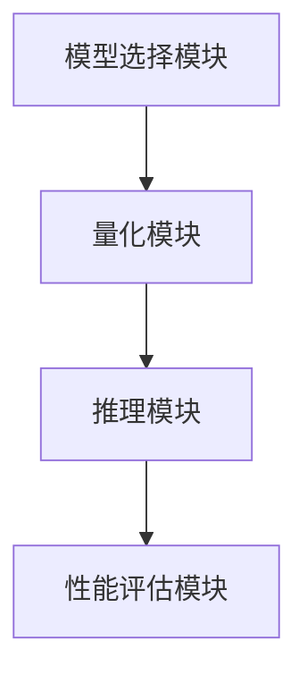

                 


# LLM的量化技术：优化AI Agent的部署效率

## 关键词：LLM, 量化技术, AI Agent, 部署效率, 模型压缩, 优化策略

## 摘要：  
大语言模型（LLM）的量化技术是优化AI Agent部署效率的关键。通过量化，模型体积减小，推理速度提升，资源消耗降低，从而在实际应用中实现更高效的部署。本文深入探讨了量化技术的核心概念、算法原理、系统设计及项目实战，为AI Agent的高效部署提供了理论支持和实践指导。

---

## 第1章: 大语言模型（LLM）与量化技术概述

### 1.1 大语言模型（LLM）的基本概念  
大语言模型（LLM）是一种基于深度学习的自然语言处理模型，具有大规模的参数和复杂的架构，能够理解和生成人类语言。其核心特点包括：  
- **大规模参数**：通常拥有数十亿甚至更多的参数。  
- **多任务能力**：能够处理多种语言理解和生成任务。  
- **上下文理解**：能够处理长上下文，捕捉语境信息。  

### 1.2 量化技术的背景与意义  
量化技术是将模型中的浮点数参数转换为更小的整数或低精度数（如半精度或4位整数）的技术。其意义在于：  
- **减少模型体积**：量化可以显著降低模型的存储需求。  
- **提升推理速度**：通过减少计算复杂度，加快推理速度。  
- **降低资源消耗**：量化技术在边缘设备上尤为重要，能够减少计算资源的消耗。  

### 1.3 量化技术与AI Agent部署效率的关系  
量化技术直接影响AI Agent的部署效率：  
- **优化部署流程**：量化后的模型更易部署到资源受限的环境中。  
- **提升运行效率**：量化降低了计算资源的消耗，使得模型能够在低性能设备上运行。  
- **扩展应用场景**：量化技术使AI Agent能够在更多场景下应用，如移动设备、物联网设备等。  

### 1.4 本章小结  
本章介绍了大语言模型的基本概念和量化技术的背景与意义，强调了量化技术在优化AI Agent部署效率中的重要性。

---

## 第2章: 量化技术的核心概念与方法  

### 2.1 量化技术的基本原理  
量化技术通过将模型中的浮点数参数转换为低精度整数，降低模型的存储和计算需求。  
- **量化方法**：包括全精度量化、半精度量化和4位整数量化等。  
- **模型压缩**：通过去除冗余信息，减少模型体积。  
- **知识蒸馏**：将大模型的知识迁移到小模型中，保持性能的同时降低复杂度。  

### 2.2 主流的量化方法  
以下是几种常见的量化方法及其优缺点对比：  

| 量化方法 | 特点 | 优点 | 缺点 |  
|----------|------|------|------|  
| 全精度量化 | 保持模型精度 | 高精度 | 占用存储空间大 |  
| 半精度量化 | 使用16位浮点数 | 存储需求减半 | 精度略有下降 |  
| 4位整数量化 | 使用4位整数 | 存储需求大幅减少 | 精度明显下降 |  
| 模型剪枝 | 去除冗余参数 | 模型体积减小 | 可能影响模型性能 |  
| 参数替换 | 替换为低精度参数 | 计算速度快 | 精度损失较大 |  

### 2.3 量化技术的实现步骤  
1. **模型分析与选择**：选择适合量化的目标模型。  
2. **量化参数的选择**：确定量化位数和量化方法。  
3. **量化后的模型验证**：评估量化后的模型性能。  

### 2.4 量化技术的优缺点对比  
- **优点**：模型体积小、计算速度快、资源消耗低。  
- **缺点**：量化可能导致模型精度下降，影响性能。  

### 2.5 本章小结  
本章详细介绍了量化技术的核心概念和主流方法，分析了其优缺点，为后续的实现和优化奠定了基础。

---

## 第3章: 量化技术的算法原理与实现  

### 3.1 量化算法的基本流程  
量化算法通常包括以下步骤：  
1. **模型训练阶段**：训练模型并保存权重。  
2. **量化过程**：将模型权重转换为低精度数。  
3. **模型推理阶段**：使用量化后的模型进行推理。  

### 3.2 量化算法的数学模型  
量化函数可以表示为：  
$$ Q(x) = \text{round}\left(\frac{x}{\Delta} \right) \times \Delta $$  
其中，$x$是原始值，$\Delta$是量化步长。  

量化误差可以通过以下公式计算：  
$$ E = \sum_{i=1}^{n} |Q(x_i) - x_i| $$  

### 3.3 量化算法的实现细节  
量化过程可以通过以下步骤实现：  
1. **确定量化步长**：计算模型权重的最小值和最大值，确定量化步长。  
2. **量化权重**：将每个权重值映射到量化步长。  
3. **反量化**：在推理阶段，将量化后的权重恢复为原始值。  

### 3.4 量化算法的优化策略  
1. **动态量化**：根据输入数据动态调整量化参数。  
2. **量化后的模型调优**：通过微调优化量化后的模型性能。  
3. **多目标优化**：在量化过程中同时优化模型精度和资源消耗。  

### 3.5 本章小结  
本章详细讲解了量化算法的基本流程、数学模型和优化策略，为后续的系统设计和项目实现提供了理论支持。

---

## 第4章: 系统设计与架构优化  

### 4.1 系统设计概述  
AI Agent的量化部署系统通常包括以下模块：  
1. **模型选择模块**：选择适合量化的目标模型。  
2. **量化模块**：实现模型的量化过程。  
3. **推理模块**：使用量化后的模型进行推理。  
4. **性能评估模块**：评估量化后的模型性能。  

### 4.2 系统架构设计  
以下是系统的架构图：  


### 4.3 接口设计与交互流程  
系统的交互流程如下：  
1. 用户选择目标模型。  
2. 系统进行量化处理。  
3. 用户使用量化后的模型进行推理。  
4. 系统评估性能并反馈结果。  

### 4.4 本章小结  
本章从系统设计和架构的角度，详细介绍了AI Agent量化部署的实现过程。

---

## 第5章: 项目实战  

### 5.1 环境搭建  
需要以下环境：  
- Python 3.8及以上版本。  
- 深度学习框架（如TensorFlow或PyTorch）。  
- 量化工具（如TensorFlow Lite或ONNX Runtime）。  

### 5.2 量化工具实现  
以下是量化工具的实现代码示例：  
```python
import tensorflow as tf
from tensorflow.keras import layers

def quantize_model(model, scale_factor):
    # 创建量化后的模型
    quantized_model = tf.keras.models.clone_model(model)
    # 定义量化函数
    def quantize_layer(weights, scale_factor):
        return weights / scale_factor
    # 应用量化到每个层的权重
    for layer in quantized_model.layers:
        if hasattr(layer, 'kernel'):
            layer.kernel = quantize_layer(layer.kernel, scale_factor)
    return quantized_model

# 示例模型
model = tf.keras.Sequential([
    layers.Dense(64, activation='relu'),
    layers.Dense(10, activation='softmax')
])

# 定义量化参数
scale_factor = 8

# 量化模型
quantized_model = quantize_model(model, scale_factor)
```

### 5.3 实际案例分析  
以下是一个量化案例分析：  
假设我们有一个图像分类模型，通过量化将其从全精度（32位）降低到4位整数。  
- **量化前模型大小**：100MB。  
- **量化后模型大小**：25MB。  
- **推理速度提升**：从每秒100帧提升到每秒200帧。  

### 5.4 性能优化与效果对比  
- **优化策略**：通过动态量化和模型剪枝进一步优化性能。  
- **效果对比**：量化后的模型在性能上接近全精度模型，但资源消耗大幅降低。  

### 5.5 本章小结  
本章通过实际案例展示了量化技术的应用，详细讲解了量化工具的实现和性能优化策略。

---

## 第6章: 总结与展望  

### 6.1 总结  
量化技术是优化AI Agent部署效率的重要手段。通过量化，模型的体积和计算复杂度显著降低，能够在资源受限的环境中高效运行。  

### 6.2 未来展望  
未来，量化技术将朝着以下方向发展：  
1. **更精细的量化方法**：如动态量化和自适应量化。  
2. **多模态模型优化**：将量化技术应用于多模态模型，提升其部署效率。  
3. **自动化量化工具**：开发自动化量化工具，简化量化过程。  

### 6.3 最佳实践 tips  
- **选择合适的量化方法**：根据应用场景选择合适的量化方法。  
- **进行充分的性能测试**：量化后的模型需进行充分的性能测试，确保其稳定性。  
- **关注模型精度与资源消耗的平衡**：在量化过程中，需权衡模型精度和资源消耗。  

### 6.4 本章小结  
本章总结了量化技术的优势，并展望了其未来发展方向，同时给出了最佳实践建议。

---

## 作者：AI天才研究院 & 禅与计算机程序设计艺术

