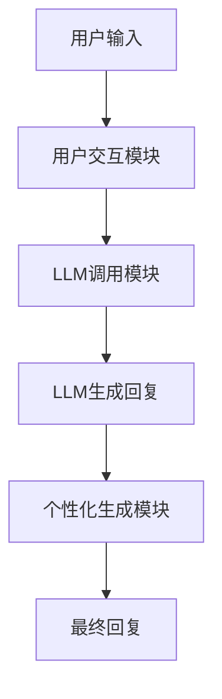
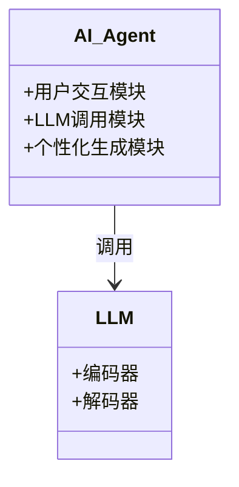

                 


# LLM驱动的AI Agent个性化对话生成

## 关键词：
- 大语言模型
- AI Agent
- 个性化对话生成
- 自然语言处理
- 对话系统

## 摘要：
LLM驱动的AI Agent个性化对话生成是一种结合了大语言模型（LLM）与人工智能代理技术的创新方法。通过分析对话生成的核心原理、系统架构设计以及实际项目实现，本文深入探讨了如何利用LLM提升AI Agent的对话能力，实现个性化的用户体验。文章从背景介绍、核心概念、算法原理到系统架构设计，详细阐述了每个环节的技术细节，并通过实际案例分析和代码实现，为读者提供了全面的技术指导。最终，本文总结了开发中的注意事项，并展望了未来的发展方向。

---

# 正文

## 第一部分：引言

## 第1章：LLM与AI Agent的基本概念

### 1.1 LLM的基本概念

#### 1.1.1 大语言模型的定义
大语言模型（Large Language Model, LLM）是指基于深度学习训练的大型神经网络模型，能够理解和生成人类语言。LLM通常基于Transformer架构，通过大量的文本数据进行预训练，具有强大的上下文理解和生成能力。

#### 1.1.2 LLM的核心特点
- **大规模训练数据**：通常使用 billions of parameters 的模型，如GPT-3、GPT-4等。
- **上下文理解**：能够理解上下文关系，生成连贯的对话。
- **多任务能力**：可以在多种任务上表现出色，如翻译、问答、文本生成等。

#### 1.1.3 LLM与传统NLP模型的区别
| 特性 | LLM | 传统NLP模型 |
|------|------|-------------|
| 参数量 | 大型（ billions） | 小型（ millions） |
| 上下文理解 | 强大 | 较弱 |
| 多任务能力 | 高 | 低 |

### 1.2 AI Agent的基本概念

#### 1.2.1 AI Agent的定义
AI Agent（人工智能代理）是指能够感知环境并采取行动以实现目标的智能实体。它可以是一个软件程序，也可以是物理设备，通过与用户的交互完成特定任务。

#### 1.2.2 AI Agent的主要功能
- **感知环境**：通过传感器或用户输入获取信息。
- **决策与推理**：基于获取的信息做出决策。
- **执行操作**：根据决策执行具体的动作，如生成对话、发送邮件等。

#### 1.2.3 AI Agent的应用场景
- **智能助手**：如Siri、Alexa等。
- **客服机器人**：用于在线客服对话。
- **教育辅助**：提供个性化学习建议。

### 1.3 LLM驱动的AI Agent

#### 1.3.1 LLM在AI Agent中的作用
- **对话生成**：利用LLM生成自然流畅的对话内容。
- **上下文理解**：通过LLM理解对话的历史和上下文。
- **动态调整**：根据用户反馈动态调整对话内容。

#### 1.3.2 LLM驱动的对话生成优势
- **生成能力强**：能够生成多样化、个性化的对话内容。
- **理解能力强**：能够准确理解用户的意图和情感。
- **可扩展性高**：适用于多种对话场景。

#### 1.3.3 个性化对话生成的定义与目标
个性化对话生成是指根据用户的个性特征、兴趣爱好和对话历史，生成符合用户独特风格的对话内容。目标是提升用户体验，使对话更加自然和贴切。

---

## 第二部分：LLM与对话生成基础

## 第2章：大语言模型的原理与实现

### 2.1 LLM的训练方法

#### 2.1.1 监督学习与无监督学习
- **监督学习**：基于标注数据进行训练。
- **无监督学习**：基于未标注数据进行自监督学习。

#### 2.1.2 基于Transformer的架构
- **Transformer结构**：由编码器和解码器组成，通过自注意力机制捕捉上下文关系。
- **自注意力机制**：公式如下：
  $$
  \text{Attention}(Q, K, V) = \text{softmax}\left(\frac{QK^T}{\sqrt{d_k}}\right)V
  $$

#### 2.1.3 模型的训练流程
1. 数据预处理：清洗和格式化数据。
2. 模型初始化：随机初始化模型参数。
3. 模型训练：通过反向传播优化参数。
4. 模型评估：在验证集上评估模型性能。

### 2.2 对话生成的基本原理

#### 2.2.1 基于概率的生成方法
- **最大似然估计**：选择概率最高的生成序列。
- **Beam Search**：通过搜索生成最优序列。

#### 2.2.2 基于规则的生成方法
- **预定义规则**：根据特定规则生成对话内容。

#### 2.2.3 基于检索的生成方法
- **检索对话历史**：根据对话历史生成回复。

---

## 第三部分：个性化对话生成的核心概念

## 第3章：LLM驱动的AI Agent结构与工作流程

### 3.1 LLM驱动的AI Agent结构

#### 3.1.1 输入模块
- **用户输入**：接收用户的输入，如文本或语音。
- **预处理**：对输入进行分词、去停用词等处理。

#### 3.1.2 处理模块
- **LLM调用**：将用户输入传递给LLM进行处理。
- **对话历史维护**：记录对话历史，用于后续生成。

#### 3.1.3 输出模块
- **生成回复**：根据处理结果生成回复。
- **反馈机制**：收集用户反馈，优化生成策略。

### 3.2 个性化对话生成的关键技术

#### 3.2.1 用户画像构建
- **用户特征提取**：提取用户的年龄、性别、兴趣爱好等特征。
- **用户偏好分析**：分析用户的偏好，生成个性化内容。

#### 3.2.2 对话历史分析
- **历史记录检索**：检索对话历史，生成连贯的回复。
- **情感分析**：分析用户情感，生成合适的情感回复。

---

## 第四部分：系统架构设计

## 第4章：系统架构与实现

### 4.1 系统功能设计

#### 4.1.1 功能模块划分
- **用户交互模块**：负责与用户的交互。
- **LLM调用模块**：负责调用LLM生成回复。
- **个性化生成模块**：负责个性化对话生成。

#### 4.1.2 功能流程图


### 4.2 系统架构设计

#### 4.2.1 系统架构图


---

## 第五部分：项目实战

## 第5章：项目实战与案例分析

### 5.1 环境搭建

#### 5.1.1 安装依赖
```bash
pip install transformers torch
```

#### 5.1.2 下载LLM模型
```bash
wget https://huggingface.co/gpt2/model.tar.gz
```

### 5.2 核心实现

#### 5.2.1 初始化模型
```python
from transformers import AutoTokenizer, AutoModelForCausalLM
tokenizer = AutoTokenizer.from_pretrained('gpt2')
model = AutoModelForCausalLM.from_pretrained('gpt2')
```

#### 5.2.2 生成对话
```python
def generate_response(input_text):
    inputs = tokenizer.encode(input_text, return_tensors='pt')
    outputs = model.generate(inputs, max_length=50)
    response = tokenizer.decode(outputs[0], skip_special_tokens=True)
    return response
```

### 5.3 案例分析

#### 5.3.1 对话历史分析
```python
# 示例对话历史
history = [
    "用户：今天天气怎么样？",
    "AI：北京今天天气晴朗。",
    "用户：我想去公园散步。"
]
```

---

## 第六部分：最佳实践与未来展望

## 第6章：开发经验总结

### 6.1 最佳实践

#### 6.1.1 模型优化
- **参数调整**：根据具体任务调整模型参数。
- **微调训练**：在特定领域数据上进行微调。

#### 6.1.2 安全性考虑
- **内容过滤**：避免生成敏感或不当内容。
- **用户隐私保护**：确保用户数据安全。

### 6.2 未来展望

#### 6.2.1 技术发展
- **更强大的LLM**：如GPT-4、PaLM等。
- **多模态对话生成**：结合视觉、听觉等多模态信息。

#### 6.2.2 应用场景扩展
- **教育领域**：提供个性化学习支持。
- **医疗领域**：提供个性化的医疗建议。

---

# 结论

LLM驱动的AI Agent个性化对话生成是一项前沿技术，通过结合大语言模型与AI代理技术，能够实现高度个性化的对话生成。随着技术的不断发展，未来将会有更多创新的应用场景和方法，为人类带来更智能、更便捷的交互体验。

---

# 作者

作者：AI天才研究院/AI Genius Institute & 禅与计算机程序设计艺术/Zen And The Art of Computer Programming

