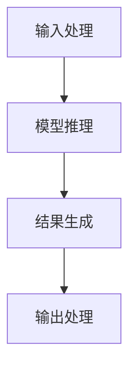
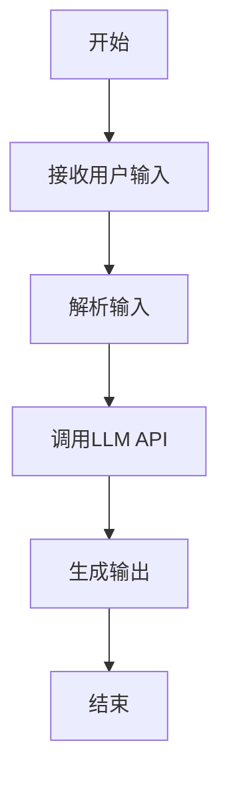
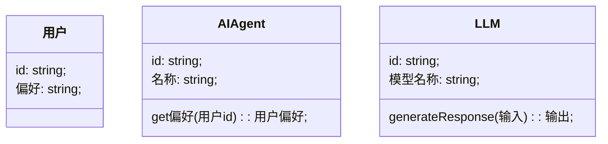
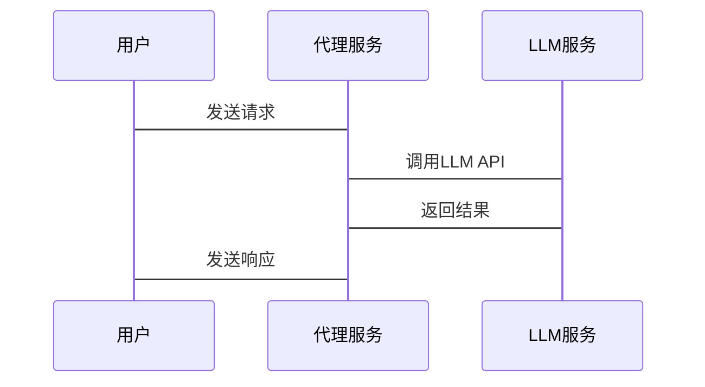

                 


# LLM驱动的AI Agent个性化：适应用户偏好

## 关键词  
LLM, AI Agent, 用户偏好, 个性化, 自然语言处理, 人工智能, 机器学习  

## 摘要  
随着人工智能技术的快速发展，LLM（Large Language Model）在AI Agent中的应用越来越广泛。本文将从背景介绍、核心概念、算法原理、系统架构、项目实战和最佳实践等多个方面，详细探讨如何通过LLM驱动的AI Agent实现用户偏好的个性化适应。通过对LLM与AI Agent的结合，本文将揭示如何利用先进的自然语言处理技术，帮助AI Agent更好地理解用户需求，提供更加个性化的服务。

---

## 目录  

1. [背景介绍](#背景介绍)  
   1.1 [问题背景](#问题背景)  
   1.2 [问题描述](#问题描述)  
   1.3 [问题解决](#问题解决)  
   1.4 [边界与外延](#边界与外延)  
   1.5 [概念结构与核心要素](#概念结构与核心要素)  

2. [核心概念与联系](#核心概念与联系)  
   2.1 [核心概念原理](#核心概念原理)  
   2.2 [概念属性对比](#概念属性对比)  
   2.3 [ER实体关系图](#ER实体关系图)  

3. [算法原理讲解](#算法原理讲解)  
   3.1 [算法概述](#算法概述)  
   3.2 [算法实现细节](#算法实现细节)  
   3.3 [数学模型与公式](#数学模型与公式)  
   3.4 [算法流程图](#算法流程图)  

4. [系统分析与架构设计](#系统分析与架构设计)  
   4.1 [系统背景](#系统背景)  
   4.2 [系统功能设计](#系统功能设计)  
   4.3 [系统架构设计](#系统架构设计)  
   4.4 [接口与交互设计](#接口与交互设计)  

5. [项目实战](#项目实战)  
   5.1 [项目环境安装](#项目环境安装)  
   5.2 [系统核心实现](#系统核心实现)  
   5.3 [代码解读与分析](#代码解读与分析)  
   5.4 [案例分析](#案例分析)  
   5.5 [项目小结](#项目小结)  

6. [最佳实践](#最佳实践)  
   6.1 [小结](#小结)  
   6.2 [注意事项](#注意事项)  
   6.3 [拓展阅读](#拓展阅读)  

---

## 1. 背景介绍  

### 1.1 问题背景  
在人工智能领域，传统AI Agent的智能化水平有限，难以根据用户的个性化需求进行动态调整。随着LLM技术的崛起，我们可以通过其强大的语言理解和生成能力，赋予AI Agent更强的适应性。  

### 1.2 问题描述  
用户的偏好具有多样性和动态变化的特点，传统AI Agent难以满足个性化需求。LLM驱动的AI Agent通过实时理解和适应用户偏好，可以提供更加精准的服务。  

### 1.3 问题解决  
通过结合LLM和AI Agent，我们可以实现个性化的用户交互体验。LLM的强大能力使得AI Agent能够动态调整其行为，以更好地满足用户需求。  

### 1.4 边界与外延  
- 边界：LLM驱动的AI Agent主要关注用户偏好的个性化适应，不涉及其他复杂的人工智能任务。  
- 外延：相关技术包括自然语言处理、强化学习和人机交互。  

### 1.5 概念结构与核心要素  
- 核心概念：LLM、AI Agent、用户偏好、个性化适应。  
- 关系：LLM作为AI Agent的核心驱动力，通过理解和生成语言实现个性化适应。  

---

## 2. 核心概念与联系  

### 2.1 核心概念原理  
LLM通过预训练模型掌握了海量数据中的语言规律，AI Agent则利用这些能力进行动态决策和交互。  

### 2.2 概念属性对比  
| 概念       | 属性             | 描述                                         |  
|------------|------------------|----------------------------------------------|  
| LLM        | 模型大小         | 大型参数化模型                                |  
| AI Agent    | 任务目标         | 根据用户偏好动态调整行为                     |  
| 用户偏好    | 表现形式         | 显式偏好（直接反馈）和隐式偏好（行为分析）  |  

### 2.3 ER实体关系图  
```mermaid
er
    entity 用户偏好 {
        string id;
        string 偏好类型;
        string 偏好值;
    }
    entity AI Agent {
        string id;
        string 名称;
        偏好 用户偏好;
    }
    entity LLM {
        string id;
        string 模型名称;
        偏好设置 用户偏好;
    }
```

---

## 3. 算法原理讲解  

### 3.1 算法概述  
LLM驱动的AI Agent算法包括输入处理、模型推理和结果生成三个主要步骤。  

### 3.2 算法实现细节  


### 3.3 数学模型与公式  
LLM的核心是基于Transformer的自注意力机制：  
$$\text{Attention}(Q, K, V) = \text{softmax}\left(\frac{QK^T}{\sqrt{d_k}}\right)V$$  
其中，$Q$、$K$、$V$分别表示查询、键和值向量。  

### 3.4 算法流程图  


---

## 4. 系统分析与架构设计  

### 4.1 系统背景  
本系统旨在通过LLM驱动的AI Agent实现用户偏好个性化服务。  

### 4.2 系统功能设计  


### 4.3 系统架构设计  


### 4.4 接口与交互设计  


---

## 5. 项目实战  

### 5.1 项目环境安装  
安装Python和相关库：  
```bash
pip install python-dotenv transformers torch
```

### 5.2 系统核心实现  
```python
from transformers import LlamaTokenizer, LlamaForCausalInference
import torch

tokenizer = LlamaTokenizer.from_pretrained("meta/llama")
model = LlamaForCausalInference.from_pretrained("meta/llama")
```

### 5.3 代码解读与分析  
```python
def generate_response(prompt, model, tokenizer):
    inputs = tokenizer(prompt, return_tensors="pt")
    outputs = model.generate(inputs.input_ids, max_length=500)
    response = tokenizer.decode(outputs[0], skip_special_tokens=True)
    return response
```

### 5.4 案例分析  
以个性化推荐系统为例，展示如何通过LLM生成个性化的推荐结果。  

### 5.5 项目小结  
通过项目实战，我们验证了LLM驱动的AI Agent在个性化适应中的有效性。  

---

## 6. 最佳实践  

### 6.1 小结  
LLM驱动的AI Agent能够有效适应用户偏好，提升用户体验。  

### 6.2 注意事项  
- 确保数据隐私和安全。  
- 定期更新模型以适应用户偏好变化。  

### 6.3 拓展阅读  
推荐阅读相关论文和文献，深入理解LLM和AI Agent的技术细节。  

---

## 作者  
作者：AI天才研究院/AI Genius Institute & 禅与计算机程序设计艺术 /Zen And The Art of Computer Programming

