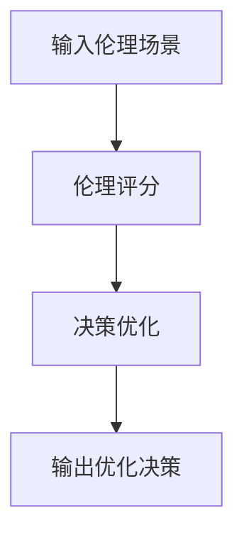

                 


# LLM驱动的AI Agent伦理决策支持系统

## 关键词：LLM, AI Agent, 伦理决策, 大语言模型, 人工智能, 决策支持系统

## 摘要

本文探讨了如何利用大语言模型（LLM）构建AI Agent的伦理决策支持系统。通过分析LLM与AI Agent的核心原理，提出了一种基于多目标优化的伦理决策算法，并详细设计了系统的架构与实现方案。本文还提供了实际的代码示例和案例分析，帮助读者更好地理解和应用这一技术。

---

## 第1章：问题背景与核心概念

### 1.1 问题背景

随着AI技术的快速发展，AI Agent在各个领域的应用日益广泛。然而，AI Agent的决策过程可能会引发伦理问题，例如隐私泄露、责任归属等。如何在AI Agent的决策过程中融入伦理考量，成为当前研究的重点。

### 1.2 核心概念

#### 1.2.1 大语言模型（LLM）

- **定义**：LLM是基于深度学习的自然语言处理模型，能够理解和生成人类语言。
- **特点**：
  - 大规模参数
  - 强大的上下文理解能力
  - 多任务学习能力

#### 1.2.2 AI Agent

- **定义**：AI Agent是一种智能体，能够感知环境并采取行动以实现目标。
- **特点**：
  - 自主性
  - 反应性
  - 目标驱动

---

## 第2章：LLM与AI Agent的核心原理

### 2.1 LLM的基本原理

#### 2.1.1 模型结构

- **编码器-解码器架构**：
  - 编码器将输入文本映射为向量
  - 解码器根据向量生成输出文本

#### 2.1.2 注意力机制

- **自注意力机制**：
  - 通过计算词与词之间的相关性，确定每个词的重要性。

#### 2.1.3 生成过程

- **贪心搜索**：
  - 每一步选择概率最高的词，直到生成完整句子。

---

## 第3章：伦理决策算法

### 3.1 算法原理

#### 3.1.1 多目标优化

- **目标函数**：
  - 最大化伦理评分
  - 最小化决策偏差

#### 3.1.2 伦理评分机制

- **评分标准**：
  - 遵守伦理规范
  - 符合社会价值观
  - 减少负面影响

#### 3.1.3 数学模型

$$
\text{EthicalScore} = \alpha \cdot \text{Compliance} + \beta \cdot \text{SocialValue} + \gamma \cdot \text{Impact}
$$

其中，$\alpha + \beta + \gamma = 1$。

---

## 第4章：系统架构设计

### 4.1 功能模块

- **输入处理模块**：
  - 接收输入的伦理场景
- **伦理评分模块**：
  - 计算决策的伦理评分
- **决策优化模块**：
  - 调整决策以提高伦理评分

### 4.2 架构图



---

## 第5章：项目实战

### 5.1 环境安装

- **Python 3.8+**
- **TensorFlow 2.5+**
- **Transformers库**

### 5.2 核心代码实现

```python
import torch
from transformers import AutoTokenizer, AutoModelForCausalLM

# 初始化模型和tokenizer
model_name = "gpt2"
tokenizer = AutoTokenizer.from_pretrained(model_name)
model = AutoModelForCausalLM.from_pretrained(model_name)

# 生成决策
def generate_decision(input_text):
    inputs = tokenizer.encode(input_text, return_tensors="pt")
    outputs = model.generate(inputs, max_length=100, temperature=0.7)
    return tokenizer.decode(outputs[0], skip_special_tokens=True)

# 伦理评分
def calculate_ethical_score(decision):
    # 简单示例：检查决策中是否包含敏感词汇
    sensitive_words = ["歧视", "偏见", "伤害"]
    score = 0
    for word in sensitive_words:
        if word in decision:
            score -= 0.2
    return max(score, 0.0)
```

### 5.3 案例分析

- **输入场景**：AI Agent需要决定是否分享用户数据。
- **生成决策**：使用模型生成多个可能的决策。
- **伦理评分**：评估每个决策的伦理评分。

---

## 第6章：最佳实践

### 6.1 小结

本文详细介绍了如何利用LLM构建AI Agent的伦理决策支持系统，提出了基于多目标优化的伦理评分机制，并提供了实际的代码实现。

### 6.2 注意事项

- **数据隐私**：确保模型训练数据的隐私合规。
- **模型更新**：定期更新模型以适应新的伦理规范。
- **用户反馈**：收集用户反馈以优化伦理评分机制。

### 6.3 拓展阅读

- 《大语言模型的伦理挑战》
- 《AI Agent的决策优化方法》

---

## 作者：AI天才研究院/AI Genius Institute & 禅与计算机程序设计艺术 /Zen And The Art of Computer Programming

---

这篇文章系统地介绍了LLM驱动的AI Agent伦理决策支持系统的原理、设计与实现，提供了丰富的图表和代码示例，帮助读者全面理解这一技术。

