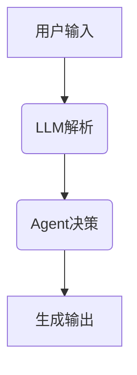
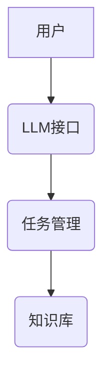
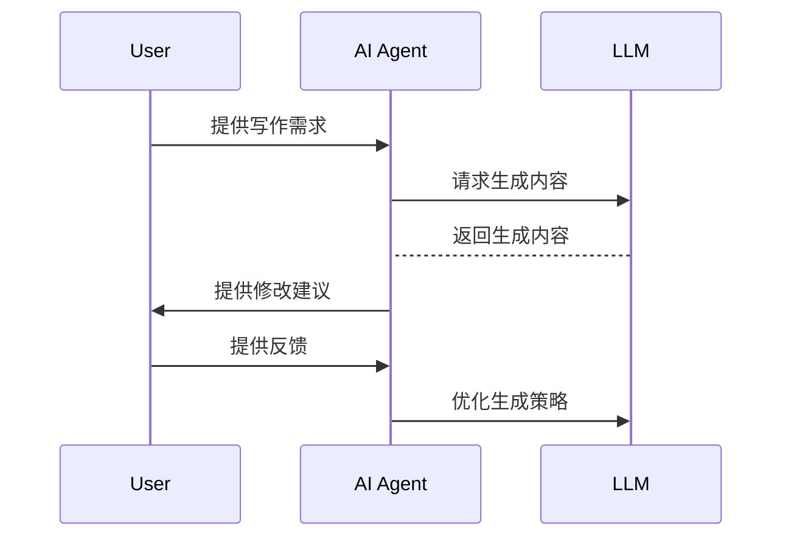

                 


# LLM驱动的AI Agent创意写作助手

## 关键词：
- 大语言模型（LLM）
- AI Agent
- 创意写作
- 技术实现
- 系统架构

## 摘要：
本文探讨了如何利用大语言模型（LLM）驱动的AI Agent来提升创意写作的效率与质量。通过分析LLM和AI Agent的核心原理，结合实际项目案例，详细讲解了系统的架构设计、算法实现及优化策略，为读者提供从理论到实践的全面指导。

---

## 第1章: LLM驱动的AI Agent创意写作助手概述

### 1.1 LLM与AI Agent的基本概念
#### 1.1.1 大语言模型（LLM）的定义
大语言模型（Large Language Model，LLM）是基于深度学习的自然语言处理模型，如GPT系列、BERT系列等。这些模型通过大量数据的预训练，能够理解并生成人类语言。

#### 1.1.2 AI Agent的核心概念
AI Agent（人工智能代理）是一种智能系统，能够感知环境、执行任务并做出决策。它可以理解用户的意图，并通过交互提供服务。

#### 1.1.3 LLM驱动AI Agent的创新点
LLM为AI Agent提供了强大的自然语言处理能力，使其能够更自然地与用户互动，并生成高质量的内容。

### 1.2 技术背景与发展趋势
#### 1.2.1 大语言模型的崛起
近年来，随着计算能力和数据量的提升，大语言模型在NLP领域取得了显著进展。

#### 1.2.2 AI Agent在创意写作中的应用潜力
AI Agent可以辅助作家生成灵感、校对文本、优化结构，甚至帮助创作特定风格的作品。

#### 1.2.3 当前技术发展面临的挑战
模型的计算成本高、生成内容的质量不稳定以及用户隐私问题。

### 1.3 应用价值与目标
#### 1.3.1 创意写作的痛点分析
创意写作需要灵感、效率和质量，但作家常常面临创作瓶颈和时间压力。

#### 1.3.2 LLM驱动AI Agent的解决方案
通过AI Agent辅助，提升写作效率，拓展创作思路，优化文本质量。

#### 1.3.3 目标与预期成果
构建一个高效、智能的AI写作助手，帮助用户完成高质量的创意写作任务。

## 第2章: LLM与AI Agent的核心概念与联系

### 2.1 LLM的原理与特点
#### 2.1.1 大语言模型的工作流程
1. 预训练：通过大量数据学习语言模式。
2. 微调：针对特定任务进行优化。

#### 2.1.2 LLM的核心技术特征
- 参数量大
- 预训练+微调模式
- 基于Transformer架构

#### 2.1.3 LLM的优缺点分析
优点：生成能力强、可定制化；缺点：计算成本高、可能产生不准确内容。

### 2.2 AI Agent的结构与功能
#### 2.2.1 AI Agent的基本组成
1. 感知模块：接收用户输入。
2. 决策模块：分析需求，生成响应。
3. 执行模块：输出结果。

#### 2.2.2 AI Agent的功能模块
- 用户意图识别
- 内容生成
- 任务管理

#### 2.2.3 AI Agent的交互方式
- 文本交互
- 多轮对话

### 2.3 LLM与AI Agent的关系
#### 2.3.1 LLM作为AI Agent的核心驱动力
LLM为AI Agent提供了语言理解与生成能力。

#### 2.3.2 AI Agent作为LLM的应用载体
AI Agent将LLM的能力应用于具体场景。

#### 2.3.3 两者结合的协同效应
提升AI Agent的自然语言处理能力，增强用户体验。

### 2.4 核心概念对比分析
#### 2.4.1 LLM与传统NLP模型的对比
| 特性       | LLM          | 传统NLP模型 |
|------------|--------------|--------------|
| 参数量     | 大           | 小           |
| 模型能力   | 强大          | 较弱          |
| 任务适用性 | 多任务        | 单任务        |

#### 2.4.2 AI Agent与传统任务执行系统的对比
| 特性       | AI Agent      | 传统任务系统  |
|------------|---------------|---------------|
| 智能性     | 高            | 低            |
| 交互性     | 强            | 弱            |
| 自适应性   | 强            | 弱            |

#### 2.4.3 LLM驱动AI Agent的独特优势
- 高效性：快速响应
- 智能性：深度理解用户需求
- 创新性：生成独特内容

## 第3章: LLM驱动的AI Agent算法原理

### 3.1 大语言模型的训练与优化
#### 3.1.1 监督微调（Fine-tuning）流程
1. 预训练：在通用数据集上训练基础模型。
2. 微调：在特定任务数据上进行优化。

#### 3.1.2 生成机制
- 基于概率的生成：通过解码器生成序列。
- 注意力机制：捕捉上下文信息。

#### 3.1.3 模型优化策略
- 参数调整：学习率、批次大小
- 增强训练数据：多样化的数据

### 3.2 AI Agent的决策机制
#### 3.2.1 基于规则的决策
- 预定义规则：如关键词匹配
- 优点：简单高效
- 缺点：缺乏灵活性

#### 3.2.2 基于强化学习的决策
- 策略网络：学习最优策略
- 奖励函数：定义评价标准

#### 3.2.3 深度学习与规则结合
- 深度学习模型辅助规则决策
- 优化性能，提升准确率

### 3.3 LLM与AI Agent协同工作的算法流程
#### 3.3.1 算法流程图


#### 3.3.2 数学公式
- 交叉熵损失函数：
$$ \text{Loss} = -\sum_{i=1}^{n} \text{log} p(y_i|x_i) $$

### 3.4 代码实现
#### 3.4.1 环境配置
```python
import torch
import torch.nn as nn
import torch.optim as optim
```

#### 3.4.2 模型训练
```python
def train(model, optimizer, criterion, train_loader):
    for epoch in range(num_epochs):
        for inputs, labels in train_loader:
            outputs = model(inputs)
            loss = criterion(outputs, labels)
            loss.backward()
            optimizer.step()
            optimizer.zero_grad()
```

## 第4章: LLM驱动的AI Agent系统分析与架构设计

### 4.1 系统分析
#### 4.1.1 问题场景介绍
用户需要一个智能写作助手，能够实时生成内容并提供修改建议。

#### 4.1.2 项目介绍
构建一个基于LLM的写作助手，提供创意写作支持。

### 4.2 系统功能设计
#### 4.2.1 功能模块
1. LLM接口模块
2. 任务管理模块
3. 知识库模块

#### 4.2.2 功能流程
用户输入需求，系统通过LLM生成内容，用户反馈优化建议，系统调整生成策略。

### 4.3 系统架构设计
#### 4.3.1 系统架构图


#### 4.3.2 实体关系图
```mermaid
entity User
entity LLM
entity AI Agent
User --> LLM: 请求生成
LLM --> AI Agent: 返回内容
AI Agent --> User: 提供修改建议
```

### 4.4 系统接口设计
#### 4.4.1 接口定义
- 输入接口：用户输入文本
- 输出接口：生成文本、修改建议

#### 4.4.2 交互流程
用户输入需求，系统生成内容，用户反馈，系统优化。

### 4.5 交互流程图


## 第5章: LLM驱动的AI Agent项目实战

### 5.1 环境安装
#### 5.1.1 安装Python
```bash
python --version
```

#### 5.1.2 安装依赖
```bash
pip install torch transformers
```

### 5.2 核心代码实现
#### 5.2.1 LLM接口实现
```python
from transformers import GPT2LMHeadModel, GPT2Tokenizer

model = GPT2LMHeadModel.from_pretrained('gpt2')
tokenizer = GPT2Tokenizer.from_pretrained('gpt2')
```

#### 5.2.2 AI Agent实现
```python
class AIAssistant:
    def __init__(self, model, tokenizer):
        self.model = model
        self.tokenizer = tokenizer

    def generate(self, input_text, max_length=50):
        inputs = self.tokenizer(input_text, return_tensors='pt')
        outputs = self.model.generate(inputs.input_ids, max_length=max_length)
        return self.tokenizer.decode(outputs[0], skip_special_tokens=True)
```

#### 5.2.3 交互流程实现
```python
assistant = AIAssistant(model, tokenizer)
user_input = input("请输入你的需求：")
response = assistant.generate(user_input)
print("生成内容：", response)
```

### 5.3 代码应用解读与分析
- 代码实现了AI Agent与LLM的交互，用户输入需求，系统生成内容。

### 5.4 实际案例分析
- 案例：生成小说大纲
- 用户输入：创作一个科幻小说，主题是人工智能失控。
- 系统输出：生成详细的大纲。

### 5.5 项目总结与优化建议
- 系统实现了一个基本的AI写作助手，后续可以优化生成质量，增加多模态支持。

## 第6章: LLM驱动的AI Agent高级主题与最佳实践

### 6.1 模型可解释性
#### 6.1.1 模型解释方法
- 层级注意力可视化
- Token重要性分析

#### 6.1.2 可视化工具
- 使用工具如Lemur进行可视化

### 6.2 模型优化与调优技巧
#### 6.2.1 参数调整
- 学习率、批次大小

#### 6.2.2 模型压缩
- 知识蒸馏
- 参数剪枝

### 6.3 模型推理优化
#### 6.3.1 硬件加速
- GPU加速
- 转置矩阵优化

#### 6.3.2 推理优化策略
- 增量推理
- 并行计算

### 6.4 伦理与安全问题
#### 6.4.1 内容安全
- 防止生成有害信息

#### 6.4.2 用户隐私
- 数据加密
- 权限控制

### 6.5 最佳实践Tips
- 定期模型更新
- 监控生成质量
- 用户反馈优化

## 第7章: 总结与展望

### 7.1 全文总结
本文系统地探讨了LLM驱动的AI Agent在创意写作中的应用，从理论到实践，详细讲解了系统的实现与优化。

### 7.2 未来展望
随着技术进步，未来的AI Agent将更加智能，支持多模态交互，生成更高质量的内容。

### 7.3 致谢
感谢读者的支持，感谢技术社区的贡献。

---

## 作者：AI天才研究院/AI Genius Institute & 禅与计算机程序设计艺术 /Zen And The Art of Computer Programming

