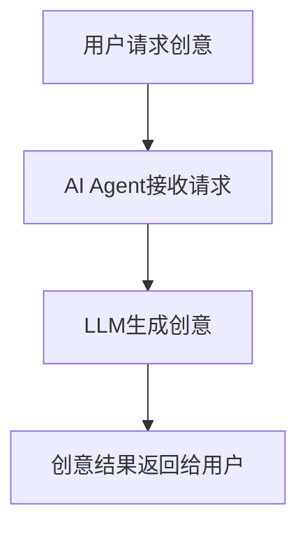

                 


# LLM驱动的AI Agent创意生成系统

## 关键词：LLM, AI Agent, 创意生成, 大语言模型, 人工智能代理, 创意系统设计

## 摘要：本文探讨了利用大语言模型（LLM）驱动人工智能代理（AI Agent）进行创意生成的方法。通过分析创意生成系统的背景、核心概念、算法原理、系统架构、项目实战和最佳实践，本文为构建高效的LLM驱动AI Agent提供了全面的指导。

---

## 第一章: 背景介绍

### 1.1 问题背景
- 1.1.1 创意生成的市场需求
- 1.1.2 当前系统的痛点
- 1.1.3 LLM驱动AI Agent的解决方案

### 1.2 问题描述
- 1.2.1 创意生成系统的定义
- 1.2.2 现有系统的问题
- 1.2.3 LLM驱动AI Agent的核心问题

### 1.3 问题解决
- 1.3.1 LLM在创意生成中的优势
- 1.3.2 AI Agent在创意生成中的角色
- 1.3.3 LLM驱动AI Agent的实现路径

### 1.4 边界与外延
- 1.4.1 LLM驱动AI Agent的边界
- 1.4.2 创意生成系统的外延
- 1.4.3 相关概念的区分与联系

### 1.5 概念结构与核心要素
- 1.5.1 LLM驱动AI Agent的概念结构
- 1.5.2 创意生成系统的要素组成
- 1.5.3 核心要素之间的关系

---

## 第二章: 核心概念与联系

### 2.1 核心概念原理
- 2.1.1 LLM的工作原理
- 2.1.2 AI Agent的基本原理
- 2.1.3 创意生成的核心机制

### 2.2 核心概念属性对比
- 2.2.1 LLM与传统NLP模型的对比
- 2.2.2 AI Agent与传统脚本的对比
- 2.2.3 创意生成与传统生成任务的对比

### 2.3 ER实体关系图
```mermaid
er
    Actor: 用户
    Agent: AI Agent
    Model: 大语言模型
    Task: 创意生成任务
    Output: 创意结果
    用户 --> AI Agent: 请求创意生成
    AI Agent --> 大语言模型: 调用LLM API
    大语言模型 --> 创意生成任务: 处理任务
    创意生成任务 --> 创意结果: 输出结果
    AI Agent <---> 创意结果: 返回给用户
```

---

## 第三章: 算法原理讲解

### 3.1 算法原理概述
- 3.1.1 LLM的训练过程
- 3.1.2 AI Agent的对话流程
- 3.1.3 创意生成的算法框架

### 3.2 算法流程图


### 3.3 数学模型和公式
- 3.3.1 概率分布的公式：
  $$ P(\text{创意生成}|x) = \prod_{i=1}^n P(y_i|x_{<i}) $$
- 3.3.2 损失函数的公式：
  $$ \text{Loss} = -\sum_{i=1}^n \log P(y_i|x_{<i}) $$

---

## 第四章: 系统分析与架构设计

### 4.1 问题场景介绍
- 4.1.1 创意生成的典型场景
- 4.1.2 系统的功能需求

### 4.2 系统功能设计
- 4.2.1 用户交互模块
- 4.2.2 创意生成模块
- 4.2.3 结果展示模块

### 4.3 系统架构设计


### 4.4 系统接口设计
- 4.4.1 用户与AI Agent的接口
- 4.4.2 AI Agent与LLM的接口
- 4.4.3 创意结果的输出接口

### 4.5 系统交互流程图
```mermaid
sequence
    用户 -> AI Agent: 请求创意生成
    AI Agent -> 大语言模型: 发送任务
    大语言模型 -> 创意生成任务: 处理任务
    创意生成任务 -> AI Agent: 返回结果
    AI Agent -> 用户: 显示结果
```

---

## 第五章: 项目实战

### 5.1 环境安装
- 5.1.1 安装Python和相关库
- 5.1.2 安装LLM框架（如GPT）

### 5.2 核心代码实现
- 5.2.1 AI Agent的实现代码
- 5.2.2 LLM调用的代码
- 5.2.3 创意生成的主程序代码

### 5.3 代码应用解读
- 5.3.1 代码的功能分析
- 5.3.2 代码的优化建议
- 5.3.3 代码的实际应用案例

### 5.4 案例分析
- 5.4.1 典型案例的分析
- 5.4.2 案例的实现过程
- 5.4.3 案例的优化与改进

### 5.5 项目小结
- 5.5.1 项目总结
- 5.5.2 经验分享
- 5.5.3 问题与不足

---

## 第六章: 最佳实践

### 6.1 小结
- 6.1.1 核心概念回顾
- 6.1.2 算法原理总结
- 6.1.3 系统设计总结

### 6.2 注意事项
- 6.2.1 实际应用中的注意事项
- 6.2.2 代码实现的注意事项
- 6.2.3 创意生成的注意事项

### 6.3 拓展阅读
- 6.3.1 推荐阅读的书籍
- 6.3.2 推荐的在线资源
- 6.3.3 未来的研究方向

---

## 附录

### A. 术语表
- 术语定义和解释

### B. 参考文献
- 相关论文和书籍的引用

### C. 致谢
- 对贡献者的感谢

---

## 作者：AI天才研究院/AI Genius Institute & 禅与计算机程序设计艺术 /Zen And The Art of Computer Programming

