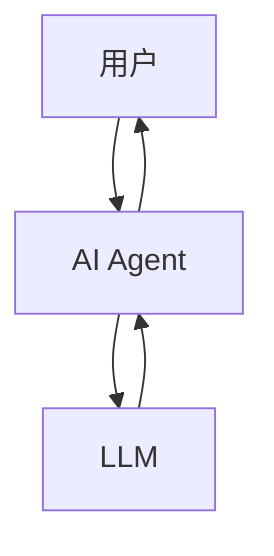

                 


# LLM驱动的AI Agent创意生成：突破思维局限

> 关键词：LLM、AI Agent、创意生成、生成式模型、注意力机制、系统架构

> 摘要：本文深入探讨了如何利用大语言模型（LLM）驱动AI Agent进行创意生成，重点分析了LLM与AI Agent的核心原理、算法实现、系统架构及实际应用。通过详细的技术分析和案例解读，揭示了LLM驱动的AI Agent在创意生成领域的独特优势和未来发展方向。

---

## 第一部分: LLM驱动的AI Agent创意生成背景介绍

### 第1章: 问题背景与概念定义

#### 1.1 问题背景
- **1.1.1 创意生成的挑战与局限**
  创意生成是许多领域（如设计、写作、编程）的核心需求，但传统方法往往依赖固定的规则或模板，难以突破思维定式。  
  例如，在内容创作中，AI通常只能生成符合特定模板的内容，难以真正“创新”。

- **1.1.2 LLM技术的崛起**
  大语言模型（LLM）如GPT-3、PaLM通过海量数据的预训练，具备强大的语言理解和生成能力，能够生成多样化、个性化的文本内容。

- **1.1.3 AI Agent的定义与特点**
  AI Agent是一种能够自主决策并执行任务的智能体，结合LLM的能力，AI Agent可以实现更复杂的创意生成任务。

#### 1.2 LLM驱动的AI Agent核心概念
- **1.2.1 LLM与AI Agent的关系**
  LLM为AI Agent提供强大的语言生成能力，而AI Agent则负责任务分解、目标设定和结果优化。

- **1.2.2 创意生成的实现路径**
  通过LLM的生成能力和AI Agent的任务规划能力，实现从创意构思到落地执行的完整流程。

- **1.2.3 技术边界与外延**
  本文主要关注LLM驱动的AI Agent在创意生成中的应用，但技术边界可能延伸至其他领域（如视觉生成、跨模态交互）。

#### 1.3 技术演进与应用前景
- **1.3.1 从传统AI到LLM驱动的演进**
  传统AI依赖规则和模板，而LLM驱动的AI Agent通过学习数据实现更灵活的生成能力。

- **1.3.2 创意生成的典型应用场景**
  - 内容创作：文章、文案、诗歌的生成。
  - 设计辅助：产品设计、UI设计的灵感生成。
  - 编程助手：代码片段生成与优化建议。

- **1.3.3 技术的局限性与未来方向**
  当前LLM存在生成内容的质量不稳定、上下文理解能力有限等问题，未来可以通过多模态学习和强化学习进一步优化。

---

## 第二部分: 核心概念与联系

### 第2章: LLM与AI Agent的核心原理

#### 2.1 LLM的基本原理
- **2.1.1 大语言模型的训练机制**
  LLM通过海量数据的预训练，学习语言的分布规律。例如，GPT模型通过预测下一个单词的概率分布来生成文本。

- **2.1.2 概率生成式模型的数学基础**
  LLM的生成过程基于概率模型，通过最大化条件概率$P(y|x)$来生成最可能的输出。

- **2.1.3 注意力机制的作用**
  注意力机制（Attention）通过计算输入序列中每个位置的重要性权重，提升模型对上下文的理解能力。

#### 2.2 AI Agent的实现原理
- **2.2.1 智能体的行为决策模型**
  AI Agent通过状态、动作和奖励的循环来优化生成策略。例如，在创意生成中，Agent可能根据用户的反馈调整生成内容的方向。

- **2.2.2 多轮对话的上下文管理**
  AI Agent需要维护对话历史，确保生成内容的连贯性和一致性。

- **2.2.3 创意生成的策略优化**
  通过强化学习（如REINFORCE算法）优化生成策略，使AI Agent能够生成更符合用户需求的内容。

#### 2.3 LLM与AI Agent的协同机制
- **2.3.1 模型调用接口设计**
  AI Agent通过调用LLM的API（如OpenAI的API）获取生成内容。

- **2.3.2 创意生成的反馈优化**
  用户对生成内容的反馈（如评分、修改建议）被用于优化LLM的生成策略。

- **2.3.3 系统的可扩展性设计**
  通过模块化设计，AI Agent可以方便地扩展到新的创意生成领域。

#### 2.4 核心概念对比与ER图分析
- **2.4.1 LLM与传统NLP模型的特征对比**
  | 特性       | LLM                | 传统NLP模型       |
  |------------|--------------------|-------------------|
  | 参数量      | 大（数十亿参数）    | 小（百万级别）    |
  | 生成能力    | 强大（多样化输出）  | 有限（固定模式）  |
  | 上下文理解  | 强（基于注意力机制）| 弱（基于规则）    |

- **2.4.2 AI Agent与传统脚本式AI的差异**
  ```mermaid
  graph TD
    A[AI Agent] --> B[LLM]
    A --> C[任务规划]
    B --> C
    C --> D[生成策略]
  ```

---

## 第三部分: 算法原理与数学模型

### 第3章: LLM的生成式算法解析

#### 3.1 生成式模型的算法流程
- **3.1.1 基于Transformer的生成式模型**
  Transformer模型通过编码器和解码器的架构，实现高效的序列生成。

- **3.1.2 解码过程的数学公式**
  解码过程可以表示为：
  $$ P(y_i|x_{<i}) = \text{softmax}(Qy_iK^T) $$

- **3.1.3 采样策略的优化方法**
  使用温度采样（Temperature Sampling）或核采样（Nucleus Sampling）等方法，提升生成内容的多样性。

#### 3.2 AI Agent的决策算法
- **3.2.1 基于强化学习的生成策略优化**
  使用REINFORCE算法优化生成策略：
  $$ \nabla J = \frac{1}{\pi(\theta)} \sum_{t} r_t \nabla \ln \pi(\theta) $$

- **3.2.2 注意力机制在决策中的应用**
  注意力机制帮助AI Agent聚焦于关键的生成内容，提升决策的准确性。

---

## 第四部分: 系统分析与架构设计方案

### 第4章: 系统功能与架构设计

#### 4.1 项目背景
- 本项目旨在通过LLM驱动的AI Agent实现创意生成，覆盖文本创作、设计辅助等多个领域。

#### 4.2 系统功能设计
- **4.2.1 用户输入与解析**
  用户输入需求（如“写一篇科技博客”），系统解析生成目标。

- **4.2.2 生成内容的优化**
  通过LLM生成初稿，AI Agent根据反馈优化内容。

- **4.2.3 输出结果展示**
  将生成内容以自然的方式呈现给用户。

#### 4.3 系统架构设计


---

## 第五部分: 项目实战

### 第5章: 项目实战与案例分析

#### 5.1 环境安装
- 安装Python和相关库（如OpenAI SDK、Hugging Face库）。

#### 5.2 核心代码实现
```python
import openai

def generate_blog_title():
    client = openai.Client('your-api-key')
    response = client.chat.completions.create(
        model="gpt-3.5-turbo",
        messages=[{"role": "user", "content": "写一个关于AI生成创意的标题"}]
    )
    return response.choices[0].message['content']
```

#### 5.3 案例分析
- **案例1：科技博客标题生成**
  输入需求：“生成一篇关于AI生成创意的科技博客标题。”  
  输出结果：“LLM驱动的AI创意生成：从文本到思维的解放。”

---

## 第六部分: 最佳实践与总结

### 第6章: 最佳实践与总结

#### 6.1 小结
- LLM驱动的AI Agent在创意生成中具有独特优势，但需要结合具体场景优化生成策略。

#### 6.2 注意事项
- 注意生成内容的质量控制，避免AI生成的“垃圾”内容。
- 保护用户隐私，避免滥用生成技术。

#### 6.3 拓展阅读
- 推荐阅读《生成式人工智能：技术与应用》（《Generative AI: Engineering for the Factory of the Future》）。

---

作者：AI天才研究院 & 禅与计算机程序设计艺术

