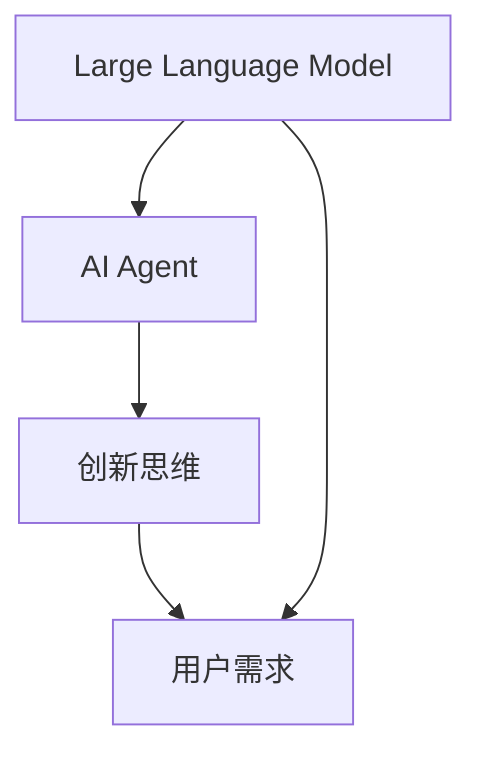
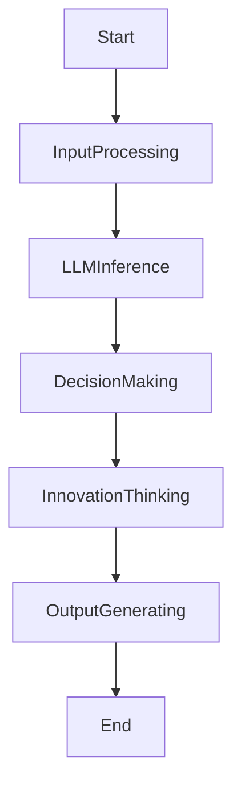
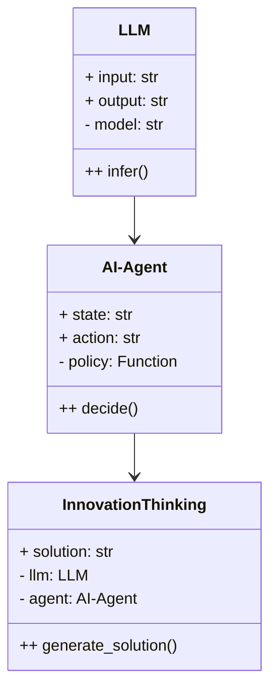
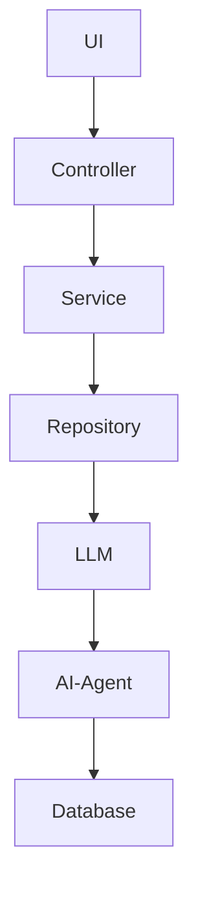

                 


# 目录大纲：LLM驱动的AI Agent创新思维激发器

---

## 关键词：LLM, AI Agent, 创新思维, 自然语言处理, 系统架构, 强化学习, 项目实战

---

## 摘要：

本文将详细探讨LLM（大语言模型）驱动的AI Agent如何通过创新思维激发器实现智能化和高效化。从背景介绍到算法原理，再到系统架构设计和项目实战，本文将全面解析这一前沿技术的核心概念、实现机制和应用场景。通过丰富的图表和代码示例，我们将深入理解LLM与AI Agent的协同工作原理，并展示如何通过实际项目来实现创新思维的激发。最终，本文将为读者提供一套完整的解决方案，帮助他们快速掌握LLM驱动的AI Agent技术，并将其应用于实际场景中。

---

# 第一部分: LLM驱动的AI Agent背景与核心概念

---

## 第1章: LLM驱动的AI Agent概述

### 1.1 问题背景与定义

#### 1.1.1 创新思维激发的背景需求

在当前快速发展的科技时代，创新思维的重要性愈发凸显。然而，传统的创新方法往往依赖于人类的创造力和经验，难以高效地应对复杂问题。为了突破这一瓶颈，LLM（Large Language Model）与AI Agent的结合应运而生，为创新思维的激发提供了全新的解决方案。

#### 1.1.2 LLM驱动AI Agent的核心定义

LLM驱动的AI Agent是一种结合了大语言模型和人工智能代理的技术。通过LLM的强大语言理解和生成能力，AI Agent能够更智能地进行决策、推理和创新。这种结合不仅提升了AI Agent的性能，还使其能够更好地理解和满足用户的需求。

#### 1.1.3 创新思维激发器的目标与意义

创新思维激发器的目标是通过LLM驱动的AI Agent，帮助用户在解决问题时跳出传统思维模式，提出更具创意和可行性的解决方案。其意义在于，它不仅能够提高效率，还能够为用户提供新的视角和思路，从而推动技术和社会的进步。

---

### 1.2 LLM与AI Agent的关系

#### 1.2.1 LLM的基本原理

LLM（Large Language Model）是一种基于深度学习的自然语言处理模型，如GPT系列。它通过大量数据的训练，能够理解上下文并生成连贯的文本。LLM的核心在于其强大的语言生成能力和上下文理解能力。

#### 1.2.2 AI Agent的功能与特点

AI Agent（人工智能代理）是一种能够感知环境、执行任务并做出决策的智能系统。它通常具备自主性、反应性和目标性等特点，能够在复杂环境中完成各种任务。

#### 1.2.3 LLM如何驱动AI Agent

通过将LLM作为AI Agent的核心模块，AI Agent能够利用LLM的语言生成能力来优化其决策过程。LLM不仅能够理解用户的输入，还能够生成多样化的解决方案，从而增强AI Agent的创新能力。

---

### 1.3 创新思维激发的实现机制

#### 1.3.1 创新思维的定义与特征

创新思维是指在解决问题时，能够突破常规思维模式，提出新颖且有效的解决方案。其特征包括独特性、灵活性和创造性。

#### 1.3.2 LLM在创新思维中的作用

LLM通过其强大的语言生成能力，能够为AI Agent提供多样化的思路和建议，从而激发创新思维。

#### 1.3.3 AI Agent如何辅助创新思维

AI Agent通过整合LLM的能力，能够在决策过程中考虑更多的可能性，从而帮助用户或系统提出更具创意的解决方案。

---

## 第2章: LLM驱动的AI Agent核心概念与联系

---

### 2.1 核心概念原理

#### 2.1.1 LLM的训练与推理机制

LLM的训练过程涉及大量的数据输入和深度学习算法的优化。其推理机制基于生成式模型，能够根据输入生成连贯的文本。

#### 2.1.2 AI Agent的行为决策模型

AI Agent的行为决策模型通常基于强化学习，通过不断试错来优化决策策略。

#### 2.1.3 创新思维激发的算法框架

创新思维激发的算法框架结合了LLM的语言生成能力和AI Agent的决策模型，通过不断迭代优化来提升创新能力。

---

### 2.2 核心概念对比表

| **概念**       | **LLM**                  | **AI Agent**               | **创新思维激发器**          |
|-----------------|--------------------------|-----------------------------|-----------------------------|
| **核心功能**     | 语言生成与理解          | 行为决策与任务执行         | 激发创新思维                |
| **技术基础**     | 深度学习与NLP           | 强化学习与行为决策          | 结合LLM与AI Agent            |
| **应用场景**     | 自然语言处理任务        | 多领域自动化任务           | 创新设计与问题解决          |
| **优势**         | 高效的语言处理能力      | 自主决策与执行             | 提高创新效率                |

---

### 2.3 实体关系图（ER图）



---

## 第3章: LLM驱动的AI Agent算法原理

---

### 3.1 算法原理概述

#### 3.1.1 基于LLM的自然语言处理流程

自然语言处理流程通常包括输入处理、模型推理和结果生成三个阶段。LLM通过这些阶段生成连贯且有意义的文本。

#### 3.1.2 AI Agent的行为决策算法

AI Agent的行为决策算法基于强化学习，通过不断试错来优化决策策略。

#### 3.1.3 创新思维激发的算法框架

创新思维激发的算法框架结合了LLM的语言生成能力和AI Agent的决策模型，通过不断迭代优化来提升创新能力。

---

### 3.2 算法流程图



---

### 3.3 算法实现代码示例

```python
def llm_inference(input_text):
    # 假设使用GPT-3作为LLM
    response = openai.Completion.create(
        model="gpt-3",
        prompt=input_text
    )
    return response.choices[0].text

def ai_agent_decision-making(state):
    # 假设使用强化学习算法
    action = policy_network.predict(state)
    return action

def innovation_thinking(llm_output, state):
    # 综合LLM输出和状态进行创新思维
    return creative_solution
```

---

## 第4章: 系统分析与架构设计

---

### 4.1 系统功能设计

#### 4.1.1 领域模型设计



---

### 4.2 系统架构设计

#### 4.2.1 分层架构



---

### 4.3 系统接口设计

#### 4.3.1 接口描述

| **接口名称** | **输入**           | **输出**           |
|--------------|--------------------|--------------------|
| `llm_inference` | `input_text: str` | `output_text: str`  |
| `agent_decision` | `state: str`     | `action: str`      |
| `innovation_generate` | `llm_output: str` | `solution: str`    |

---

## 第5章: 项目实战

---

### 5.1 环境安装

```bash
pip install openai transformers
```

---

### 5.2 核心代码实现

```python
import openai

def llm_inference(prompt):
    response = openai.Completion.create(
        model="gpt-3",
        prompt=prompt
    )
    return response.choices[0].text

class AI-Agent:
    def __init__(self, policy):
        self.policy = policy

    def decide(self, state):
        return self.policy(state)

class InnovationThinking:
    def __init__(self, llm, agent):
        self.llm = llm
        self.agent = agent

    def generate_solution(self, problem):
        prompt = f"Solve the problem {problem}"
        llm_output = self.llm_inference(prompt)
        action = self.agent.decide(llm_output)
        return action
```

---

### 5.3 代码应用解读

上述代码展示了如何通过LLM和AI Agent的结合来实现创新思维激发。LLM用于生成多样化的解决方案，AI Agent则基于这些方案进行决策，从而实现创新思维的激发。

---

## 第6章: 最佳实践与小结

---

### 6.1 小结

通过本文的详细讲解，我们了解了LLM驱动的AI Agent如何通过创新思维激发器实现智能化和高效化。从背景介绍到算法原理，再到系统架构设计和项目实战，我们全面解析了这一前沿技术的核心概念和实现机制。

---

### 6.2 注意事项

在实际应用中，需要注意模型的训练数据质量和算法的可解释性问题，确保创新思维的激发过程既高效又可靠。

---

### 6.3 拓展阅读

推荐读者进一步学习强化学习和大语言模型的最新研究成果，以更好地理解LLM驱动的AI Agent技术。

---

## 作者：AI天才研究院/AI Genius Institute & 禅与计算机程序设计艺术 /Zen And The Art of Computer Programming

